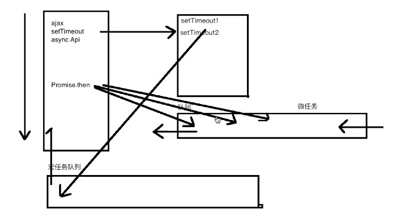

# node
[[toc]]

文档：http://nodejs.cn/api/

## 浏览器事件环（event loop）
- js是单线程，也可以说是多线程(比如setTimeout)
- 代码从上到下执行 会先执行同步 再执行异步
- 异步任务
  - 宏任务：慢
  - 微任务：快

**宏任务macro**： `setTimeout` `ie的setImmediate` `ie的 MessageChannel`

**微任务micro**： `promise.then方法` `MutationObserver对象（监听dom元素的变化）`

- vm.$nextTick(function(){})，会判断所有的宏任务和微任务，让其代码最后执行

:::tip windows原生对象 MutationObserver和MessageChannel
- MutationObserver 微任务 监听dom元素的变化 会等待所有代码都执行完再去执行回调
```html
<div id="app"></div>
<script>
  let observer=new MutationObserver(function(){
    console.log('节点已更新')// 节点已更新
    console.log(app.childList.length)// 40
  });
  let app=document.getElementById('app');
  observer.observe(app,{
    childList:true
  });
  for(let i=0;i<20;i++){
    app.appendChild(document.createElement('p'));
  }
  for(let i=0;i<20;i++){
    app.appendChild(document.createElement('span'));
  }
</script>
```
- MessageChannel 消息通道 宏任务
```html
<div id="app"></div>
<script>
  let channel=new MessageChannel();
  channel.port1.postMessage('我爱你');
  channel.port2.onmessage=function(e){
    console.log(e.data);
  }
  console.log('hello')
  // hello
  // 我爱你
</script>
```
:::

浏览器中，先执行主栈同步任务，微任务放入微任务队列，宏任务到时间了放入宏任务队列（按执行顺序放入，setTimeout先放入缓存，到时间了再放），主栈执行完后，执行完微任务，再取出宏任务队列中第一个执行，执行完后再次执行完微任务，再取第二个宏任务。

————— 环

<!--  -->
<!--  -->


```js
// 宏任务微任务执行顺序
setTimeout(function(){
  console.log('timeout1')
  Promise.resolve().then(()=>{
    console.log('then1')
  })
},0)
Promise.resolve().then(()=>{
  console.log('then2')
  setTimeout(function(){
    console.log('timeout2')
  },0)
})
// then2
// timeout1
// then1
// timeout2
```
```js
// 求执行顺序
async function async1(){
    console.log('async1 start')
    await async2()
}
async function async2(){
    console.log('async2')
}
console.log('script start')
setTimeout(function(){
    console.log('setTimeout') 
},0)  
async1();
new Promise(function(resolve){
    console.log('promise1')
    resolve();
}).then(function(){
    console.log('promise2')
})
console.log('script end')
// script start
// async1 start
// async2
// promise1
// script end
// promise2
// setTimeout
```

## Node
- node不包含JavaScript全集(es+dom+bom)，node基于v8，
- node包含ecmascript+模块(读写文件等)
- 提供简单 高性能服务器（cup密集 计算 i/o密集 文件读取） 适合做工具类，扩展类，中间层等
- 分配单位 靠的是**进程** 进程中 一个环境 环境中可以开很多线程 （主线程是单线程 node api异步的） 底层还是通过多线程来模拟了异步 libuv库来实现异步
- java 多**线程**（切换执行上下文 切换的很快） 并发操作同一个文件 锁的概念。
  - 线程池里有固定线程数，一个线程用完就返回到线程池中，等待下一次调用
  - 缺点：要锁文件 和 频繁的切换上下文导致性能消耗
- node 通过回调（**事件驱动**）的方式

- 异步/同步 被调用方 可以决定此方法是 同步还是异步的
- **阻塞和非阻塞** 调用方的状态就是 阻塞或者非阻塞 同步阻塞 异步非阻塞
:::tip
- heap:堆，对象引用函数地址放在堆里
- stack:栈，代码执行放在栈里，后进先出
- 队列，先进先出
- 栈，后进先出

```js
// 队列
push+shift
// 栈
push+pop
```
:::
- 浏览器为什么是单线程的？
  - 防止同时操作dom


  
### node安装
- npm包管理器
  - npm install  --save  esri-loader@1
- nvm mac切换node版本
  ```js
  npm install nvm -g
  // 安装某个node版本
  nvm install 6.14.4
  // 列出已安装版本
  nvm ls-remote
  // 使用某个版本
  nvm use 8.9.1
  // window切换版本
  nvm-windows
  ```


### node start

- global可以直接访问global，没有window的概念
- 浏览器中`window`代理了`global`属性

- global里面有什么
  - `process`进程，node每开一个服务都会有一个进程(当前的运行环境)
  - `Buffer`十六进制的内存 缓存，可以和字符串相互转化
  - `clearImmediate` `setImmediate` 宏任务
  - `setTimeout` `clearTimeout` 宏任务
  - `clearInterval` 宏任务
  - ...浏览器的方法基本上都支持
```js
// 显示出global的隐藏属性
console.dir(global,{showHidden:true})

Object[global]{
  ...
  global:[Circular],
  process:
  	process { 
      title:'node',
      version:'v11.10.0',
      ...
    },
  Buffer:
  clearImmediate setImmediate
  setTimeout clearTimeout
  ...
}
```
:::tip REPL
- REPL（read evaluate print loop） 循环求值打印
  - 安装node后输入`node`，然后就可以不断地输入命令得到值
:::

- node中打印this是{}
  - 因为node的文件默认在外面套了一层函数，在函数运行时把this指向改变了


#### console
```js
//1 标准输出
console.log('log')
console.log('info') 
process.stdout.write('呵呵')
//2 错误输出
console.warn('warn')
console.error('error')
process.stderr.write('错误')
// 监控输出类型
process.stdin.on('data',function(data){
  console.log(data.toString())//0 表示标准输入
})
```
#### process
  
  - process.cwd()
    - 当前工作目录(current working directory) 。在哪执行文件 就可以打印出位置
  - process.env 
    - environment

    <!-- :::tip
    往命令行的process.env注入内容：window:set a=1 mac:export a=1
    - 命令行中可设置当前的process.env.NODE_ENV为’production‘，只在当前命令行生效
    ::: -->
    ::: tip
    这是一个提示
    :::

    - process.argv
    - arguments，一个数组，前两个是固定的路径，后面是node命令行执行时以空格分开的参数
    ```js
    node 1.node.js --port 3000
    [ '/usr/local/bin/node',
    '/Users/yinyi/study/yy3535/docs/Backend/1.node.js',
    '--port',
    '3000' ]
    ```
    :::tip 传递参数解析成对象
    ```js
    //yargs把执行命令的时候传递参数解析成对象，可以自己手动将其变成对象
    let args=process.argv.slice(2);
    args=args.reduce((total,value,currentIndex,arr)=>{
      if(value.includes('-')){
        total[value.slice(1)]=arr[currentIndex+1];
      }
      return total;
    },{});
    console.log(args.p)
    ```
    :::
  - process.nextTick()
    - 下一队列，微任务
  - process.pid
    - 进程id
  - process.exit()
    - 手动退出应用
  - process.chdir('6.node')
    - 改变当前工作目录
  
### node event loop

- node中有如下六个队列，依次执行。
- 每次都把队列清空后，或者达到执行的最大限制切换到下一个队列中会再执行微任务


- 微任务（promise.then < process.nextTick）
- 主执行栈，先执行完，然后依次执行六个队列，每次队列切换都会把微任务队列清空
- timers 时间 settimeout 回调
- poll 轮询 i/o 回调 fs.readFile()
- check setImmediate 方法
```js
// 面试题
let fs=require('fs');
//poll阶段下一个阶段是check,所以执行的话一定是走的setImmidaite
fs.readFile('note.md','utf-8',function(){
  setTimeout(function(){
    console.log('timeout')
  },0);
  setImmediate(function(){
    console.log('setImmediate2')
  })
})
```

### global
- 每个node文件都被一个函数包裹，这个函数有如下五个参数
  - `exports`
  - `module`
  - `require`
  - `__dirname`
    - 当前文件所在文件夹路径
  - `__filename`
    - 当前文件的绝对路径
- node 实现模块化（命名冲突 代码方便维护 方便协作 依赖关系）
  - 浏览器中实现模块化，用 var obj={a} 不能完全解决命名冲突，而且调用过长（单例模式）
  - 自执行函数来实现 sea.js cmd require.js amd（异步）
  - common.js规范 通过文件读取 (utf8) 实现了模块化
    - 文件即模块
    - 定义了导出方式 module.exports exports
    - 定义了导入方式 require
  ```js
  // Promise.js
  (function(){
    module.exports=Promise;
    return module.exports
  })()
  ```
  ```js
  let a=require('./Promise.js')
  ```

## 内置模块
- NODE模块分为**内置/核心模块**、**文件模块/自定义模块**、**第三方模块**
### vm
- vm.runInThisContext()
  - 让字符串在一个干净的环境里执行（不会去找作用域外面的变量）
  ```js
  let vm=require('vm');
  let hello='zf';
  vm.runInThisContext("console.log(hello)");
  // hello is not defined
  ```

### path
- path.basename()
  - 取基础名 
  ```js
  path.basename('1.min.js','.js')// 1.min
  ```
- path.extname() 
  - 取扩展名
  ```js
  path.extname('1.min.js') // .js
  ```
- path.dirname()
  - 取父级名
  ```js
  path.dirname('a/b/c') //a/b
  ```
- path.join()
  - 路径拼接
  ```js
  path.join('a/b/c','d/e/f');// a/b/c/d/e/f
  path.join('a/b/c','../','d/e/f');// a/b/d/e/f
  path.join(__dirname,'a/b/c','../','d/e/f')// Users/maoerbaby/Desktop/1.promise/doc/a/b/d/e/f 
  ```
- path.resolve()
  - 路径拼接（比join多个当前命令行的路径）
  - __dirname是当前文件的路径
  - 碰到/会直接去根目录
  ```js
  path.resolve('a/b/c','../','d/e/f')// Users/maoerbaby/Desktop/1.promise/a/b/d/e/f
  path.resolve(__dirname,'a/b/c','../','d/e/f')// Users/maoerbaby/Desktop/1.promise/doc/a/b/d/e/f 
  ```
:::tip
- join和resolve与__dirname拼接时结果是一样的。都是当前文件目录下的路径。
:::
### fs模块
- fs将文件读取成buffer。

#### fs方法
- fs.readfile() 
  - 异步读取文件
- fs.readFileSync() 
  - 同步读取文件
  - 第二个参数`utf8`，将读取的内存二进制Buffer转为字符串格式
  ```js
  fs.readFileSync('./name.txt','utf8',(err,data)=>{

  })// age.txt
  ```
- fs.writeFile()
  - 写入文件(写入时，文件不存在会创建文件，如有内容会清空内容)
   ```js
   fs.writeFile('./note.md',1,function(err,data){
   	if(err){
   		console.log(err);
   	}
   	console.log(data);
   })
   ```
- fs.access()
  - 异步判断一个文件是否有权限访问
- fs.accessSync()
  - 同步判断一个文件是否有权限访问
  - 存在就没有反应，不存在会报错
  ```js
  fs.access(path[, mode], callback)
  try{
    fs.accessSync('./name.txt')
  }catch(e){
    console.log(e)// {Error...}
  }
  ```
- fs.stat()
  - 判断文件或文件夹是否存在
  - 不存在会报错
  ```js
  fs.stat('name.txt',(data,statObj)=>{
    statObj.isDirectory()//是否是目录
    statObj.isFile()//是否是文件
  })
  ```
- fs.readdir()
  - 返回路径下的所有列表


#### fs原理

:::tip flag

| 符号 | 含义                                     |
| ---- | ---------------------------------------- |
| r    | 读文件，文件不存在报错                   |
| r+   | 读取并写入，文件不存在报错               |
| w    | 写入文件，不存在则创建，存在则清空       |
| w+   | 读取并写入文件，不存在则创建，存在则清空 |
| wx   | 排它写入文件                             |
| a    | 追加写入                                 |
:::

- fs.appendFile 
  - 追加写入（里面使用flag:a）
- fs.copyFile
  - 拷贝文件
   ```js
   fs.copyFile(source,target,function(){
     console.log('ok')
   })
   ```
- 从指定位置开始读取文件
   - 打开文件：fs.open('./1,txt','r',0600,**function**(err,fd){});

   - 读取文件：fs.read(fd, buffer, offset, length, position, callback((err, bytesRead, buffer)))

   - 写入文件：fs.write(fd, buffer[, offset[, length[, position]]], callback)

   process.stdin 0
   
   process.stdout 1
   
   process.stderr 2
   
   0,1,2是标识符，node中默认会占用0,1,2十三个描述符，所以自定义fd的是从3开始数

   ```js
   /*打开文件*/
   fs.open('a.md','r',function name(err,fd){
     console.log(fd)//3,fd是标识符，每次打开会累加
     let buffer=Buffer.alloc(3);//只能放三勺水
     /*读取文件*/
     //fd 文件描述符 buffer读取到哪里
     //0 是从buffer的哪个位置读取
     //3 读取的个数
     //0 读取文件的位置
     fs.read(fd,buffer,0,3,0,function(err,bytesRead){
     	//bytesRead 真实读取的字节数 <Buffer 31 00 00>
       /*关闭文件*/
       fs.close(fd,()=>{
         console.log('关闭')
       })
     })
   })
   ```
   ```js
   /*打开文件*/
   fs.open('a.md','w',function(err,fd){
   	let buffer=Buffer.from([1,2,3,4])
   	/*写入文件*/
   	//fd 代表文件描述符
   	//0 代表把buffer的第几个位置开始写入
   	//2 代表写入的个数
   	//0 写到文件的哪个位置
     fs.write(fd,buffer,0,2,0,function(err,written){
       console.log('写入成功')
       fs.fsync();//最后应该调用此方法，更新内存，将文件写入到磁盘中。
     });
   })
   ```

   ```js
   //实现一个拷贝，用fs.open fs.read fs.write实现拷贝文件的功能，控制读取速率，防止内存占用过多
   //第三个参数写Null，就会自动往后，不用自己计算位置
   //流的原理，发布订阅来简化
   function copy(source,target,callback){
     const BufferSize=2;
     fs.open(source,'r',function(err,rfd){
       fs.open(target,'w',function(err,wfd){
       	let buffer=Buffer.aloc(3);
       	function next(){
           fs.read(rfd,buffer,0,BUFFERSIZE,null,function(err,bytesRead){
             if(bytesRead>0){
               fs.write(wfd,buffer,0,bytesRead,null,function(err,written){
                 next();
               });
             }else{
             	fs.close(rfd,()=>{})
             	fs.close(wfd,()=>{
                 fs.fsync();
             	})
               callback();
             }
           })
       	};
       	next();
       })
     })
   }
   copy('a.md','b.md',function(){
     console.log('复制成功')
   })
   ```

- direction
  - 基本操作
   ```js
   //创建目录(必须保证父级存在)
   fs.mkdirSync('a/b') 或者fs.mkdirSync('a/b/c')或者 fs.mkdirSync('a\\b')双杠为了转义成\
   fs.mkdir()
   //判断一个文件是否有权限访问
   fs.access(path[, mode], callback)
   //删除目录(必须保证目录中没有子文件和子文件夹，否则会出错)
   fs.rmdirSync('a')
   fs.rmdir('a')
   //删除文件
   fs.unlinkSync
   fs.unlink
   //读取目录下所有文件
   fs.readdir(path[, options], callback)
   //查看文件目录信息
   let stat=fs.statSync(path)
   let stat=fs.stat(path,callback)
   stat.isDirectory()//是否是目录
   stat.isFile()//是否是目录
   ```

  - 做一个创建任意目录的工具
   ```js
   let fs=require('fs');
   //同步,使用for循环
   function mkdirSync(p){
     let dirs=p.split('/');
     for(let i=0;i<dirs.length;i++){
     	let currentPath=dirs.slice(0,i).join('/');
     	try{
         fs.accessSync(currentPath);
     	}catch(e){
         fs.mkdirSync(currentPath);
     	}
     }
   }
   mkdirSync('m/q/d')
   
   //异步，使用递归，next方法来帮助进行迭代操作
   //fs.access
   function mkdir(p,callback){
     let dirs=p.split('/');
     let index=0;
     function next(){
     	if(index===dirs.length) return callback();
       let currentPath=dirs.slice(0,++index).join('/');
       fs.access(currentPath,function(err){
         if(err){
           fs.mkdir(currentPath,function(){
             next();
           });
         }else{
           next();//当前文件夹存在就继续迭代
         }
       })
     }
     next();
   }
   mkdir('a/b/c',function(){
     console.log('创建完成')
   })
   ```

   - 同步先序深度优先删除目录
   
   ```js
   let fs=require('fs');
   let path=require('path')
   function rmSync(dir) {
       try {
           let stat = fs.statSync(dir);
           if (stat.isFile()) {
               fs.unlinkSync(dir);
           } else {
               let files=fs.readdirSync(dir);
               files
                   .map(file =path.join(dir,file))
                   .forEach(item=rmSync(item));
               fs.rmdirSync(dir);
           }
       } catch (e) {
           console.log('删除失败!');
       }
   }
   rmSync(path.join(__dirname,'a'));
   ```
   
   - 异步串行删除目录深度优先
   ```js
   function rmAsyncSeries(dir,callback) {
       setTimeout(() ={
           fs.stat(dir,(err,stat) ={
               if (err) return callback(err);
               if (stat.isDirectory()) {
                   fs.readdir(dir,(err,files) ={
                       let paths = files.map(file =path.join(dir,file));
                       function next(index) {
                           if (index>=files.length) return fs.rmdir(dir,callback);
                           let current=paths[index];
                           rmAsyncSeries(current,()=>next(index+1));
                       }
                       next(0);
                   });
               } else {
                   fs.unlink(dir,callback);
               }
           })
       },1000);
   }
   
   console.time('cost');
   rmAsyncSeries(path.join(__dirname,'a'),err ={
        console.timeEnd('cost');
   })
   
   //异步并行删除目录深度优先
   function rmAsyncParallel(dir,callback) {
       setTimeout(() ={
           fs.stat(dir,(err,stat) ={
               if (err) return callback(err);
               if (stat.isDirectory()) {
                   fs.readdir(dir,(err,files) ={
                       let paths=files.map(file =path.join(dir,file));
                       if (paths.length>0) {
                           let i=0;
                           function done() {
                               if (++i == paths.length) {
                                   fs.rmdir(dir,callback);
                               }
                           }
                         paths.forEach(p=>rmAsyncParallel(p,done));
                       } else {
                           fs.rmdir(dir,callback);
                       }
                   });
               } else {
                   fs.unlink(dir,callback);
               }
           })
       },1000);
   }
   console.time('cost');
   rmAsyncParallel(path.join(__dirname,'a'),err ={
        console.timeEnd('cost');
   })
   
   //异步删除非空目录(Promise版)
   function rmPromise(dir) {
       return new Promise((resolve,reject) ={
           fs.stat(dir,(err,stat) ={
               if (err) return reject(err);
               if (stat.isDirectory()) {
                   fs.readdir(dir,(err,files) ={
                       let paths = files.map(file =path.join(dir,file));
                       let promises = paths.map(p=>rmPromise(p));
                       Promise.all(promises).then((() =fs.rmdir(dir,resolve)));
                   });
               } else {
                   fs.unlink(dir,resolve);
               }
           });
       });
   }
   rmPromise(path.join(__dirname,'a')).then(() ={
       console.log('删除成功');
   })
   
   //同步删除目录(广度优先) 
   function rmSync(dir){
       let arr=[dir];
       let index=0;
       while (arr[index]) {
           let current=arr[index++];
           let stat=fs.statSync(current);
           if (stat.isDirectory()) {
               let dirs=fs.readdirSync(current);
               arr=[...arr,...dirs.map(d =path.join(current,d))];
           }
       }
       let item;
       while (null != (item = arr.pop())) {
           let stat = fs.statSync(item);
           if (stat.isDirectory()) {
               fs.rmdirSync(item);
           } else {
               fs.unlinkSync(item);
           }
       }
   }
   
   //异步删除目录(广度优先)
   function rmdirWideAsync(dir,callback){
       let dirs=[dir];
       let index=0;
       function rmdir() {
           let current = dirs.pop();
           if (current) {
               fs.stat(current,(err,stat) ={
                   if (stat.isDirectory()) {
                       fs.rmdir(current,rmdir);
                   } else {
                       fs.unlink(current,rmdir);
                   }
               });
           }
       }
       !function next() {
           let current=dirs[index++];
           if (current) {
               fs.stat(current,(err,stat) ={
                   if (err) callback(err);
                   if (stat.isDirectory()) {
                       fs.readdir(current,(err,files) ={
                           dirs=[...dirs,...files.map(item =path.join(current,item))];
                           next();
                       });
                   } else {
                       next();
                   }
               });
           } else {
               rmdir();
           }
       }();
   }
   ```
### events模块
- 是个类
```js
let EventEmitter=require('events');
let e = new EventEmitter();
```
#### 方法
- e.on()
  - 绑定事件
  - 可以绑定多次，多个回调都会触发
  ```js
  e.on('吃饭',function(){
    console.log('吃米饭')
  })
  ```
- e.emit()
  - 触发事件
  ```js
  e.emit('吃饭')
  ```
- e.removeListener/off()
  - 解除绑定
  - 第二个参数是绑定事件
  ```js
  e.off('吃饭')
  e.off('吃饭',function(){
    console.log('吃米饭')
  })
  ```
- e.defaultMaxListeners
  - 默认最大绑定数
- e.setMaxListener(1)
  - 设置最大绑定数
- e.once()
  - 不管绑定多少次，仅触发一次
  ```js
  e.once('失恋',cry)
  ```
#### events自定义事件原理
```js
function EventEmitter() {
    this._events = Object.create(null)
}
EventEmitter.prototype.prependListener = function(eventName, callback) {
    this.on(eventName, callback, true);
}
EventEmitter.prototype.on = function(eventName, callback, flag) {
    if (!this._events) this._events = Object.create(null);
    if (eventName != 'newListener') {
        this._events[newListener].forEach((fn) => {
            fn(eventName)
        });
    }
    if (this._events[eventName]) {
        if (flag) {
            this._events[eventName].unshift(callback);
        } else {
            this._events[eventName].push(callback);
        }

    } else {
        this._events[eventName] = [callback];
    }
}
EventEmitter.prototype.off = function(eventName, callback) {
    //当前函数绑定的是cry,删除的也是cry
    this._events[eventName] = this._events[eventName].filter(
        (l) => l != callback && l.l != callback)
}
EventEmitter.prototype.once = function(eventName, callback) {
    function one(...args) {
        callback(...args)
        this.off(eventName, one)
    }
    one.l = callback;
    this.on(eventName, one);
}
Emitter.prototype.emit = function(eventName, ...args) {
    this._events[eventName].forEach(fn => {
        fn.call(this, ...args);
    })
}
module.exports = EventEmitter;
```
```js
class EventEmitter {
    constructor() {
        this._events = {};
    }
    on(eventName, callback) {
        if (this._events[eventName]) {
            this._events[eventName].push(callback);
        } else {
            this._events[eventName] = [callback];
        }
    }
    emit(eventName) {
        this._events[eventName].forEach(fn => {
            fn();
        })
    }
    off(eventName, callback) {
        this._events[eventName] = this._events[eventName].filter((fn) => {
            return fn != callback;
        })
    }
}
```

### 流
- 用fs模块读取文件，如果文件很大的话，会占用大量的内存空间。
:::tip 文件的拷贝
- readFile+writeFile实现拷贝功能
  - readfile将内容整个读取到内存中，再写入文件中。占用两倍内存。不能读大文件
```js
fs.readFile(source,function(err,data){
  fs.writeFile(target,data,function(err){
    console.log('成功')
  })
})
```
:::
- 流 边读边写（可以控制读取的速率） 流是基于事件的。 
- 可读流，可写流，双工流(可读可写)，转化流(压缩流)
- 可以分段读取 可以控制速率
#### fs.createReadStream(path,[options]);
- 创建可读流
```js
let rs=fs.createReadStream('name.txt')
```
  :::tip options
  - options
    - flags:'r'/'w'
    - highWaterMark:3(每次读多少个,默认64k)
    - encoding:null,默认为null(buffer)
    - autoClose:true,默认true(读取完毕后关闭文件)
    - start:1,开始读取的索引位置
    - end:5,结束读取的索引位置(包前包后)
:::
- rs.on('data',function(){})
  - 默认是暂停模式，非流动模式 内部每读一次就会触发data事件 rs.emit('data',123)
  - 绑定了data事件，就变成流动模式
```js
let arr=[];
rs.on('data',function(chunk){
  arr.push(chunk);
})
```
- rs.on('end',function(){})
  - 绑定读取完毕事件
  - 客户端发来的数据一定要采用Buffer.concat来拼
```js
rs.on('end',function(){
  Buffer.concat(arr).toString();
})
```
- rs.pause()
  - 暂停data事件的触发
  ```js
  rs.on('data',function(chunk){
    arr.push(chunk);
    rs.pause();
  })
  ```
- rs.resume()
  - 恢复data事件的触发
- rs.on('error',function(err){})
  - 绑定读取出错事件


#### fs.createWriteStream(path,[options])
- w在文件不存在，会创建一个文件，如果有内容会清空内容
:::tip options
  - options
    - flags:'r'/'w'
    - encoding:'utf8'
    - highWaterMark:3(每次预计写入多少个，默认16k)
    - autoClose:true,默认true(写入完毕后关闭文件)
    - start:1,开始写入的索引位置
:::
```js
let ws=fs.createWriteStream('name.txt',)
```
- ws.write('123',function(err){})
  - 写入的内容必须是buffer/字符串
  - 返回值是当前写入长度和预计长度是否符合
```js
let flag=ws.write('123',function(err){
  console.log('写入成功')
})
console.log(flag)// 
```
- ws.end('结束',function(){})
  - 全部写入完成后回调，必须加上，代表关闭写入的文件
  - 第一个参数会写入到写入文件末尾
- ws.on('drain',function(){})
  - 当前次写入完成
#### read+write==>(pipe方法)
- readFile 可以读取64k以下的文件
- 否则就使用流的方式
```js
let fs = require('fs');
let path = require('path');
let r = fs.createReadStream(path.resolve(__dirname, 'name.txt'), {
    highWaterMark: 3
});
let w = fs.createWriteStream(path.resolve(__dirname, 'write.txt'), {
    highWaterMark: 1
})
function pipe(r, w) {
    r.on('data', function(data) {
        let flag = w.write(data);
        if (!flag) r.pause();
    })
    w.on('drain', function() {
        console.log('抽干');
        r.resume();
    })
    r.on('end', function() {
        console.log('文件读取完毕');
        w.end();
    })
}
pipe(r, w);
```
- 官方封装pipe 把可读流导入到可写流中
  - r.pipe(w)

### http模块

- 客户端 浏览器
- 服务端 监听请求 监听特定的ip和端口（最大65535）

```js
let http=require('http');
```
#### http.createServer()
  - 创建服务端
  - 只有当请求到来时触发
  - 端口用的时候不要用3000以下的
  - 请求分为三部分
    - 请求行 方法 路径 协议
    - 请求头 浏览器信息 自定义
    - 请求体
  - 响应也分为三部分
    - 响应行 状态码
    - 响应头 
    - 响应体
  ```js
  let server=http.createServer(function(request,response){
  })
  ```
  - server.listen()
    - 监听的端口号（默认80）
    - 主机名
    - 启动服务成功后回调
    ```js
    server.listen(3000,'localhost',()=>{
      console.log('3000 starts')
    })
    ```
  - server.on('request',function(req,res){})
    - 等待请求到来时执行，等价于createServer里的回调函数

  :::tip curl工具发请求
  ```js
  curl -v https://www.baidu.com
  curl -X POST -d "username=123&password=456" http://localhost:3000
  curl -v -X POST -d "username=123&password=456" http://localhost:3000
  ```
  :::
  - request
    - 可读流
    - 请求体需要ondata来接受数据
    - querystring模块
      - querystring.parse，将参数字符串转成对象
    - url模块
      - url.parse
        - 第二个参数true，将url字符串变对象
    ```js
    let http = require('http');

    let server = http.createServer(function(request, response) {
        // request.method // 方法名是大写的
        // request.url
        // request.httpVersion
        // request.headers // 所有的属性名都是小写的
        let querystring = require('querystring');
        let url = require('url');
        let arr = [];
        request.on('data', function(data) {
            arr.push(data);
        })
        request.on('end', function() {
            let str = Buffer.concat(arr).toString();
            console.log(str);
            // querystring 原理 start
            // username=123&password=456
            // let obj = {};
            // str.replace(/([^=&]*)=([^=&]*)/g, function() {
            //         obj[arguments[1]] = arguments[2];
            //     })
            // querystring 原理 end
            let obj = querystring.parse(str, '&', '=')
            response.statusCode = 404; // 要写有意义的
            response.setHeader('a', '1'); // 设置响应头，给客户端
            response.end(JSON.stringify(obj))
        })
    })

    server.listen(3000, function() {
        console.log('3000启动成功');
    })
    ```
    ```js
    let {pathname,query}=url.parse(req.url,true);
    ```
  - response
    - 双工流
    ```js
    response.write('hello');
    // 必须有这句，否则一直是pending等待状态，end后不能调write，但可以调end
    response.end();
    ```
  :::tip nodemon
  npm install -g nodemon
  nodemon 6.http.js
  - 用nodemon启动node服务文件，只要文件发生变化，就会重启服务
  :::


#### 客户端发请求
- 通过服务端发请求，没有跨域问题
- 应用场景
  - 爬虫
  - 中间层（转发请求，解决跨域问题）
- http.get()
- http.request()

  ```js
  let client=http.request({
    hostname:'localhost',
    port:3000,
    path:'/xxx',
    method:'post',
    headers:{
      a:1,
      'Content-Type':'application/json',
      'Content-Type':'application/x-www-form-urlencoded', // 表单类型
    }
  },function(response){
    response.on('data',(data)=>{
      console.log(JSON.parse(data));
    })
  });
  client.end('name=zf&a=1');
  ```

#### http静态服务
- 一般服务端 会处理两种类型
  - 静态的 html css
  - 动态数据 ajax获取
- fs.stat()
  - 判断文件或文件夹是否存在
  - statObj.isFile()
:::tip
在服务端中没有.././
:::
```js

// 第三方模块mime
let mime=require('mime');
let fs=require('fs');

let server=http.createServer((req,res)=>{
  let {pathname}=url.parse(req.url,true);
  let absPath=path.join(__dirname,pathname);
  fs.stats(path.resolve(__dirname,'a'),function(err,statObj){
    console.log(err);
    console.log(statObj.isDirectory());
    if(err){
      res.statusCode=404;
      res.end('Not found');
      return
    }
    if(statObj.isFile()){
      // 1.css => text/css 1.png => img/png
      res.setHeader('Content-Type',mime.getType(absPath)+':charset=utf8')
      fs.createReadStream(absPath).pipe(res);
    }else{
      let realPath=path.join(absPath,'index.html');
      fs.access(realPath,(err)=>{
        if(err){
          res.statusCode=404;
          res.end('Not found');
          return
        }
        res.setHeader('Content-Type','text/html;charset=utf-8');
        fs.createReadStream(realPath).pipe(res);
      })
      console.log('你访问的是/')
    }
  })
})
```
- 封装以上启动服务的代码
```js
let mime=require('mime');
let fs=require('mz/fs');

class Server{
  async handleRequest(){
    // this
    let {pathname}=url.parse(req.url,true);
    let absPath=path.join(__dirname,pathname);
    // 先判断是否是用调用的接口 /user get/post/delete/put
    let method=req.method.toLowerCase();
    switch(pathname){
      case '/userList';
        if(method==='get'){
          res.end(JSON.stringify({name:'zf'}));
        }

      return;
    }

    try{
      let statObj=await fs.stat(absPath);
      if(statObj.isDirectory()){
        let realPath=path.join(absPath,'index.html');
        await fs.access(realPath);
        this.sendFile(realPath,res)
      }else{
        this.sendFile(absPath,res)
      }
    }catch(e){
      this.sendError(res,e)
    }
  }
  sendFile(absPath,res){
    res.setHeader('Content-Type',mime.getType(absPath));
    fs.createReadStream(absPath).pipe(res);
  }
  sendError(res,err){
    res.statusCode=404;
    res.end('Not found');
  }
  start(port){
    http.createServer(this.handleRequest.bind(this));
    server.listen(port);
  }
}
let server=new Server();
server.start(3000);
```

#### http跨域 cors
```js
let http = require('http');
let mime = require('mime');
let fs = require('mz/fs');
let url = require('url');
let path = require('path');

class Server {
    async handleRequest(req, res) {
        // this
        let { pathname } = url.parse(req.url, true);
        let absPath = path.join(__dirname, pathname);
        // 先判断是否是用调用的接口 /user get/post/delete/put
        let method = req.method.toLowerCase();

        res.setHeader('Access-Control-Allow-Origin', 'http://127.0.0.1:5500');
        // 允许的请求方法
        res.setHeader('Access-Control-Allow-Methods', 'GET,PUT,DELETE,OPTIONS,POST');
        // 允许的跨域头
        res.setHeader('Access-Control-Allow-Headers', 'Content-Type,token');
        // options的发送间隔，如果请求不是get或者post，并且带请求头的话(复杂请求)，在请求前，会先发一个options请求，来是否支持跨域（预检查），然后再发送请求
        res.setHeader('Access-Control-Max-age', 10);
        // 允许前端访问 强制跨域携带cookie
        res.setHeader('Access-Control-Allow-Credentials', true);
        // options不进行处理（解决options出错问题）
        if (method === 'options') {
            res.end(); // 可以访问
        }
        switch (pathname) {
            case '/userList':
                if (method === 'get') {
                    res.setHeader('Content-Type', 'application/json')
                    res.end(JSON.stringify({ name: 'zf' }));
                }
                if (method === 'put') {
                    res.setHeader('Content-Type', 'application/json')
                    res.end(JSON.stringify({ name: 'zf' }));
                }
                return;
        }
        try {
            let statObj = await fs.stat(absPath);
            if (statObj.isDirectory()) {
                let realPath = path.join(absPath, 'index.html');
                await fs.access(realPath);
                this.sendFile(realPath, res)
            } else {
                this.sendFile(absPath, res)
            }
        } catch (e) {
            this.sendError(res, e)
        }
    }
    sendFile(absPath, res) {
        res.setHeader('Content-Type', mime.getType(absPath));
        fs.createReadStream(absPath).pipe(res);
    }
    sendError(res, err) {
        res.statusCode = 404;
        res.end('Not found');
    }
    start(port) {
        let server = http.createServer(this.handleRequest.bind(this));
        server.listen(port);
    }
}
let server = new Server();
server.start(3000)
```
```js
let xhr = new XMLHttpRequest();
xhr.open('PUT', 'http://localhost:3000/userList', true);
xhr.responseType = 'json';
// 凭证 默认跨域不支持cookie
document.cookie = 'token=100';
// 强制带上cookie
xhr.withCredentials = true;
xhr.setRequestHeader('token', 'asd.askfs.g')
xhr.onreadystatechange = function() {
    if (xhr.status === 200 && xhr.readyState === 4) {
        console.log(xhr.response);
    }
}
xhr.send()
```
#### cookie&session
- cookie 客户端的 （请求头） Set-Cookie
  - 不重要的放在cookie中
  - 用户可以随意篡改，不安全。即使签名了，还是可以明显看到.之前就是它的值。或者一些注入把当前的cookie带着发ajax请求
- session 服务端的
  - 重要信息放在session中
  - 会员卡的总额存在服务器，客户端只存个会员卡卡号
- crypto 核心模块(签名)
:::tip 登录
- cookie和session一般做客户端服务端同构
- spa react+vue token jwt 用户token正确，就是正确，服务端不存储信息，直接加盐把内容返回去，客户端拿到后使用。（密钥丢失 可以伪造用户）
:::
```js
let http = require('http');
let querystring = require('querystring');
http.createServer(function(req, res) {
    // 设置cookie 读取cookie 
    if (req.url === '/read') {
        let cookies = querystring.parse(req.headers.cookie, '; ') || {};
        res.end(JSON.stringify(cookies));
    }
    if (req.url === '/write') {
        // res.setHeader('Set-Cookie', ['name=zf', 'age=10']);
        // domain 默认只针对某个域名 .zhufe.cn 表示a.zhufe b.zhufe c.zhufe 都可以共用cookie
        // path 一般不会设置 表示只能在某个域名显示
        // expires 绝对时间 / max-age 相对时间 5秒后重新登录
        // httpOnly(一般情况下服务端设置都是true)
        res.setHeader('Set-Cookie', 'name=zf; httpOnly=true')
        res.end('write ok')
    }
}).listen(3000)
```
```js
let http = require('http');
let querystring = require('querystring');
let crypto = require('crypto');


// 签名 给cookie标个记号 下次带上记号和内容，可以确认这个东西有没有更改
let sign = (value) => {
    return crypto.createHmac('sha256', 'zf').update(value.toString()).digest('base64').replace(/[+/]/g, '');
}
http.createServer(function(req, res) {

    let arr = [];
    res.setCookie = function(key, value, options = {}) {
        let optionsArr = [];
        if (options.maxAge) {
            optionsArr.push(`Max-Age=${options.maxAge}`);
        }
        if (options.httpOnly) {
            optionsArr.push(`httpOnly=${options.httpOnly}`);
        }
        if (options.path) {
            optionsArr.push(`path=${options.path}`);
        }
        if (options.signed) {
            value = value + '.' + sign(value);
        }
        arr.push(`${key}=${value}; ` + optionsArr.join('; '))
        res.setHeader('Set-Cookie', arr)
    }
    res.getCookie = function(key) {
        let cookies = querystring.parse(req.headers.cookie, '; ') || {};
        return cookies[key]
    }
    res.getSignCookie = function(key) {
        let cookies = querystring.parse(req.headers.cookie, '; ') || {};
        if (cookies[key]) {
            let [value, signValue] = cookies[key].split('.');
            if (sign(value) === signValue) {
                return value
            }
        }
        return '';
    }

    // 设置cookie 读取cookie 
    if (req.url === '/read') {
        res.end(res.getSignCookie('name'));
    }
    if (req.url === '/write') {
        // res.setHeader('Set-Cookie', ['name=zf', 'age=10']);
        // domain 默认只针对某个域名 .zhufe.cn 表示a.zhufe b.zhufe c.zhufe 都可以共用cookie
        // path 一般不会设置 表示只能在某个域名显示
        // expires 绝对时间 / max-age 相对时间 5秒后重新登录
        // httpOnly(一般情况下服务端设置都是true)
        res.setCookie('name', 'zf', { maxAge: 10, path: '/', httpOnly: true, signed: true });
        res.setCookie('age', '10', { maxAge: 10, path: '/', httpOnly: true });
        res.end('write ok')
    }
}).listen(3000)

```
```js
let http = require('http');
let querystring = require('querystring');
let uuid = require('uuid');

let sessionId = 'zhufengwash';
let session = {}
http.createServer(function(req, res) {
    console.log(session)
    if (req.url === '/towash') {
        let cookies = querystring.parse(req.headers.cookie, '; ') || {};
        let username = cookies[sessionId];
        if (username && session[username]) {
            session[username].mny -= 10;
            console.log(session[username]);
            res.setHeader('Content-Type', 'text/html;charset=utf8');
            res.end(`当前您的额度是${session[username].mny}`);
        } else {
            // 第一次来
            let cardId = uuid.v4();
            res.setHeader('Set-Cookie', `${sessionId}=${cardId}; httpOnly=true`)
            session[cardId] = {
                mny: 100
            }
            res.setHeader('Content-Type', 'text/html;charset=utf8');
            res.end(`当前您的额度是${session[cardId].mny}`);
        }
    }
}).listen(3000)
```
#### ejs模板
- 自己实现ejs
```html
<!DOCTYPE html>
<html lang="en">

<head>
    <meta charset="UTF-8">
    <meta name="viewport" content="width=device-width, initial-scale=1.0">
    <meta http-equiv="X-UA-Compatible" content="ie=edge">
    <title>Document</title>
</head>

<body>
    <%arr.forEach(a=>{%>
        <li><%=a%></li>
        <%})%>
</body>

</html> 
```
```js
let ejs = require('ejs');
let fs = require('fs');
let path = require('path');
let data = { name: 'zf', age: 10, arr: [1, 2, 3] }; // with(data){} 模板里才用得到(添加一个作用域，this指向data)
let tempStr = fs.readFileSync(path.resolve(__dirname, 'index.html'), 'utf8');

function render(str, data) {
    str.replace(/<%=([\s\S]*?)%>/g, function() {
        return '${' + arguments[1] + '}'
    });
    let head = 'let str;\r\nwith(obj){\r\n'
    head += 'str=`';
    let content = str.replace(/<%([\s\S]*?)%>/g, function() {
        return '`\r\n' + arguments[1] + '\r\nstr+=`'
    });
    let tail = '`\r\n}\r\nreturn str;';
    let fn = new Function('obj', head + content + tail);
    return fn(data);
}

// 取值表达式的替换
// function render(str, data) {
//     return str.replace(/<%=([\s\S]*?)%>/g, function() {
//         return data[arguments[1]]
//     })
// }
let str = render(tempStr, data);
console.log(str);
```
#### static-server
- 使用node http自己实现一个http-server启动服务小工具
- 解析用户传入的数据，根据数据启动一个http-server
```js
"bin": {
        "zf-http-server": "./bin/www.js"
    },
```
```js
#! /usr/bin/env node

// 默认启动一个http-server port ip地址
// 定义 一个port属性
let config = {
        port: 3000,
        host: '127.0.0.1',
        dir: './'
    }
    // process.argv
    // yargs comander 做命令行工具需要这种工具

let commander = require('commander');
let json = require('../package.json');
commander.version(json.version)
    .option('-p, --port <n>', 'set http-server port')
    .option('-o, --host <n>', 'set http-server host')
    .option('-d, --dir <n>', 'set http-server directory')
    .on('--help', function() {
        console.log('Examples')
        console.log('  $ zf-http-server --port --host')
    })
    .parse(process.argv)

// console.log(commander.port);
// console.log(commander.host);
// console.log(commander.dir);
config = {...config, ...commander }
console.log(config)
```
```js
let http = require('http');
let url = require('url');
let path = require('path');

let chalk = require('chalk'); // 颜色模块
let fs = require('mz/fs');
let ejs = require('ejs') // 
let mime = require('mime'); // 解析类型的

let template = fs.readFileSync(path.resolve(__dirname, 'template.html'), 'utf8');

class Server {
    constructor(config) {
        this.host = config.host;
        this.dir = config.dir;
        this.port = config.port;
        this.template = template;
    }
    async handleRequest(req, res) {

        // 1. 判断是目录还是文件 如果是文件，直接将内容展示给用户
        try {
            let { pathname } = url.parse(req.url);
            // 防止中文文件名浏览器不认就自动给转成buffer二进制
            let absPath = path.join(this.dir, decodeURIComponent(pathname));
            let statObj = await fs.stat(absPath);
            if (statObj.isDirectory()) {
                // 先读取当前目录下的所有列表
                let dirs = await fs.readdir(absPath);
                // 需要拿到当前url和目录的每一项拼接

                let href = path.join();

                let str = ejs.render(this.template, {
                    arrs: dirs.map(dir => ({
                        href: path.join(pathname, dir),
                        content: dir
                    }))
                });
                res.setHeader('Content-Type', 'text/html;charset=utf8')
                res.end(str);
            } else {
                this.sendFile(req, res, statObj, absPath)
            }

            // 2. 如果是目录 列出目录列表
        } catch (e) {
            console.log(e)
            this.sendError(req, res);
        }

    }
    sendError(req, res, absPath) {
        res.statusCode = 404;
        res.end('Not Found')
    }
    sendFile(req, res, statObj, absPath) {
        // last-modified
        let client = req.headers['if-modified-since'];
        let server = statObj.ctime.toUTCString();
        if (client = server) {
            res.statusCode = 304;
            res.end();
            return
        }
        res.setHeader('Last-Modified', server);
        res.setHeader('Cache-Control', 'no-cache');

        res.setHeader('Content-Type', mime.getType(absPath) + ';charset=utf8')
        fs.createReadStream(absPath).pipe(res);

        // etag

    }

    start() {
        let server = http.createServer(this.handleRequest.bind(this));
        server.listen(this.port, this.host, () => {
            console.log(chalk.yellow(`Starting up http-server, serving ${this.dir}\r\nAvailable on\r\n`));
            console.log(chalk.green(`http://${this.host}:${this.port}`))
        })
    }
}

module.exports = Server;
```
#### 服务器304cache实现（服务端来实现的）
- 前端 pwa 实现缓存
  - 即离线缓存 网络不通也可以缓存起来 使用的是Caches api(Cache Storage)
- 服务端 http 缓存，分为两种
  - 强制缓存（首页没法强制缓存）
    - Cache-Control max-age
    - Expires
    - 有的文件设置上了 可能会导致内容是老的内容
    相对时间优先级更高
    ```js
    res.setHeader('Cache-Control', 'max-age=10');
    // 低版本浏览器只支持这个绝对时间
    res.setHeader('Expires', new Date(Date.now() + 10000).toGMTString())
    ```
  - 对比缓存 
    - last-modified(服务端)) if-modified-since(客户端)
        - If-Modified-Since
        - 第一次访问时，请求头的last-modified最后修改时间8：00
      以后请求时，带着这个时间，发现变成了10：00就返回新的文件
        - If-Modified-Since 是浏览器自己携带的，如果服务器设置过last-modified，下次请求就会带上这个头
        - 缺陷：如果文件没改，时间变了 时间精确到秒，可能会有问题
    - Etag(服务端) if-none-match(客户端)
      - Etag 实体内容
        - 根据文件内容算出一个唯一的值 md5 
        - 方式比较靠谱，精确，但不能对大文件进行etag 一般用文件的大小和文件的最后修改时间来组成etag
  ```js
  let http = require('http');
  let mime = require('mime');
  let url = require('url');
  let path = require('path');
  let fs = require('fs');

  http.createServer(function(req, res) {
      let { pathname } = url.parse(req.url, true);
      let abs = path.join(__dirname, pathname);
      fs.stat(path.join(__dirname, pathname), (err, stat) => {
          if (err) {
              res.statusCode = 404;
              res.end('Not Found');
              return;
          }
          if (stat.isFile()) {
              let ctime = stat.ctime.toUTCString();

              if (req.headers['if-modified-since'] == ctime) {
                  res.statusCode = 304;
                  res.end();
                  return;
              }
              res.setHeader('Last-Modified', ctime);
              fs.createReadStream(abs).pipe(res);
          }
      });
  }).listen(3000)
  ```
  ```js
  let http = require('http');
  let mime = require('mime');
  let url = require('url');
  let path = require('path');
  let fs = require('fs');
  let crypto = require('crypto');

  http.createServer(function(req, res) {
      let { pathname } = url.parse(req.url, true);
      let abs = path.join(__dirname, pathname);
      fs.stat(path.join(__dirname, pathname), (err, stat) => {
          if (err) {
              res.statusCode = 404;
              res.end('Not Found');
              return;
          }
          if (stat.isFile()) {
              let md5 = crypto.createHash('md5');
              let arr = [];
              fs.createReadStream(abs).on('data', function(data) {
                  md5.update(data);
                  arr.push(data);
              })
              res.on('end', function() {
                  let etag = md5.digest('base64');
                  if (req.headers['if-none-match'] === etag) {
                      res.statusCode = 304;
                      res.end();
                      return
                  }
                  res.setHeader('Etag', etag);
                  res.end(Buffer.concat(arr));
              })

              fs.createReadStream(abs).pipe(res);
          }
      });
  }).listen(3000)
  ```
- 全部都使用 如果浏览器访问服务端 会先加一个强制缓存 强制缓存- 5s，5s后会再次发送请求 对比缓存 先判断 last-modified 再判断etag如果都成立 返回304
- 继续强制5s，5s后再次发请求 如果有变化 会再返回新的文件 304=last-modified+etag
#### express 
- express 大 全 集成路由的功能，集成了内置的方法
- koa 小+插件 egg
- express 使用
```js
let express = require('./express');
let app = express(); //监听函数

// use 中间件 get/post/delete/put

// 从上往下的顺序找

// 请求方法+请求路径

app.get('/', function(req, res) {
    res.end('home')
})

app.get('/a', function(req, res) {
    res.end('home-a')
})
app.post('/', function(req, res) {
    res.end('post home')
})


// 所有方法，没有具体的就走这个
app.all('*', function(req, res) {
    res.end('all');
})

// // 匹配所有路径
// app.all('*', function(req, res) {
//     res.end('all * ')
// })


app.listen(3000, function() {
    console.log('server start')
});
app.listen(3001); //可监听多个服务
```
- 实现express监听方法和路径
```js
let http = require('http');
let url = require('url');
// methods模块，所有的ajax方法
let methods = require('methods');

function application() {
    let app = (req, res) => {
        // 获取用户请求的方法
        let method = req.method.toLowerCase();
        // 获取用户请求的路径
        let { pathname } = url.parse(req.url);
        for (let i = 0; i < app.routes.length; i++) {
            let currentLayer = app.routes[i];
            console.log(method, currentLayer.method)
            if ((method === currentLayer.method || currentLayer.method == 'all') && (pathname === currentLayer.path || currentLayer.path == '*')) {
                console.log('进来')
                return currentLayer.callback(req, res);
            }
        }
        res.end(`Cannot ${method} ${pathname}`)
    }
    app.routes = [];
    // 批量添加所有方法
    [...methods, 'all'].forEach(method => {
        app[method] = function(path, callback) {
            let layer = {
                method,
                path,
                callback
            }
            app.routes.push(layer);
        }
    })

    // 实现all
    app.listen = (...args) => {
        let server = http.createServer(app);
        server.listen(...args);
    }
    return app;
}

module.exports = application;
```
- 实现express参数传递
```js
let express = require('./express');
let app = express();

// 当有两个值时就会进入这个方法
// 常见传递参数的方式 ?a=1&b=2 req.query /1/2 req.params
// pathToRegExp '/username/1/2/a'=>[1,2]=>{xid:1,xname:2}

app.get('/username/:xid/:xname', function(req, res) {
    console.log(req.params.xid, req.params.xname)
    res.end(`${req.params.xid},${req.params.xname}`);
})
app.get('/username', function(req, res) {
    res.end(`ok`);
})


// app.get('/username', function(req, res) {
//     console.log('ok service');
//     res.end(`fadsfads`)
// })

app.listen(3000, function() {
    console.log('server start');
})


// pathToRegExp '/username/1/2/a'=>[1,2]=>{xid:1,xname:2}
// 把请求路径 和 配置的路径 取出params
// let server = '/username/:xid/:xname/a';
// let client = '/username/1/2/a';
// let arr = [];
// let regStr = server.replace(/:([^\/]+)/g, function() {
//     arr.push(arguments[1]);
//     return '([^\/]+)'
// })

// let reg = new RegExp(regStr);
// let [, ...args] = client.match(reg);
// console.log(client.match(reg));
// let params = arr.reduce((memo, current, index) => (memo[current] = args[index], memo), {});
// console.log(params);
```
```js
let http = require('http');
let url = require('url');
// methods模块，所有的ajax方法
let methods = require('methods');

function application() {
    let app = (req, res) => {
        // 获取用户请求的方法
        let method = req.method.toLowerCase();
        // 获取用户请求的路径
        let { pathname } = url.parse(req.url);
        for (let i = 0; i < app.routes.length; i++) {
            let currentLayer = app.routes[i];
            // 路径存在 并且 是正则 说明是路径参数 匹配出用户的参数 使用参数和路由返回出匹配的结果
            if (currentLayer.path.parms) {
                // currentLayer.path => reg
                // pathname /username/1/2
                if (method === currentLayer.method && currentLayer.path.test(pathname)) {
                    let [, ...args] = pathname.match(currentLayer.path);
                    req.params = currentLayer.path.parms.reduce((memo, current, index) =>
                        (memo[current] = args[index], memo), {})
                    return currentLayer.callback(req, res);
                }
            }
            if ((method === currentLayer.method || currentLayer.method == 'all') && (pathname === currentLayer.path || currentLayer.path == '*')) {
                console.log('进来')
                return currentLayer.callback(req, res);
            }

        }
        res.end(`Cannot ${method} ${pathname}`)
    }
    app.routes = [];
    // 批量添加所有方法
    [...methods, 'all'].forEach(method => {
        app[method] = function(path, callback) {
            // path如果有: 冒号，就是路径参数路由
            if (path.includes(':')) {
                let parms = [];
                path = path.replace(/:([^\/]+)/g, function() {
                    parms.push(arguments[1]);
                    return '([^\/]+)';
                });
                path = new RegExp(path);
                path.parms = parms;
            }
            let layer = {
                method,
                path,
                callback
            }
            app.routes.push(layer);
        }
    })
    app.listen = (...args) => {
        let server = http.createServer(app);
        server.listen(...args);
    }
    return app;
}

module.exports = application
```
- 实现express中间件
```js
let express = require('./express');
let app = express();

// cookie path
// 中间件
// 只要开头匹配就走
// 可以放公共的逻辑 执行的代码
// 一般情况下中间件放到路由的上方
// 有路径和handler，没有方法
// 用于鉴权，可以拦截，如果有权限可以接续，决定代码是否向下执行
// path不传就是/
app.use('/write', function(req, res, next) {
    console.log(1)

    // next就走下一个中间件或者接口，代表执行下个中间件的回调方法
    next();
    console.log('4')
})

app.use('/write', function(req, res, next) {
    console.log(2)

    next();
    console.log('5')
})

// app.use('/', function(req, res, next) {
//     console.log(3)
// })
// app.use('/', function(req, res, next) {
//     console.log(4)
// })

app.get('/', function(req, res) {
    res.end('xxxx');
})
app.listen(3000, function() {
    console.log('server start');
})
```
```js
let http = require('http');
let url = require('url');
// methods模块，所有的ajax方法
let methods = require('methods');

function application() {
    let app = (req, res) => {
        // 获取用户请求的方法
        let method = req.method.toLowerCase();
        // 获取用户请求的路径
        let { pathname } = url.parse(req.url);

        // 默认先取出第一个看看是路由还是中间件
        let index = 0;

        function next() {
            if (index >= app.routes.length) return res.end(`Cannot ${method} ${pathname}`);
            let currentLayer = app.routes[index++];
            if (currentLayer.method === 'middle') {
                if (currentLayer.path === '/' || currentLayer.path === pathname || pathname.startsWith(currentLayer.path + '/')) {
                    return currentLayer.callback(req, res, next);
                } else {
                    next();
                }
            } else {
                if (currentLayer.path.parms) {
                    // currentLayer.path => reg
                    // pathname /username/1/2
                    if (method === currentLayer.method && currentLayer.path.test(pathname)) {
                        let [, ...args] = pathname.match(currentLayer.path);
                        req.params = currentLayer.path.parms.reduce((memo, current, index) =>
                            (memo[current] = args[index], memo), {})
                        return currentLayer.callback(req, res);
                    }
                } else if ((method === currentLayer.method || currentLayer.method == 'all') && (pathname === currentLayer.path || currentLayer.path == '*')) {
                    console.log('进来')
                    return currentLayer.callback(req, res);
                } else {
                    index++;
                    next();
                }
            }
        }
        next();
    }
    app.routes = [];

    app.use = function(path, handler) {
        if (typeof handler == 'undefined') {
            handler = path;
            path = '/'
        }
        let layer = {
            method: 'middle',
            path,
            callback: handler
        }
        app.routes.push(layer);
    };

    // 批量添加所有方法
    [...methods, 'all'].forEach(method => {
        app[method] = function(path, callback) {
            // path如果有: 冒号，就是路径参数路由
            if (path.includes(':')) {
                let parms = [];
                path = path.replace(/:([^\/]+)/g, function() {
                    parms.push(arguments[1]);
                    return '([^\/]+)';
                });
                path = new RegExp(path);
                path.parms = parms;
            }
            let layer = {
                method,
                path,
                callback
            }
            app.routes.push(layer);
        }
    })
    app.listen = (...args) => {
        let server = http.createServer(app);
        server.listen(...args);
    }
    return app;
}

module.exports = application
```
```js
let express = require('./express');
let app = express();

// 自己实现以下express功能 express内置的中间件 可以实现封装一些公共方法和属性
app.use(function(req, res, next) {
    let { pathname, query } = require('url').parse(req.url, true);
    req.path = pathname;
    req.query = query;
    res.sendFile = function(p, options = {}) {
        let abs = require('path').join(options.root, p);
        let fs = require('fs');
        // mime
        fs.createReadStream(abs).pipe(res)
    }
    res.send = function(value) {
        if (Buffer.isBuffer(value) || typeof value == 'string') {
            res.setHeader('Content-Type', 'text/html;charset=utf-8');
            res.end(value)
        }
        if (typeof value === 'object') {
            res.setHeader('Content-Type', 'application/json;charset=utf-8');
            res.end(JSON.stringify(value));
        }
        if (typeof value === 'number') {
            res.statusCode = value;
            res.end(require('_http_server').STATUS_CODES[value]);
        }
    }
    next();
})

app.get('/', function(req, res) {
    res.end('xxxx');
    res.send({ name: 123 })
    console.log(req.path)
    res.sendFile('./package.json', { root: __dirname });
})
app.listen(3000, function() {
    console.log('server start');
})
```
```js
let http = require('http');
let url = require('url');
// methods模块，所有的ajax方法
let methods = require('methods');

function application() {
    let app = (req, res) => {
        // 获取用户请求的方法
        let method = req.method.toLowerCase();
        // 获取用户请求的路径
        let { pathname } = url.parse(req.url);

        // 默认先取出第一个看看是路由还是中间件
        let index = 0;

        function next(err) {
            if (index >= app.routes.length) {
                if (err) {
                    return res.send(err);
                }
                return res.end(`Cannot ${method} ${pathname}`);
            }
            let currentLayer = app.routes[index++];
            if (err) { // 有错误并且是中间件 函数的参数长度是4 就是找到了
                if (currentLayer.method === 'middle' && currentLayer.callback.length === 4) {
                    return currentLayer.callback(err, req, res, next);
                } else {
                    next(err); //继续向下传递错误
                }
            } else {
                if (currentLayer.method === 'middle') {
                    if (currentLayer.path === '/' || currentLayer.path === pathname || pathname.startsWith(currentLayer.path + '/')) {
                        return currentLayer.callback(req, res, next);
                    } else {
                        next();
                    }
                } else {
                    if (currentLayer.path.parms) {
                        // currentLayer.path => reg
                        // pathname /username/1/2
                        if (method === currentLayer.method && currentLayer.path.test(pathname)) {
                            let [, ...args] = pathname.match(currentLayer.path);
                            req.params = currentLayer.path.parms.reduce((memo, current, index) =>
                                (memo[current] = args[index], memo), {})
                            return currentLayer.callback(req, res);
                        }
                    } else if ((method === currentLayer.method || currentLayer.method == 'all') && (pathname === currentLayer.path || currentLayer.path == '*')) {
                        console.log('进来')
                        return currentLayer.callback(req, res);
                    } else {
                        index++;
                        next();
                    }
                }
            }

        }
        next();
        // for (let i = 0; i < app.routes.length; i++) {
        //     let currentLayer = app.routes[i];
        //     // 路径存在 并且 是正则 说明是路径参数 匹配出用户的参数 使用参数和路由返回出匹配的结果
        //     if (currentLayer.path.parms) {
        //         // currentLayer.path => reg
        //         // pathname /username/1/2
        //         if (method === currentLayer.method && currentLayer.path.test(pathname)) {
        //             let [, ...args] = pathname.match(currentLayer.path);
        //             req.params = currentLayer.path.parms.reduce((memo, current, index) =>
        //                 (memo[current] = args[index], memo), {})
        //             return currentLayer.callback(req, res);
        //         }
        //     }
        //     if ((method === currentLayer.method || currentLayer.method == 'all') && (pathname === currentLayer.path || currentLayer.path == '*')) {
        //         console.log('进来')
        //         return currentLayer.callback(req, res);
        //     }

        // }
        // res.end(`Cannot ${method} ${pathname}`)
    }
    app.routes = [];

    app.use = function(path, handler) {
        if (typeof handler == 'undefined') {
            handler = path;
            path = '/'
        }
        let layer = {
            method: 'middle',
            path,
            callback: handler
        }
        app.routes.push(layer);
    };

    // 批量添加所有方法
    [...methods, 'all'].forEach(method => {
        app[method] = function(path, callback) {
            // path如果有: 冒号，就是路径参数路由
            if (path.includes(':')) {
                let parms = [];
                path = path.replace(/:([^\/]+)/g, function() {
                    parms.push(arguments[1]);
                    return '([^\/]+)';
                });
                path = new RegExp(path);
                path.parms = parms;
            }
            let layer = {
                method,
                path,
                callback
            }
            app.routes.push(layer);
        }
    })
    app.listen = (...args) => {
        let server = http.createServer(app);
        server.listen(...args);
    }
    return app;
}

module.exports = application
```
```js
let express = require('./express');
let app = express();

// next()传参会跳过其他中间件直接找错误中间件（四个参数的，第一个是err）
app.use(function(req, res, next) {
    console.log(1);
    next('xxxx');
})
app.use(function(req, res, next) {
    console.log(2);
    next();
})

app.get('/', function(req, res) {

    })
    // 错误中间件：有四个参数
app.use(function(err, req, res, next) {

})
app.listen(3000, function() {
    console.log('server start');
})
```
- express ejs使用
```js
let express = require('express');
let app = express();
// express 中内置了模板引擎
// 会默认去找views文件夹下的index.ejs

// 不使用ejs后缀名：指定渲染方式
app.engine('.html', require('ejs').__express)

// 不带后缀名：设置模板引擎的后缀
app.set('view engine', '.html');

// 设置文件夹名字
app.set('views', 'my')

// 后缀名更改
app.get('/', function(req, res) {
    res.render('index.html', { name: 'zf' })
})

// 不改后缀名
app.get('/', function(req, res) {
    res.render('index.ejs', { name: 'zf' })
})

app.listen(3000, function() {
    console.log('server start');
})
```
- express内置中间件
  - express.static()
  ```js
  let express = require('express');
  let app = express();

  // app.use 可以提供一些公共的功能

  // 1. 获取静态文件功能中间件:会在指定目录中找文件,请求路径处理不了就走next()(跟app.use的位置无关)
  app.use(express.static(__dirname));
  // 需要再子级目录找，要自己添加
  app.use(express.static(__dirname + '/my'));
  app.use('/', function(req, res) {
      res.send('ok')
  })

  app.listen(3000, function() {
      console.log('server start');
  })
  ```
  :::tip 自己实现获取静态文件功能的中间件
  ```js
  // 自己实现获取静态文件功能的中间件
  express.static = function(dirname) {
      // 为了方便传参，所以写成了高阶函数
      // 中间件的函数都是一个高阶函数，返回的是一个函数
      return function(req, res, next) {
          let fs = require('fs');
          let path = require("path");
          fs.stat(path.join(dirname, req.path), (err, statObj) => {
              if (err) {
                  // 中间件无法处理 向下执行
                  return next();
              }
              if (statObj.isFile()) {
                  fs.createReadStream(current).pipe(res);
              }
          })
      }
  }
  ```
  :::
  - body-parser 第三方中间件 请求体解析
  ```js
  let express = require('express');
  let app = express();

  let bodyParser = require('body-parser');

  // 原来解析请求体
  // app.post('/ajax', function(req, res) {
  //     let arr = [];
  //     req.on('data', function(data) {
  //         arr.push(data);
  //     })
  //     req.on('end', function() {
  //         console.log(Buffer.concat(arr).toString())
  //         res.end()
  //     })
  // })

  // 使用中间件解析请求体
  // 位置一般放在请求上面，因为需要先解析再执行请求。会把解析后的结果放在req.body上
  // 解析json（）
  app.use(bodyParser.json());

  // 解析表单格式
  app.use(bodyParser.urlencoded());

  app.post('/ajax', function(req, res) {
      console.log(req.body)
      res.send(req.body)
  });

  app.listen(3000, function() {
      console.log('server start');
  });
  ```
  :::tip 自己实现body-parser
  ```js
  // 自己实现body-parser
  function bodyParser() {

  }
  bodyParser.json = function() {
      return function(req, res, next) {

          if (req.headers['content-type'] === 'application/json') {
              let arr = [];
              req.on('data', function(data) {
                  console.log(data);
                  arr.push(data);
              })
              req.on('end', function() {
                  console.log(arr);
                  req.body = JSON.parse(Buffer.concat(arr).toString())
                  next();
              })
          } else {
              next();
          }
      }
  }
  bodyParser.urlencoded = function() {
      return function(req, res, next) {
          if (req.headers['content-type'] === 'application/x-www-form-urlencoded') {
              let arr = [];
              req.on('data', function(data) {
                  arr.push(data);
              })
              req.on('end', function() {
                  req.body = require('querystring').parse(Buffer.concat(arr).toString())
              })
          } else {
              next();
          }
      }
  }
  ```
  :::
  - cookie-parser express-session
  ```js
  let express = require('express');
  let app = express();  

  // 使用包:将cookie解析后放到req属性上
  // cookie签名直接参数传
  let cookieParser = require('cookie-parser');

  let session = require('express-session');

  app.use(cookieParser('zf'));
  app.use(session({
      resave: false, // 每次是否发放新的名字
      saveUninitialized: true, // 只要客户端连接服务端，就提供一个session
      secret: 'zf' //签名的秘钥
  }))

  app.get('/read', function(req, res) {
      res.send(req.cookies);
      res.send(req.session.a);
  })
  app.get('/write', function(req, res) {
      res.cookie('name', 'zf', { signed: true });
      res.session.a = 'hello';
      res.send('ok')
  })

  ```
  - body-parser不支持文件 使用multer处理文件内容
#### koa
- 特点
  - 增加了自己封装的ctx上下文
  - koa 中间件支持异步 express 中间件不支持异步
  ```js
  let Koa = require('koa');
  // let Koa = require('./koa/application')

  // app是这个类的实例
  let app = new Koa();

  // 洋葱模型
  app.use(async(ctx, next) => {
      console.log(1);
      await next();
      console.log(2);
  });
  app.use(async(ctx, next) => {
      console.log(3);
      await next();
      console.log(4);
  })

  // koa统一捕获promise错误(调用了两次next)
  app.on('error', function(err) {
      console.log(err)
  })


  // async 函数执行后返回的是一个promise

  app.use(async(ctx, next) => {
      // ctx.req ctx.res 原生的
      // ctx.request ctx.response 自己封装的 尽量使用它封装的，不要使用原生的
      // res.end('xxxx')
      // ctx.req.url
      // ctx.request.req.url
      // ctx.request.url
      // ctx.url
      ctx.body = 'hello'; // 返回给客户端
      // 如果下一个中间件中有await异步的话，需要加上await或者return来等异步执行完再继续执行下一步
      return next();
      await next();
  })

  app.use(async(ctx, next) => {
      await new Promise((resolve, reject) => {
          setTimeout(() => {
              resolve();
          }, 1000);
      })
      ctx.body = 'world';
  })

  app.listen(3000, function() {
      console.log('server start');
  });
  ```
- 源码
  ```js
  // application.js
  let http = require('http');
  let context = require('./context');
  let request = require('./request');
  let response = require('./response');
  let EventEmitter = require('events');


  class Koa extends EventEmitter {
      constructor() {
          this.middlewares = [];
          // 防止用户直接修改context对象
          this.context = Object.create(context);
          this.request = Object.create(request);
          this.response = Object.create(response);
      }
      use(fn) {
          this.middlewares.push(fn);
      }

      // 产生ctx上下文
      createContext(req, res) {
          let ctx = this.context;
          ctx.request = this.request;
          ctx.response = this.response;
          ctx.request.req = ctx.req = req;
          ctx.response.res = ctx.res = res;
          return ctx;
      }
      compose(ctx, middlewares) {
          let i = -1;
          let dispatch = async(index) => {
              if (index <= i) return Promise.reject('multi called next()~~~~');
              i = index;
              // 最后一个中间件，再调用next方法无效
              if (index === middleware.length) return;
              let middleware = middlewares[index];
              return middleware(ctx, () => dispatch[index + 1]);
          }
          return dispatch(0);
      }
      handlerRequest(req, res) {
          let ctx = this.createContext(req, res);
          // 创建上下文
          // 预先定义个404状态码
          res.statusCode = 404;

          // compose函数 组合函数 n种方式 reduce function next()
          let p = this.compose(this.middlewares);
          // 组合后会产生一个新的promise,等待这个promise执行完成后 取ctx.body 返回结果
          p.then(() => {
              let body = ctx.body;

              if (body instanceof Stream) {
                  // 说明当前是二进制流文件
                  res.setHeader('Content-Type', 'application/octet-stream');
                  res.setHeader('Content-Disposition', `attachment; filename=${body.path}`);
                  body.pipe(res);
              } else if (body) {
                  res.end(body)
              } else {
                  res.end(`Not Found`);
              }
          }).catch((e) => {
              this.emit('error', err);
          })
      }
      listen(...args) {
          let server = http.createServer(this.handlerRequest.bind(this));
          server.listen(...args);
      }
  }
  module.exports = Koa;
  ```
  ```js
  // context.js
  let cxt = {

    }
    // 公共代理方法
    // 获取代理
  function defineGetter(property, key) {
      // 取值时相当于去property上面取值
      ctx.__defineGetter__(key, function() {
          return this[property][key];
      })
  }
  // 设置代理
  function defineSetter(property, key) {
      ctx.__defineGetter__(key, function(value) {
          this[property][key] = value;
      })
  }
  // ctx.url=ctx.request.url
  defineGetter('request', 'url');
  defineGetter('response', 'body');
  module.exports = ctx;

  // 上下文上的url
  ```
  ```js
  // response.js
  let response = {
      _body: '',
      get body() {
          return this._body
      },
      set body(value) {
          this.res.statusCode = 200;
          this._body = value
      }
  }
  module.exports = response;
  ```
  ```js
  let request = {
      get url() {
          return this.req.url
      }
  }
  module.exports = request;
  ```
#### http头的应用
- 多语言
  - 前端实现多语言 vue-i18n / 做成多个网站 / 服务端来实现
  - Accept-Language: zh-CN,zh;q=0.9,en;q=0.8
  ```js
  let defaultLanguage='zh-CN'

  let server=http.createServer((req,res)=>{
    let language=req.headers['accept-language'];
    res.setHeader('Content-type','text/plain;charset=utf8');
    if(language){
      language=language.split(',').map(lan=>{
        let [l,q="q=1"]=lan.split(";");
        return {lan:l,q:q.split("=")[1]}
      }).sort((a,b)=>{b.q-a.q});
      for(let i=0;i<language.length;i++>{
        let current=language[i].lan;
        if(languages[current]){
          res.end(languages[current]);
          return;
        }
      })
      res.end(languages[defaultLanguage])
    }else{
      res.end(languages[defaultLanguage])
    }
  })
  ```
- 断点续传 范围请求206
  - 写一个客户端 1-5 5-10 10-`5
  - 请求头加：Range:bytes=0-5
  - 响应头：Content-Range:bytes 0-5/2381
  ```js
  // curl -v --header "Range:bytes=0-5" http://www.baidu.com
  // curl -v --header "Range:bytes=0-5" http://localhost:3000 

  // 发一个范围请求
  // 下载的时候

  let http = require('http');
  let fs = require('fs');
  let path = require('path');

  const DOWNLOAD_FILE = path.resolve(__dirname, 'name.txt');

  let total = fs.statSync(DOWNLOAD_FILE).size;

  let server = http.createServer((req, res) => {
      let range = req.headers['range'];
      res.setHeader('Content-type', 'text/plain;charset=utf8')
      if (range) {
          let [, start, end] = range.match(/(\d*)-(\d*)/);
          start = start ? Number(start) : 0;
          end = end ? Number(end) : total;

          res.statusCode = 206;
          res.setHeader('Content-Range', `bytes ${start}-${end}/${total}`);
          // 返回部分数据
          fs.createReadStream(DOWNLOAD_FILE, { start, end: end - 1 }).pipe(res)
      } else {
          fs.createReadStream(DOWNLOAD_FILE).pipe(res)
      }
  });
  server.listen(3000);
  ```
  ```js
  let start = 0;
  let http = require('http');
  let fs = require('fs');

  let ws = fs.createWriteStream('./test.txt');

  function downLoad() {
      http.get({
          hostname: 'localhost',
          port: 3000,
          headers: {
              Range: `bytes=${start}-${start+5}`
          }
      }, function(res) {
          // 监听服务端 返回的数据
          res.on('data', function(chunk) {
              ws.write(chunk);
              let total = res.headers['content-range'].split('/')[1];
              if (start <= total) {
                  start += 5;
                  setTimeout(() => {
                      downLoad();
                  }, 1000);
              } else {
                  ws.end();
              }
          })
      })
  }

  downLoad();
  ```

- 判断内核
  - 浏览器：navigator.userAgent 
  - 服务端 user-agent 判断浏览器内核 跳转到不同网站上 临时跳转 302
  ```js
  let http = require('http');
  let fs = require('fs');
  let path = require('path');

  let server = http.createServer((req, res) => {
      let core = req.headers['user-agent'];
      if (core.includes('Android')) {
          res.statusCode = 302;
          // 浏览器会解析地址 进行跳转
          res.setHeader('Location', 'http://www.baidu.com');
          res.end(); // 重定向
      } else {
          res.statusCode = 302;
          res.setHeader('Location', 'http://www.javascriptpeixun.cn');
          res.end(); // 重定向
      }
  });
  server.listen(3000);
  ```
- referer
  - 来源 安全 xss csrf
  - 防盗链 限制用户发请求的网站 来源 referer
  - 可以伪造 + 验证码 （影响用户体验）
  ```html
  <!DOCTYPE html>
  <html lang="en">

  <head>
      <meta charset="UTF-8">
      <meta name="viewport" content="width=device-width, initial-scale=1.0">
      <meta http-equiv="X-UA-Compatible" content="ie=edge">
      <title>Document</title>
  </head>

  <body>
      <!-- 其他服务器的图片在自己的网页上显示会出现防盗链现象（判断referer和主机名不一样，就是盗取） -->
      <!-- host 本地域名改成 www.baidu.com -->
      <!-- xxx.com -->

      
  </body>

  </html>
  ```
  ```js
  let http = require('http');
  let fs = require('fs');
  let path = require('path');
  let url = require('url');

  let whiteList = ['localhost:3000']
  let server = http.createServer((req, res) => {
      fs.stat('.' + req.url, function(err, statObj) {
          if (err) {
              res.statusCode = 404;
              res.end();
              return;
          }
          if (statObj.isDirectory()) {
              res.end();
          } else {
              // Host:a.zhufeng.cn:3000 主机名
              // Referer:http://b.zhufeng.cn:4000/1.html 判断引用来源
              let refererHost = req.headers['referer'];
              if (refererHost) {
                  refererHost = url.parse(refererHost).host;
                  let host = req.headers['host']; // 当前的主机 当前的图片地址
                  if (refererHost !== host && !whiteList.includes(refererHost)) {
                      return fs.createReadStream(path.join(__dirname, '/bad.jpeg')).pipe(res)
                  }
              }
              console.log(path.join(__dirname, req.url));
              fs.createReadStream(path.join(__dirname, req.url)).pipe(res)
          }
      })

  });
  server.listen(3000);
  ```
- gzip压缩
  - 压缩体积
    - Content-Encoding: gzip res
    - Accept-Encoding: gzip, deflate, br req
    ```js
    let zlib = require('zlib');

    // let gzip = zlib.createGzip(); // 流 转化流

    let fs = require('fs');
    let http = require('http');
    let path = require('path');
    let url = require('url');

    // fs.createReadStream('./test.txt').pipe(gzip).pipe(fs.createWriteStream('./test.gz'));

    let server = http.createServer((req, res) => {
        let encoding = req.headers['accept-encoding'];
        if (encoding) {
            if (/\b(gzip)\b/.test(encoding)) {
                res.setHeader('Content-Encoding', 'xxx')
                fs.createReadStream('./1.html').pipe(zlib.createGzip()).pipe(res);
                return
            }
            if (/\b(deflate)\b/.test(encoding)) {
                res.setHeader('Content-Encoding', 'deflate')
                fs.createReadStream('./1.html').pipe(zlib.createDeflate()).pipe(res);
                return
            }
            fs.createReadStream('./1.html').pipe(res);
        } else {
            fs.createReadStream('./1.html').pipe(res);
        }
    })

    server.listen(3000)
    ```
- host
  - 代理： 正向代理（客户端用密码，客户端对代理知道的，科学上网） 反向代理（客户端访问代理服务器，客户端不知道代理的存在，nginx）
  - 正向代理 就是我访问 外网 我需要挂一个代理来访问（客户知道代理的存在）
  - 反向代理 就是我访问 外网 某个网站前 会先判断 跳转到指定的网站（客户端不知道代理的存在）
  - 两个不同的host，相同的端口访问不同的网站
  - 正向代理 就是我访问 外网 我需要挂一个代理来访问（客户知道代理的存在）
  - 反向代理 就是我访问 外网 某个网站前 会先判断 跳转到指定的网站（客户端不知道代理的存在）
    - http-proxy
  ```js
  let http = require('http');
  let httpProxy = require('http-proxy');
  let p = httpProxy.createProxyServer();
  let proxy = {
      "a.zhufeng.cn:8081": "http://localhost:3000",
      "b.zhufeng.cn:8081": "http://localhost:4000"
  }
  http.createServer(function(req, res) {
      console.log(req.headers.host)
      let host = req.headers.host;
      p.web(req, res, {
          target: proxy[host]
      })

  }).listen(8081);
  ```
  ```js
  let http = require('http');
  http.createServer(function(req, res) {
      res.end('a')
  }).listen(3000);
  ```
  ```js
  let http = require('http');
  http.createServer(function(req, res) {
      res.end('b')
  }).listen(4000);
  ```
#### http服务

```js
// node中的核心模块，专门用来创建http服务的
let http=require('http');
// http.get只能发送get请求
// 相当于发了post localhost:3000/path
let client=http.request({
  host:'localhost',
  method:'post',
  port:3000,
  path:'/user',
  headers:{
    name:'zfpx'
  }
},function(){

})
// 请求体
client.end('age=9')
```

### crypto模块
- md5
  - 摘要算法 并不是加密 不能解密
    - 相同的内容 摘要后相同
    - 不同的内容 摘要出的结果完全不同
    - 长度永远相同
    - 摘要后不能反过来
  - 存密码
    - gnzLDuqKcGxMNKFokfhOew== 12345 撞库
- 加盐算法
  - 有密钥，一般用openssl生成一串字符串
```js
// md5
let crypto = require('crypto');
let str = crypto.createHash('md5').update('12345').digest('base64');
str = crypto.createHash('md5').update(str).digest('base64');

// 加盐算法
let secret = 'zf';
let str = crypto.createHmac('sha256', secret).update('123456').digest('base64');
console.log(str)
```

### util模块
- util.promisify(xxx)
  - 将回调方法改成promise（util较麻烦，一般用第三方模块mz，将node模块转化成promise形式）
```js
//拿出来是个属性实例
let util=require('util');
let fs=require('fs');
let read=util.promisify(fs.readFile);
```
- Util.inherits();
  - 继承方法，构造函数，继承原型上的公有属性(原理`Object.setPrototypefOf()`)
### readline模块
- createInterface({input,output})
  - setPrompt(str) 设置提示文字
  - prompt() 提供输入时显示提示文字
  - on('line',callback) 输入后回车的回调
```js
function getNumber(str, char) {
    let res = str.split('').reduce((acc, cur) => {
        if (cur === char) acc++;
        return acc;
    }, 0);
    console.log(res);
}

let readline = require('readline');
const rl = readline.createInterface({
    input: process.stdin,
    output: process.stdout
});
const rl = readline.createInterface(process.stdin, process.stdout);
rl.setPrompt('Test> ');
rl.prompt();
let arr = []
rl.on('line', (str) => {
    arr.push(str);
    if (arr.length === 2) {
        getNumber(...arr);
    }
    rl.prompt();
})
```
## 手写一个common.js规范
- 读取文件规则
  - 会默认添加后缀名.js，找不到再.json，找不到再.node
- require方法的实现
  - 内置实现了一个require方法
  - 通过Module._load方法 加载模块
  - Module._resolveFilename 根据相对路径转化为绝对路径 并且增加后缀
  - 模块的缓存问题 Module._cache
  - new Module 创建模块 id存的是名字 exports={} this
  - tryModuleLoad(module) 尝试加载这个模块
    - 取出文件的后缀
    - 加载模块（读取文件）
    - Module.wrap 包裹读取的内容
    - 使用runInthisContext 运行字符串
    - 让字符串执行 this改变成exports
```js
let path = require('path');
let fs = require('fs');
let vm = require('vm');

function Module(id) {
    this.id = id;
    this.exports = {};
}

Module.wrapper = [
    "(function(exports,module,require,__dirname,__filename){",
    "})"
]

Module._extensions = {
    '.js' (module) {
        let content = fs.readFileSync(module.id, 'utf8');
        let fnStr = Module.wrapper[0] + content + Module.wrapper[1];
        let fn = vm.runInThisContext(fnStr);
        fn.call(module.exports, module.exports, module, req);
    },
    '.json' (module) {
        let json = fs.readFileSync(module.id, 'utf8');
        module.exports = json;
    },
    '.node' () {

    }
}

function tryModuleLoad(module) {
    let extension = path.extname(module.id);
    Module._extensions[extension](module);
}
Module._cache = {};

function req(modulePath) {
    // 要加载的文件的绝对路径
    let absPathname = path.resolve(__dirname, modulePath);
    let extNames = Object.keys(Module._extensions);
    let index = 0;
    let old = absPathname;

    function find(absPathname) {
        if (index === extNames.length) {
            return absPathname;
        }
        try {
            fs.accessSync(absPathname)
            return absPathname;
        } catch (e) {
            let ext = extNames[index++];
            let newPath = old + ext;
            return find(newPath);
        }
    }
    absPathname = find(absPathname);

    if (Module._cache[absPathname]) {
        return Module._cache[absPathname].exports;
    }
    let module = new Module(absPathname);
    Module._cache[absPathname] = module;
    tryModuleLoad(module);
    return module.exports;
}

let obj = req('./a.js');

// 重复引用
let obj1 = req('./a.js');
// 自动添加后缀
let obj2 = req('./a');

console.log(obj2)
```
::: tip 面试题
node文件中的module.exports和exports什么关系？
- exports是module.exports别名。两个变量指向同一个空间，如果文件中赋值给exports,那module.exports的值不会变。就无法require进来。但如果改的是exports得属性，那就相当于改的module.exports的属性，就可以require进来。
```js
module.exports=exports={}
module.exports=exports={}
exports.a=xxx;
```
:::


## 第三方模块
### npm
- 安装 npm 全局安装 -g（npm里加了快捷键，命令行中使用） 局部安装 （安装到当前文件夹中）
- npm
```js
npm init -y
npm install jquery@2.1.0
npm uninstall jquery
npm info react
// yarn
npm install yarn -g
yarn add jquery
yarn remove jquery
yarn global add mz
```
### 第三方模块的查找
- 第三方模块 不能出现 ./ ../的路径
- 先根据module.paths向上找到node_mudules文件夹
- node_modules中，找同名文件夹（文件文件夹顺序不确定）
- 找pakage.json,找到main入口
- 没有pakage.json,就找index.js

:::tip
- script可以快捷运行命令行，start/test 不需要run
:::

## 实现全局命令
1. 包里的package.json中加上bin属性，前面是命令 后面是执行的文件
```json
// package.json
{
  "name":"jw",
  "main":"a.js",
  "scripts":{
    "dev":"export a=1 & node a.js --color red"
  },
  "bin":{
    "jw":"./a.js"
  }
}
```
2. `#! /usr/bin/env node`使用node来运行文件
```js
// a.js
#! /usr/bin/env node
console.log('hello')
```
- 进入到包根目录，输入`npm link`（让全局的npm中的命令指向本地这个文件）
### 把我的包发布到npm官网
- 切换官方源 nrm use npm
:::tip nrm切换源
```js
npm install nrm -g
nrm ls
nrm current
```
:::
- 登录账号 npm addUser 
- 发布代码 npm publish，名字用-连接
- 取消发布 npm unpublish --force


## Buffer类
- (不要用new) 缓存 二进制（表现成了16进制）
- utf8(三个字节) / gbk / gb2312(两个字节)

### 声明方式
- Buffer.alloc()
  - 申请一个buffer内存
  ```js
  let buffer=Buffer.alloc(3);//<Buffer 00 00 00>
  ```
- Buffer.from()
  - 把字符串或者数组转化成16进制 
  ```js
  Buffer.from('珠峰')// <Buffer e7 8f a0 e5 b3 b0>
  Buffer.from([255,255,255])// <Buffer ff ff ff>
  ```
- buffer.toString()
  - 把buffer转化成字符串，默认utf8
  ```js
  buffer.toString()// 珠峰
  buffer.toString('utf8')// 同上
  buffer.toString('base64')// 54+g5b0w
  ```
  :::tip 
  - node只支持utf8格式，可以用iconv-lite，把二进制gbk转成utf8
  :::

:::warning 编码的问题
- 二进制 255，八进制 377，十六进制 ff
- node读取的结果默认为十六进制
- base64
  1. 一切能放置路径的地方都能使用base64
  2. 只是编码，没有加密，把原有体积扩大了1/3
  ```js
  let str='ABCDEFGHIJKLMNOPQRSTUVWXYZ';
  str+=str.toLowerCase();
  str+='0123456789+/';
  console.log(str[57]+str[56]+str[62]+str[32])// 54+g
  ```
  3. `fileReader`文件读取器，读成`base64`编码的
  ```html
  <input type="file" onchange="fn(event)" />
  <script>
    function fn(e){
      let reader=new FileReader();
      reader.readAsDataURL(e.target.files[0]);
      reader.onload=function(e){
        console.log(e.currentTarget.result)
      }
    }
  </script>
  ```

- 转化进制
```js
// 任意进制转10进制
parseInt('11111111',2)
// 任意进制转任意进制，但转出来是字符串类型
(255).toString(8)
```
:::


### 方法（数组的方法 length 字节的个数）
- buffer一旦声明，就不能增加长度
- forEach
- slice
- copy(target,targetStart,sourceStart,sourceEnd)
  ```js
  let b1=Buffer.from('珠');
  let big=Buffer.alloc(6);
  b1.copy(big,0,0,3);
  ```
- Buffer.concat([buf1,buf2])
  - 默认自动给长度
  ```js
  Buffer.concat([b1,b2])
  Buffer.concat([b1,b2],6)
  ```
  :::tip 自己实现concat方法
  ```js

  ```
  :::
- split()
- indexOf('珠')


### mz模块
- 将回调方法改成promise
```js
let fs=require('mz/fs');
```
### websocket
- 安装
```js
npm i nodejs-websocket -S
```

- 创建服务使用
```js
var ws = require("nodejs-websocket");
console.log("开始建立连接...")

var server = ws.createServer(function(conn){
  conn.on("text", function (str) {
    var msg = {
        type: "message",
        text: "something",
        id:   "number",
        date: Date.now()
    };
    console.log("message:"+str)
    conn.send(JSON.stringify(msg));
  })
  conn.on("close", function (code, reason) {
    console.log("关闭连接")
  });
  conn.on("error", function (code, reason) {
    console.log("异常关闭")
  });
}).listen(3001)
console.log("WebSocket建立完毕")
```


**node核心模块**


## express
- 安装
```js
npm install -g express-generator
npm install -g express
```
- 快速创建express项目
```js  
// e.js作为模板引擎
express -e ./
```
- 使用
```js
//server.js
let express=require('express');

let app=express();

app.get('/getUser',(req,res)=>{
    res.json({name:'zfpx'});
})

app.listen(3000)
```

