# 前端算法

[[toc]]

- leetcode刷题

## 面试算法考点
- 见多识广（每个类型都要能说出一二三来，具体细节不要纠结）
- 反应迅速（快速用js实现出来栈，队列等）
- 就算立马写不出来，至少快速说出思路

## 环境搭建
- 下载源码(.babelrc .eslintrc.js package.json)
- npm instll
- 使用源码
    - master分支：环境搭建原始内容(git checkout master)
    - dev分支：所有源码(git checkout dev)
- 检验代码是否正常 `npm test`

## 基础算法-字符串
### ① 反转字符串中的单词 III
给定一个字符串，你需要反转字符串中每个单词的字符顺序，同时仍保留空格和单词的初始顺序。

示例 1:

输入: "Let's take LeetCode contest"
输出: "s'teL ekat edoCteeL tsetnoc" 
注意：在字符串中，每个单词由单个空格分隔，并且字符串中不会有任何额外的空格。
- 注意点
    - 让代码更加优雅（不要产生多余的变量）

```js
var reverseWords = function(s) {
    return s.split(' ').map(item=>{
        return item.split('').reverse().join('');
    }).join(' ');
};
```
```js
var reverseWords = function(s) {
    // 体现出split两种用法都清楚
    return s.split(/\s/g).map(item=>{
        return item.split('').reverse().join('');
    }).join(' ');
};
```
```js
var reverseWords = function(s) {
    // 使用match来做（大于一个单词或者'的集合的数组）
    return s.match(/[\w']+/g).map(item=>{
        return item.split('').reverse().join('');
    }).join(' ');
};
```
```js
var reverseWords = function(s) {
    // 重写以上
    if (str.length < 1) return ''
    return str.match(/[\S]+/g).map(item => {
        return item.split('').reverse().join('')
    }).join(' ')
};
```
### ② 计数二进制子串
```js
给定一个字符串 s，计算具有相同数量0和1的非空(连续)子字符串的数量，并且这些子字符串中的所有0和所有1都是组合在一起的。

重复出现的子串要计算它们出现的次数。

示例 1 :

输入: "00110011"
输出: 6
解释: 有6个子串具有相同数量的连续1和0：“0011”，“01”，“1100”，“10”，“0011” 和 “01”。

请注意，一些重复出现的子串要计算它们出现的次数。

另外，“00110011”不是有效的子串，因为所有的0（和1）没有组合在一起。
示例 2 :

输入: "10101"
输出: 4
解释: 有4个子串：“10”，“01”，“10”，“01”，它们具有相同数量的连续1和0。
注意：

s.length 在1到50,000之间。
s 只包含“0”或“1”字符。
```
- 写出所有情况，然后找出规律
  - 00110011--->0011
  - 0110011 --->01
  - 110011  --->1100
  - 10011   --->10
  - 0011    --->0011
  - 011     --->01
  - 11      --->
  - 1       --->
```js
var countBinarySubstrings=function(str){
    // 建立数据结构，堆栈，保存数据
    let r = []
    // 给一个字符串返回第一个符合条件的子串
    let match = (str) => {
      let j = str.match(/^(0+|1+)/)[0]
      // 与运算1变0，0变1
      let o = (j[0] ^ 1).toString().repeat(j.length)
      // 正则对象中可以使用模板字符串来用变量
      let reg = new RegExp(`^(${j}${o})`)
      if (reg.test(str)) {
          // 返回匹配到的第一个结果
          return RegExp.$1
      } else {
          return ''
      }
    }
    // 依次把最前面的数字去掉
    for (let i = 0, len = str.length - 1; i < len; i++) {
        let sub = match(str.slice(i))
        if (sub) {
            r.push(sub)
        }
    }
    return r
}
countBinarySubstrings('00101')
```
- 知识点
    - slice
    - match
    - repeat
    - push 
    - RegExp

## 基础算法-数组

<mark-question></mark-question>

### ③ 公式运算（电话号码的组合）

给定一个仅包含数字 2-9 的字符串，返回所有它能表示的字母组合。

给出数字到字母的映射如下（与电话按键相同）。注意 1 不对应任何字母。


示例:

输入："23"
输出：["ad", "ae", "af", "bd", "be", "bf", "cd", "ce", "cf"].
说明:
尽管上面的答案是按字典序排列的，但是你可以任意选择答案输出的顺序。

- 找出规律：只要前两项合并好,替代原来数组，再继续和后面合并
- 写出程序伪代码
```js
export default (str) => {
  // 对输入做处理，如果小于1返回空（LeetCode测试用例）
  if (str.length < 1) return []
  // 建立电话号码键盘映射
  let map = ['', 1, 'abc', 'def', 'ghi', 'jkl', 'mno', 'pqrs', 'tuv', 'wxyz']
  // 如果只给了一个按键，直接把按键内容取出来并按单个字符分组就可以了（LeetCode测试用例）
  if (str.length < 2) return map[str].split('')
  // 把输入字符串按单字符分隔变成数组，234=>[2,3,4]
  let num = str.split('')
  // 保存键盘映射后的字母内容，如 23=>['abc','def']
  let code = []
  num.forEach(item => {
    if (map[item]) {
      code.push(map[item])
    }
  })
  let comb = (arr) => {
    // 临时变量用来保存前两个组合的结果
    let tmp = []
    // 最外层的循环是遍历第一个元素，里层的循环是遍历第二个元素
    for (let i = 0, il = arr[0].length; i < il; i++) {
      for (let j = 0, jl = arr[1].length; j < jl; j++) {
        tmp.push(`${arr[0][i]}${arr[1][j]}`)
      }
    }
    arr.splice(0, 2, tmp)
    if (arr.length > 1) {
      comb(arr)
    } else {
      return tmp
    }
    // 函数体应该返回第一个，最终只剩一个
    return arr[0]
  }
  return comb(code)
}
```

<mark-question></mark-question>

### ④ 归类运算（卡牌分组）
```js
给定一副牌，每张牌上都写着一个整数。

此时，你需要选定一个数字 X，使我们可以将整副牌按下述规则分成 1 组或更多组：

每组都有 X 张牌。
组内所有的牌上都写着相同的整数。
仅当你可选的 X >= 2 时返回 true。

 

示例 1：

输入：[1,2,3,4,4,3,2,1]
输出：true
解释：可行的分组是 [1,1]，[2,2]，[3,3]，[4,4]
示例 2：

输入：[1,1,1,2,2,2,3,3]
输出：false
解释：没有满足要求的分组。
示例 3：

输入：[1]
输出：false
解释：没有满足要求的分组。
示例 4：

输入：[1,1]
输出：true
解释：可行的分组是 [1,1]
示例 5：

输入：[1,1,2,2,2,2]
输出：true
解释：可行的分组是 [1,1]，[2,2]，[2,2]

提示：

1 <= deck.length <= 10000
0 <= deck[i] < 10000
```
- 看题目
    - 答案都是排序的，所以需要先排序
    - 相同数字过多需要拆分，是最大公约数即可
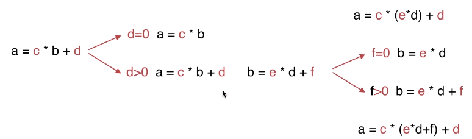

<absolute-box>最大公约数：gcd(a,b) = gcd(b,a mod b)</absolute-box>

```js
// 
export default (arr)=>{
  // 求最大公约数
  let gcd=(a,b)=>{
    if(b===0){
      return a
    }else{
      return gcd(b,a%b)
    }
  }
//   卡牌排序，排序的目的就是为了让相同的牌排在一起方便我们分组
  let str=arr.sort().join('')
  // 分组(单张或者多张)
  let group=str.match(/(\d)\1+|\d/g)
  while(group.length>1){
    let a=group.shift().length
    let b=group.shift().length
    let v=gcd(a,b)
    if(v===1){
      return false
    }else{
      // 结果放进去跟下一个比
      group.unshift('0'.repeat(v))
    }
  }
  return group.length?group[0].length>1:false
}
```
```js
var hasGroupsSizeX = function(deck) {
        const map = {}
  let minLen = Number.MAX_SAFE_INTEGER
  let result

  // 卡牌按值分组
  deck.forEach(item => {
    if(!map[item]) {
      map[item] = []
    }
    map[item].push(item)
  })
  
  // 获取数量最少的卡牌数量
  Object.keys(map).forEach(item => {
    if(map[item].length < minLen) {
      minLen = map[item].length
    }
  })

  if(minLen === 1) {
    return false
  }

  // 从每组2张开始查看能否分组，能分组则返回true 
  for(let i = 2; i <= minLen; i++) {
    result = true
    Object.keys(map).forEach(item => {
      if(map[item].length % i !== 0) {
        result = false
      }
    })
    if(result) {
      return result
    }
  }
  
  return result;
};
```

```js
var hasGroupsSizeX = function (deck) {
    // 统计数字个数
    const numMap = {}
    for (let i = 0; i < deck.length; i++) {
        if (!numMap[deck[i]]) {
            numMap[deck[i]] = 1
        } else {
            numMap[deck[i]]++
        }
    }
    const valuesArr = Object.values(numMap).sort((a, b) => a > b ? 1 : -1)
    // console.log('valuesArr', valuesArr)
    // 也就是说最大公约数得大于 1
    return !valuesArr.find(value => gcd(value, valuesArr[0]) === 1 || value < 2)

};

// 欧里几德算法，辗转相除法。
function gcd(a, b) {
    if (b == 0) {
        return a;
    }
    var r = parseInt(a % b);
    return gcd(b, r);
}
```

### ⑤ 筛选运算（种花问题）
<absolute-box>注意max加1时要记得那块地变成1</absolute-box>
```js
假设你有一个很长的花坛，一部分地块种植了花，另一部分却没有。可是，花卉不能种植在相邻的地块上，它们会争夺水源，两者都会死去。

给定一个花坛（表示为一个数组包含0和1，其中0表示没种植花，1表示种植了花），和一个数 n 。能否在不打破种植规则的情况下种入 n 朵花？能则返回True，不能则返回False。

示例 1:

输入: flowerbed = [1,0,0,0,1], n = 1
输出: True
示例 2:

输入: flowerbed = [1,0,0,0,1], n = 2
输出: False
注意:

数组内已种好的花不会违反种植规则。
输入的数组长度范围为 [1, 20000]。
n 是非负整数，且不会超过输入数组的大小。
```
- 技巧：把输入边长

```js
// 场景一
[0,0,1,0,0,0,1,0,1,0,0,0,0,0,0,1,0,1]
// 场景二
[1,0,1,0,0,0,1,0,1,0,0,0,0,0,0,1,0,1]
[0,1,0,0,0,0,1,0,1,0,0,0,0,0,0,1,0,1]
```
- 问题：
  - 边界问题（前后加个0可解决）
  - 条件010
  [0,0,1,0,0,0,1,0,1,0,0,0,0,0,0,1,0,1]
+1 | |

```js
export default (flowerbed,n)=>{
  let max = 0;
    flowerbed.push(0);
    flowerbed.unshift(0);
    let len=flowerbed.length;
    for (let i = 1; i < len-1; i++) {
        if (flowerbed[i-1] === 0 && flowerbed[i] === 0 && flowerbed[i+1] === 0) {
            flowerbed[i] = 1;
            max++;
        }
    }
    return max >= n
}
```
- 总结
  - 学会问题抽象
  - 学会数学建模思想
  - 学会动态输入（多找输入，而不是通过该代码）
### ⑥ 二进制运算（格雷编码）
<absolute-box>1. parseInt(num,2)转换二进制为十进制<br/>2. 注意两个连续的数值仅有一个位数的差异</absolute-box>
```js
格雷编码是一个二进制数字系统，在该系统中，两个连续的数值仅有一个位数的差异。

给定一个代表编码总位数的非负整数 n，打印其格雷编码序列。格雷编码序列必须以 0 开头。

示例 1:

输入: 2
输出: [0,1,3,2]
解释:
00 - 0
01 - 1
11 - 3
10 - 2

对于给定的 n，其格雷编码序列并不唯一。
例如，[0,2,3,1] 也是一个有效的格雷编码序列。

00 - 0
10 - 2
11 - 3
01 - 1
示例 2:

输入: 0
输出: [0]
解释: 我们定义格雷编码序列必须以 0 开头。
     给定编码总位数为 n 的格雷编码序列，其长度为 2n。当 n = 0 时，长度为 20 = 1。
     因此，当 n = 0 时，其格雷编码序列为 [0]。
```
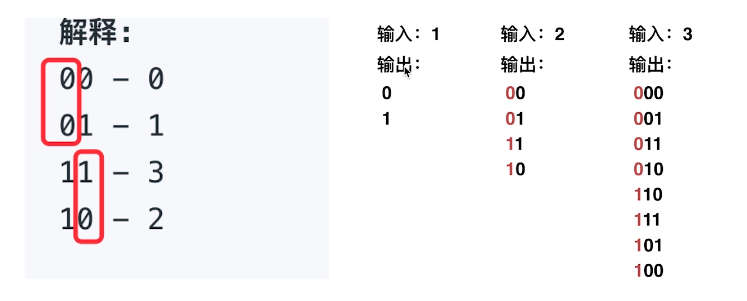
```js
export default (n)=>{
  // 递归函数，用来算输入为n的格雷编码序列
  let gray = function(n){
    if( n === 1){
      return ['0','1'];
    } else {
      let prev = gray(n-1);
      let res = [];
      let max = Math.pow(2,n)-1;
      for(let i =0;i<prev.length;i++){
        res[i] = `0${prev[i]}`;
        res[max - i] = `1${prev[i]}`;
      }
      return res;
    }
  }
  if(n === 0){
    return [0]
  }
  var res = gray(n);
  return res.map(item => {
    return parseInt(item,2)
  })
}
```
```js
let grayCode = function(n){
    let arr=[];
      while(n--){
          let temp=[];
          if(arr.length===0){
              arr=[0,1];
              continue;
          }
          
          
          for(let i=0;i<arr.length;i++){
              for(let j=0;j<2;j++){
                  let num=parseInt(`${arr[i]}${j}`,2);
                  temp.push(num);
              }
          }
          arr=temp;
      }
    return arr;
}
```
- 发现规律，动态输入

## 正则表达式
### ⑦ 重复的子字符串
```js
给定一个非空的字符串，判断它是否可以由它的一个子串重复多次构成。给定的字符串只含有小写英文字母，并且长度不超过10000。

示例 1:

输入: "abab"

输出: True

解释: 可由子字符串 "ab" 重复两次构成。
示例 2:

输入: "aba"

输出: False
示例 3:

输入: "abcabcabcabc"

输出: True

解释: 可由子字符串 "abc" 重复四次构成。 (或者子字符串 "abcabc" 重复两次构成。)
```
- 用正则去做
/^(\w+)\1+$/即为对应正则表达式
```js
export default (str)=>{
    var reg=/^(\w+)\1+$/
    return reg.test(str)
}
```

<mark-question></mark-question>
### ⑧正则表达式匹配
```js
给你一个字符串 s 和一个字符规律 p，请你来实现一个支持 '.' 和 '*' 的正则表达式匹配。

'.' 匹配任意单个字符
'*' 匹配零个或多个前面的那一个元素
所谓匹配，是要涵盖 整个 字符串 s的，而不是部分字符串。

说明:

s 可能为空，且只包含从 a-z 的小写字母。
p 可能为空，且只包含从 a-z 的小写字母，以及字符 . 和 *。
示例 1:

输入:
s = "aa"
p = "a"
输出: false
解释: "a" 无法匹配 "aa" 整个字符串。
示例 2:

输入:
s = "aa"
p = "a*"
输出: true
解释: 因为 '*' 代表可以匹配零个或多个前面的那一个元素, 在这里前面的元素就是 'a'。因此，字符串 "aa" 可被视为 'a' 重复了一次。
示例 3:

输入:
s = "ab"
p = ".*"
输出: true
解释: ".*" 表示可匹配零个或多个（'*'）任意字符（'.'）。
示例 4:

输入:
s = "aab"
p = "c*a*b"
输出: true
解释: 因为 '*' 表示零个或多个，这里 'c' 为 0 个, 'a' 被重复一次。因此可以匹配字符串 "aab"。
示例 5:

输入:
s = "mississippi"
p = "mis*is*p*."
输出: false
```
- 一个字符一个字符对比，对比完一个扔掉一组，然后重复刚才的动作
- 三种情况：无模式，有模式*,有模式.

```js
export default (s,p)=>{
    let isMatch=(s,p)=>{
        // 边界情况，如果s和p都为空，说明处理结束，返回true，否则返回false
        if(p.length<=0){
            return !s.length
        }
        // 判断p模式字符串的第一个字符和s字符串的第一个字符是不是匹配
        let match=false
        if(s.length>0&&(p[0]===s[0]||p[0]==='.')){
            match=true
        }
        // p有模式的，字符后面有*
        if(p.length>1&&p[1]==='*'){
            // 第一种情况：s*匹配0个字符
            // 第二种情况：s*匹配1个字符，递归下去，用来表示s*匹配多个s
            return isMatch(s,p.slice(2))||(match && isMatch(s.slice(1),p))
        }else{// 字符后面没有*
            return match && isMatch(s.slice(1),p.slice(1))
        }
    }
    return isMatch(s,p)
}
```

## 排序类
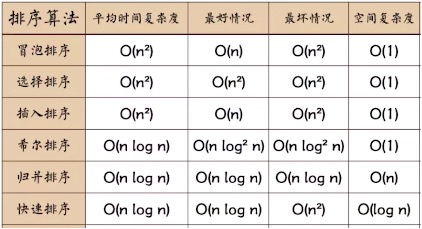
- 时间复杂度
    - 运行的次数(常数：O(1)，线性关系O(n),倍数关系：O(n*2))
- 空间复杂度
    - 占用的内存(常数：o1,线性关系O(n),倍数关系O(n*2))
### ⑨ 冒泡排序（先把最大值冒出来，再把倒数第二大的冒出来，以此类推

跟后一个元素对比，如果较大，就交换，一直把最大的换到最后一个，然后重复length-1次。
- 
```js
function bubbleSort(arr) {
    var len = arr.length;
    for (var i = 0; i < len - 1; i++) {
        for (var j = 0; j < len - 1 - i; j++) {
            if (arr[j] > arr[j+1]) {        // 相邻元素两两对比
                var temp = arr[j+1];        // 元素交换
                arr[j+1] = arr[j];
                arr[j] = temp;
            }
        }
    }
    return arr;
}
```
<mark-question></mark-question>
### ⑩ 选择排序（选中最小的值，和第一个交换，再选中第二小的值，和第二个交换，以此类推）
    - 首先在未排序序列中找到最小（大）元素，存放到排序序列的起始位置。
    - 再从剩余未排序元素中继续寻找最小（大）元素，然后放到已排序序列的末尾。
    - 重复第二步，直到所有元素均排序完毕。


```js
function selectionSort(arr) {
    var len = arr.length;
    var minIndex, temp;
    for (var i = 0; i < len - 1; i++) {
        minIndex = i;
        for (var j = i + 1; j < len; j++) {
            if (arr[j] < arr[minIndex]) {     // 寻找最小的数
                minIndex = j;                 // 将最小数的索引保存
            }
        }
        temp = arr[i];
        arr[i] = arr[minIndex];
        arr[minIndex] = temp;
    }
    return arr;
}
```
<mark-question></mark-question>
### ⑪ 922.按奇偶排序
```js
给定一个非负整数数组 A， A 中一半整数是奇数，一半整数是偶数。

对数组进行排序，以便当 A[i] 为奇数时，i 也是奇数；当 A[i] 为偶数时， i 也是偶数。

你可以返回任何满足上述条件的数组作为答案。

 

示例：

输入：[4,2,5,7]
输出：[4,5,2,7]
解释：[4,7,2,5]，[2,5,4,7]，[2,7,4,5] 也会被接受。
 

提示：

2 <= A.length <= 20000
A.length % 2 == 0
0 <= A[i] <= 1000
```
```js
export default (arr)=>{
    // 升序排序
    arr.sort((a,b)=>a-b)
    // 声明一个空数组用来存储奇偶排序后的数组
    let r=[]
    // 记录奇数，偶数位下标
    let odd=1
    let even=0
    // 对数组进行遍历
    arr.forEach(item=>{
        if(item%2===1){
            r[odd]=item
            odd+=2
        }else{
            r[even]=item
            even+=2
        }
    })
    return r
}
```
sort(compareFunction)
- 如果没有指明 compareFunction ，那么元素会按照转换为的字符串的诸个字符的Unicode位点进行排序。例如 "Banana" 会被排列到 "cherry" 之前。当数字按由小到大排序时，9 出现在 80 之前，但因为（没有指明 compareFunction），比较的数字会先被转换为字符串，所以在Unicode顺序上 "80" 要比 "9" 要靠前。
- 指定了compareFunction，a-b从小到大，b-a从大到小

<mark-question></mark-question>
### ⑫ 数组中的第K个最大元素
```js
在未排序的数组中找到第 k 个最大的元素。请注意，你需要找的是数组排序后的第 k 个最大的元素，而不是第 k 个不同的元素。

示例 1:

输入: [3,2,1,5,6,4] 和 k = 2
输出: 5
示例 2:

输入: [3,2,3,1,2,4,5,5,6] 和 k = 4
输出: 4
说明:

你可以假设 k 总是有效的，且 1 ≤ k ≤ 数组的长度。
```
```js
export default (arr)=>{
    return arr.sort((a,b)=>b-a)[k-1]
}
```
```js
// 更高性能的办法
export default (arr)=>{
    let len=arr.length
    for(let i=len;i<len-k;i--){
        for(let j=0;j<i;j++){
            temp=arr[j]
            if(temp>arr[j+1]){
                arr[j]=arr[j+1]
                arr[j+1]=temp
            }
        }
    }
    return arr[len-(k-1)]
}
```
```js
var findKthLargest = function(arr, k) {
    let len=arr.length;
    if(len===1){
        return arr[0];
    }
    for(let i=0;i<len-1;i++){
        for(let j=0;j<len-1-i;j++){
            if(arr[j]>arr[j+1]){
                let temp=arr[j];
                arr[j]=arr[j+1];
                arr[j+1]=temp;
            }
        }
        if(i===k-1){
            return arr[len-k];
        }
    }
    return arr[0]
};
```
- 一定要吃透基本排序法


<mark-question></mark-question>
<absolute-box>注意后面的第一个和第二个的间距没有遍历到，需要单独判断</absolute-box>
### ⑬ 最大间距
```js
给定一个无序的数组，找出数组在排序之后，相邻元素之间最大的差值。

如果数组元素个数小于 2，则返回 0。

示例 1:

输入: [3,6,9,1]
输出: 3
解释: 排序后的数组是 [1,3,6,9], 其中相邻元素 (3,6) 和 (6,9) 之间都存在最大差值 3。
示例 2:

输入: [10]
输出: 0
解释: 数组元素个数小于 2，因此返回 0。
说明:

你可以假设数组中所有元素都是非负整数，且数值在 32 位有符号整数范围内。
请尝试在线性时间复杂度和空间复杂度的条件下解决此问题。
```
```js
var maximumGap = function(arr) {
    if(arr.length<2) return 0
    let temp,max=0,space;
    for(let i=0;i<arr.length-1;i++){
        for(let j=0;j<arr.length-1-i;j++){
            if(arr[j]>arr[j+1]){
                temp=arr[j];
                arr[j]=arr[j+1];
                arr[j+1]=temp;
            }
        }
        if(i>0){
            space=arr[arr.length-i]-arr[arr.length-i-1];
            max=max>space?max:space;
        }
    }
    return Math.max(max, arr[1] - arr[0])
};
```
```js
export default (arr)=>{
    if (arr.length < 2) {
      return 0
    }
    let max = 0
    let len = arr.length - 1
    let space
    for (let i = len, tmp; i > 0; i--) {
        for (let j = 0; j < i; j++) {
            tmp = arr[j]
            if (tmp > arr[j + 1]) {
                arr[j] = arr[j + 1]
                arr[j + 1] = tmp
            }
        }
        if (i < len) {
            space = arr[i + 1] - arr[i]
            if (space > max) {
                max = space
            }
        }
    }
    return Math.max(max, arr[1] - arr[0])
}
```

<mark-question></mark-question>
<absolute-box>注意过滤掉负整数，注意边界情况</absolute-box>
### ⑭ 缺失的第一个正数
```js
给定一个未排序的整数数组，找出其中`没有出现的``最小的``正整数`。

示例 1:

输入: [1,2,0]
输出: 3
示例 2:

输入: [3,4,-1,1]
输出: 2
示例 3:

输入: [7,8,9,11,12]
输出: 1
说明:

你的算法的时间复杂度应为O(n)，并且只能使用常数级别的空间。
```

- 第一个是1,返回1。第一个不是1，遍历数组，如果两个数值差值大于一，返回第一个数值+1。

```js
export default (arr)=>{
    // 过滤掉非正整数
    arr=arr.filter(item=>item>0)
    // 正整数数组是不是为空
    if(arr.length){
        // 升序，方便取最小值
        arr.sort((a,b)=>a-b)
        // 第一个元素不为1，返回1
        if(arr[0]!==1){
            return 1
        }else{
            // 从左边开始遍历，只要下一个元素和当前元素差值>1，返回当前元素加1
            for(let i=0,len=arr.length-1;i<len;i++){
                if(arr[i+1]-arr[i]>1){
                    return arr[i]+1
                }
            }
            // 如果是连续正整数，则返回最后一个元素加1
            return arr.pop()+1
        }
    }else{
        return 1
    }
}
```
```js
// 使用选择排序
export default (arr)=>{
    // 过滤掉非正整数
    arr=arr.filter(item=>item>0)
    // 实现选择排序，先拿到最小值，如果第一个元素不是1直接返回1，如果是1，就要比相邻元素差值
    for(let i=0,len=arr.length,min;i<len;i++){
        min=arr[i]
        for(let j=i+1;j<len;j++){
            if(arr[j]<min){
                let c=min
                min=arr[j]
                arr[j]=c
            }
        }
        arr[i]=min
        if(i>0){
            if(arr[i]-arr[i-1]>1){
                return arr[i-1]+1
            }
        }else{
            if(min!==1){
                return 1
            }
        }
    }
    return arr.length?arr.pop()+1:1
}
```
## 基础算法之递归类
<mark-question></mark-question>
### ⑮ 复原IP地址
```js
给定一个只包含数字的字符串，复原它并返回所有可能的 IP 地址格式。

示例:

输入: "25525511135"
输出: ["255.255.11.135", "255.255.111.35"]
```
- IP由4部分构成，每部分范围0~255（递归）
- 所有情况都列出来(每个子字符串都可以是一位数到三位数)，然后按条件筛选
```js
export default (str)=>{
    // 保存所有符合条件的ip
    let r=[]
    // 递归函数
    let search=(cur,sub)=>{
        if(cur.length===4&&cur.join('')===str){
            r.push(cur.join('.'))
        }else{
            for(let i=0,len=Math.min(3,sub.length),tmp;i<len;i++){
                tmp=sub.substr(0,i+1)
                if(tmp<256){
                    search(cur.concat([tmp]),sub.substr(i+1))
                }
            }
        }
    }
    search([],str)
    return r
}

```
- 递归的本质（就是一个while循环，但可以有多个条件或地方调用）
  - 每一个处理过程是相同的
  - 输入输出是相同的
  - 处理次数未知


<mark-question></mark-question>
### ⑯ 与所有单词相关联的字符串
```js
给定一个字符串 s 和一些长度相同的单词 words。找出 s 中恰好可以由 words 中所有单词串联形成的子串的起始位置。

注意子串要与 words 中的单词完全匹配，中间不能有其他字符，但不需要考虑 words 中单词串联的顺序。

示例 1：

输入：
  s = "barfoothefoobarman",
  words = ["foo","bar"]
输出：[0,9]
解释：
从索引 0 和 9 开始的子串分别是 "barfoor" 和 "foobar" 。
输出的顺序不重要, [9,0] 也是有效答案。
示例 2：

输入：
  s = "wordgoodgoodgoodbestword",
  words = ["word","good","best","word"]
输出：[]
```
- 递归循环来计算出所有的words组合，然后匹配字符串即可。
```js
export default (str,words)=>{
    // 保存结果
    let result=[]
    // 记录数组的长度，做边界条件计算
    let num=words.length
    // 递归函数体
    let range=(r,_arr)=>{
        if(r.length===num){
            result.push(r)
        }else{
            _arr.forEach((item,idx)=>{
                // 当前元素踢出去，留下剩下的
                let tmp=[].concat(_arr)
                tmp.splice(idx,1)
                range(r.concat(item),tmp)
            })
        }
    }
    range([], words)
    // [0,9,-1]
    return result.map(item=>{
        return str.indexOf(item.join(''))
    }).filter(item=>item!==-1).sort()
}
```

## 数据结构之栈
- 栈的概念
  - 线性表，运算受限（仅允许一端的插入和删除）
### ⑰ 棒球比赛
```js
你现在是棒球比赛记录员。
给定一个字符串列表，每个字符串可以是以下四种类型之一：
1.整数（一轮的得分）：直接表示您在本轮中获得的积分数。
2. "+"（一轮的得分）：表示本轮获得的得分是前两轮有效 回合得分的总和。
3. "D"（一轮的得分）：表示本轮获得的得分是前一轮有效 回合得分的两倍。
4. "C"（一个操作，这不是一个回合的分数）：表示您获得的最后一个有效 回合的分数是无效的，应该被移除。

每一轮的操作都是永久性的，可能会对前一轮和后一轮产生影响。
你需要返回你在所有回合中得分的总和。

示例 1:

输入: ["5","2","C","D","+"]
输出: 30
解释: 
第1轮：你可以得到5分。总和是：5。
第2轮：你可以得到2分。总和是：7。
操作1：第2轮的数据无效。总和是：5。
第3轮：你可以得到10分（第2轮的数据已被删除）。总数是：15。
第4轮：你可以得到5 + 10 = 15分。总数是：30。
示例 2:

输入: ["5","-2","4","C","D","9","+","+"]
输出: 27
解释: 
第1轮：你可以得到5分。总和是：5。
第2轮：你可以得到-2分。总数是：3。
第3轮：你可以得到4分。总和是：7。
操作1：第3轮的数据无效。总数是：3。
第4轮：你可以得到-4分（第三轮的数据已被删除）。总和是：-1。
第5轮：你可以得到9分。总数是：8。
第6轮：你可以得到-4 + 9 = 5分。总数是13。
第7轮：你可以得到9 + 5 = 14分。总数是27。
注意：

输入列表的大小将介于1和1000之间。
列表中的每个整数都将介于-30000和30000之间。
```
```js
export default (arr)=>{
    // 用数组来实现堆栈结构，pop,push(从后面添加，从后面删除)
    let result=[]
    // 上一轮的数据
    let pre1
    // 上上轮的数据
    let pre2
    // 对数组进行遍历，遍历的目的是处理得分
    arr,forEach(item=>{
        switch(item){
            case 'C':
                if(result.length){
                    result.pop()
                }
                break
            case 'D':
                pre1=result.pop()
                result.push(pre1,pre1*2)
                break
            case '+':
                pre1=result.pop()
                pre2=result.pop()
                result.push(pre2,pre1,pre1+pre2)
                break
            default:
                result.push(item*1)
                break
        }
    })
    return result.reduce((total,num)=>{total+num})
}
```

<mark-question></mark-question>
### ⑱ 85.最大矩形
```js
给定一个仅包含 0 和 1 的二维二进制矩阵，找出只包含 1 的最大矩形，并返回其面积。

示例:

输入:
[
  ["1","0","1","0","0"],
  ["1","0","1","1","1"],
  ["1","1","1","1","1"],
  ["1","0","0","1","0"]
]
输出: 6
```
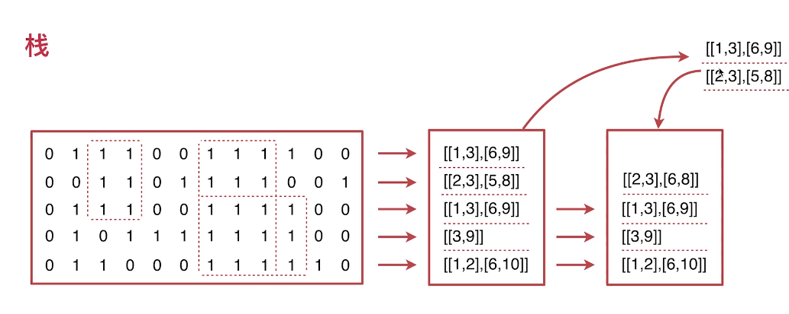
```js
export default (arr) => {
  let result = []
  let reg = /1{2,}/g
  // 把二位数组重新表达，把相邻的1提取出来（起始点+截止点）
  arr = arr.map(item => {
    let str = item.join('')
    let r = reg.exec(str)
    let rs = []
    while (r) {
      rs.push([r.index, r.index + r[0].length - 1])
      r = reg.exec(str)
    }
    return rs
  })
  // 通过递归计算相邻的矩阵
  let maxRect = (arr, result, n = 1) => {
    // 弹出第一行
    let top = arr.pop()
    // 弹出第二行
    let next = arr.pop()
    // 记录第一行的每一个起始点和截止点
    let tt
    // 记录第二行的每一个起始点和截止点
    let nn
    // 记录交叉的起始索引
    let start
    // 记录交叉的截止索引
    let end
    let width = 1
    let maxWidth = 1
    n++
    for (let i = 0, il = top.length; i < il; i++) {
      tt = top[i]
      for (let j = 0, jl = next.length; j < jl; j++) {
        nn = next[j]
        width = Math.min(tt[1], nn[1]) - Math.max(tt[0], nn[0])
        // 修改避免相邻两个数的差值为1（实际宽度为2）没有为start,end赋值导致的bug,应该加上=
        if (width >= maxWidth) {
          maxWidth = width
          start = Math.max(tt[0], nn[0])
          end = Math.min(tt[1], nn[1])
        }
      }
    }
    // 如果没有找到交叉点
    if (start === undefined || end === undefined) {
      if (n < 3) {
        return false
      } else {
        width = top[0][1] - top[0][0] + 1
        if (width > 1) {
          result.push((n - 1) * width)
        }
      }
    } else {
      // 找到交叉点继续下一行
      if (arr.length > 0) {
        arr.push([
          [start, end]
        ])
        maxRect(arr, result, n++)
      } else {
        // 从某一行一直计算到最后一行，这个时候start和end一直有值，所以不会进入到if层，这个时候n就是累计的行数（高），end-start+1就是宽
        result.push(n * (end - start + 1))
      }
    }
  }
  while (arr.length > 1) {
    maxRect([].concat(arr), result)
    arr.pop()
  }
  // 取最大值
  let max = 0
  let item = result.pop()
  while (item) {
    if (item > max) {
      max = item
    }
    item = result.pop()
  }
  return max > 0 ? max : -1
}
```

```js
export default (arr) => {
  let result = []
  let reg = /1{2,}/g
  // 把二位数组重新表达，把相邻的1提取出来（起始点+截止点）
  arr = arr.map(item => {
    let str = item.join('')
    let r = reg.exec(str)
    let rs = []
    while (r) {
      rs.push([r.index, r.index + r[0].length - 1])
      r = reg.exec(str)
    }
    return rs
  })
  // [ [], [ [ 2, 4 ] ], [ [ 0, 4 ] ], [] ]
  // 通过递归计算相邻的矩阵
  let maxRect = (arr, result, n = 1) => {
    // 弹出第一行
    let top = arr.pop()
    // 弹出第二行
    let next = arr.pop()
    // 记录第一行的每一个起始点和截止点
    let tt
    // 记录第二行的每一个起始点和截止点
    let nn
    // 记录交叉的起始索引
    let start
    // 记录交叉的截止索引
    let end
    let width = 1
    let maxWidth = 1
    n++
    for (let i = 0, il = top.length; i < il; i++) {
      tt = top[i]
      for (let j = 0, jl = next.length; j < jl; j++) {
        nn = next[j]
        width = Math.min(tt[1], nn[1]) - Math.max(tt[0], nn[0])
        // 修改避免相邻两个数的差值为1（实际宽度为2）没有为start,end赋值导致的bug,应该加上=
        if (width >= maxWidth) {
          maxWidth = width
          start = Math.max(tt[0], nn[0])
          end = Math.min(tt[1], nn[1])
        }
      }
    }
    // 如果没有找到交叉点
    if (start === undefined || end === undefined) {
      if (n < 3) {
        return false
      } else {
        width = top[0][1] - top[0][0] + 1
        if (width > 1) {
          result.push((n - 1) * width)
        }
      }
    } else {
      // 找到交叉点继续下一行
      if (arr.length > 0) {
        arr.push([
          [start, end]
        ])
        maxRect(arr, result, n++)
      } else {
        // 从某一行一直计算到最后一行，这个时候start和end一直有值，所以不会进入到if层，这个时候n就是累计的行数（高），end-start+1就是宽
        result.push(n * (end - start + 1))
      }
    }
  }
  while (arr.length > 1) {
    maxRect([].concat(arr), result)
    arr.pop()
  }
  // 取最大值
  let max = 0
  let item = result.pop()
  while (item) {
    if (item > max) {
      max = item
    }
    item = result.pop()
  }
  return max > 0 ? max : -1
}
```


## 数据结构之队列
- 特殊的线性表，只允许在表的前端删除，表的后端插入（先进先出）

### ⑲ 设计循环队列
```js
设计你的循环队列实现。 循环队列是一种线性数据结构，其操作表现基于 FIFO（先进先出）原则并且队尾被连接在队首之后以形成一个循环。它也被称为“环形缓冲器”。

循环队列的一个好处是我们可以利用这个队列之前用过的空间。在一个普通队列里，一旦一个队列满了，我们就不能插入下一个元素，即使在队列前面仍有空间。但是使用循环队列，我们能使用这些空间去存储新的值。

你的实现应该支持如下操作：

MyCircularQueue(k): 构造器，设置队列长度为 k 。
Front: 从队首获取元素。如果队列为空，返回 -1 。
Rear: 获取队尾元素。如果队列为空，返回 -1 。
enQueue(value): 向循环队列插入一个元素。如果成功插入则返回真。
deQueue(): 从循环队列中删除一个元素。如果成功删除则返回真。
isEmpty(): 检查循环队列是否为空。
isFull(): 检查循环队列是否已满。
 
示例：

MyCircularQueue circularQueue = new MycircularQueue(3); // 设置长度为 3

circularQueue.enQueue(1);  // 返回 true

circularQueue.enQueue(2);  // 返回 true

circularQueue.enQueue(3);  // 返回 true

circularQueue.enQueue(4);  // 返回 false，队列已满

circularQueue.Rear();  // 返回 3

circularQueue.isFull();  // 返回 true

circularQueue.deQueue();  // 返回 true

circularQueue.enQueue(4);  // 返回 true

circularQueue.Rear();  // 返回 4

提示：

所有的值都在 0 至 1000 的范围内；
操作数将在 1 至 1000 的范围内；
请不要使用内置的队列库。
```

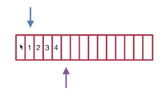
<absolute-box>注意添加数据时队尾指针要求余this.max，获取队尾数据时要队尾指针减一，并且如果指针减一小于0，即为数组最后一位</absolute-box>
```js
export default class MyCircularQueue {
    constructor (k) {
        // 保存数据长度为k的数据结构
        this.list=Array(k)
        // 队首的指针
        this.front=0
        // 队尾的指针
        this.rear=0
        // 队列的长度
        this.max=k
    }
    enQueue (num) {
        if(this.isFull()){
            return false
        }else{
            this.list[this.rear]=num
            this.rear=(this.rear+1)%this.max
            return true
        }
    }
    deQueue () {
        let v=this.list[this.front]
        this.list[this.front]=''
        this.front=(this.front+1)%this.max
        return v
    }
    isEmpty () {
        return this.front===this.rear&&!this.list[this.front]
    }
    isFull () {
        return this.front===this.rear&&!!this.list[this.front]
    }
    Front () {
        return this.list[this.front]
    }
    Rear () {
        let rear=this.rear-1

        return this.list[rear<0?this.max-1:rear]
    }
}
```

```js
class MycircularQueue{
    constructor(len){
        this.list=new Array(len);
        this.front=0;
        this.rear=0;
        this.max=len;
    }
    Front(){
        return this.list.length?this.list(this.front):-1;
    }
    Rear(){
        let rear=this.rear-1;
        return this.list[rear<0?this.max-1:rear]
    }
    enQueue(value){
        if(this.isFull()){
            return false;
        }else{
            this.list[this.rear]=value;
            this.rear=(this.rear+1)%this.max;
            return true;
        }
    }
    deQueue(){
        if(this.list.length>0){
            this.list[this.front]="";
            this.front++;
            return true;
        }else{
            return false;
        }
    }
    isEmpty(){
        return this.front===this.rear&&!this.list[this.front]
    }
    isFull(){
        return this.front===this.rear&&this.list[this.front]
    }
}
```
<mark-question></mark-question>
### ⑳ 任务调度器
```js
给定一个用字符数组表示的 CPU 需要执行的任务列表。其中包含使用大写的 A - Z 字母表示的26 种不同种类的任务。任务可以以任意顺序执行，并且每个任务都可以在 1 个单位时间内执行完。CPU 在任何一个单位时间内都可以执行一个任务，或者在待命状态。

然而，两个相同种类的任务之间必须有长度为 n 的冷却时间，因此至少有连续 n 个单位时间内 CPU 在执行不同的任务，或者在待命状态。

你需要计算完成所有任务所需要的最短时间。

示例 1：

输入: tasks = ["A","A","A","B","B","B"], n = 2
输出: 8
执行顺序: A -> B -> (待命) -> A -> B -> (待命) -> A -> B.
注：

任务的总个数为 [1, 10000]。
n 的取值范围为 [0, 100]。
```

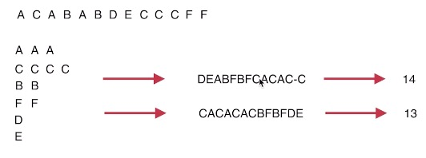

- 任务多的优先执行即可

```js
export default (tasks, n) => {
    let q = ''
    let Q = {}
    // 每种任务的数量
    tasks.forEach(item => {
        if (Q[item]) {
            Q[item]++
        } else {
            Q[item] = 1
        }
    })
    while (1) {
        let keys = Object.keys(Q)
        if (!keys[0]) {
            break
        }
        // n+1为一组
        let tmp = []
        for (let i = 0; i <= n; i++) {
            let max = 0
            let key
            let pos
            // 从所有的任务中找到未处理数最大的，优先安排
            keys.forEach((item, idx) => {
                if (Q[item] > max) {
                    max = Q[item]
                    key = item
                    pos = idx
                }
            })
            if (key) {
                tmp.push(key)
                keys.splice(pos, 1)
                Q[key]--;
                if (Q[key] < 1) {
                    delete Q[key]
                }
            } else {
                break
            }
        }
        q += tmp.join('').padEnd(n + 1, '-')
    }
    // A--A--A--
    q = q.replace(/-+$/g, '')
    return q.length
}
```

## 数据结构之链表
- 知识点
    - 如何手动地创建一个链表的数据结构(NodeList)
    - 知道链表如何排序(sort)
    - 如何检测链表是否是闭环的
- 概念
  - 链表由一系列结点（元素）组成，结点可以在运行时动态生成。每个结点包括两个部分：`存储数据元素的数据域`和`存储下一个结点地址的指针域`。
  - 链表只暴露一个头指针，后面的元素必须通过头指针不断的next，才能拿到
- js中没有链表结构
  - 数组可以充当队列，可以充当堆栈，但是不能充当链表

<mark-cross></mark-cross>

### ㉑ 排序链表
```js
在 O(n log n) 时间复杂度和常数级空间复杂度下，对链表进行排序。

示例 1:

输入: 4->2->1->3
输出: 1->2->3->4
示例 2:

输入: -1->5->3->4->0
输出: -1->0->3->4->5
```
- 什么是快速排序？
    - 选择一个基准值，小于的放它左边，大于的放它右边，然后左边右边再选一个基准值，以此类推。

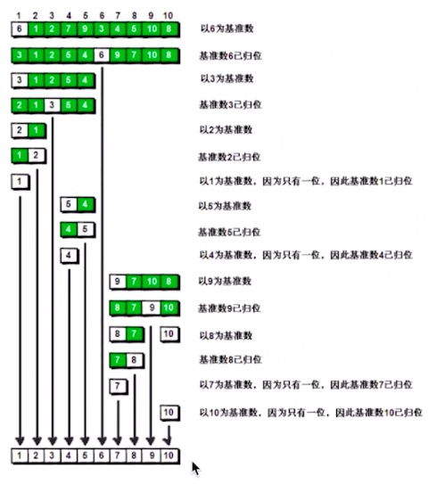

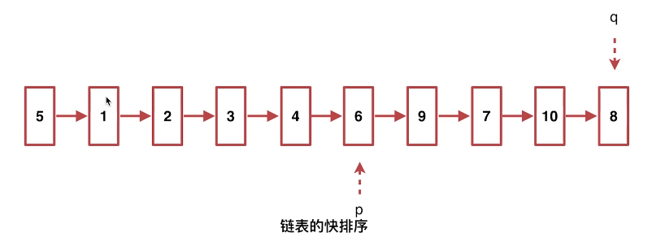

- 定义两个指针，q指针遍历所有链表节点，如果q指针指向的元素小于基准元素，就和p指针的后一个元素进行交换，同时p后移一位。最后让基准元素和小于它的后一个元素进行交换

```js
// 声明链表的节点

class Node {
    constructor(value) {
        this.val = value;
        this.next = undefined
    }
}

// 声明链表的数据结构

class NodeList {
    constructor(arr) {
        // 声明链表的头部节点
        let head = new Node(arr.shift())
        let next = head
        arr.forEach(item => {
            next.next = new Node(item)
            next = next.next
        })
        return head
    }
}

// 交换两个节点的值
let swap = (p, q) => {
    let val = p.val
    p.val = q.val
    q.val = val
}

// 寻找基准元素的节点
let partion = (begin, end) => {
    let val = begin.val
    let p = begin
    let q = begin.next
    while (q !== end) {
        if (q.val < val) {
            p = p.next
            swap(p, q)
        }
        q = q.next
    }
    // 让基准元素跑到中间去
    swap(p, begin)
    return p
}

export default function sort(begin, end) {
    if (begin !== end) {
        let part = partion(begin, end)
        sort(begin, part)
        sort(part.next, end)
    }
}

export {
    Node,
    NodeList
}
```
```js
// 拿到头指针
let head =new NodeList([4,1,3,2,7,9,10,12,6])
// 对头指针进行排序
sort(head)
let res=[]
let next=head
while(next){
    res.push(next.val)
    next=next.next
}
console.log(res)// [1,2,3,4,6,7,9,10,12]
```

```js
const merge = (l, r) => {
    let result = new ListNode('sb');
    let current = result;

    while(l && r) {
        if(l.val < r.val) {
            current.next = l;
            l = l.next;
            current = current.next;
        } else {
            current.next = r;
            r = r.next;
            current = current.next;
        }
    }

    current.next = l || r;
    return result.next;
}

// 归并排序
var sortList = function(head) {
    if(head === null || head.next === null) return head;
    let fast = head;
    let slow = head;

    while(fast.next && fast.next.next) {
        fast = fast.next.next;
        slow = slow.next;
    }

    const mid = slow.next;
    slow.next = null;

    return merge(sortList(head), sortList(mid));
};
```

<mark-cross></mark-cross>
### ㉒ 环形链表
```js
给定一个链表，判断链表中是否有环。

为了表示给定链表中的环，我们使用整数 pos 来表示链表尾连接到链表中的位置（索引从 0 开始）。 如果 pos 是 -1，则在该链表中没有环。

示例 1：

输入：head = [3,2,0,-4], pos = 1
输出：true
解释：链表中有一个环，其尾部连接到第二个节点。

示例 2：

输入：head = [1,2], pos = 0
输出：true
解释：链表中有一个环，其尾部连接到第一个节点。

示例 3：

输入：head = [1], pos = -1
输出：false
解释：链表中没有环。

进阶：

你能用 O(1)（即，常量）内存解决此问题吗？
```
- 环形检测原理
  - 两个指针一个快，一个慢，同时出发。快的和慢的相遇
  - 快的在慢的后面
```js
// 声明链表的节点
class Node {
    constructor(value) {
        this.val = value;
        this.next = undefined
    }
}

// 声明链表的数据结构
class NodeList {
    constructor(arr) {
        // 声明链表的头部节点
        let head = new Node(arr.shift())
        let next = head
        arr.forEach(item => {
            next.next = new Node(item)
            next = next.next
        })
        return head
    }
}

export default function isCircle(head) {
    // 慢指针
    let slow = head
        // 快指针
    let fast = head.next
    while (1) {
        if (!fast || !fast.next) {
            return false
        } else if (fast === slow || fast.next === slow) {
            return true
        } else {
            slow = slow.next
            fast = fast.next.next
        }
    }
}
export {
    Node,
    NodeList
}
```
```js
// 检测
let head=new NodeList([6,1,2,5,7,9])
// 设置环状
head.next.next.next.next.next.next=head.next
console.log(isCircle(head))// true
```
## 数据结构之矩阵
- 二维矩阵


### ㉓ 螺旋矩阵
```js
给定一个包含 m x n 个元素的矩阵（m 行, n 列），请按照顺时针螺旋顺序，返回矩阵中的所有元素。

示例 1:

输入:
[
 [ 1, 2, 3 ],
 [ 4, 5, 6 ],
 [ 7, 8, 9 ]
]
输出: [1,2,3,6,9,8,7,4,5]
示例 2:

输入:
[
  [1, 2, 3, 4],
  [5, 6, 7, 8],
  [9,10,11,12]
]
输出: [1,2,3,4,8,12,11,10,9,5,6,7]
```
- 拆解成一步一步的，而且要拆成每一步是相同的
  - 第一圈是第一行全部，第二行到倒数第二行是第一个和最后一个，最后一行全部，接着里面的作为一个新的矩阵，继续重复这个步骤。
```js

[
  [1, 2, 3, 4],
  [5, 6, 7, 8],
  [9,10,11,12],
  [5, 6, 7, 8],
  [9,10,11,12]
]

export default (arr) => {
    // 处理每一圈的数据遍历过程
    let map = (arr, r = []) => {
        for (let i = 0, len = arr.length; i < len; i++) {
            // 第一行
            if (i === 0) {
                r = r.concat(arr[i])
            } else if (i === len - 1) {// 最后一行
                r = r.concat(arr[len - 1].reverse())
            } else {// 其它行最后一个
                r.push(arr[i].pop())
            }
        }
        // 去掉第一行
        arr.shift()
        // 去掉最后一行
        arr.pop()
        // 去掉剩余行的第一个，并放入结果数组
        for (let i = arr.length - 1; i >= 0; i--) {
            r.push(arr[i].shift())
        }
        // 还有其它行没处理
        if (arr.length) {
            return map(arr, r)
        } else {// 否则直接返回结果数组r
            return r
        }
    }
    return map(arr, [])
}
```


<mark-question></mark-question>
### ㉔ 旋转图像
```js
给定一个 n × n 的二维矩阵表示一个图像。

将图像顺时针旋转 90 度。

说明：

你必须在原地旋转图像，这意味着你需要直接修改输入的二维矩阵。请不要使用另一个矩阵来旋转图像。

示例 1:

给定 matrix = 
[
  [1,2,3],
  [4,5,6],
  [7,8,9]
],

原地旋转输入矩阵，使其变为:
[
  [7,4,1],
  [8,5,2],
  [9,6,3]
]
示例 2:

给定 matrix =
[
  [ 5, 1, 9,11],
  [ 2, 4, 8,10],
  [13, 3, 6, 7],
  [15,14,12,16]
], 

原地旋转输入矩阵，使其变为:
[
  [15,13, 2, 5],
  [14, 3, 4, 1],
  [12, 6, 8, 9],
  [16, 7,10,11]
]
```
- 找到456这个轴，交换后再以753为轴，交换后即可
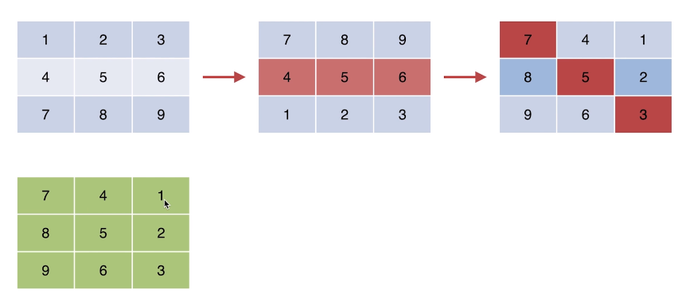
```js
function rotateImg(arr){

}
```

```js
export default (arr) => {
    // 获取n的维度
    let vecor = arr.length
        // 垂直翻转
    for (let i = 0, len = vecor / 2; i < len; i++) {
        for (let j = 0, tmp; j < vecor; j++) {
            tmp = arr[i][j]
            arr[i][j] = arr[vecor - i - 1][j]
            arr[vecor - i - 1][j] = tmp
        }
    }
    // 对角线翻转
    for (let i = 0; i < vecor; i++) {
        for (let j = 0, tmp; j < i; j++) {
            tmp = arr[i][j]
            arr[i][j] = arr[j][i]
            arr[j][i] = tmp
        }
    }
    return arr
}
```

<mark-cross></mark-cross>
## ㉕ 数据结构之二叉树
- 特性
  - 一个节点只有两个子节点，左节点和右节点
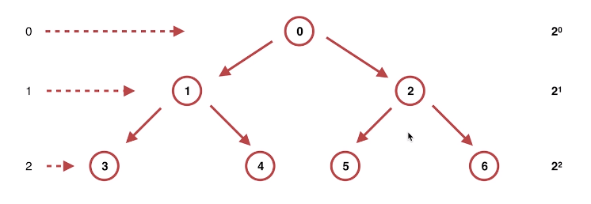
- 实现二叉树结构
```js
// 二叉树的节点
class Node {
    constructor(val) {
        this.val = val
        this.left = this.right = undefined
    }
}

class Tree {
    constructor(data) {
        // 临时存储所有节点，方便寻找父子节点
        let nodeList = []
            // 顶节点
        let root
        for (let i = 0, len = data.length; i < len; i++) {
            let node = new Node(data[i])
            nodeList.push(node)
            if (i > 0) {
                // 计算当前节点属于哪一层
                let n = Math.floor(Math.sqrt(i + 1))
                    // 记录当前层的起始点
                let q = Math.pow(2, n) - 1
                    // 记录上一层的起始点
                p = Math.pow(2, n - 1) - 1
                    // 找到当前节点的父节点
                let parent = nodeList[p + Math.floor((i - q) / 2)]
                    // 将当前节点和上一层的父节点做关联
                if (parent.left) {
                    parent.right = node
                } else {
                    parent.left = node
                }
            }
        }
        root = nodeList.shift()
            // 释放数组
        nodeList.length = 0
        return root
    }
}

export default Tree

export {
    Node
}
```
<mark-cross></mark-cross>
### ㉖ 对称二叉树
```js
给定一个二叉树，检查它是否是镜像对称的。

例如，二叉树 [1,2,2,3,4,4,3] 是对称的。

    1
   / \
  2   2
 / \ / \
3  4 4  3
但是下面这个 [1,2,2,null,3,null,3] 则不是镜像对称的:

    1
   / \
  2   2
   \   \
   3    3
```
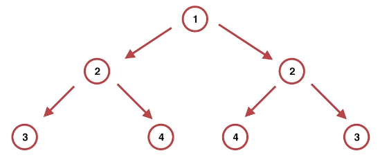
- 左定点的左节点等于右定点的右节点，以此类推
```js
// 二叉树的节点
class Node {
    constructor(val) {
        this.val = val
        this.left = this.right = undefined
    }
}

class Tree {
    constructor(data) {
        // 临时存储所有节点，方便寻找父子节点
        let nodeList = []
            // 顶节点
        let root
        for (let i = 0, len = data.length; i < len; i++) {
            let node = new Node(data[i])
            nodeList.push(node)
            if (i > 0) {
                // 计算当前节点属于哪一层
                let n = Math.floor(Math.sqrt(i + 1))
                    // 记录当前层的起始点
                let q = Math.pow(2, n) - 1
                    // 记录上一层的起始点
                p = Math.pow(2, n - 1) - 1
                    // 找到当前节点的父节点
                let parent = nodeList[p + Math.floor((i - q) / 2)]
                    // 将当前节点和上一层的父节点做关联
                if (parent.left) {
                    parent.right = node
                } else {
                    parent.left = node
                }
            }
        }
        root = nodeList.shift()
            // 释放数组
        nodeList.length = 0
        return root
    }
    static isSymmetry(root) {
        if (!root) {
            return true
        }
        let walk = (left, right) => {
            if (!left && !right) {
                return true
            }
            if ((left && !right) || (!left && right) || (left.val !== right.val)) {
                return false
            }
            return walk(left.left, right.right) && walk(left.right, right.left)
        }
        return walk(root.left, root.right)
    }
}

export default Tree

export {
    Node
}
```
```js
let root =new Tree([1,2,2,3,4,4,3])
console.log(Tree.isSymmetry(root))
```
<mark-cross></mark-cross>
### ㉗ 验证二叉搜索树
```js
给定一个二叉树，判断其是否是一个有效的二叉搜索树。

假设一个二叉搜索树具有如下特征：

节点的左子树只包含小于当前节点的数。
节点的右子树只包含大于当前节点的数。
所有左子树和右子树自身必须也是二叉搜索树。
示例 1:

输入:
    2
   / \
  1   3
输出: true
示例 2:

输入:
    5
   / \
  1   4
     / \
    3   6
输出: false
解释: 输入为: [5,1,4,null,null,3,6]。
     根节点的值为 5 ，但是其右子节点值为 4 。
```
- 所有的子树跳出来，看看是不是左边小右边大。如果所有都满足，那整个树都满足了
```js
// 二叉树的节点
class Node {
    constructor(val) {
        this.val = val
        this.left = this.right = undefined
    }
}

class Tree {
    constructor(data) {
        let root = new Node(data.shift())
            // 遍历所有的数据，逐渐插入到当前这课搜索树中去
        data.forEach(item => {
            this.insert(root, item)
        })
        return root
    }
    insert(node, data) {
        if (node.val > data) {
            if (node.left === undefined) {
                node.left = new Node(data)
            } else {
                this.insert(node.left, data)
            }
        } else {
            if (node.right === undefined) {
                node.right = new Node(data)
            } else {
                this.insert(node.right, data)
            }
        }
    }
    static walk(root) {
        if (!root.left && !root.right) {
            return true
        } else if (((root.left && root.val < root.left.val) || (root.right && root.val > root.right.val))) {
            return false
        } else {
            return Tree.walk(root.left) && Tree.walk(root.right)
        }
    }
}
export default Tree
export {
    Node
}
```
- 二叉搜索树对于排序有很大参考。
    - 做好了排序后，插入和删除非常好操作。
<mark-cross></mark-cross>
## ㉘ 数据结构之堆
- 概念
    - 必须是完全二叉树(n-1层必须是满二叉树)
    - 任一结点的值是其子树所有结点的最大值（最大堆）或最小值（最小堆）

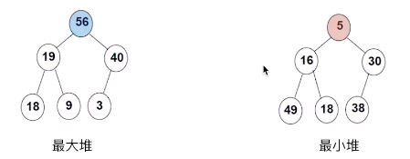

- 作用
    - 利用堆做排序和查找
- 堆排序
    - 完全二叉树节点之间的关系
        - 如果父节点是i，子节点(左)2*i+1，子节点(右)2*i+2

    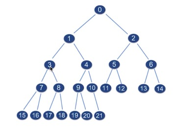

    - 普通的完全二叉树构建最大堆
        - 找到最后一个父节点，验证父节点是不是子树中的最大值，再依次往前判断每个子树，不是的交换成最大值。如果交换后对某个子树进行了破坏，那需要再次验证这个子树。找到第一个顶点的最大值后。移出最大值，把右下角的值放到最大值位置上，继续构建最大堆，找出第二大的值。以此类推。直到只剩一个值。
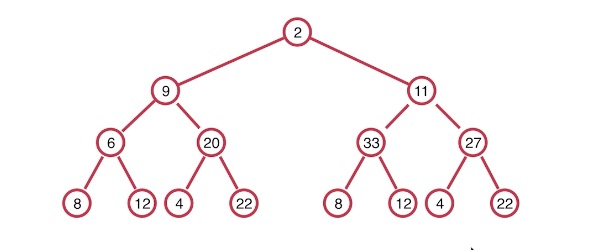
```js
class Heap {
    constructor(data) {
        this.data = data
    }
    sort() {
            let iArr = this.data
            let n = iArr.lenth
            if (n <= 1) {
                return iArr
            } else {
                for (let i = Math.floor(n / 2); i >= 0; i--) {
                    Heap.maxHeapify(iArr, i, n)
                }
                for (let j = 0; j < n; j++) {
                    Heap.swap(iArr, 0, n - 1 - j)
                    Heap.maxHeapify(iArr, 0, n - 1 - j)
                }
                return iArr
            }
        }
        // 交换两个元素
    static swap(arr, a, b) {
            if (a === b) {
                return ''
            }
            let c = arr[a]
            arr[a] = arr[b]
            arr[b] = c
        }
        // 构建最大堆
    static maxHeapify(Arr, i, size) {
        // 左节点（索引）
        let l = i * 2 + 1
            // 右节点
        let r = i * 2 + 2
        let largest = i
            // 父节点i分别和左节点l和右节点r做比较取最大
        if (l <= size && Arr[l] > Arr[largest]) {
            largest = l
        }
        if (r <= size && Arr[r] > Arr[largest]) {
            largest = r
        }
        if (largest != i) {
            Heap.swap(Arr, i, largest)
            Heap.maxHeapify(Arr, largest, size)
        }
    }
}
export default Heap
```

<mark-cross></mark-cross>
### ㉙ 根据字符出现频率排序
- 用堆排序做这题时间复杂度和空间复杂度是最低的
```js
给定一个字符串，请将字符串里的字符按照出现的频率降序排列。

示例 1:

输入:
"tree"

输出:
"eert"

解释:
'e'出现两次，'r'和't'都只出现一次。
因此'e'必须出现在'r'和't'之前。此外，"eetr"也是一个有效的答案。
示例 2:

输入:
"cccaaa"

输出:
"cccaaa"

解释:
'c'和'a'都出现三次。此外，"aaaccc"也是有效的答案。
注意"cacaca"是不正确的，因为相同的字母必须放在一起。
示例 3:

输入:
"Aabb"

输出:
"bbAa"

解释:
此外，"bbaA"也是一个有效的答案，但"Aabb"是不正确的。
注意'A'和'a'被认为是两种不同的字符。
```

```js
class Heap {
    constructor(str) {
        let map = new Map()
        str.split('').forEach(item => {
            if (map.has(item)) {
                map.set(item, map.get(item) + 1)
            } else {
                map.set(item, 1)
            }
        })
        this.map = map
        this.data = Array.from(map.values())
    }
    sort() {
        let iArr = this.data
        let n = iArr.lenth
        if (n <= 1) {
            return iArr
        } else {
            for (let i = Math.florr(n / 2); i >= 0; i--) {
                Heap.maxHeapify(iArr, i, n)
            }
            for (let j = 0; j < n; j++) {
                Heap.swap(iArr, 0, n - 1 - j)
                Heap.maxHeapify(iArr, 0, n - 1 - j)
            }
            return iArr
        }
    }
    toString() {
            let arr = this.sort()
            let str = []
            while (arr.length) {
                let top = arr.pop()
                for (let [k, v] of this.map) {
                    if (v === top) {
                        str.push(k.repeat(v))
                        this.map.delete(k)
                        break
                    }
                }
            }
            return str.join('')
        }
        // 交换两个元素
    static swap(arr, a, b) {
            if (a === b) {
                return ''
            }
            let c = arr[a]
            arr[a] = arr[b]
            arr[b] = c
        }
        // 构建最大堆
    static maxHeapify(Arr, i, size) {
        // 左节点（索引）
        let l = i * 2 + 1
            // 右节点
        let r = i * 2 + 2
        let largest = i
            // 父节点i分别和左节点l和右节点r做比较取最大
        if (l <= size && Arr[l] > Arr[largest]) {
            largest = l
        }
        if (r <= size && Arr[r] > Arr[largest]) {
            largest = r
        }
        if (largest != i) {
            Heap.swap(Arr, i, largest)
            Heap.maxHeapify(Arr, largest, size)
        }
    }
}
export default Heap
```

<mark-cross></mark-cross>
### ㉚ 超级丑数
```js
编写一段程序来查找第 n 个超级丑数。

超级丑数是指其所有质因数都是长度为 k 的质数列表 primes 中的正整数。

示例:

输入: n = 12, primes = [2,7,13,19]
输出: 32 
解释: 给定长度为 4 的质数列表 primes = [2,7,13,19]，前 12 个超级丑数序列为：[1,2,4,7,8,13,14,16,19,26,28,32] 。
说明:

1 是任何给定 primes 的超级丑数。
 给定 primes 中的数字以升序排列。
0 < k ≤ 100, 0 < n ≤ 106, 0 < primes[i] < 1000 。
第 n 个超级丑数确保在 32 位有符整数范围内。
```
- 概念
    - 质数
        - 大于1的自然数中，除了1和他本身没有其他因数
    - 质因数
        - 一个数的约数，并且是质数
    - 丑数
        - 只包含因子2，3，5的正整数，1也是丑数

- 解题思路
    - 求解任意整数的质因数
    - 质因数是否在指定质因数范围内
    - 是否达到指定个数n
```js
// 堆查找
class Heap {
    constructor(arr) {
        this.data = arr
        this.max = arr.length
        this.sort()
    }
    sort() {
        let iArr = this.data
        let n = iArr.lenth
        if (n <= 1) {
            return iArr
        } else {
            for (let i = Math.floor(n / 2); i >= 0; i--) {
                Heap.maxHeapify(iArr, i, n)
            }
            return iArr
        }
    }
    find(val, i = 0) {
            let arr = this.data
            if (val > arr[i] || i > this.max) {
                return false
            } else if (val === arr[i]) {
                return val
            } else {
                return this.find(val, i * 2 + 1 || this.find(val, i * 2 + 2))
            }
        }
        // 交换两个元素
    static swap(arr, a, b) {
            if (a === b) {
                return ''
            }
            let c = arr[a]
            arr[a] = arr[b]
            arr[b] = c
        }
        // 构建最大堆
    static maxHeapify(Arr, i, size) {
        // 左节点（索引）
        let l = i * 2 + 1
            // 右节点
        let r = i * 2 + 2
        let largest = i
            // 父节点i分别和左节点l和右节点r做比较取最大
        if (l <= size && Arr[l] > Arr[largest]) {
            largest = l
        }
        if (r <= size && Arr[r] > Arr[largest]) {
            largest = r
        }
        if (largest != i) {
            Heap.swap(Arr, i, largest)
            Heap.maxHeapify(Arr, largest, size)
        }
    }
}
export default Heap
```

```js
class Ugly {
    constructor(n, primes) {
        this.n = n
        this.primes = new Heap(primes)
    }
    getAll() {
            // 超级丑数列表
            let res = [1]
            let i = 2
            let primes = this.primes
            while (res.length < this.n) {
                let arr = Ugly.getPrimes(i)
                let k = 0
                let l = arr.length
                for (; k < l; k++) {
                    if (!primes.find(arr[k])) {
                        break
                    }
                }
                // k===l有两种情况（当前数没有质因数或者所有的质因数都在指定列表中）
                if (k === l) {
                    if (l === 0) {
                        if (primes.find(arr[k])) {
                            res.push(i)
                        }
                    } else {
                        res.push(i)
                    }
                }
                i++
            }
            return res[this.n - 1]
        }
        // 计算指定正整数n的质因数
    static getPrimes(n) {
        let prime = (n) => {
            // 存储所有的质因数
            let arr = []
            for (let i = 2; i < n / 2 + 1; i++) {
                if (n % i === 0 && !prime(i).length) {
                    arr.push(i)
                }
            }
            return arr
        }
        return prime(n)
    }

}
export default Ugly
```

##  进阶算法（思想）
- 贪心算法思想
- 动态规划思想

## 进阶算法之贪心算法
- 概念
    - 通过每一步的最优解来达到整体最优解。但不一定是问题的最优解。
    - 选择的贪心策略必须具备无后效性（某个状态以前的过程不会影响以后的状态，只与当前状态有关）
- 当一个问题特别抽象，特别复杂的时候，又找不到规律，不知道怎么办，可以考虑贪心算法，通过不断优化策略，靠近最优解。
<mark-question></mark-question>
### ㉛ 买卖股票的最佳时机
```js
给定一个数组，它的第 i 个元素是一支给定股票第 i 天的价格。

设计一个算法来计算你所能获取的最大利润。你可以尽可能地完成更多的交易（多次买卖一支股票）。

注意：你不能同时参与多笔交易（你必须在再次购买前出售掉之前的股票）。

示例 1:

输入: [7,1,5,3,6,4]
输出: 7
解释: 在第 2 天（股票价格 = 1）的时候买入，在第 3 天（股票价格 = 5）的时候卖出, 这笔交易所能获得利润 = 5-1 = 4 。
     随后，在第 4 天（股票价格 = 3）的时候买入，在第 5 天（股票价格 = 6）的时候卖出, 这笔交易所能获得利润 = 6-3 = 3 。
示例 2:

输入: [1,2,3,4,5]
输出: 4
解释: 在第 1 天（股票价格 = 1）的时候买入，在第 5 天 （股票价格 = 5）的时候卖出, 这笔交易所能获得利润 = 5-1 = 4 。
     注意你不能在第 1 天和第 2 天接连购买股票，之后再将它们卖出。
     因为这样属于同时参与了多笔交易，你必须在再次购买前出售掉之前的股票。
示例 3:

输入: [7,6,4,3,1]
输出: 0
解释: 在这种情况下, 没有交易完成, 所以最大利润为 0。
```

- 策略1：从最低点买入，在最高点卖出（追求单词利益）
- 策略2：从低点买入，只要可以赚钱就卖出；不断买卖（追求多次利益，单词利益不够）
- 策略3：从低点买入，到价格高点卖出，不断买卖（在保证单次利益的基础上，实现多次交易）（最贪）

```js
export default (prices) => {
    // 用来保存利润
    let count = 0
    for (let i = 0, len = prices.length; i < len; i++) {
        // 循环i的下一个
        for (let j = i; j < len - 1; j++) {
            if (prices[j + 1] > prices[j]) {
                count += prices[j + 1] - prices[j]
                i = j
            } else {
                i = j
                break
            }
        }
    }
    return count
}
```
- 每天和前一天比较，高了就加上差价，低了就重新选择低点。

<mark-question></mark-question>
### ㉜ 柠檬水找零
```js
在柠檬水摊上，每一杯柠檬水的售价为 5 美元。

顾客排队购买你的产品，（按账单 bills 支付的顺序）一次购买一杯。

每位顾客只买一杯柠檬水，然后向你付 5 美元、10 美元或 20 美元。你必须给每个顾客正确找零，也就是说净交易是每位顾客向你支付 5 美元。

注意，一开始你手头没有任何零钱。

如果你能给每位顾客正确找零，返回 true ，否则返回 false 。

示例 1：

输入：[5,5,5,10,20]
输出：true
解释：
前 3 位顾客那里，我们按顺序收取 3 张 5 美元的钞票。
第 4 位顾客那里，我们收取一张 10 美元的钞票，并返还 5 美元。
第 5 位顾客那里，我们找还一张 10 美元的钞票和一张 5 美元的钞票。
由于所有客户都得到了正确的找零，所以我们输出 true。
示例 2：

输入：[5,5,10]
输出：true
示例 3：

输入：[10,10]
输出：false
示例 4：

输入：[5,5,10,10,20]
输出：false
解释：
前 2 位顾客那里，我们按顺序收取 2 张 5 美元的钞票。
对于接下来的 2 位顾客，我们收取一张 10 美元的钞票，然后返还 5 美元。
对于最后一位顾客，我们无法退回 15 美元，因为我们现在只有两张 10 美元的钞票。
由于不是每位顾客都得到了正确的找零，所以答案是 false。
 

提示：

0 <= bills.length <= 10000
bills[i] 不是 5 就是 10 或是 20 
```
- 问题：找零钱
    - 策略1：给钱找零，不区分金额直到找到足够的零钱（追求单词找零）
    - 策略2：给钱找零，优先给金额大的零钱，尽量把零钱放在手里（追求多次找零）(更贪)
```js
export default (arr) => {
    // 钱箱
    let hand = []
        // 是否还有顾客
    while (arr.length) {
        // 取出最前面顾客的钱
        let money = arr.shift()
        if (money === 5) {
            hand.push(money)
        } else {
            // 手里的零钱降序排列
            hand.sort((a,b)=>b-a)
            // 需要的找零
            let change = money - 5
            for (let i = 0, len = hand.length; i < len; i++) {
                if (hand[i] <= change) {
                    change -= hand[i]
                    hand.splice(i, 1)
                        // 删除了元素，数组的长度发生了变化，要维持刚才的i不变
                    i--
                }
                if (change === 0) {
                    break
                }
            }
            // 没有足够的零钱给顾客
            if (change !== 0) {
                return false
            } else {
                // 顾客的钱收起来
                hand.push(money)
            }
        }
    }
    return true
}
```
- 只需要一个个取值时用while
- 需要比较等更复杂处理的用for
## 进阶算法之动态规划
- 概念
    - 状态转移方程
        - 由最优子结构得到的问题的公式
    - 最优子结构
        - 问题简化为最简单的情况
    - 边界
        - 特殊情况
- 用途
    - 不同路径
    - 最短路径
### ㉝ 不同路径II
```js
一个机器人位于一个 m x n 网格的左上角 （起始点在下图中标记为“Start” ）。

机器人每次只能向下或者向右移动一步。机器人试图达到网格的右下角（在下图中标记为“Finish”）。

现在考虑网格中有障碍物。那么从左上角到右下角将会有多少条不同的路径？
```


```js
网格中的障碍物和空位置分别用 1 和 0 来表示。

说明：m 和 n 的值均不超过 100。

示例 1:

输入:
[
  [0,0,0],
  [0,1,0],
  [0,0,0]
]
输出: 2
解释:
3x3 网格的正中间有一个障碍物。
从左上角到右下角一共有 2 条不同的路径：
1. 向右 -> 向右 -> 向下 -> 向下
2. 向下 -> 向下 -> 向右 -> 向右
```
- 思路
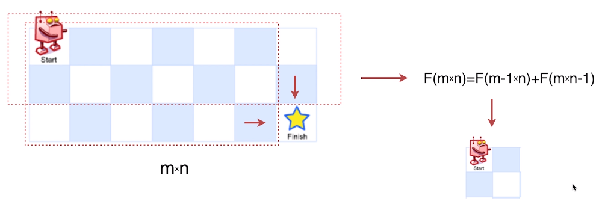
- 最后一步有几种情况？最后一步之前的路径等同于如上两个图形。
- 状态转移方程如上
- 最有子结构在方程中
- 边界三种情况：四个方块，一行，一列
```js
// leetcode提交超出时间限制！
export default (arr, m, n) => {
    // 最优子结构
    let dp = (m, n) => {
        let dp = (m, n) => {
    // 检查起始或者目标元素是不是1（被占用了），如果起始或者最后那个格就是1，说明怎么都怎么不到那，直接返回0
    if (arr[m - 1][n - 1] === 1 || arr[0][0] === 1) {
      return 0
    }
    if (m === 2 && n === 2) {
      return (arr[1][1] === 1 || arr[1][0] + arr[0][1] === 2) ? 0 : (arr[1][0] === 1 || arr[0][1] === 1) ? 1 : 2
    } else if (m < 2 || n < 2) {
      if (m < 2) {
        return arr[m - 1].includes(1) ? 0 : 1
      } else {
        for (let i = 0; i < m; i++) {
          if (arr[i][0] === 1) {
            return 0
          }
        }
        return 1
      }
    } else {
      return dp(m - 1, n) + dp(m, n - 1)
    }
  }
  return dp(m, n)
}
```
- 遍历所有的位置，如果遇到障碍物，位置值改为0，如果是起点，位置值改为1，如果是起点的两边，值等于它的前一个值。如果都不是，那等于它的左格子值加上格子值。最后右下角的格子值即为路径条数。
```js
// leetcode成功通过
var uniquePathsWithObstacles = function(obstacleGrid) {
    for(let i = 0; i<obstacleGrid.length;i++){
        for(let j = 0 ; j<obstacleGrid[i].length;j++){
            if(obstacleGrid[i][j] == 1){
                obstacleGrid[i][j] = 0;
                continue;
            }
            if(i==0&&j==0){
                obstacleGrid[i][j] = 1;
                continue;
            }
            if(i==0 || j==0){
                obstacleGrid[i][j] = i==0?obstacleGrid[i][j-1]:obstacleGrid[i-1][j];
                continue;
            }
            obstacleGrid[i][j] = obstacleGrid[i-1][j]+obstacleGrid[i][j-1];
        }
    }
    return obstacleGrid[obstacleGrid.length-1][obstacleGrid[0].length-1];
};
```

### ㉞ K站中转内最便宜的航班
```js
有 n 个城市通过 m 个航班连接。每个航班都从城市 u 开始，以价格 w 抵达 v。

现在给定所有的城市和航班，以及出发城市 src 和目的地 dst，你的任务是找到从 src 到 dst 最多经过 k 站中转的最便宜的价格。 如果没有这样的路线，则输出 -1。

示例 1:
输入: 
n = 3, edges = [[0,1,100],[1,2,100],[0,2,500]]
src = 0, dst = 2, k = 1
输出: 200
解释: 
城市航班图如下
```

```js
从城市 0 到城市 2 在 1 站中转以内的最便宜价格是 200，如图中红色所示。
示例 2:
输入: 
n = 3, edges = [[0,1,100],[1,2,100],[0,2,500]]
src = 0, dst = 2, k = 0
输出: 500
解释: 
城市航班图如下
```

```js
从城市 0 到城市 2 在 0 站中转以内的最便宜价格是 500，如图中蓝色所示。
提示：

n 范围是 [1, 100]，城市标签从 0 到 n - 1.
航班数量范围是 [0, n * (n - 1) / 2].
每个航班的格式 (src, dst, price).
每个航班的价格范围是 [1, 10000].
k 范围是 [0, n - 1].
航班没有重复，且不存在环路
```

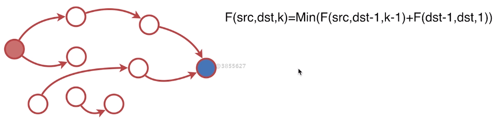
```js
// leetcode中运行超出时间限制！
export default (fights, src, dst, k) => {
  // 将fights作为参数和LeetCode一致
  let cheap = (fights, src, dst, k) => {
    let prev = fights.filter(item => item[1] === dst)
    let min = Math.min.apply(null, prev.map(item => {
      if (item[0] === src && k > -1) {
        return item[2]
      } else if (k === 0 && item[0] !== src) {
        return Number.MAX_SAFE_INTEGER
      } else {
        return item[2] + cheap(fights, src, item[0], k - 1)
      }
    }))
    return min
  }
  // 增加返回值是不是Number.MAX_SAFE_INTEGER，如果是返回-1
  let min = cheap(fights, src, dst, k)
  return min >= Number.MAX_SAFE_INTEGER ? -1 : min
}
```


## 【面试题】

<mark-question></mark-question>
### 【1】821. 字符的最短距离
```js
给定一个字符串 S 和一个字符 C。返回一个代表字符串 S 中每个字符到字符串 S 中的字符 C 的最短距离的数组。

示例 1:

输入: S = "loveleetcode", C = 'e'
输出: [3, 2, 1, 0, 1, 0, 0, 1, 2, 2, 1, 0]
说明:

字符串 S 的长度范围为 [1, 10000]。
C 是一个单字符，且保证是字符串 S 里的字符。
S 和 C 中的所有字母均为小写字母。
```
- 先求出左边的C到每个字符的最近距离，再求出右边的C到每个字符的最近距离，然后左右中取最小值即可，双指针
```js
var shortestToChar = function(S, C) {
    let len=S.length;
    let left=[];let right=[];
    left[0]=S[0]===C?0:10000;
    for(var i=1;i<len;i++){
        left[i]=S[i]===C?0:left[i-1]+1;
    }
    right[len-1]=S[len-1]===C?0:10000;
    for(var i=len-2;i>=0;i--){
        right[i]=S[i]===C?0:right[i+1]+1;
    }
    for(var i=0;i<len;i++){
        left[i]=Math.min(left[i],right[i])
    }
    return left;
};
```

<mark-question></mark-question>
### 【2】 845. 数组中的最长山脉
```js
我们把数组 A 中符合下列属性的任意连续子数组 B 称为 “山脉”：

B.length >= 3
存在 0 < i < B.length - 1 使得 B[0] < B[1] < ... B[i-1] < B[i] > B[i+1] > ... > B[B.length - 1]
（注意：B 可以是 A 的任意子数组，包括整个数组 A。）

给出一个整数数组 A，返回最长 “山脉” 的长度。

如果不含有 “山脉” 则返回 0。

 

示例 1：

输入：[2,1,4,7,3,2,5]
输出：5
解释：最长的 “山脉” 是 [1,4,7,3,2]，长度为 5。
示例 2：

输入：[2,2,2]
输出：0
解释：不含 “山脉”。
 

提示：

0 <= A.length <= 10000
0 <= A[i] <= 10000
```
- 三个指针
```js
// 没看懂
var longestMountain = function(A) {
    let m=A.length;
    if(m<3) return 0;
    let ptrL=0;
    // 保存最高点
    let ptrM=0;
    let ptrR=0;
    let result=0;
    while(ptrR<m){
        // 递增最高点
        while(ptrM<m-1&&A[ptrM+1]>A[ptrM]) ptrM++;
        ptrR=ptrM;
        // 递减最低点
        while (ptrR < m - 1 && A[ptrR + 1] < A[ptrR])
				ptrR++;
            // 有递增，并且有递减，并且
			if (ptrL != ptrM && ptrR != ptrM && result < ptrR - ptrL + 1)
				result = ptrR - ptrL + 1;
            // 数字相等，跳过这个数字
            if(ptrL == ptrR)
                ptrL = ptrM = ++ptrR;
            // 到最低点之前都不符合，跳过
            else
                ptrL = ptrM = ptrR;
    }
    return result;
};
```
- temp是临时的山脉，res是目前为止的最大山脉。
```js
var s=[2,1,4,7,3,1,4,7,3,2,5]
var longestMountain = function(A) {
    let res=0,temp=1;
    let isDown=false;
    for (let i = 1; i < A.length; i++) {
        if (A[i] > A[i - 1]) {
            if (isDown) {
                res = res > temp ? res : temp;
                temp = 1;
                isDown = false;
            }
            temp++;
        } else if (A[i] == A[i - 1]) {
            if (isDown) {
                res = res > temp ? res : temp;
                isDown = false;
            }
            temp = 1;
        } else {
            if (isDown) {
                temp++;
            } else if (temp != 1) {
                isDown = true;
                temp++;
            }
        }
    }
    if (isDown) {
        res = res > temp ? res : temp;
    }
    return res;
};
```

<mark-question></mark-question>
### 【3】741. 摘樱桃
```js
一个N x N的网格(grid) 代表了一块樱桃地，每个格子由以下三种数字的一种来表示：

0 表示这个格子是空的，所以你可以穿过它。
1 表示这个格子里装着一个樱桃，你可以摘到樱桃然后穿过它。
-1 表示这个格子里有荆棘，挡着你的路。
你的任务是在遵守下列规则的情况下，尽可能的摘到最多樱桃：

从位置 (0, 0) 出发，最后到达 (N-1, N-1) ，只能向下或向右走，并且只能穿越有效的格子（即只可以穿过值为0或者1的格子）；
当到达 (N-1, N-1) 后，你要继续走，直到返回到 (0, 0) ，只能向上或向左走，并且只能穿越有效的格子；
当你经过一个格子且这个格子包含一个樱桃时，你将摘到樱桃并且这个格子会变成空的（值变为0）；
如果在 (0, 0) 和 (N-1, N-1) 之间不存在一条可经过的路径，则没有任何一个樱桃能被摘到。
示例 1:

输入: grid =
[[0, 1, -1],
 [1, 0, -1],
 [1, 1,  1]]
输出: 5
解释： 
玩家从（0,0）点出发，经过了向下走，向下走，向右走，向右走，到达了点(2, 2)。
在这趟单程中，总共摘到了4颗樱桃，矩阵变成了[[0,1,-1],[0,0,-1],[0,0,0]]。
接着，这名玩家向左走，向上走，向上走，向左走，返回了起始点，又摘到了1颗樱桃。
在旅程中，总共摘到了5颗樱桃，这是可以摘到的最大值了。
说明:

grid 是一个 N * N 的二维数组，N的取值范围是1 <= N <= 50。
每一个 grid[i][j] 都是集合 {-1, 0, 1}其中的一个数。
可以保证起点 grid[0][0] 和终点 grid[N-1][N-1] 的值都不会是 -1。
```

```js
function cherryPickup(grid){
        let N = grid.length  // 转化为2人同时从(0,0)走到(N-1,N-1)的最大收益
        let S = (N-1) * pow(2,1)  // 最大步数，即（N-1)*2步走到目的地
        let dp = new Map([[0,0,0],grid[0][0]])// dp[s,i,j]走了s步且位于两人分别位于i,j两行的最大收益，在下面的循环里仅当(s,i,j)状态可达时才存入哈希
        let moves = [[0, 0], [1, 0], [0, 1], [1, 1]]  // i,j要考虑的上一时刻到现在可能的变化量
        for (let s=1; s<=S+1;i++){
            for(let y1=1;y1<=Math.min(s+1,N);y1++){
                let x1 = s-y1
                if (x1 >= N || grid[y1][x1] == -1)  // 该状态不可达
                    continue
                for(let y2=1;y2<=Math.min(s+1,N);y2++){// 仅考虑y1<=y2，因为(s,y1,y2)与(s,y2,y1)等价
                    x2 = s-y2
                    if (x2 >= N || grid[y2][x2] == -1) // 该状态不可达
                        continue
                    _max = -1  // -1占位后面判断可达
                    for(let [dy1,dy2] in moves){
                        let [_y1, _y2] = [y1-dy1, y2-dy2]  // 其可能来自的状态
                        if (_y1 > _y2)
                            continue
                        _max = max(_max, dp.get((s-1, _y1, _y2), -1))
                    
                    }
                        
                    if (_max != -1)  // 仍为-1则说明没有前置状态可以到达当前状态
                        dp[s, y1, y2] = _max + grid[y1][x1] + grid[y2][x2] if y1 != y2 else _max + grid[y1][x1]  // y1=y2时则只能有一个人获得樱桃
        } 
            }
                }
                
            
        return dp.get((S, N-1, N-1), 0)  // 若该状态不可达，返回0
 }
```
<mark-question></mark-question>
### 【4】[1,{a:13},3,{b:12},12] 统计所有数字之和
```js
let sum=arr.reduce((acc,cur)=>{
    if(typeof cur==='object'){
        for(key in objs){
            if(obj.hasOwnProperty(key)){
                acc+=cur[key]
            }
        }
    }else{
        acc+=cur
    }
    return acc;
})
```
### 【5】获取一个对象的所有key
```js
Object.keys(obj)

let keys=[];
for(key in obj){
    keys.push(key);
}
```

### 【6】[{a:34},{a:12},{a:43}]数组排序
```js
arr.sort((a,b)=>{
    return a.a-b.a;
})
```

### 【7】找出一个长字符串中连续重复次数最多的字符，如：在"nddemdereeeffetcssssfggddregg"中's'重复出现次数(4)次最多，因此's'为连续重复出现最长的字符。
```js
function maxTime(str) {
    let reg = /(\w)\1+/;
    let max = 0;
    let maxChar = '';
    while (str) {
        let result = reg.exec(str);
        if (result) {
            if (result.length > max) {
                max = result.length;
                maxChar = result[1];
            }
            str = str.slice(result.index + result.length);
        } else {
            break;
        }
    }
    return maxChar;
}
```
```js
function maxTime(str){
    str.match(/(\w)\1+/g).sort((a,b)=>b.length-a.length)[0][0];
}
```
<mark-question></mark-question>
### 【8】现在一个json，在某一维度中可能会出现'score'键，请用任意语言写一个check方法判断该json是否满足要求。要求如下：
```js
a. 任意一个键为score的值预期是一个整型数字且大于60，则检查通过
b. 若不存在键为score的值，则检查通过
json参考样例：
{
    "name":"BeJson",
    "url":"http://www.bejson.com",
    "score":59,
    "address":{
        "score":20,
        "city":"江苏苏州",
        "country":"中国"
    },
    "links":[{
        "score":60,
        "url":"http://www.google.com"
    }]
}
```
```js
function hasScore(json) {
    let exist = false;
    let over = false;

    function checkScoreChild(obj) {
        if (obj instanceof Object) {
            for (key in obj) {
                checkScoreChild(obj[key]);
                if (key === 'score') {
                    exist = true;
                    console.log(obj['score']);
                    if (typeof obj['score'] === 'number' && obj['score'] > 60) {
                        over = true;
                    }
                }
            }
        } else if (obj instanceof Array) {
            obj.forEach(item => {
                checkScoreChild(item);
            })
        }

    }
    checkScoreChild(JSON.parse(json))
    return over || !exist;
}
```

### 【9】实现一个promise,实现promise.all，实现promise.race
1. 一个类里面有一个变量保存promise状态，new的时候传入一个函数，函数的参数里包含两个方法resolve和reject，在promise初始化时定义了。当new promise异步成功后执行定义的resolve方法，传入成功值，失败调用reject方法，传入失败值。立即执行new传入的函数。
2. then函数的作用是返回一个新的promise，在里面判断目前的promise状态，成功就调用原promise的成功，失败调用原promise的失败，等待就把原成功和原失败存起来(存的时候函数包一下把参数传进去)，等成功后调用。这样通过一个变量和发布订阅就实现了发送请求和得到请求结果的分离。
3. 原promise的成功函数执行时出错就执行新promise的失败，成功就执行新promise的成功。其它也是如此
4. resolvePromise(promise2,x,resolve,reject),执行promise2的resolve，即执行新promise成功时，要先判断原promise成功函数的返回值x是不是一个promise(判断是对象或者函数，并且有then属性即认为是promise)。加上异步以保证能拿到promise2传过去。是promise，就执行它的then方法，按then的结果来判断promise2的状态。
```js
let Promise=require('./promise')
let p=new Promise(function(resolve,reject){
    reject('情人节到了');
    resolve('情人到了');
    throw new Error('错误');
})
// 链式调用
p.then((value)=>{
    console.log('success',value);
    return value;
},(reason)=>{
    console.log('error',reason);
}).then((value)=>{

})

// 值的穿透 
p.then().then().then((data)=>{
    console.log(data);
})
p.then().then(1,data=>{
    console.log(data);
})
```

```js
function Promise(executor){
    // 在promise内部定义一个状态 当前promise的状态
    let self=this;
    self.value=undefined;
    self.reason=undefined;
    self.onResolvedCallbacks=[];
    self.onRejectedCallbacks=[];
    self.status='pending';// 默认promise的状态是pending
    function resolve(value){
        if(value instanceof Promise){// resolve的结果是一个promise，会让这个promise执行，将执行后的结果传递给resolve或者reject
            return value.then(resolve,reject)
        }
        if(self.status==='pending'){
            self.value=value;
            self.status='resolved';// 成功状态
            // 发布
            self.onResolvedCallbacks.forEach(fn=>{
                fn();
            })
        }
    }
    function reject(reason){
        if(self.status==='pending'){
            self.reason=reason;
            self.status='rejected';// 失败状态
            self.onRejectedCallbacks.forEach(fn=>{
                fn();
            })
        }
    }
    try{
        executor(resolve,reject);
    }catch(e){
        reject(e);// 说明失败了
    }
    
}

function resolvePromise(promise2,x,resolve,reject){
    // 判断x是不是promise
    // 如果自己等待着自己完成 那么当前就应该走向失败，防止自己等待自己
    if(promise2===x){
        return reject(new TypeError('循环引用了'))
    }
    let called; // 表示当前有没有被调用过（规范要求如果resolve和reject都被调用了或者被调用多次，只有第一次有效）
    // 按规范来判断
    if((x!==null&&typeof x==='object')|| typeof x==='function'){
        // 很有可能是一个promise
        try{
            let then=x.then;// then属性具有getter 此时获取时会发生异常
            if(typeof then==='function'){// 默认是promise
                then.call(x,(y)=>{// 不再次取x.then()，防止then的get函数被意外修改，使用call调用一定不会报错
                    // y有可能是一个promise。一直解析 直到结果是一个常量为止
                    if(called) return;// 给别人的promise增加的逻辑
                    called=true;
                    resolvePromise(promise2,y,resolve,reject)
                    // resolve(y);// 成功拿到成功的结果，让promise2变成成功状态
                },(r)=>{
                    if(called) return;
                    called=true;
                    reject(r);
                }); // 保证this指向这个promise
            }else{// 当前这个then是一个普通对象
                resolve(x); // {a:1}
            }
        }catch(e){
            if(called) return;
            called=true;
            reject(e);
        }
    }else{
        resolve(x);// 普通值 直接成功即可
    }
}
Promise.prototype.then=function(onFulfilled,onRejected){
    // 值得穿透：给一个默认的返回参数或者抛出错误的函数
    onFulfilled=typeof onFulfilled==='function'?onFulfilled:value=>value;
    onRejected=typeof onRejected==='function'?onRejected:err=>{throw err};
    let self=this;
    // 调用then后需要再次 返回一个新的promise
    // 需要拿到当前then方法成功或失败执行后的结果
    // 判断then函数的执行结果和promise2的关系
    let promise2 = new Promise(function(resolve,reject){
        if(self.status==='resolved'){// 这里要使用promise2，需要添加异步保证可以获取到promise2
            setTimeout(()=>{
                try{
                    let x = onFulfilled(self.value);
                    resolve(x);
                    resolvePromise(promise2,x,resolve,reject);
                }catch(e){
                    reject(e);// 如果执行函数时抛出失败，那么会走向下一个then的失败状态
                }
            },0)
        }
        if(self.status==='rejected'){
            setTimeout(()=>{
                try{
                    let x = onRejected(self.reason);
                    resolvePromise(promise2,x,resolve,reject);
                }catch(e){
                    reject(e);
                }
            },0)
        }
        if(self.status==='pending'){
            // 订阅
            self.onResolvedCallbacks.push(function(){
                setTimeout(()=>{
                    try{
                        let x = onFulfilled(self.value);
                        resolvePromise(promise2,x,resolve,reject);
                    }catch(e){
                        reject(e);
                    }
                },0)
            });
            self.onRejectedCallbacks.push(function(){
                setTimeout(()=>{
                    try{
                        let x = onRejected(self.reason);
                        resolvePromise(promise2,x,resolve,reject);
                    }catch(e){
                        reject(e);
                    }
                },0)
            });
        }
    })
    return promise2;
    
}
// 不属于规范内的。就是返回了个then
Promise.prototype.catch=function(errCallback){
    return this.then(null,errCallback)
}

Promise.resolve=function(value){
    return new Promise((resolve,reject)=>{
        resolve(value);
    })
}

Promise.reject=function(value){
    return new Promise((resolve,reject)=>{
        reject(value)
    })
}

// promise.finally实现原理是什么 try{}catch{}finally{} 无论如何都会执行 也是返回的then
Promise.prototype.finally=function(callback){
    return this.then((data)=>{
        // 如果callback是一个函数返回promise 就等待这个promise执行完毕
        // 如果finally里返回一个promise，要等这个promise状态改变，再继续执行下面代码.使用resolve即可
        return Promise.resolve(callback()).then(()=>data);
        // callback();
        // return data;
    },(err)=>{
        // 一定要用resolve，不能用reject，因为resolve有等待的效果
        return Promise.resolve(callback()).then(()=>{throw err});
        // callback();
        // throw err;
    })
}
```
- 链式调用
    - 回调地狱
    ```js
    function readFile(url){
        return new Promise((resolve,reject)=>{
            fs.readFile(url,'utf8',function(err,data){
                if(err) reject(err);
                resolved(data);
            })
        })
    }
    readFile('./name.txt').then((data)=>{
        readFile(data).then(data=>{
            console.log(data);
        })
    },(err)=>{
        console.log(err);
    })
    ```
    - 特点
        1. 如果一个then方法 返回一个普通值 这个值会传递给下一次then中作为成功的结果
        2. 如果报错，传递给下一个失败
        3. 如果返回的是promise,promise成功结果传给下一个成功，promise失败传给下一个失败
        4. 捕获错误机制：默认会找最近的then的失败
        5. jquery的链式调用，返回this可以实现。promise.then的链式调用，返回一个新的promise可以实现（因为then后状态已经变为pending，不可以再变成其他。所以要有个新的promise，新的状态）
        ```js
        readFile('./name.txt').then((data)=>{
            // return 100;
            return new Promise((resolve,reject)=>{
                setTimeout(function(){
                    resolve('哈哈');
                },1000)
            })
        }).then(data=>{
            console.log(data);
        },function(err){
            console.log(err);
        }).catch(err=>{
            console.log('catch',err);
        })

        
        ```

### 【10】实现一个promise延迟对象 defer
- 延迟对象 Q库 减少套用
```js
let fs=require('fs');
let Promise=require('./promise');
function read(url){
    let defer=Promise.defer();
    fs.readFile(url,'utf8',(err,data)=>{
        if(err) reject(err)
        defer.resolve(data);
    })
    return defer.promise;
}
read('./name.txt').then(data=>{
    console.log(data);
})
```
```js
// promise.js
Promise.defer=function(){
    let dfd={};
    dfd.promise=new Promise((resolve,reject)=>{
        dfd.resolve=resolve;
        dfd.reject=reject;
    })
    return dfd;
}
```

- 安装这个库可校验自己写的是否符合promise a+规范
```js
npm install -g promises-aplus-test
promises-aplus-tests promise.js
```

### 【11】如何终止promise链？
- 返回一个等待的promise
```js
let promise=new Promise((resolve,reject)=>{
    resolve();
})
promise.then(function(){
    // 走到这希望后面的then不再执行了
    console.log(1)
    // 返回一个空的promise，既不成功也不失败
    return new Promise(()=>{})

}).then(function(){
    console.log(2)
})

```

### 【12】Promise.all
```js
let fs=require('fs').promises;//新版本10版本新增的
Promise.all([fs.readFile('./name.txt','utf8'),fs.readFile('./age.txt','utf8'),1,2]).then(data=>{
    console.log(data);
})
```
- 多个异步并发，使用计数器
```js
function isPromise(value){
    if(typeof value==='function' || (typeof value==='object' && value !==null)){
        if(typeof value.then==='function'){
            return true;
        }
    }
    return false;
}
Promise.all=function(values){
    return new Promise((resolve,reject)=>{
        let arr=[];
        let i=0;
        let processData=(key,value)=>{
            arr[key]=value;// after函数
            if(++i===value.length){
                resolve(arr);
            }
        }
        for(let i=0;i<values.length;i++){
            let current=values[i];
            if(isPromise(current)){
                current.then(y=>{
                    processData(i,y);
                },reject)
            }else{
                processData(i,current);
            }
        }
    })
}
```

### 【13】Promise.race

```js
Promise.race([fs.readFile('./name.txt','utf8'),fs.readFile('./age.txt','utf8'),1,2]).then(data=>{
    console.log(data);
})
```

```js
Promise.race=function(values){
    return new Promise((resolve,reject)=>{
        for(let i=0;i<values.length;i++){
            let current=values[i];
            if(isPromise(current)){
                current.then(resolve,reject);
            }else{
                resolve(current);
            }
        }
    })
}
```

### 【14】如何终止一个promise(中断promise) promise超时
```js
let p=new Promise((resolve,reject)=>{
    setTimeout(()=>{
        resolve(123);
    },3000)
})

setTimeout(()=>{
    // 让这个promise 变成失败态
},2000)

p.then(data=>{
    console.log(data);
}).catch(err=>{
    console.log(err);
})
```
```js
// 解决：
function wrap(promise){
    let abort;
    let newPromise=new Promise((resolve,reject)=>{
        abort=reject;
    });
    let p=Promise.race([newPromise,promise]);
    p.abort=abort;
    return p;
}
let p1=wrap(p);

setTimeout(()=>{
    // 让这个promise 变成失败态
    p1.abort();
},2000)

p1.then(data=>{
    console.log(data);
}).catch(err=>{
    console.log(err);
})
```

