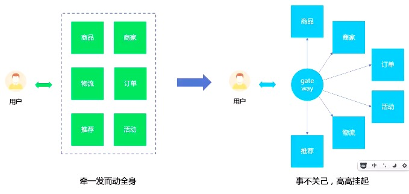

# 微前端

## 即拆功能，拆模块，
- 如果单纯用组件去堆，可能会出现问题。
- 增加一个新功能成本最低，高内聚低耦合，更好地应对变化
- 其他人也想用
- 其他人的部件添加进来
- 项目技术栈迁移

## 借鉴后端微服务的思想，拷贝到前端，先拆后合。后端微服务的思想在前端的映射

- 前端各个模块给出一个个接口，给输入输出即可，不关心内部

- 优点
  - 隔离
  - 弹性/扩展性
  - 增强稳定性
  - 降低成本

- 网盘思路
  - 参照windows系统，需要什么功能就安装什么功能
  

