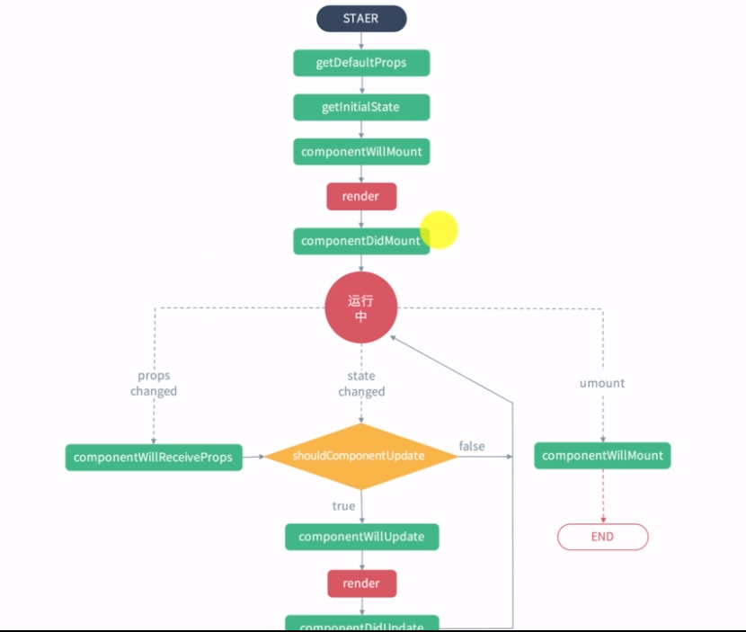

# React
[[toc]]

- react基础+路由（路由源码--公开课）
- redux+中间件
- react源码(单独的一门课)
- react+dva+umi+antd

## react_jsx
```js
npm install create-react-app -g
create-react-app react-lesson
```
- 有jsx语法，Babel 会把 JSX 转译成一个名为 React.createElement() 函数调用,返回虚拟节点，然后放入页面中
- React.createElement()
```js
React.createElement(
  type,
  [props],
  [...children]
)
```
```js
let element=<h1 className="title">hello<span>world</span></h1>;
let element=React.createElement('h1',{
  className:'title'
},'hello',React.createElement('span',null,'world'));
console.log(element)
/**
{
	"type": "h1",
	"props": {
		"className": "title",
		"children": ["hello", {
			"type": "span",
			"props": {
				"children": "world"
			},
		}]
	},
}
 */
```
- jsx和js区别
  1. 根据<来判断是一个html元素 根据{}判断是一个js语法
  2. js中有很多关键字，所以要以小驼峰命名法命名，class用className代替
  3. react相邻的jsx元素 react元素 必须被一个标签所包裹
  4. style标签 必须是一个对象元素
  5. 注释问题 {// /** */}
  6. dangerouslySetInnerHTML 会执行代码，要确保内容是安全的
  7. {}可以使用三元表达式，函数等，只要有返回值即可
  8. onclick=>onClick onchange=>onChange 函数加括号
  10. 可以直接渲染数组，如果想渲染对象 需要转化成字符串格式
```js
import React from 'react';
import {render} from 'react-dom';

let name='zfpx';
let d='<strong>加粗</strong>';
let flag=true;
let ele=(
  // 可以拿<></>空标签包裹作为父元素，其实是<React.Fragment></React.Fragment>，渲染出来是没有标签
  <>
    {/* 多行注释 */} 
    {
      // 单行注释
    }
    <h1>你好{name}</h1>
  <div style={{color:'red'}}>内容
    <label htmlFor="username">用户名</label>
    <input type="text" id='username'/>
    <div dangerouslySetInnerHTML={{__html:d}}></div>
    {flag?<h1>正在加载</h1>:<h1>加载完成</h1>}
    {/* IIFE（自执行函数） */}
    {(function() {
      return 1000;
    })()}

    <button onClick={()=>{

    }}>点击</button>
  </div>
  </>
);

render(ele,window.root);
```
## react_virutaldom
- 自己实现虚拟dom
```js
// index.js
import React from './react';
import ReactDOM from './react-dom';
// let ele = <h1>你好</h1>;
/**
let element=React.createElement("h1",{
  className:"title",
  style:{
    color:'red',
    fontSize:'50px'
  }
},"hello",React.createElement("span",null,"world"));
 */
function Welcome(props){
  return React.createElement('h1',{id:'welcome'},props.name,props.age);
}
class Welcome1 extends React.Component{
  render(){
    return React.createElement('h1',{id:'classwelcome'},this.props.name,this.props.age);
  }
}

let element=React.createElement(Welcome1,{name:'zhufeng',age:10});
ReactDOM.render(element,document.getElementById('root'))
```
```js
// react.js
class Component {
    static isReactComponent = true
    constructor(props) {
        this.props = props;
    }
}

function ReactElement(type, props) {
    const element = { type, props };
    return element;
}

function createElement(type, config = {}, children) {
    let propName;
    const props = {};
    for (propName in config) {
        props[propName] = config[propName];
    }
    const childrenLength = arguments.length - 2;
    if (childrenLength === 1) {
        props.children = children;
    } else if (childrenLength > 1) {
        props.children = Array.from(arguments).slice(2);
    }
    return ReactElement(type, props);
}
export default { Component, createElement };
```
```js
// react-dom.js
function render(element, parentNode) {
    // 判断需要渲染的元素
    // 字符串或数字
    if (typeof element == 'string' || typeof element === 'number') {
        return parentNode.appendChild(document.createTextNode(element));
    }
    let { type, props } = element;
    // 类组件
    if (type.isReactComponent) {
        let returnedElement = new type(props).render();
        type = returnedElement.type; //"h1"
        props = returnedElement.props; //{id:'welcome'}
    // 函数组件
    } else if (typeof type === 'function') {
        let returnedElement = type(props);
        type = returnedElement.type; //"h1"
        props = returnedElement.props; //{id:'welcome'}
    }
    let domElement = document.createElement(type);
    // 构建dom
    for (let propName in props) {
        if (propName === 'className') {
            domElement.className = props[propName];
        } else if (propName === 'style') {
            let styleObj = props[propName];
            // for(let attr in styleObj){
            //   domElement.style[attr]=styleObj[attr];
            // }
            // 驼峰式命名转成'-'命名
            let cssText = Object.keys(styleObj).map(attr => {
                return `${attr.replace(/([A-Z])/g,function(){return "-"+arguments[1].toLowerCase()})}:${styleObj[attr]}`;
            }).join(';')
            domElement.style.cssText = cssText;
        } else if (propName === 'children') {
            let children = Array.isArray(props.children) ? props.children : [props.children];
            children.forEach(child => render(child, domElement));
        } else {
            domElement.setAttribute(propName, props[propName]);
        }
    }
    return parentNode.appendChild(domElement);
}
export default { render }
```

## react_state
- setState
  - 修改状态，修改后会重新render，原来有就覆盖，没有就增加，不会删除
  - 可能是异步的
  :::tip 解决this指针的三种方法
  1. this.add.bind(this) 把add方法里面的this指针绑定为组件实例
  2. 使用箭头函数 `onClick={()=>this.add()}`
  3. es7新特性:实例添加一个属性等于箭头函数
  :::
  ```js
  // 第一种放对象：连续修改会合并修改
  this.setState({num:this.state.num+1});
  this.setState({num:this.state.num+1});// 修改结果为1
  
  // 第二种放函数（依赖前一个状态去修改后面状态）:不合并修改
  this.setState((prev)=>({num:prev.num+1}))
  this.setState((prev)=>({num:prev.num+1}))// 修改结果为2
  
  // 第三种放对象和回调函数（前一个改变之后后一个再改变）:不合并修改
  this.setState({num:this.state.num+1},()=>{
    this.setState({num:this.state.num+1},()=>{// 修改结果为2
    })
  })
  ```
## react_ref
- 在react中拿到真实dom
  - ref=字符串
    - `ref='numA'` `this.refs.numA.value`
  - ref=函数
    - `ref={inst=>this.numA=inst}` `this.numA.value`
  - ref对象(新版)
    - constructor中`this.numA=React.createRef()` dom元素的`ref={this.numA}` 获取：`this.numA.current.value`
  :::tip createRef原理
  ```js
  function createRef(){
    return {current:null}
  }
  ```
  :::
- 组件也可以使用ref获取，但函数组件不可以，需要使用`React.forwardRef(TextInput2)`才能获取
  :::tip 手写React.forwardRef
  ```js 
  function TextInput2(props,ref1){
    return <input ref={ref1}/>
  }
  function forwardRef(funcComponent){
    return function(props){ // ref:{current:null}
      return funcComponent(props,props.ref1);
    }
  }
  ```
  :::
:::tip 受控组件和非受控组件
  - 非受控组件指的是dom元素的值存在dom元素内部，不受react控制 ref defaultValue
  - 受控组件指的是DOM元素的值受react状态控制  onchange  要改值只能通过修改状态来实现
:::
### 数据是单向流动的
- 数据只能父传子，子传孙，不能反过来
  - 子修改父，只能通过把修改父组件数据的函数传属性给子组件，然后调用方法。
  - 子传子，只能把数据放在父组件，通过父组件修改

## react_setstate
```html
<!DOCTYPE html>
<html lang="en">

<head>
    <meta charset="UTF-8">
    <meta name="viewport" content="width=device-width, initial-scale=1.0">
    <meta http-equiv="X-UA-Compatible" content="ie=edge">
    <title>Document</title>
</head>

<body>
    <div id="counter-app"></div>
    <script src="./index.js"></script>
    <script>
        let counterApp = document.getElementById('counter-app');
        new Counter({
            name: '珠峰架构'
        }).mount(counterApp);
    </script>
</body>

</html>
```
```js
// index.js

// 事务(让一段代码在中间执行，前面是initialize，后面是close)
class Transaction {
    constructor(wrappers) {
        this.wrappers = wrappers; //{initialize,close}
    }
    perform(anyMethod) {
        this.wrappers.forEach(wrapper => wrapper.initialize());
        anyMethod.call();
        this.wrappers.forEach(wrapper => wrapper.close());
    }
}
let transaction = new Transaction([{
    initialize() {
        batchingStrategy.isBatchingUpdate = true; // 开启批量更新模式
    },
    close() {
        batchingStrategy.isBatchingUpdate = false; // 结束批量更新
        batchingStrategy.batchedUpdates(); // 进行批量更新
    }
}])

// batchingStrategy.isBatchingUpdates batchedUpdates
let batchingStrategy = {
    isBatchingUpdate: false,
    updaters: [],
    batchedUpdates() {
        this.updaters.forEach(component => component.updateComponent());
    }
}
class Updater {
    constructor(component) {
        this.component = component;
        this.pendingStates = [];
    }
    addState(particialState) {
        this.pendingStates.push(particialState);
        console.log(particialState)
        batchingStrategy.isBatchingUpdate ?
            batchingStrategy.updaters.push(this.component) :
            this.component.updateComponent()
    }
}
class Component {
    constructor(props) {
        this.props = props;
        this.$updater = new Updater(this);
    }
    createDOMFromDOMString(domString) {
        let div = document.createElement('div');
        div.innerHTML = domString;
        return div.children[0];
    }
    setState(particialState) {
        this.$updater.addState(particialState);
    }
    updateComponent() {
        // 真正更新数据 合并所有的状态 
        this.$updater.pendingStates.forEach(particialState => Object.assign(this.state, particialState));
        this.$updater.pendingStates.length = 0;
        let oldElement = this.domElement;
        // 重新渲染
        let newElement = this.renderElement();
        oldElement.parentElement.replaceChild(newElement, oldElement);
    }

    // 把一个DOM模板字符串转成真实的DOM元素
    renderElement() {
        let htmlString = this.render();
        this.domElement = this.createDOMFromDOMString(htmlString);
        // 让这个buttondom节点的component属性等于当前Counter组件的实例
        this.domElement.component = this;
        return this.domElement;
    }
    mount(container) {
        container.appendChild(this.renderElement());
    }
}
window.trigger = function(event, method) {
    let component = event.target.component;
    transaction.perform(component[method].bind(component));
}
class Counter extends Component {
    constructor(props) {
        super(props)
        this.state = { number: 0 }
    }
    add(event) {
        this.setState({ number: this.state.number + 1 });
        console.log(this.state); // 0
        this.setState({ number: this.state.number + 1 })
        console.log(this.state); // 0
        setTimeout(() => {
            this.setState({ number: this.state.number + 1 });
            console.log(this.state); // 2
            this.setState({ number: this.state.number + 1 })
            console.log(this.state); // 3
        })
    }
    render() {
        return `<button onclick="trigger(event,'add')">${this.props.name}:${this.state.number}</button>`;
    }
}
```

### 批量更新

- 即同一个方法中使用多个setState，会先将更新方法存在一个数组里，等方法执行完毕后，再合并全部状态到组件状态中，然后重新渲染组件。使用事务来实现等待方法执行前后的操作。

## react_lifecycle
- 父级更新 子级就会更新

```js
import React from 'react';
import ReactDOM from 'react-dom';

class ChildCounter extends React.Component{
  // 传来的属性更新时触发此方法，能拿到下一次的props
  // 1.发送ajax 2. 可以把属性转化成状态（调用setState，官方不希望大家去调用）
  // 能调用setState的方法 只有constructor componentWillMount componnentDidMount UNSAFE_componentWillReceiveProps
  componentWillReceiveProps(nextProps){
  }
}

class Counter extends React.Component{
  constructor(){
  }
  // 与constructor一样的时机触发
  componentWillMount(){
  }
  render(){
  }
  // 渲染完成，ajax放这，因为这个方法只会调用一次willmount不一定（服务端渲染会执行两次，服务端一次，客户端一次。16后willmount会执行多次）
  componentDidMount(){
  }
  componentWillUpdate(){
  }
  // 第三个参数是snap得返回值
  componentDidUpdate(prevProps,prevState,getSnapReturn){
  }
  componentWillUnmount(){
      // 在其中删除所有的监听以及卸载异步方法
  }
  // 做react优化 immutablejs 重写这方法
  // PureComponent 内部重写了shouldComponent
  shouldComponentUpdate(nextProps,nextState){
    // 控制setState是否更新视图 默认return true
    return true
  }
}

ReactDOM.render(<Counter></Counter>,window.root);
```
- 新版

- 变化
  - 增加了`getDerivedStateFromProps` `getSnapshotBeforeUpdate` 
  - 删除了`componentWillMount` `componentWillUpdate` `componentWillReceiveProps`
- static getDerivedStateFromProps
  ```js
  // 根据新的属性对象派生状态对象 新的属性对象 旧的状态对象 
  static getDerivedStateFromProps(nextProps,prevState){
    // 可以把属性全部映射为状态，这样就不用区分属性和状态了
    return {a:1}
  }
  ```
- getSnapshotBeforeUpdate
  ```js
  // 得到更新之前的快照(代替willmount和willupdate)
  getSnapshotBeforeUpdate(prevProps,prevState){
    return {'info':'呵呵'}
  }
  ```
  :::tip DEMO--滚动列表--给列表前端添加数据，让列表一直保持显示第一条数据
  ```js
  import React from 'react';
  import ReactDOM from 'react-dom';

  class LifeCycle extends React.Component {
      constructor(props) {
          super(props);
          this.wrapper= React.createRef();
          this.state = {
            messages: []
          }
      }
      componentDidMount() {
          setInterval(() => {
              this.setState({ messages: [this.state.messages.length,...this.state.messages]})
          }, 1000)
      }
      getSnapshotBeforeUpdate(){
        // 返回更新前内容的高度
        return this.wrapper.current.scrollHeight;
      }
      componentDidUpdate(prevProps,prevState,prevScrollHeight){
        this.wrapper.current.scrollTop=this.wrapper.current.scrollTop+(this.wrapper.current.scrollHeight-prevScrollHeight);
      }
      render() {
          let style={
            height:'100px',
            width:'200px',
            border:'1px solid red',
            overflow:'auto'
          }
          return (
            <ul style={style} ref={this.wrapper}>
              {
                this.state.messages.map((message,index)=><li key={index}>{message}</li>)
              }
            </ul>
          )
      }
  }

  ReactDOM.render(<LifeCycle></LifeCycle>,document.getElementById('root'))
  ```
  :::


### 总结
- 挂载
  - constructor()
  - static getDerivedStateFromProps()
  - render()
  - componentDidMount()
  - UNSAFE_componentWillMount()
- 更新
  - static getDerivedStateFromProps()
  - shouldComponentUpdate()
  - render()
  - getSnapshotBeforeUpdate()
  - componentDidUpdate()
  - UNSAFE_componentWillUpdate()
  - UNSAFE_componentWillReceiveProps()
- 卸载
  - componentWillUnmount()
- 错误处理
  - static getDerivedStateFromError()
    - 渲染备用 UI 
  - componentDidCatch()
    - 打印错误信息。

## react_context
- 在某些场景下，你想在整个组件树中传递数据，但却不想手动地在每一层传递属性。你可以直接在 React 中使用强大的contextAPI解决上述问题
- 如果父亲和爷爷都有上下文，会合并加过滤得到结果，一样就取父亲的，就近原则

### 旧版
- 提供数据
```js
// 定义子上下文对象的属性和类型
static childContextTypes={
  color:'string',
  setColor:'function'
}
// 返回或者说定义真正的子上下文
getChildContext(){
  return {
    color:this.state.color,
    setColor:this.setColor
  }
}
```
- 拿到数据
```js
// 指定我要获取哪些上下文对象
static contextTypes={
  color:'string',
  setColor:'function'
}
`{this.context.color}`
```
:::tip 属性类型校验
  - 限定属性的类型(如果乱传也没办法)-->prop-types包
  ```js
  import React,{Component} from 'react';
  import ReactDOM from 'react-dom';
  import PropTypes from 'prop-types';

  class Person extends React.Component{
    // 给类赋予默认属性，如果传递了，用传递的
    // 如果没有传，内部会给props赋予这些属性(this.props.age=0)
    static defaultProps={
      age:0
    }
    static propTypes={
      name:PropTypes.string.isRequired,
      hobby:PropTypes.arrayOf(PropTypes.number),
      gender:PropTypes.oneOf(['男','女']),
      pos:PropTypes.shape({
        x:PropTypes.string,
        y:PropTypes.string
      }),
      salary(props,propName,component){
        let salary=props[propName];
        if(salary<20000){
          throw new Error(`${component} ${propName} is too low`)
        }
      }
    }
    render(){
      let {name,age,hobby,pos,salary}=this.props;
      return <div>
        我是人{age}{name}
      </div>
    }
  }

  let data={
    name:'珠峰',
    age:18,
    gender:'男',
    hobby:['游泳'],
    pos:{
      x:12,
      y:12
    },
    salary:10000
  }

  ReactDOM.render(<Person {...data}></Person>,window.root)
  ```
:::
### 新版
- 提供数据
```js
const ThemeContext=React.createContext();// {Provider,Consumer}

render(){
  let ctx={color,setColor};
  return (
    <ThemeContext.Provider value={ctx}>
      <div>Page</div>
    </ThemeContext.Provider>
  )
}
```
- 拿数据
  - 指定 contextType 读取当前的 ThemeContext。
  - React 会往上找到最近的 theme Provider，然后使用它的值。
  - 类组件
  ```js
  // 绑定上下文对象
  static contextType=ThemeContext;
  // this.context=Title.contextType.Provider.value;
  // 使用上下文对象的值（就近原则）
  {this.context.color}
  ```
  - 函数组件
  ```js
  function Title(props){
    return (
      <ThemeContext.Consumer>
        {
          value=>{
            <div style={{color:value.color}}>
              Title
            </div>
          }
        }
      </ThemeContext.Consumer>
    )
  }
  ```
:::tip 函数组件createContext实现
```js
function createContext(){
  class Provider extends Component{
    static value;
    $$typeof=REACT_PROVIDER_TYPE
    constructor(props){
      super(props);
      Provider.value=props.value;
      this.state={value:props.value}
    }
    // 重新刷新页面
    static getDerivedStateFromProps(props,state){
      Provider.value=props.value;
      return {value:props.value}
    }
    render(){
      // ThemeContext.Provider的子组件
      return this.props.children;
    }
  }
  class Consumer extends Component{
    render(){
      return this.props.children(Provider.value);
    }
  }
  return {$$typeof:REACT_CONTEXT_TYPE,Provider,Consumer}
}
```
:::
## PureComponent
- PureComponent只有state或者prop修改了才刷新，Component是只要set就会刷新
- PureComponent一定要用新对象更新数据，不然会直接对象完全相等，返回false
```js
// 不要这么写
this.state.number.count=this.state.number.count+parseInt(this.inputRef.current.value)
this.setState({
  number:this.state.number
})
// 要这么写
this.setState({
  number:{...this.state.number,count:this.state.number.count+1}
})
```

:::tip PureComponent自己实现
```js
import React ,{Component} from  'react';
export default class PureComponent extends Component {
  shouldComponentUpdate(nextProps,nextState){
    return !shallowEqual(this.props,nextProps)||!shallowEqual(this.state,nextState);
  }
}

// 浅比较 只比较第一层
function shallowEqual(obj1,obj2){
  if(obj1===obj2){
    return true;
  }
  if(typeof obj1!='object' || obj1===null||typeof obj2!='object'||obj2===null){
    return false;
  }
  let keys1=Object.keys(obj1);
  let keys2=Object.keys(obj2);
  if(keys1.length!==keys2.length){
    return false;
  }
  for(let key of keys1){
    if(!obj2.hasOwnProperty(key)||obj1[key]!=obj2[key]){
      return false
    }
    /**
    if(!obj2.hasOwnProperty(key)){
      if(obj1[key]!==obj2[key]){
        if(typeof obj1[key]==='object'&&typeof obj2[key]==='object'){
          // 深比较[原版里是浅比较，因为深比较太耗性能]
          return shallowEqual(obj1[key],obj2[key])
        }
      }
    }else{
      return false
    }
     */
  }
  return true;
}
```
:::
- 函数组件使用`React.memo`实现purecomponent效果
```js
Title=React.memo(Title);
```
:::tip 实现memo
```js
function memo1(FuncComponent){
  return class extends PureComponent{
    render(){
      return <FuncComponent {...this.props}>
    }
  }
}
function memo2(FuncComponent){
  return class extends PureComponent{
    render(){
      return FuncComponent(this.props);
    }
  }
}
```
:::

## 高阶组件
- 传入一个组件，返回一个新的组件的函数就叫高阶组件。
- 作用：返回的时候用高阶组件包一下就可以拥有高阶组件带有的功能
:::tip 高阶函数
函数传入一个函数，返回一个新的函数
- js中的函数要比一般语言中高级一些，其他语言是不能把函数作为参数传递以及返回函数的。
- 高阶：函数可以作为方法的参数和返回值
```js
function caculate(fn){
  return function(a,b){
    return fn(a,b)
  }
}
function sum(a,b){
  return a+b;
}
let newFunc=caculate(sum);
let result=newFunc(2,3);
console.log(result);// 5
```
:::
```js
// index.js
import React, { Component } from 'react';
import ReactDOM from 'react-dom';
import Logger from './Logger';

ReactDOM.render(<Logger></Logger>,window.root)
```
```js
// Logger.js
import React, { PureComponent } from 'react'
import withLogger from './withLogger';
class Counter extends PureComponent {
    render() {
        return (
          <div>
            Counter
          </div>
        )
    }
}
export default withLogger(Counter)
```
```js
// withLogger.js
import React, { Component } from 'react'
export default function(Comp) {
    return class extends Component {
      componentWillMount(){
        this.start=Date.now();
      }
      componentDidMount(){
        console.log('componentDidMount')
        console.log((Date.now()-this.start)+'ms')
      }
      render(){
        return <Comp {...this.props}/>
      }
    }
}
```
- 多层高阶函数
```js
let UserNameInputWithAjax=withAjax(UserNameInput);
let UserNameInputWithLocal=withLocal(UserNameInputWithAjax,'uername');
export default UserNameInputWithLocal;
```
## render props
- 和高阶组件一样是解决逻辑复用问题
- 是传了一个函数过来
## Portals 插槽
```html
<!-- index.html -->
<!DOCTYPE html>
<html lang="en">

<head>
    <meta charset="utf-8" />
    <link rel="icon" href="%PUBLIC_URL%/favicon.ico" />
    <meta name="viewport" content="width=device-width, initial-scale=1" />
    <meta name="theme-color" content="#000000" />
    <meta name="description" content="Web site created using create-react-app" />

    <title>React App</title>
</head>

<body>
    <div id="root"></div>
    <div id="modal-root"></div>
</body>

</html>
```
```js
// index.js
import React, { Component } from 'react';
import ReactDOM from 'react-dom';
import Model from './Model';

ReactDOM.render(<Model></Model>,window.root)
```
```js
// Modal.js
import React, { Component } from 'react';
import ReactDOM from 'react-dom';
import './modal.css';
class Modal extends Component {
  constructor(){
    super();
  }
  render() {
    return ReactDOM.createPortal(this.props.children,document.getElementById('modal-root'));
  }
}

export default class Page extends Component{
  constructor(){
    super();
    this.state={showModal:false}
  }
  toggleModal=()=>{
    this.setState({
      showModal:!this.state.showModal
    })
  }
  render(){
    return (
      <div>
        <button onClick={this.toggleModal}>显示/关闭模态窗口</button>
        {
          this.state.showModal&&(
            <Modal>
              <div id="modal" className="modal">
                <div id="content" className="content">
                  主体内容
                  <button onClick={this.toggleModal}>关闭</button>
                </div>
              </div>
            </Modal>
          )
        }
      </div>
    )
  }
}


```

## 错误边界
- 使用static getDerivedStateFromError()渲染备用 UI ，使用 componentDidCatch() 打印错误信息。
- 组件出错只会组件失效，不会影响整个页面
```js
import React from 'react';

class ErrorBoundary extends Component{
  constructor(){
    super();
    this.state={hasErrors:false}；
  }
  // 此生命周期函数可以用来捕获错误和信息
  componentDidCatch(err,info){
    if(err){
      this.setState({
        hasErrors:true
      });
    }
  }
  render(){
    if(this.state.hasErrors){
      return <div>子组件发送未知错误，无法正常显示</div>
    }
    return this.props.children;
  }
}
class Page extends Component{
  render(){
    return (
      <div>
        page
        <ErrorBoundary>
          <Clock/>>
        </ErrorBoundary>
      </div>
    )
  }
}
```
## 组件
- 需要返回一个并且仅能返回一个React元素
- 必须大写字母开头
### 函数组件
```js
// 函数组件
function School(props) {
  return <h1>学校{props.color}{props.size}</h1>
}
let data={color:'red',size:100};
render(<div>
  <div><School color="red" size="100"></School></div>
  <div><School color="green"></School></div>
  <div><School {...data}></School></div>
</div>,window.root)
```

### 类组件
- 继承自React.Component：提供生命周期和更改状态的方法
```js
import React from 'react';
import ReactDOM from 'react-dom';

class Clock extends React.Component{
  constructor(props){
  }
  state={
    time:new Date().toLocaleString()
  }
  render(){
    return <div>
      <h1>当前时间是：{this.state.time}{this.props.a}</h1>
    </div>
  }
}
ReactDOM.render(<Clock a="1"></Clock>,window.root)
```

### Props的只读性
- 所有 React 组件都必须像纯函数一样保护它们的 props 不被更改。
:::tip 纯函数
- 不会尝试更改入参，且多次调用下相同的入参始终返回相同的结果。
- 不能影响作用域之外的变量
:::
### setState
- 批量处理状态：多次setState会把所有的状态合并到一起，只渲染一次。如果希望渲染多次，使用定时器包裹
```js
import React,{Component} from 'react';
import ReactDOM from 'react-dom';
class Counter extends Component{
  constructor(props){
    super();
    this.state={
      num:props.n
    }
  }
  handleClick=()=>{
    this.setState({num:this.state.num+1});
    this.setState({num:this.state.num+1});
  }
  render(){
    return <div>
      {this.state.num}
      <button onClick={this.handleClick}>添加</button>
    </div>
  }
}
ReactDOM.render(<Counter n={100}></Counter>,window.root)
```
:::tip 批量更新原理，为什么加了settimeout就不会批量更新了
- 因为setState是利用事务来进行批量更新的，把中间所有的setState都执行完再去更新。但setTimeout是异步，所以会先执行事务的close，再执行setTimeout中的更新方法。导致批量更新的flag为false。
:::

### 受控和非受控
- 受控和非受控 表单元素（双向绑定）
- 输入内容，可以把数据更新到原有数据中
- 数据变化了 视图跟着更新
- 状态绑定给输入框
- 受控组件
  - 受控组件 需要添加 onChange属性
  - 好处：可以给输入框赋予默认值 可以做实时校验
  - 缺点：每次输入都会调用setState，有一些功能 只有点击按钮需要校验，希望拿到最终输入结果 react+jquery 表单校验
```js
import React from 'react';
import ReactDOM from 'react-dom';

class Control extends React.Component{
  state={
    username:'珠峰',
    password:'123456'
  }
  handleChange=(e)=>{
    // e不是原生的事件，但是可以通过target来取
    // es6[]可以用来取对应的值
    this.setState({[e.target.name]:e.target.value})
  }

  render(){
    return <div>
      <input type="text" name="username" value={this.state.username} onChange={this.handleChange}/>
      <input type="text" name="password" value={this.state.password} onChange={this.handleChange}/>
      
      {this.state.username}
      {this.state.password}
    </div>
  }
}
ReactDOM.render(<Control></Control>,window.root)
```

- 非受控组件
  - 不能绑change事件
  - 操作原生dom元素的方法
  ```js
  import React from 'react';
  import ReactDOM from 'react-dom';

  class UnControl extends React.Component{
    password=React.createRef();
    handleClick=()=>{
      // 1. 
      console.log(this.username.value)
      // 2. 
      console.log(this.password.current.value);
    }
    render(){
      return <div>
        {/* ref起别名 */}
        <input type="text" name="username" ref={(dom)=>{this.username=dom}}/>
        <input type="text" name="password" ref={this.password}/>
        <button onClick={this.handleClick}>添加</button>
      </div>
    }
  }
  ReactDOM.render(<UnControl></UnControl>,window.root)
  ```
### 总结
- APIs
  - setState()
  - forceUpdate()
- class 属性
  - defaultProps
  - displayName
- 实例属性
  - props
  - state
### 组件间通信
- 父亲->儿子—>孙子 单向数据流，一层一层，不能跳过
- 要修改传的值
  - 传递一个函数 回调里放的是修改的功能 子组件调用函数即可改变父组件数据
- 兄弟之间通过父级来通信
- 绑定事件和触发事件来修改
- context api 定义一些数据 直接消费父级数据

## react-router
### 分类
- HashRouter
  - hashchange事件
  - window.location.hash.slice(1)
  ```js
  <a href="#/a">去a</a>
  <a href="#/b">去b</a>
  <script>
    window.addEventListener('hashchange',(event)=>{
        console.log(window.location.hash);// #/a
    });
  </script>
  ```
- BrowserRouter:实现h5 Api实现路由的切换
  - history.pushState(状态,标题,url)
  - history.onpopstate事件
    - 点击后退、前进按钮(或者在JavaScript中调用history.back()、history.forward()、history.go()方法).
  - history不存在onpushState，需要自己写。
  ```html
    <a href="#/a">去a</a>
    <a href="#/b">去b</a>
    <button onclick="push('/a')">/a</button>
    <button onclick="push('/b')">/b</button>
    <button onclick="push('/c')">/c</button>
    <script>
        window.addEventListener('hashchange', (event) => {
            console.log(window.location.hash)
        })

        // 监听弹出状态事件
        window.onpopstate = function(event) {
            console.log(event)
        }

        // 自己实现onpushstate监听添加状态事件
        window.onpushstate = function(event) {
            console.log(event);
        }
        let old = window.history.pushState;
        (function(history) {
            var pushState = history.pushState;
            history.pushState = function(state, title, pathname) {
                if (typeof window.onpushstate === 'function') {
                    window.onpushstate({
                        state,
                        title,
                        pathname
                    })
                }
                return pushState.apply(history, arguments);
            }
        })(window.history);

        function push(to) {
            window.history.pushState({
                to
            }, null, to);
        }
    </script>
  ```
### 使用
```js
npm i react-router-dom -S
```
- `Router`是路由的容器，分为`HashRouter`和`BrowserRouter`，里面有且只有一个子节点，`Route`是路由
- 默认只匹配前缀(路由加/xxx都会匹配)，加`exact`精确匹配
- this.props包含：history,location,match
```js
import { HashRouter as Router, Route } from 'react-router-dom';
import Home from './components/Home';
import User from './components/User';
import Profile from './components/Profile';
ReactDOM.render(
  <Router>
    <>
      <Route path="/" component={Home} exact/>
      <Route path="/user" component={User}  />
      <Route path="/profile" component={Profile} />
    </>
  </Router>,
document.getElementById('root'));
```

### 实现
- 用context的方式把Router中的路由数据传递给各个路由组件，一旦hash更新，就会更新Router中的state，触发子组件的重新渲染。子组件会安装最新的路由数据来渲染。
```js
// \react-router-dom\index.js
import HashRouter from './HashRouter';
import Route from './Route';
export {
    HashRouter,
    Route
}
```
```js
// \react-router-dom\HashRouter.js
import React, { Component } from 'react'
import Context from './context';
export default class HashRouter extends Component {
  state = {
      location:{pathname:window.location.hash.slice(1)}
  }  
  componentWillMount(){
      window.addEventListener('hashchange',()=>{
          this.setState({
              location:{
                  ...this.state.location,
                  pathname:window.location.hash.slice(1) || '/'
              }
          });
      });
      window.location.hash = window.location.hash || '/';
  }
  render() {
    let value = {
        location:this.state.location
    }
    return (
      <Context.Provider value={value}>
        {this.props.children}
      </Context.Provider>
    )
  }
}
```
```js
// \react-router-dom\Route.js
import React,{Component} from 'react';
import Context from './context';
export default class Route extends Component{
    static contextType =  Context;  
    render() {
        let {path='/',component: Component,exact=false}=this.props;
        let pathname = this.context.location.pathname;
        if (path == pathname) {
            return <Component  {...this.context} />
        } else {
            return null;
        }
    }
}
```
```js
// \react-router-dom\context.js
import {createContext} from 'react';
export default  createContext();
```
### path-to-regexp
- 将路径按照规则转为匹配路径的正则
```js
npm i path-to-regexp -S
let {pathToRegExp} = require('path-to-regexp');
```
- 三个参数：路径、捕获组名称、是否以path结尾
#### 精确匹配
```js
let regx = pathToRegExp('/home', [], { end: true });
console.log(regx); //   /^\/home\/?$/i
console.log(regx.test('/home'));// true
console.log(regx.test('/home/2'));// false
```
#### 一般匹配
```js
let regx2 = pathToRegExp('/home', [], { end: false });
console.log(regx2); //   /^\/home\/?(?=\/|$)/i
console.log(regx2.test('/home'));// true
console.log(regx2.test('/home/'));// true
console.log(regx2.test('/home//'));// true
console.log(regx2.test('/home/2'));// true
```

#### pathToRegExp获取路径参数
- params 
  - 赋值为参数名称的对象数组
- match
  - 匹配转后的正则表达式，得到的捕获组即为参数的值
```js
let { pathToRegexp } = require('path-to-regexp');
let params = [];
let regx3 = pathToRegexp('/user/:id/:name', params, { end: false });
let str = '/user/1/zhufeng';
let [url, ...values] = str.match(regx3);
params = params.reduce((acc, current, index) => {
    acc[current.name] = values[index];
    return acc;
}, {})
console.log(params) // { id: '1', name: 'zhufeng' }

// /^\/user(?:\/([^\/#\?]+?))(?:\/([^\/#\?]+?))(?:[\/#\?](?=[]|$))?(?=[\/#\?]|[]|$)/i
/**
/^\/user\/(?:([^\/]+?))\/?$/i
[ { name: 'id', optional: false, offset: 7 } ]
**/

```


### 其他

```js
// index.js
import React from 'react';
import ReactDOM from 'react-dom';
import Protected from './Protected'
// 路由模块 需要一个路由容器（HashRouter BrowserRouter）容器里放的就是路由
import {BrowserRouter as Router,Route,Redirect,Switch,Link,NavLink} from 'react-router-dom'
import Home from './pages/Home';
import Profile from './pages/Profile';
import User from './pages/User';
import Login from './pages/Login';
import App from './App';
import 'bootstrap/dist/css/bootstrap.css'
// 路由盒子只能有一个子节点
// 默认 路由从上到下匹配 如果匹配到就会渲染对应的组件 
// 默认只匹配开头（中间件）多个都匹配就都显示出来 exact={true}配置改完精确的路由
// 404 找不到后端就返回首页，前端会重新渲染，找不到重定向：Redirect
// 路由匹配后 就不要继续向下匹配了：Switch
ReactDOM.render(<Router>
  <App>
    <Switch>
      <Route path="/" exact={true} component={Home}></Route>
      <Route path="/user" component={User}></Route>
      {/* 高阶组件中判断用户是否登陆过 如果没登录跳转 Protected */}
      <Protected path="/profile" component={Profile}></Protected>
      <Route path="/login" component={Login}></Route>
      <Redirect to="/"></Redirect>
    </Switch>
  </App>
</Router>,window.root)
```
```js
// App.js
import React,{Component} from 'react';
import ReactDOM from 'react-dom';
import Nav from './components/Nav';
export default class App extends Component{
  constructor(){
    super();
  }
  render(){
    return (<div>
      <Nav></Nav>
      {this.props.children}
    </div>)
  }
}
```
```js
// Nav.js
import React, { Component } from 'react';
import {NavLink,Route,withRouter} from 'react-router-dom';
import MenuLink from './MenuLink';

// 可以选择用装饰器来使用withRouter包裹组件
// @withRouter
class Nav extends Component {
    constructor() {
      super();
    }
    handleClick=()=>{
      // 编成式路由跳转
      console.log(this.props.history)
      this.props.history.push('/')
    }
    render() {
      return ( 
        <nav className="navbar navbar-inverse">
          <div className="container-fluid">
            <div className="navbar-header">
              <a className="navbar-brand" onClick={this.handleClick}>路由系统</a>
            </div>
            <div className="navbar-nav nav">
              <MenuLink exact={true} to="/">首页</MenuLink>
              <MenuLink to="/user">用户</MenuLink>
              <MenuLink to="/profile">个人中心</MenuLink>
              <MenuLink to="/login">登录</MenuLink>
            </div>
          </div>
        </nav>
      )
    }
}
// 如果某个组件 不是通过route来渲染的还想用里面的props 可以使用withRouter
// 可以改写成@withRouter的形式
export default withRouter(Nav);
```
```js
// Login.js
import React,{Component} from 'react'
export default class Login extends Component{
  constructor(){
    super();
  }
  render(){
    return (<div>
      <button onClick={()=>{
        localStorage.setItem('login',true);
      }}>登录</button>
      <button onClick={()=>{
        localStorage.clear();
      }}>取消登录</button>
    </div>)
  }
}
```
```js
// User.js
import React,{Component} from 'react'
import SliderBar from '../components/SliderBar'
import {Route,Switch} from 'react-router-dom';
import Add from './Add';
import UserDetail from './UserDetail';
import List from './List';
export default class User extends Component{
  state={
    sliderBarData:[
      {path:'/user/add',content:'用户添加'},
      {path:'/user/list',content:'用户列表'}
    ]
  }
  constructor(){
    super();
  }
  render(){
    return (<div>
      <div className="col-md-3">
        <SliderBar sliderBarData={this.state.sliderBarData}></SliderBar>
      </div>
      <div className="col-md-9">
        <Switch>
          {/* 设置默认页面 */}
          <Route path='/user' exact={true} component={Add}></Route>
          <Route path='/user/add' component={Add}></Route>
          <Route path='/user/detail/:uid' component={UserDetail}></Route>
          <Route path='/user/list' component={List}></Route>
        </Switch>
      </div>
    </div>)
  }
}
```
```js
// UserDetail.js
import React, { Component } from 'react';
import { Link } from 'react-router-dom';
export default class UserDetail extends Component {
    constructor() {
        super();
    }
    render() {
        return ( <div>
          UserDetail
          {/* url传参 */}
          {this.props.match.params.uid}
          {/* 状态传参(如果没拿到状态 就通过id再获取一遍) */}
          {this.props.location.state}
        </div>)
        }
    }
```
```js
// SliderBar.js
import React,{Component} from 'react';
import {Link} from 'react-router-dom';
export default class SliderBar extends Component{
  constructor(){
    super();
  }
  render(){
    return (<nav className="nav nav-stacked">
      {this.props.sliderBarData.map((slide,key)=>(
        <li key={key}><Link to={slide.path}>{slide.content}</Link></li>
      ))}
    </nav>)
  }
}
```
```js
// List.js
import React,{Component} from 'react';
import {Link} from 'react-router-dom';
export default class List extends Component{
  state={
    users:JSON.parse(localStorage.getItem('lists')||[])
  }
  constructor(){
    super();
  }
  render(){
    return (<table className="table">
      <thead>
        <tr>
          <th>id</th>
          <th>name</th>
        </tr>
      </thead>
      <tbody>
          {this.state.users.map((user,index)=>{
            return <tr>
              {/* url传参 */}
              <td><Link to={`/user/detail/${user.id}`}>{user.id}</Link></td>
              {/* 状态传参：状态只有点击的时候才有，刷新就没了 */}
              <td><Link to={{pathname:`/user/detail/${user.id}`,state:user.username}}>{user.id}</Link></td>
              <td>{user.username}</td>
            </tr>
          })}
      </tbody>
    </table>)
  }
}
```
```js
// Add.js
import React,{Component} from 'react';
export default class Add extends Component{
  input=React.createRef();
  constructor(){
    super();
  }
  handleSubmit=(e)=>{
    e.preventDefault();
    let username=this.input.current.value;
    let lists=JSON.parse(localStorage.getItem('lists'))||[];
    lists.push({username,id:Math.random()})
    localStorage.setItem('lists',JSON.stringify(lists));
    // 使用路由容器后 路由容器上挂载着一些属性 Provider history
    // Route组件中可以获取到 父级提供的属性
    this.props.history.push('/user/list');
  }
  render(){
    return (<div>
      <form onSubmit={this.handleSubmit}>
        <input className="form-control" type="text" required ref={this.input}/>
        <button className="btn btn-primary">添加</button>
      </form>
      </div>)
  }
}

// history go / goBack / push
// location pathname state 跳转所带的数据
// match params isExact 是否严格匹配
```
```js
// Protected.js
import React, { Component } from 'react';
import { Route,Redirect } from 'react-router-dom';
// 函数组件 参数是属性
// 把component拿出来 重新命名Component 组件名必须大写
// route中可以放置 component
// render可以放一个函数 会渲染这个函数的返回值
let Protected = ({ component: Component, ...props }) => {
    return <Route {...props} render={
      (props)=>{
        // 属性会自动传给p，然后手动把p传给组件即可
        // p:history,match,location
        
        return localStorage.getItem('login')?<Component {...props}/>:<Redirect to="/login" />
      }
    }/>
}

export default Protected
```
```js
// MenuLink.js
// 自己实现一个navLink
// <MenuLink exact={true} to="/">首页</MenuLink>

import React from 'react';
import {Route} from 'react-router-dom';

// props history location match
let MenuLink=({to,...p})=>{
  // 不管路径是什么都需要渲染
  // match属性 是拿当前的path,和to相等才算匹配上
  return <Route path={to} {...p} children={(props)=>{
    return <div 
      style={{color:'white'}} 
      className={props.match?'active':''}
      onClick={()=>{
        props.history.push(to);
      }}>
        {p.children}
      </div>
  }} />
}

export default MenuLink;
// 路由渲染的方式
// component 路径匹配到渲染组件
// render 渲染对应的方法的返回值 路径匹配到
// children 不管路径是什么都会渲染
```


### 正则匹配
```js
// \react-router-dom\Route.js
import React, { Component } from 'react'
import Context from './context';
import { pathToRegexp } from 'path-to-regexp';
export default class Route extends Component {
  static contextType =  Context;  
  render() {
    let {path,component:Component,exact=false} = this.props;
    let pathname = this.context.location.pathname;
    let regxp = pathToRegexp(path,[],{end:exact});
    let result = pathname.match(regxp);
    
    if(result){
      // 此处传递路由信息location
      let props = {
        location: this.context.location,
      }
        return <Component {...props}/>;
    }
    return null;
  }
}
```
### Link
#### 使用
```JS
// src/index.js
import React from 'react';
import ReactDOM from 'react-dom';
import {HashRouter as Router,Route,Link} from './react-router-dom';
import Home from './components/Home';
import User from './components/User';
import Profile from './components/Profile';
ReactDOM.render(
    <Router>
        <>
          <Link to="/">Home</Link>
          <Link to="/user">User</Link>
          <Link to="/profile">Profile</Link>
          <Route path="/" exact component={Home} />
          <Route path="/user" component={User} />
          <Route path="/profile" component={Profile}/>
        </>
    </Router>
,document.getElementById('root'));
```
#### 实现
```js
// src/react-router-dom/Link.js
import React, { Component } from 'react'
import Context from './context';
export default class Link extends Component {
  static contextType =  Context;  
  render() {
    return (
        <a onClick={()=>this.context.history.push(this.props.to)}>{this.props.children}</a>
        // 哈希路由可以这样，但history不可以
        // <a href={`#${this.props.to}`}>{this.props.children}</a>
    )
  }
}
```
```js
// src/react-router-dom/index.js
import HashRouter from './HashRouter';
import Route from './Route';
import Link from './Link';
export {
    HashRouter,
    Route,
    Link
}
```
```js
// src/react-router-dom/HashRouter.js
import React, { Component } from 'react'
import Context from './context';
export default class HashRouter extends Component {
  state = {
      location:{pathname:window.location.hash.slice(1) || '/'},
  }  
  componentDidMount(){
      window.location.hash = window.location.hash || '/';
      window.addEventListener('hashchange',()=>{
          this.setState({
              location:{
                  ...this.state.location,
                  pathname:window.location.hash.slice(1) || '/'
              }
          });
      });
  }
  render() {
     let value={
            location: this.state.location,
            history: {
                push(path,state) {
                    window.location.hash=path;
                }
            }
    }
    return (
      <Context.Provider value={value}>
        {this.props.children}
      </Context.Provider>
    )
  }
}
```
### Redirect和Switch
- Redirect 
  - 重定向
- Switch 
  - 匹配到一个路由后就不继续匹配了
#### 使用
```js
// src\index.js
import React from 'react';
import ReactDOM from 'react-dom';
import {HashRouter as Router,Route,Link,Redirect,Switch} from './react-router-dom';
import Home from './components/Home';
import User from './components/User';
import Profile from './components/Profile';
import 'bootstrap/dist/css/bootstrap.css';
ReactDOM.render(
    <Router>
        <>
          <div className="navbar navbar-inverse">
            <div className="container-fluid">
              <div className="navbar-heading">
                  <div className="navbar-brand">珠峰架构</div>
              </div>
              <ul className="nav navbar-nav">
                <li><Link to="/">Home</Link></li>
                <li><Link to="/user">User</Link></li>
                <li><Link to="/profile">Profile</Link></li>
              </ul>
            </div>
          </div>
          <div className="container">
            <div className="row">
              <div className="col-md-12">
                <Switch>
                  <Route path="/" exact component={Home} />
                  <Route path="/user" component={User} />
                  <Route path="/profile" component={Profile}/>
                  <Redirect to="/" />
                </Switch>
              </div>
            </div>
          </div>
        </>
    </Router>
,document.getElementById('root'));
```
#### 源码
```js
// src/react-router-dom/index.js
import HashRouter from './HashRouter';
import Route from './Route';
import Link from './Link';
import Redirect from './Redirect';
import Switch from './Switch';
export {
    HashRouter,
    Route,
    Link,
    Redirect,
    Switch
}
```
```js
// src/react-router-dom/Redirect.js
import React, { Component } from 'react'
import Context from './context';
export default class Link extends Component {
  static contextType = Context;  
  render() {
    this.context.history.push(this.props.to);  
    return null;
  }
}
```
```js
// src/react-router-dom/Switch.js
import React, { Component } from 'react'
import Context from './context';
import pathToRegexp from 'path-to-regexp';
export default class Switch extends Component {
  static contextType =  Context;  
  render() {
    let pathname = this.context.location.pathname;
    for(let i=0;i<this.props.children.length;i++){
        let child = this.props.children[i];
        let {path='/',component:Component,exact=false} = child.props;
        let regxp = pathToRegexp(path,[],{end:exact});
        let result = pathname.match(regxp);
        if(result){
            return child;
        }
    }
    return null;
  }
}
```


### 路径参数
- props提供了：
  - location: this.context.location,
  - history: this.context.history,
  - match
    - url
    - isExact
    - path
    - params
#### 使用
```js
// src/components/User.js
import React,{Component} from 'react';
import {Link,Route} from '../react-router-dom';
import UserAdd from './UserAdd';
import UserDetail from './UserDetail';
import UserList from './UserList';
export default class User extends Component{
    render() {
        return (
            <div className="row">
               <div className="col-md-2">
                    <ul className="nav nav-stack">
                        <li><Link to="/user/list">用户列表</Link></li>    
                        <li><Link to="/user/add">添加用户</Link></li>    
                    </ul>
               </div>
               <div className="col-md-10">
                    <Route path="/user/add" component={UserAdd}/>
                    <Route path="/user/list" component={UserList}/>
                    <Route path="/user/detail/:id" component={UserDetail}/>
               </div>
            </div>
        )
    }
}
```
```js
// src/components/UserAdd.js
import React, { Component } from 'react'

export default class UserAdd extends Component {
  constructor(){
    super();
    this.usernameRef = React.createRef();
  }
  handleSubmit = (event)=>{
    event.preventDefault();
    let username = this.usernameRef.current.value;
    let usersStr = localStorage.getItem('users');
    let users = usersStr?JSON.parse(usersStr):[];
    users.push({id:Date.now()+'',username});
    localStorage.setItem('users',JSON.stringify(users));
    this.props.history.push('/user/list');
  }
  render() {
    return (
      <form onSubmit={this.handleSubmit}>
        <input className="form-control" type="text" ref={this.usernameRef}/>
        <button type="submit" className="btn btn-primary">提交</button>
      </form>
    )
  }
}
```
```js
// src/components/UserList.js
import React, { Component } from 'react'
import {Link} from '../react-router-dom';
export default class UserList extends Component {
  state = {
      users:[]
  }  
  componentDidMount(){
    let usersStr = localStorage.getItem('users');
    let users = usersStr?JSON.parse(usersStr):[];
    this.setState({users});
  }
  render() {
    return (
      <div>
        UserList
        <ul className="list-group">
        {
            this.state.users.map((user,index)=>(
                <li className="list-group-item" key={index}>
                 <Link to={{pathname:`/user/detail/${user.id}`,state :user}}>{user.username}</Link>
                </li>    
            ))
        }    
        </ul>
      </div>
    )
  }
}
```
```js
// src/components/UserDetail.js
import React, { Component } from 'react'

export default class UserDetail extends Component {
  state = {
    user:{}
  }  
  componentDidMount(){
    let user = this.props.location.state;
    if(!user){
      let usersStr = localStorage.getItem('users');
      let users = usersStr?JSON.parse(usersStr):[];
      let id = this.props.match.params.id;
      user = users.find(user=>user.id === id);
    }
    if(user) this.setState({user});
  }
  render() {
    let user = this.state.user;
    return (
      <div>
        {user.id}:{user.username}
      </div>
    )
  }
}
```
#### 实现
```js
// src/react-router-dom/HashRouter.js
import React, { Component } from 'react'
import Context from './context';
export default class HashRouter extends Component {
  state = {
      location:{pathname:window.location.hash.slice(1) || '/'}
  }  
  locationState=undefined
  componentDidMount(){
      window.location.hash = window.location.hash || '/';
      window.addEventListener('hashchange',()=>{
          this.setState({
              location:{
                  ...this.state.location,
                  pathname:window.location.hash.slice(1) || '/',
                  state:this.locationState
              }
          });
      });
  }
  render() {
    let that = this;
    let value = {
      location:that.state.location,
      history:{
        push(to){
          if(typeof to === 'object'){
            let {pathname,state}= to;
            that.locationState = state;
            window.location.hash = pathname; 
          }else{
            window.location.hash = to;
          }  
        }
      }
    }
    return (
      <Context.Provider value={value}>
        {this.props.children}
      </Context.Provider>
    )
  }
}
```
```js
// src/react-router-dom/Route.js
import React, { Component } from 'react'
import Context from './context';
import {pathToRegexp} from 'path-to-regexp';
export default class Route extends Component {
  static contextType = Context;
  render() {
    let { path, component: Component, exact = false } = this.props;
    let pathname = this.context.location.pathname;
    let keys = [];
    let regxp = pathToRegexp(path, keys, { end: exact });
    let result = pathname.match(regxp);
    if (result) {
      let [url, ...values] = result;
      keys = keys.map(item=>item.name);
      let params = values.reduce((memo, val, index) => {
        memo[keys[index]] = val;
        return memo;
      }, {});
      let match = {
        url:pathname,
        isExact:pathname===url,
        path,
        params
      }
      let props = {
        location: this.context.location,
        history: this.context.history,
        match
      }
      return <Component {...props} />;
    }
    return null;
  }
}
```
```js
// src/react-router-dom/Switch.js
import React, { Component } from 'react'
import Context from './context';
import pathToRegexp from 'path-to-regexp';
export default class Switch extends Component {
  static contextType =  Context;  
  render() {
    let pathname = this.context.location.pathname;
    let children = Array.isArray(this.props.children)?this.props.children:[this.props.children]
    for(let i=0;i<children.length;i++){
        let child = children[i];
        let {path='/',exact=false} = child.props;
        let regxp = pathToRegexp(path,[],{end:exact});
        let result = pathname.match(regxp);
        if(result){
            return child;
        }
    }
    return null;
  }
}
```

### 权限校验
- 高阶组件中判断用户是否登陆过 如果没登录跳转 Protected
#### 使用
```js
// src/index.js
import React from 'react';
import ReactDOM from 'react-dom';
import {HashRouter as Router,Route,Link,Redirect,Switch} from './react-router-dom';
import Home from './components/Home';
import User from './components/User';
import Profile from './components/Profile';
import Protected from './components/Protected';
import Login from './components/Login';
import 'bootstrap/dist/css/bootstrap.css';
ReactDOM.render(
    <Router>
        <>
          <div className="navbar navbar-inverse">
            <div className="container-fluid">
              <div className="navbar-heading">
                  <div className="navbar-brand">珠峰架构</div>
              </div>
              <ul className="nav navbar-nav">
                <li><Link to="/">Home</Link></li>
                <li><Link to="/user">User</Link></li>
                <li><Link to="/profile">Profile</Link></li>
              </ul>
            </div>
          </div>
          <div className="container">
            <div className="row">
              <div className="col-md-12">
                <Switch>
                  <Route path="/" exact component={Home} />
                  <Route path="/user" component={User} />
                  <Route path="/login" component={Login} />
                  <Protected path="/profile" component={Profile}/>
                  <Redirect to="/" />
                </Switch>
              </div>
            </div>
          </div>
        </>
    </Router>
,document.getElementById('root'));
```
#### 源码
```js
// src/react-router-dom/Route.js
let props = {
  location: this.context.location,
  history: this.context.history,
  match
}
if(Component){
  return <Component {...props} />;
}else if(render){
  return render(props);
}else{
  return null;
}
```
```js
// src/components/Protected.js
import React, { Component } from 'react'
import {Route,Redirect} from '../react-router-dom';
export default ({component:Component,...rest})=>(
    <Route {...rest} render={
        props => (
            localStorage.getItem('logined')?<Component {...props}/>:<Redirect to={{pathname:'/login',state:{from:props.location.pathname}}}/>
        )
    }/>
)
```
```js
// src/components/Login.js
import React, { Component } from 'react'

export default class Login extends Component {
  handleClick = ()=>{
    localStorage.setItem('logined','true');
    if(this.props.location.state)
      this.props.history.push(this.props.location.state.from);
  }  
  render() {
    return (
      <button className="btn btn-primary" onClick={this.handleClick}>登录</button>
    )
  }
}
```


### browserRouter
```js
// BrowserRouter.js
import React, { Component } from 'react'
import Context from './context';
(function (history) {
    var pushState = history.pushState;
    history.pushState = function (state,title,pathname) {
        if (typeof window.onpushstate == "function") {
            window.onpushstate(state,pathname);
        }
        return pushState.apply(history, arguments);
    };
})(window.history);
export default class BrowserRouter extends Component {
    state = {
        location: { pathname: '/' }
    }
    getMessage = null
    componentDidMount() {
        window.onpopstate = (event) => {
            this.setState({
                location: {
                    ...this.state.location,
                    pathname:document.location.pathname,
                    state:event.state
                }
            });
        };
        window.onpushstate = (state,pathname) => {
            this.setState({
                location: {
                    ...this.state.location,
                    pathname,
                    state
                }
            });
        };
    }
    render() {
        let that = this;
        let value = {
            location: that.state.location,
            history: {
                push(to) {
                    if (that.block) {
                        let allow = window.confirm(that.getMessage(that.state.location));
                        if (!allow) return;
                    }
                    if (typeof to === 'object') {
                        let { pathname, state } = to;
                        window.history.pushState(state, '', pathname);
                    } else {
                        window.history.pushState('', '', to);
                    }
                },
                block(getMessage) {
                    that.block = getMessage;
                },
                unblock() {
                    that.block = null;
                }
            }
        }
        return (
            <Context.Provider value={value}>
                {this.props.children}
            </Context.Provider>
        )
    }
}
```
```js
// index.js
import HashRouter from './HashRouter';
import Route from './Route';
import Link from './Link';
import Redirect from './Redirect';
import Switch from './Switch';
import BrowserRouter from './BrowserRouter';
export {
    HashRouter,
    Route,
    Link,
    Redirect,
    Switch,
    BrowserRouter
}
```


### 传参
三种方法
- url传参
- state传参
- 编程式路由：withRouter

:::tip 自己实现withRouter
```js
// 自己实现withRouter
自己写个组件 在里面调route，把route的参数放进去
let withRouter=(Component)=>{
  return ()=>{
    return <Route component={Component}></Route>
  }
}
// 高阶组件 就是组件返回组件 可以把公共的功能放到父级来做
// 功能：封装公共方法的组件
```
:::


## redux
- 解决组件间通信问题
### 原生计数器
#### 使用
```html
<div id="counter">
  <div id="counter-value"></div>
  <button id="increment-btn">+</button>
  <button id="decrement-btn">-</button>
</div>
```
```js
// index.js
import {createStore} from 'redux';
let initState=0;
const INCREMENT=Symbol.for('INCREMENT');
const DECREMENT=Symbol.for('DECREMENT');
/**
 * action必须有个不为undefined type属性，表示动作类型
 * @param {*} state 
 * @param {*} action 
 */
function reducer(state=initState,action){
  switch(action.type){
    case INCREMENT:
      return state+1;
    case DECREMENT:
      return state-1;
    default:
      return state;
  }
}
let store=createStore(reducer);
let state=store.getState();
let counterValue=document.getElementById('counter-value');
let incrementBtn=document.getElementById('increment-btn');
let decrementBtn=document.getElementById('decrement-btn');

function render(){
  counterValue.innerHTML=store.getState();
}
render();
let unsubscribe=store.subscribe(render);
setTimeout(()=>{
  unsubscribe();
},3000)
incrementBtn.addEventListener('click',function(){
  store.dispatch({type:INCREMENT});
})
decrementBtn.addEventListener('click',function(){
  store.dispatch({type:DECREMENT});
})
import {createStore} from 'redux';
let counterValue = document.getElementById('counter-value');
let incrementBtn = document.getElementById('increment-btn');
let decrementBtn = document.getElementById('decrement-btn');

const INCREMENT='INCREMENT';
const DECREMENT = 'DECREMENT';
let initState = 0;
function reducer(state=initState,action){
    switch(action.type){
        case INCREMENT:
            return state + 1;
        case DECREMENT:
            return state - 1;
        default:
            return state;
    }
}
let store=createStore(reducer);
function render() {
    counterValue.innerHTML=store.getState();
}
store.subscribe(render);
render();
incrementBtn.addEventListener('click',function () {
    store.dispatch({type:INCREMENT});
});
decrementBtn.addEventListener('click',function () {
    store.dispatch({type:DECREMENT});
});
```
#### 源码
```JS
// index.js
import createStore from './createStore';
import combineReducers from './combineReducers';
import bindActionCreators from './bindActionCreators';
export {
  createStore,// 创建仓库
  combineReducers,// 合并reducers
  bindActionCreators// 把actionCreator和dispatch方法绑定在一起
}
```
```js
// createStore.js
export default function createStore(reducer, preloadedState) {
  let currentState = preloadedState;
  let currentListeners = [];

  function getState() {
    return currentState;
  }

  function subscribe(listener) {
    currentListeners.push(listener);
    return function unsubscribe() {
      const index = currentListeners.indexOf(listener);
      currentListeners.splice(index, 1);
    };
  }

  function dispatch(action) {
    if (Object.getPrototypeOf(action) !== Object.prototype) {
      throw new Error(`动作必须是一个纯对象，如果想进行异步操作请使用中间件`);
    }
    if (typeof action.type === "undefined") {
      throw new Error(`动作不能一个值为undefined的type属性`);
    }

    currentState = reducer(currentState, action);
    for (let i = 0; i < currentListeners.length; i++) {
      const listener = currentListeners[i];
      listener();
    }

    return action;
  }
  dispatch({ type:'@@redux/INIT' });
  return {
    dispatch,
    subscribe,
    getState
  };
}
```

### React计数器
```js
// Counter.js
import React, { Component } from 'react';
import {createStore} from 'redux';

function reducer(state=0,action){
  switch(action.type){
    case 'INCREMENT':
      return state+1;
    case 'DECREMENT':
        return state-1;
    default:
        return state;
  }
}
let store=createStore(reducer,0);

function increment(){
  return {type:'INCREMENT'}
}
function decrement(){
  return {type:'DECREMENT'}
}
const actions={increment,decrement};

export class Counter extends Component {
  constructor(props){
    super(props);
    this.state={
      value:0
    };
  }
  componentDidMount(){
    console.log(this.state)
    this.unsubscribe=store.subscribe(this.update);
  }
  componentWillUnmount(){
    this.unsubscribe();
  }
  update=()=>{
    this.setState({value:store.getState()})
  }
  handleAdd=()=>{
    store.dispatch({type:'INCREMENT'})
  }
  handleDelete=()=>{
    store.dispatch({type:'DECREMENT'})
  }
  render() {
    return (
      <>
        <p>{this.state.value}</p>
        <button onClick={this.handleAdd}>+</button>
        <button onClick={this.handleDelete}>-</button>
      </>
    );
  }
}
export default Counter;
```

### bindActionCreators.js 
- 将action和dispatch映射
- action可以传函数也可以传函数对象
  - bindActionCreators(actions,dispatch)
  - bindActionCreators(increment,dispatch)

#### 使用
```js
import React, { Component } from 'react';
import {createStore,bindActionCreators} from 'redux';

function reducer(state=0,action){
  switch(action.type){
    case 'INCREMENT':
      return state+1;
    case 'DECREMENT':
        return state-1;
    default:
        return state;
  }
}
let store=createStore(reducer,0);

function increment(){
  return {type:'INCREMENT'}
}
function decrement(){
  return {type:'DECREMENT'}
}
const actions={increment,decrement};

//const boundIncrement = bindActionCreators(increment,store.dispatch);// 可以传一个函数
const boundActions=bindActionCreators(actions,store.dispatch)// 也可以传对象
export class Counter extends Component {
  constructor(props){
    super(props);
    this.state={
      value:0
    };
  }
  componentDidMount(){
    console.log(this.state)
    this.unsubscribe=store.subscribe(this.update);
  }
  componentWillUnmount(){
    this.unsubscribe();
  }
  update=()=>{
    this.setState({value:store.getState()})
  }
  render() {
    return (
      <>
        <p>{this.state.value}</p>
        <button onClick={boundActions.increment}>+</button>
        <button onClick={boundActions.decrement}>-</button>
      </>
    );
  }
}
export default Counter;
```

<absolute-box>为什么要apply,this,这的this指谁</absolute-box>

```js
// bindActionCreators.js
function bindActionCreator(actionCreator, dispatch) {
    return function() {
        return dispatch(actionCreator.apply(this, arguments));
    }
}
export default function bindActionCreators(actionCreators, dispatch) {
    if (typeof actionCreators == 'function') {
        return bindActionCreator(actionCreators, dispatch);
    }
    const boundActionCreators = {};
    for (const key in actionCreators) {
        boundActionCreators[key] = bindActionCreator(actionCreators[key], dispatch);
    }
    return boundActionCreators
}
```
### combineReducers.js
- 调用两层函数，第一层是合并的两个reducers，第二层是当做reducer需要传递的state和action。然后用一个空对象，保存多个reducer的多个调用函数。
```js
// combineReducers.js
export default function (reducers){
    const reducerKeys=Object.keys(reducers);//['counter1','counter2']
    return function(state = {}, action){//state={counter1:0,counter2:0}
        // 下一个状态对象
        const nextState={};
        for(let i=0;i<reducerKeys.length;i++){
          const key=reducerKeys[i];//counter1
          const reducer=reducers[key];//counter1
          const previousStateForKey=state[key];
          const nextStateForKey=reducer(previousStateForKey,action);
          nextState[key]=nextStateForKey;
        }
        return nextState;
    }
}
```
```js
// index.js
import React,{Component} from 'react';
import {render} from 'react-dom';
import Counter from './components/Counter';
import Todo from './components/Todo';
render(
  <div>
    <Counter></Counter>
    <Todo></Todo>
  </div>
  ,window.root)
```
```js
// /components/Counter.js
import React,{Component} from 'react';
import ReactDOM from 'react-dom';
import store from '../store';
import * as actions from '../store/actions/counter'

export default class Counter extends Component{
  state={
    number:store.getState().c.number
  }
  constructor(){
    super();
  }
  componentDidMount(){
    this.unsub=store.subscribe(()=>{
      this.setState({
        number:store.getState().c.number
      })
    })
  }
  componentWillUnmount(){
    this.unsub();
  }
  handleAdd=()=>{
    store.dispatch(actions.add(3));
  }
  handleMinus=()=>{
    store.dispatch(actions.minus(1));
  }
  handleClick=()=>{
    store.dispatch(actions.multi(3));
  }
  render(){
    return (<div>
      <button onClick={this.handleAdd}>+</button>
      <button onClick={this.handleMinus}>-</button>
      <button onClick={this.handleClick}>*</button>
      {this.state.number}
    </div>)
  }
}
```
```js
// /components/Todo.js
import React,{Component} from 'react';
import ReactDOM from 'react-dom';
import store from '../store';
import * as actions from '../store/actions/todo';
export default class Counter extends Component{
  state={
    todos:store.getState().t
  }
  constructor(){
    super();
  }
  componentWillUnmount(){
    this.unsub();
  }
  componentDidMount(){
    this.unsub=store.subscribe(()=>{
      this.setState({
        todos:store.getState().t
      })
    })
  }
  handleClick=()=>{
    store.dispatch(actions.addTodo(this.input.value))
  }
  render(){
    return (<div>
      <input type="text" ref={(dom)=>this.input=dom}/><button onClick={this.handleClick}>add</button>
      {this.state.todos.map((todo,index)=>(
        <li>{todo}</li>
      ))}
    </div>)
  }
}
```
```js
// /store/index.js
import {createStore} from '../redux';
import counter from './reducers/counter';
import todo from './reducers/todo';
import combineReducers from 'redux';

// 合并reducers，取值时需要多一层
let reducer=combineReducers({
  c:counter,
  t:todo
})
let store=createStore(reducer,{counter1:10,counter2:10});
export default store;
```
```js
// store/action-types.js
export const ADD='ADD';
export const MINUS='MINUS';
export const MULTI='MULTI';

export const ADD_TODO='ADD_TODO';
export const REMOVE_TODO='REMOVE_TODO';
```
```js
// store/actions/counter.js
import * as Types from '../action-types';
// actionCreator
export function add(n) {
  return {type:Types.ADD,count:n}
}
export function minus(n) {
  return {type:Types.MINUS,count:n}
}
export function multi(n) {
  return {type:Types.MULTI,count:n}
}
```
```js
// store/actions/todo.js
import * as Types from '../action-types';
let addTodo = (todo) => {
    return { type: Types.ADD_TODO, todo }
}
let removeTodo = (index) => {
    return { type: Types.REMOVE_TODO, index }
}
export {
    addTodo,
    removeTodo
}
```
```js
// reducers/counter.js
import * as Types from '../action-types';
let initState = { number: 0 };
function reducer(state = initState, action) {
    switch (action.type) {
        case Types.ADD:
            return { number: state.number + action.count };
        case Types.MINUS:
            return { number: state.number - action.count };
        case Types.MULTI:
            return { number: state.number * action.count };
    }
    return state;
}
export default reducer;
```
```js
// reducers/todo.js
import * as Types from '../action-types';
function reducer(state = [], action) {
    switch (action.type) {
        case Types.ADD_TODO:
            return [action.todo, ...state];
        case Types.REMOVE_TODO:
          return state.filter((todo,index)=>index!==action.index)
    }
    return state;
}
export default reducer;
```
## react-redux
- 连接react和redux的库
  - 实现绑定和订阅的功能
- connect.js返回的是一个高阶组件，把需要自己绑定和订阅的功能加上了，然后所有组件即可使用
### 使用
- state和actions的属性将成为当前组件的属性对象
- 为什么要映射？
  - 状态可能很大，但此组件用的很少。
  - 可能需要增加或者 减少或者修改一些属性
  - 为了性能优化：只有这个组件用到的状态发生改变时，组件才会刷新。
```js
// store/index.js
import { createStore } from '../redux';
import reducer from './reducers';
const store = createStore(reducer);
export default store;
```
```js
// store/reducers/counter.js
import * as types from '../action-types';
export default function(state = { number: 0 }, action) {
    switch (action.type) {
        case types.INCREMENT:
            return { number: state.number + 1 }
        case types.DECREMENT:
            return { number: state.number - 1 }
        default:
            return state;
    }
}
```
```js
// index.js
import {Provider} from 'react-redux'
import store from './store'
ReactDOM.render(
  <Provider store={store}>
    <Counter></Counter>
  </Provider>
,window.root);
```
```js
// Counter.js
import React, { Component } from 'react';
import actions from '../actions/counter';
import {connect} from 'react-redux';
import { types } from '@babel/core';
export class Counter extends Component {
    render() {
        console.log(this.props)
        // {
        //   decrement: (...args) => {…}
        //   increment: (...args) => {…}
        //   number: 0
        // }
        return (
          <>
            <p>{this.state.number}</p>
            <button onClick={this.props.increment}>+</button>
            <button onClick={this.props.decrement}>-</button>
          </>
        );
    }
}
const mapStateToProps=state=>state;
// const mapStateToProps=state=>({number:state.number*10}) // 也可以修改一些属性
export default connect({
  mapStateToProps,
  actions
})(Counter);
```
### 源码
```js
// /react-redux/index.js
import Provider from './Provider';
import connect from './connect';
export {
    Provider,
    connect
}
```
```js
// /react-redux/context.js
import React from 'react';
const ReduxContext = React.createContext(null);
export default ReduxContext;
```
```js
// /react-redux/Provider.js
import React, { Component } from 'react';
import ReduxContext from './context';
export class Provider extends Component {
  render() {
    return (
      <ReduxContext.Provider value={{store:this.props.store}}>
        {this.props.children}
      </ReduxContext.Provider>
    );
  }
}
export default Provider;
```
```js
// /react-redux/connect.js
import React, { Component } from 'react';
import {bindActionCreators} from '../redux';
import ReduxContext from './context';
export default function(mapStateToProps, mapDispatchToProps) {
    return function(WrappedComponent) {
        return class extends Component {
            static contextType = ReduxContext;
            constructor(props, context) { // context={store:this.props.store}
                super(props);
                this.state = mapStateToProps(context.store.getState());
            }
            componentDidMount(){
              this.unsubscribe=this.context.store.subscribe(()=>{
                this.setState(mapStateToProps(this.context.store.getState()))
              });
            }
            componentWillUnmount(){
              this.unsubscribe();
            }
            render() {
                let actions={};
                if(typeof mapDispatchToProps=='function'){
                  actions=mapDispatchToProps(this.context.store.dispatch);
                }else{
                  actions=bindActionCreators(mapDispatchToProps,this.context.store.dispatch);
                }
                return <WrappedComponent dispatch={...this.context.store.dispatch} {...actions}/>
            }
        }
    }
}
```

## redux-middleware
### 中间件
#### 使用
```js
import { createStore, applyMiddleware } from 'redux';
import reducer from './reducers';
// 中间件
let logger = store => dispatch => action => {
    console.log(store.getState().number);
    dispatch(action);
    console.log(store.getState().number);
}
// export default createStore(reducer);
export default applyMiddleware(logger)(createStore)(reducer);
```
#### 源码
- 将dispatch重写为包含中间件代码的dispatch
```js
// 实现中间件
function applyMiddleware(middleware) {
    return function(createStore) {
        return function(reducer) {
            // 最原始的仓库
            let store = createStore(reducer);
            let dispatch = () => { throw Error('现在还不能用!') };
            // 去掉第一层函数
            middleware = middleware(store);
            // 去掉第二层函数
            dispatch = middleware(store.dispatch);
            return {
                ...store,
                dispatch
            };
        }
    }
}
```

### 级联中间件
- 使用多个中间件
#### 使用
```js
// redux-logger1.js
export default function logger(store) {
    return function(next) {
        return function(action) {
            console.log('老状态1', store.getState())
            next(action);
            console.log('新状态1', store.getState())
        }
    }
}
```
```js
// redux-logger2.js
export default function logger(store) {
    return function(next) {
        return function(action) {
            console.log('老状态2', store.getState())
            next(action);
            console.log('新状态2', store.getState())
        }
    }
}
```
```js
// /store/index.js
import { createStore, applyMiddleware } from 'redux';
import reducers from 'reducers';
import logger1 from '../redux/redux-logger1';
import logger2 from '../redux/redux-logger2';

//  分层传数据，因为每一层的参数数量都不一定
let store = applyMiddleware(logger1, logger2)(createStore)(reducers);

/**
 * 老状态1
 * 老状态2
 * 改状态
 * 新状态2
 * 新状态1
 */
export default store;
```
#### 源码
```js
// applyMiddleware.js
import compose from './compose';
export default function applyMiddleware(...middleware) {
    return function(createStore) {
        return function(reducer) {
            let store = createStore(reducer);
            let dispatch = () => { throw Error('现在还不能用!') };
            // 模拟store，只是把dispatch更新成新的
            let middlewareAPI = {
                getState: store.getState,
                // 这里为什么要写后面的，因为如果直接写dispatch，那这里的dispatch就始终是throw error那个值，不会因下方赋值而改变。
                dispatch: (...args) => dispatch(...args)
            }
            const chain = middleware.map(middleware => middleware(middlewareAPI));
            dispatch = compose(...chain)(store.dispatch);
            // 返回新的store
            return {
                ...store,
                dispatch// 修改了dispatch
            };
        }
    }
}
```
- compose函数即让后一个函数的返回值作为前一个函数的参数，由后向前依次执行，最后第一个函数的返回值即为结果。
```js
// redux/compose.js
function add1(str) {
    return '1' + str;
}
function add2(str) {
    return '2' + str;
}
function add3(str) {
    return '3' + str;
}
function compose(...funcs) {
    funcs.reduce((acc, current) => {
        return (...args) => {
            return acc(current(...args))
        }
    })
}
// compose函数返回值简化1：
// (...args) => {
//     return (...args) => {
//         return add1(add2((add3(...args))));
//     }
// }
// compose函数返回值简化2：
// (...args) => {
//     return add1(add2((add3(...args))));
// }
let result = compose(add3,add2,add1)('zfpx');
console.log(result)// 321zfpx
```
```js
// redux/compose.js
export default function compose(...funcs) {
  if (funcs.length === 0) {
    return arg => arg
  }
  if (funcs.length === 1) {
    return funcs[0]
  }
  return funcs.reduce((a, b) => (...args) => a(b(...args)))
}
```
### redux-logger.js
```js
// redux-logger.js
export default function logger(store) {
    return function(next) {
        return function(action) {
            console.log('老状态1', store.getState())
            next(action);
            console.log('新状态1', store.getState())
        }
    }
}
```
### redux-thunk
- 处理异步的dispatch(检测传过去的参数是不是一个函数，是的话做处理)
- 使用
```js
// /store/index.js
import thunk from '../redux/redux-thunk';
import promise from '../redux-promise';
+ let thunkwithExtraArgument = thunk.thunkwithExtraArgument({ number: 5 });
+let store = applyMiddleware(thunkwithExtraArgument, promise, logger1)(createStore)(reducers);
```
```js
// 延迟一秒加1
export function asyncIncrement(dispatch, getState) {
    return function() {
        setTimeout(() => {
            dispatch({ type: types.INCREMENT });
        }, 1000)
    }
}
```
- 源码
```js
// redux-thunk.js
function createThunkMiddleware(extraArgument) {
    return ({dispatch,getState}) => next => action => {
        if (typeof action == 'function') {
            return action(dispatch, getState, extraArgument);
        }
        return next(action);
    }
}
const thunk = createThunkMiddleware();
thunk.withExtraArgument = createThunkMiddleware;
export default thunk;
```
### redux-promise
- 处理异步promise操作
- 使用
```js
// /store/index.js
import thunk from '../redux/redux-thunk';
import promise from '../redux-promise';
let thunkwithExtraArgument = thunk.thunkwithExtraArgument({ number: 5 });
let store = applyMiddleware(thunkwithExtraArgument, promise, logger1)(createStore)(reducers);
```
```js
export function promiseIncrement() {
    return {
        type: types.INCREMENT,
        payload: new Promise((resolve, reject) => {
            setTimeout(function() {
                let result = Math.random();
                if (result > .5) {
                    resolve({number:result});
                } else {
                    reject({number:result});
                }
            }, 1000)
        })
    }
}
```
- 源码
```js
// redux-promise.js
function isPromise(obj) {
    return !!obj && (typeof obj === 'object' || typeof obj === 'function') && typeof obj.then === 'function';
}
export default function promiseMiddleware({ dispatch }) {
    return next => action => {
        return isPromise(action.payload) ?
            action.payload
            .then(result => dispatch({...action, payload: result }))
            .catch(error => {
                dispatch({...action, payload: error, error: true });
                return Promise.reject(error);
            }) :
            next(action);
    };
}
```


### redux-pesist
- 让redux数据持久化
## connected-react-router
- 原来叫react-router-redux。把router和redux关联在一起
- 让你可以在redux的actioncreator中实现路由的跳转
```js
// src\index.js
import React from 'react';
import ReactDOM from 'react-dom';
import {Route,Link} from 'react-router-dom';
import Home from './components/Home';
import Counter from './components/Counter';
import { ConnectedRouter } from 'connected-react-router'
import history from './history';
import store from './store';
import { Provider } from 'react-redux'
ReactDOM.render(
  <Provider store={store}>
    <ConnectedRouter history={history}>
    <>
      <Link  to="/">Home</Link>
      <Link to="/counter">Counter</Link>
      <Route exact={true} path="/" component={Home} />
      <Route path="/counter" component={Counter} />
    </>
    </ConnectedRouter>
  </Provider>
,document.getElementById('root'));
```
```js
// src\store\index.js
import { applyMiddleware, createStore } from 'redux'
import { routerMiddleware } from 'connected-react-router'
import history from '../history';
import reducers from './reducers';
const store = applyMiddleware(routerMiddleware(history))(createStore)(reducers);
window.store = store;
export default  store;
```
```js
// src\history.js
import { createHashHistory } from 'history'
let history = createHashHistory();
export default history;
```
```js
// src\store\reducers\index.js
import { combineReducers } from 'redux'
import { connectRouter } from 'connected-react-router'
import counter from './counter';
import history from '../../history';
export default  combineReducers({
  router: connectRouter(history),
  counter
})
```
```js
// src\store\reducers\counter.js
import * as types from '../action-types';
export default function (state={number:0}, action) {
    switch (action.type) {
        case types.INCREMENT:
            return {number:state.number+1};
        case types.DECREMENT:
        return {number:state.number-1};
        default:
            return state;
    }
}
```
```js
// src\store\action-types.js
export const INCREMENT = 'INCREMENT';
export const DECREMENT = 'DECREMENT';
```
```js
// src\store\actions\counter.js
import  * as types from '../action-types';
import { push } from 'connected-react-router';
export default {
    increment(){
        return {type:types.INCREMENT}
    },
    decrement(){
        return {type:types.DECREMENT}
    },
    go(path){
        return push(path);
    }
}
```
```js
// src\components\Home.js
import React,{Component} from 'react';
export default class Home extends Component{
    render() {
        return (
            <div>Home</div>
        )
    }
}
```
```js
// src\components\Counter.js
import React, { Component } from 'react'
import {connect} from 'react-redux';
import actions from '../store/actions/counter';
class Counter extends Component {
  render() {
    return (
      <>
          <p>{this.props.number}</p>
          <button onClick={this.props.increment}>+</button>    
          <button onClick={this.props.decrement}>-</button>    
          <button onClick={()=>this.props.go('/')}>Home</button>    
      </>
    )
  }
}
export default connect(
    state=>state.counter,
    actions
)(Counter);
```
## redux-saga
- saga就是一个执行器，通过运行它执行一个generator函数
### 跑通saga
```js
// src/index.js
import store from './store';
```
```js
// src\store\index.js
import {createStore, applyMiddleware} from 'redux';
import reducer from './reducer';
import createSagaMiddleware from 'redux-saga';
import {helloSaga} from './sagas';
let sagaMiddleware = createSagaMiddleware();
let store=applyMiddleware(sagaMiddleware)(createStore)(reducer);
// sagaMiddleware就是一个执行器，可以启动helloSaga这个generator执行
sagaMiddleware.run(helloSaga);
export default store;
```
```js
// src\store\reducer.js
export default function (state,action) {}
```
```js
// src\store\sagas.js
// generator函数集合
export function* helloSaga() {
    console.log('Hello Saga!');
}
```
### 分类
- rootSaga 入口saga 是用来组织和调用别的saga generator的
- 监听saga 监听向仓库派发的动作的，如果监听到某些动作的会通知worker去执行
- worker saga 真正干活的saga 真正执行任务的saga

### 异步计数器
```js
// src/store/index.js
import {createStore, applyMiddleware} from 'redux';
import reducer from './reducer';
import createSagaMiddleware from 'redux-saga';
import rootSaga from './sagas';
let sagaMiddleware = createSagaMiddleware();
let store=applyMiddleware(sagaMiddleware)(createStore)(reducer);
// run内部使用co库自动执行了generator函数
sagaMiddleware.run(rootSaga);
export default store;
```
```js
// src/store/sagas.js
import { delay,all,put, takeEvery,call } from 'redux-saga/effects'
export function* incrementAsync() {
    // 当yield一个promise的时候，saga中间件可以接收到这个promise，会等待这个promise完成，然后把resolve的值返回，再继续往下走
    let msg=yield delay(1000);
    // 写法二：
    // let msg=yield call(delay,1000);// call就是调用函数的意思
    console.log(msg);
    // 再次向仓库派发INCREMENT动作
    yield put({ type: 'INCREMENT' })
}
export function* watchIncrementAsync() {
    yield takeEvery('INCREMENT_ASYNC', incrementAsync)
}

export function* helloSaga() {
    console.log('Hello Saga!');
}

export default function* rootSaga() {
    // 同时执行数组中的generator
    // {type:'ALL',payload:[helloSaga,watchIncrementAsync]}
    yield all([
      helloSaga(),
      watchIncrementAsync()
    ])
  }
```
:::tip delay原理
- 库里的delay返回的是个对象，内部调用了call方法去执行了下方的delay函数
```js
{
  payload:{context:null,fn:f,args:Array(1)}
  type:'CALL'
}
```
- 自己实现的delay是个promise，调用需要使用call方法调用一下。
```js
// src\utils.js
export const delay = (ms)=>{
    return new Promise(function(resolve){
        setTimeout(()=>{
            resolve();
        },ms);
    });
}
```
:::
- saga相对于thunk的优势？
  - 写起来像同步
  - 单元测试非常容易
  - 错误处理非常简单
### 单元测试
- babel-node:通过babel编译后的node脚本，帮低版本node转译ES6代码
- babel/plugin-transform-modules-commonjs:让node支持es6的模块的写法
```js
cnpm i @babel/core @babel/node @babel/plugin-transform-modules-commonjs --save-dev
```
```js
"scripts": {
    "test": "babel-node src/store/sagas.spec.js --plugins @babel/plugin-transform-modules-commonjs"
}
```
- 单元测试脚本
  - 两个参数：测试用例名字，函数用例(参数assert，断言库)
  - assert.deepEqual()
    - 前两个参数是比较对象
    - 第三个参数是不相等就报的错
```js
// src\store\sagas.spec.js
import test from 'tape';
import {call} from 'redux-saga/effects';
import {delay} from './utils';
import { incrementAsync }  from './sagas';
test('incrementAsync Saga test', (assert) => {
    const gen = incrementAsync();
    assert.deepEqual(
      gen.next().value,
      call(delay,3000),
      'incrementAsync should return a Promise that will resolve after 3 second'
    ) 
    assert.deepEqual(
      gen.next().value,
      put({type: 'INCREMENT'}),
      'incrementAsync Saga must dispatch an INCREMENT action'
    )
    assert.deepEqual(
      gen.next(),
      {done:true,value:undefined},
      'incrementAsync Saga must be done'
    )

    assert.end() 
  });
```

### effect
- call 调用函数（返回promise的异步方法使用call调用）
- cps 以node风格调用fn(调回调函数的异步方法使用cps调用)

```js
export function* readAsync(){
  let content =yield cps(readFile,'README.md');
}
export default function* rootSaga(){
  yield all([
    readAsync()
  ])
}
```
### 错误处理
- 因为类似同步语法，所以可以使用try catch
- 可以api返回{code,data,error}，通过响应码错误码来区分

### take
- take监听一次动作，而takeEvery监听每一次动作，takeEvery相当于while true 里面是take
- takeEvery内部靠take实现
```js
// src/store/sagas.js
import {all,put,take,select } from 'redux-saga/effects'
import {INCREMENT_ASYNC,INCREMENT} from './action-types';

export function* watchIncrementAsync() {
    for (let i = 0; i < 3; i++) {
        const action = yield take(INCREMENT_ASYNC);
        console.log(action);
        yield put({type:INCREMENT});
    }
    alert('最多只能点三次!');
}
export function* watchAndLog() {
    while(true){
        let action = yield take('*');
        // saga中获取最新的状态树
        const state = yield select();
        // select只取counter属性部分
        const state = yield select(state=>state.counter);
        console.log('action', action);
        console.log('state after', state);
    }
}

export default function* rootSaga() {
    yield all([
        watchAndLog(),// 监听每一个动作，当动作发生的时候打印日志
        watchIncrementAsync()// 监听加1的动作
    ])
  }
```

## react-hooks
- 可以不使用类组件，只使用函数组件
- 作用
  - 复用状态逻辑
  - 解决组件复杂问题，将组件中相互关联的部分拆分成更小的函数
  - 解决this指向困难的问题
### useState
#### 计数器
- state
- setNumber
```js
import React,{useState} from 'react';
// 类组件实现计数器
class Counter extends React.Component {
  constructor(props) {
      super(props);
      this.state = {
          number: 0
      };
  }
  render() {
      return (
          <div>
              <p>{this.state.number}</p>
              <button onClick={() => this.setState({ number: this.state.number + 1 })}>
                  +
        </button>
          </div>
      );
  }
}
// hooks实现计数器
function Counter2(){
  const [number,setNumber] = useState(0);
  return (
      <>
          <p>{number}</p>
          <button onClick={()=>setNumber(number+1)}>+</button>
      </>
  )
}
export default Counter2;
```
#### 每次渲染都是独立的闭包
#### 函数式更新

```js
function Counter2(){
  const [number,setNumber] = useState(0);
+  function lazy(){
+    setTimeout(()=>{
      // 会在渲染时的数字时渲染加1
+      setNumber(number+1);
+    },3000);
+  }
+  function lazyFunc(){
+    setTimeout(()=>{
       // 这样每次都会取最新的number值来加1
+      setNumber(number=>number+1);
+    },3000);
+  }
  return (
      <>
          <p>{number}</p>
          <button onClick={()=>setNumber(number+1)}>+</button>
          <button onClick={lazy}>lazy+</button>
          <button onClick={lazyFunc}>lazyFunc+</button>
      </>
  )
}
// 点两次直接加一再点一次lazy加1，再点两次直接加1，最终结果为3
```
#### 惰性初始state
- 设置state初始值
- 特点
  - 只执行一次
  - 和懒加载一样，需要才加载，不需要不加载这个函数
```js
function Counter3(props){
  // 惰性初始化
  const [{name,number},setValue] = useState(()=>{
    return {name:'计数器',number:props.number};
  });
  return (
      <>
          <p>{name}:{number}</p>
          <button onClick={()=>setValue({number:number+1})}>+</button>
      </>
  )
}
```
#### 性能优化
- Object.is（使用这个来比较）
  - 如果修改状态时，直接传的是老状态，则不重新渲染
```js
function Counter4(){
const [counter,setCounter] = useState({name:'计数器',number:0});
console.log('render Counter')
return (
    <>
        <p>{counter.name}:{counter.number}</p>
        <button onClick={()=>setCounter({...counter,number:counter.number+1})}>+</button>
        <button onClick={()=>setCounter(counter)}>-</button>
    </>
)
}
```
- 减少渲染次数
  - 父组件状态刷新，子组件应该不需要刷新，因为不影响
  - 优化
    - 组件属性不变不刷新 memo
    - useMemo,useCallback
```js
import React,{useState,memo,useMemo,useCallback} from 'react';
import ReactDOM from 'react-dom';
function SubCounter({onClick,data}){
  console.log('SubCounter render');
  return (
    <button onClick={onClick} >{data.number}</button>
  )
}
// 老组件传递给memo后返回新组件，拥有组件属性不变则不刷新的功能
SubCounter=memo(SubCounter);
function Counter(){
  const [number,setNumber] = useState(0);
  const [name,setName] = useState('zhufeng');
  // 使用useMemo和useCallback。加上依赖项，第二个参数数组，依赖项如果不变，那永远用上次的结果。空数组代表没有依赖项，不更新，一直用老的值
  const addClick = useCallback(()=>{
    setNumber(number=>number+1);
  },[]);
  const  data = useMemo(()=>({number})),[number];
  return (
    <div>
      <input type="text" value={name} onChange={e=>setName(e.target.value)}/>
      <SubCounter onClick={addClick} data={data}/>
    </div>
  )
}
```
### useReducer
```js
import React,{useReducer} from 'react';
import ReactDOM from 'react-dom';

const [state, dispatch] = useReducer(reducer, initialArg, init);
const initialState = 0;

function reducer(state, action) {
  switch (action.type) {
    case 'increment':
      return {number: state.number + 1};
    case 'decrement':
      return {number: state.number - 1};
    default:
      throw new Error();
  }
}
function init(initialState){
    return {number:initialState};
}
function Counter(){
    const [state, dispatch] = useReducer(reducer, initialState,init);
    return (
        <>
          Count: {state.number}
          <button onClick={() => dispatch({type: 'increment'})}>+</button>
          <button onClick={() => dispatch({type: 'decrement'})}>-</button>
        </>
    )
}
```
### useContext
- useContext
  - 简洁，不需要Consumer了
  - 
```js
import React,{useReducer,useContext} from 'react'; 

function reducer(state, action) {
  switch (action.type) {
    case 'increment':
      return {number: state.number + 1};
    case 'decrement':
      return {number: state.number - 1};
    default:
      throw new Error();
  }
}

const CounterContext = React.createContext();
function SubCounter(){
  let {state,dispatch} = useContext(CounterContext);
  return (
      <>
        <p>{state.number}</p>
        <button onClick={() => dispatch({type: 'increment'})}>+</button>
        <button onClick={() => dispatch({type: 'decrement'})}>-</button>
      </>
  )
}
function Counter(){
    const [state, dispatch] = useReducer(reducer, {number:0});
    return (
        <CounterContext.Provider value={{state,dispatch}}>
            <SubCounter/>
        </CounterContext.Provider>
    )

}
```
### effect
- 副作用


### hooks特点
- 可以用在函数组件中
- 并且可以在函数组件的多次渲染之间保持不变


### 复用一段逻辑的方法
- 高阶组件
  - 缺点：有多个逻辑的话，要一层要一层，非常复杂混乱
- render props
  - 父组件，里面传个render方法，也比较麻烦
- hooks
  - 自定义hook，复用状态的逻辑
  - 特点：方法名前缀是use，并且在函数内使用了hooks
```js
function useNumber(){
  const [number,setNumber] = useState(0);
  useEffect(() => {
     console.log('开启一个新的定时器')
     const $timer = setInterval(()=>{
      setNumber(number+1);
     },1000);
     return ()=>{
      console.log('销毁老的定时器')
         clearInterval($timer);
     }
  });
  return number;
}
function Counter1(){
  let number1 = useNumber();
  return (
      <>
          <p>{number1}</p>
      </>
  )
}
function Counter2(){
  let number = useNumber();
  return (
      <>
          <p>{number}</p>
      </>
  )
}
function App(){
  return <><Counter1/><Counter2/></>
}
```
## 手写react源码
