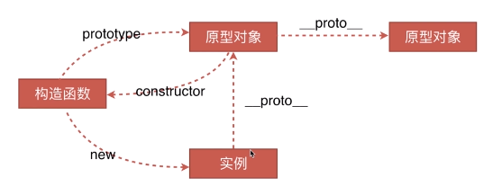
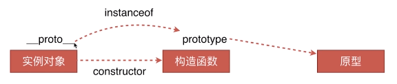

# 前端跳槽面试必备技巧

## 职位描述(JD)
不同的JD需要匹配不同的技能。写出不同的简历。通过JD着重去准备某部分东西

## 业务分析
jr.jd.com
京东金融技术分析（知识点）
- UI组件
  - 导航组件（手动写一下）
  - 基本布局(左中右三栏布局，左右两栏布局，不同思路实现布局)
  - 鼠标移过效果（CSS3动画重点准备，肯定要问）
  - 页面中的所有UI组件，不熟悉的要去看一下准备一下
- Chrome开发面板查看技术细节(Sources)
  - 用到了jQuery(比如事件委托，选择器最基本的，最常用的配套的模板引擎：handlebars/juicer/easyTemplate/underscoretemplate，最新的jq更新)
  - vue框架
  - es6语法
  - webpack打包工具
- Elements看源码（主要看header）
  - 
    ```html
    <!-- 设置IE用Edge渲染，有chrome用chrome渲染 -->
    <meta http-equiv="X-UA-Compatible" content="IE=Edge,chrome=1">
    <!-- 双核浏览器优先用webkit内核渲染浏览器 -->
    <meta name="renderer" content="webkit">
    <!-- 网站编码 -->
    <meta http-equiv="Content-Type" content="text/html; charset=utf-8">
    <!-- 网站描述，SEO -->
    <meta name="description" content="京东金融官网，服务金融机构的数字科技公司。中国互联网金融协会理事单位! 参与中央网信办等四部委发起的联合安全测评并位居榜首。旗下品牌包括京东财富、京东众筹、京东保险、京东白条、企业金融、京东股票、东家财富、金融云、城市计算等。">
    <!-- 实现dns预解析，优化性能 -->
    <link rel="dns-prefetch" href="//static.360buyimg.com">

    ```
- Application
  - local Storage用的比较多，Session Storage没怎么用，所以重点准备localstorage
  - Frames-Fronts
  字体文件，自定义字体，字体图标，知道是什么，怎么用
  - Frames-Images
  主要用了png和jpg，不用特别准备

www.elong.com
艺龙官网技术分析（知识点）
- 按上方顺序分析
- 注意右上角小程序(所以艺龙JD中说的微信项目就是小程序，需要准备微信小程序相关知识)
- 右上角手机版（就是webapp，h5需要了解）
- 左边的日期控件（去了解一下怎么写日期控件，了解其中的算法，万一问起来至少知道是怎么做的，虽然实际工作中就是调用已经写好的api）
- 鼠标移入拉宽，其它收缩的特效（准备好，扎实下基本功，面试时候可以拿出来说，甚至可以说出你更好的方案CSS animation做出来）
- viewport标签没有，`<html xmln='http://www.w3.org/1999/xhtml'>`说明项目一直维持久远历史状态，没有做新版重构。header中存在大量script，script不应该放在header部分（参考雅虎军规）。但它的script上有async，是异步加载的。异步加载script有几种
- Require.js(模块化准备)
技术栈总结：jquery+require.js

## 技术栈准备

### 技术栈

- jQuery:
    - 看源码（核心架构是什么，事件委托怎么做，插件机制是什么，兼容性暂时可以不看）：找一篇jquery源码分析文章看
- Vue/React/Angular:
    - 时间紧准备一个，问起来就说那个没用过，这个用的熟。对于其中一个的原理理解深，Vue源码深入理解，找一篇分析的文章看。提前准备好遇到过怎么问题，怎么解决的，思路是什么（二面三面经常问，考察思维，如何解决问题等）。
- Node:
    - 没时间不准备没事，直接说不了解，但要准备就准备好了，不要画蛇添足

### 前端工程（构建工具）
- sass/less:
- gulp/grunt:都不了解，就准备gulp
- npm:
    - 常见命令，通常怎么用的，npm scripts怎么用的（博客随便搜一个）
- browserify
- webpack:必准备

## 自我陈述

### 简历
- 基本信息 姓名-年龄-手机-邮箱-籍贯
- 学历，由最高往低写
- 工作经历，项目背景-技术栈-技术收益/业务业绩。如果确实没什么成绩，那你重新想一下当时什么没做好，自己代码写一遍，然后写再简历上。
- 开源项目，Github和说明（不要作假）。
- 最好不要写自我评价。
- 简历审美要好
  
### 自我陈述
- 自我介绍：面试官会根据你说的内容想好问题。
- 想告诉他的东西说半句留半句，让他来问你，你再说。
- 不懂的可以问。
- 问基础不要急躁。
- 遇到难度大的题目要尽量去思考，不要轻易放弃。
- 遇到困难的面试可以找面试官要资料，让自己有所收获。

### 参考简历


## 页面布局
### 实现两栏（三栏）布局的方法
```html
<section class="layout float">
    <style>
        .layout.float .left{
            float: left;
            width:300px;
            background-color: red;
        }
        .layout.float .right{
            float: right;
            width:300px;
            background-color:blue;
        }
        .layout.float .center{
            margin-left:300px;
            margin-right:300px;
            background-color:yellow;
        }
    </style>
    <article class="left-right-center">
        <div class="left"></div>
        <div class="right"></div>
        <div class="center">
            <div style="width:100%; height:50px;">
                hahaha 
                <h1>浮动解决方案</h1>
                1.这是三栏布局中间部分
                2.这是三栏布局中间部分
            </div>
        </div>
    </article>
</section>
<section class="layout absolute">
    <style>
        .layout.absolute{
            height: 100px;
        }
        .layout.absolute .left{
            position: absolute;
            width:300px;
            left:0;
            background-color: red;
        }
        .layout.absolute .center{
            position: absolute;
            left:300px;
            right:300px;
            background-color: yellow;
        }
        .layout.absolute .right{
            position: absolute;
            width:300px;
            right:0;
            background-color: blue;
        }
    </style>
    <article class="left-center-right">
        <div class="left"></div>
        <div class="center">
            <div style="width:100%; height:50px;">
                hahaha 
                <h1>绝对定位解决方案</h1>
                1.这是三栏布局中间部分
                2.这是三栏布局中间部分
            </div>
        </div>
        <div class="right"></div>
    </article>
</section>
<section class="layout flex">
    <style>
        .layout.flex .left-center-right{
            display:flex;
        }
        .layout.flex .left{
            width:300px;
            background-color: red;
        }
        .layout.flex .center{
            flex:1;
            background-color: yellow;
        }
        .layout.flex .right{
            width:300px;
            background-color: blue;
        }
    </style>
    <article class="left-center-right">
        <div class="left"></div>
        <div class="center">
            <div style="width:100%; height:50px;">
                hahaha 
                <h1>flex解决方案</h1>
                1.这是三栏布局中间部分
                2.这是三栏布局中间部分
            </div>
        </div>
        <div class="right"></div>
    </article>
</section>
<section class="layout table">
    <style>
        .layout.table .left-center-right{
            display:table;
            width:100%;
        }
        .layout.table .left{
            display:table-cell;
            width:300px;
            background-color: red;
        }
        .layout.table .center{
            display:table-cell;
            background-color: yellow;
        }
        .layout.table .right{
            display: table-cell;
            width:300px;
            background-color: blue;
        }
    </style>
    <article class="left-center-right">
        <div class="left"></div>
        <div class="center">
            <div style="width:100%; height:50px;">
                hahaha 
                <h1>表格解决方案</h1>
                1.这是三栏布局中间部分
                2.这是三栏布局中间部分
            </div>
        </div>
        <div class="right"></div>
    </article>
</section>
<section class="layout grid">
    <style>
        .layout.grid .left-center-right{
            display:grid;
            grid-template-rows: 100px;
            grid-template-columns: 300px auto 300px;
        }
        .layout.grid .left{
            background-color: red;
        }
        .layout.grid .center{
            background-color: yellow;
        }
        .layout.grid .right{
            background-color: blue;
        }
    </style>
    <article class="left-center-right">
        <div class="left"></div>
        <div class="center">
            <div style="width:100%; height:50px;">
                hahaha 
                <h1>grid解决方案</h1>
                1.这是三栏布局中间部分
                2.这是三栏布局中间部分
            </div>
        </div>
        <div class="right"></div>
    </article>
</section>
```

哪五种五种解决方案，
每个解决方案的优缺点：
	浮动：脱离文档流，处理不好带来很多问题/兼容性好
	绝对定位：快捷，不容易出问题/布局脱离文档流，其中所有子元素也必须脱离文档流，不实用
	Flex：解决了以上两个的问题，比较完美
	表格布局：兼容性好/有时不需要同时增高
	网格布局：
假设高度去掉，哪个方案不再适用了，
真正到业务中使用，哪个最实用

- 页面布局的变通（像上面一样写出多种方案，各个优缺点）
    - 三栏布局
        - 左右宽度固定，中间自适应
        - 上下高度固定，中间自适应
    - 两栏布局
        - 左宽度固定，右自适应
        - 右宽度固定，左自适应
        - 上高度固定，下自适应
        - 下高度固定，上自适应


## CSS盒模型
- 怎么看CSS盒模型？
    - 基本概念：标准模型+IE模型，margin,padding,border,content
    - 标准模型和IE模型的区别
        - 标准模型宽度是content
        - IE模型宽度是content,padding,border
    - CSS如何设置这两种模型
        - box-sizing:content-box(默认)/border-box;
    - JS如何设置获取盒模型对应的宽和高
        - dom.style.width/height(只能取行内样式，不能取内联样式和外联样式)
        - dom.currentStyle.width/height(得到的是渲染后的数据，仅IE)
        - window.getComputedStyle(dom).width/height(通用性好)
        - dom.getBoundingClientRect().width/height(内部通过位置来实现)
    - 实例题（根据盒模型解释边距重叠）
        - 两个div,里面的div高度100px,上边距(margin)为10px,求外面div的实际高度。--100，如果加了BFC,是110
    - BFC(边距重叠解决方案)
        - 三种情况（重叠原则：取最大值）
            - 父子margin重叠
            - 兄弟margin重叠
            - 空元素margin重叠(上下margin取最大值作边距和左右margin取最大值作边距)
        - BFC的基本概念:边距重叠解决方案
        - BFC的原理(渲染规则)
            - 在BFC这个元素垂直方向的边距会发生重叠
            - BFC的区域不会和浮动元素的box重叠
            - BFC在页面上是一个独立的容器，外面的元素不影响里面的元素，里面的也不影响外面
            - 计算BFC高度时，浮动元素也会参与计算
        - 如何创建BFC(以下任一条件)
            - overflow不为visible(设置hidden,auto)
            - float值不为none(默认为none，只要设置了float，当前元素就是BFC)
            - position不是static或relative(设置absolute,fixed)
            - display是table/tablecell跟table相关的都可以
        - BFC的使用场景
            - 解决边距重叠(父子重叠在父元素加BFC,兄弟重叠给自己或者兄弟加个父元素加BFC,空元素给自己加个父元素加加BFC)
            - demo1:(BFC的区域不会和浮动元素的box重叠)
```html
<section id='layout'>
    <style media="screen">
        #layout{
            background:red;
        }
        #layout .left{
            float:left;
            width:100px;
            height:100px;
            background:pink;
        }
        #layout .right{
            height:110px;
            background:#ccc;
            /* 给右边元素加BFC，右边就不会往左边流10px了 */
            overflow:auto;
        }
    </style>
    <div class="left"></div>
    <div class="right"></div>
</section>
```
                - demo2:父元素设置BFC可以清除浮动(计算BFC高度时，浮动元素也会参与计算)


## DOM事件
- 基本概念：DOM事件(DOM标准)的级别
    - DOM0 
      - element.onclick=function(){}
    - DOM2 
      - element.addEventListener('click',function(){},false)(DOM1标准设立的时候没有事件相关的东西，所以直接是2)
      - 默认false,冒泡阶段触发，true,捕获阶段触发。
    - DOM3 
      - element.addEventListener('keyup',function(){},false)(事件类型较DOM2增加了很多)
- DOM事件模型
    - 冒泡(从下往上)
    - 捕获(从上往下)
- DOM事件流
    - 比如点击了左键，左键是怎么传到页面上，就叫事件流
    - 一个事件流分三个阶段：捕获阶段->目标阶段->冒泡阶段。事件通过捕获到达目标阶段，再从目标阶段冒泡上传到window对象
- 具体流程
    - 事件捕获：window->document->html->body->...->目标元素
    - 冒泡流程：目标元素->...->boyd->html->document->window
      - 如何拿html对象：document.documentElement
      - 如何拿body：document.body
- Event对象的常见应用
    - 事件类型
        - CAPTURING-PHASE  当前事件阶段为捕获阶段
        - AT-TARGET   当前事件是目标阶段,在评估目标事件
        - BUBBLING-PHASE   当前的事件为冒泡阶段
    - 目标
        - 【重要】target 当前目标元素,事件委托中指子元素
        - 【重要】currentTarget 当前绑定的元素，事件委托中指父级元素

    - 事件行为
        - 【重要】preventDefault() 阻止默认行为(比如阻止链接默认跳转行为)
        - 【重要】stopPropagation() 阻止冒泡
        - 【重要】stopImmediatePropagation() 优先级(绑定了ab两个事件，a事件中写了此函数，那么b就不会执行)

    - 键盘事件
        - altKey    
          - 返回当事件被触发时，"ALT" 是否被按下。
        - ctrlKey	
          - 返回当事件被触发时，"CTRL" 键是否被按下。
        - shiftKey	
          - 返回当事件被触发时，"SHIFT" 键是否被按下。
        - charCode  
          - 返回onkeypress事件触发键值的字母代码。
        - key	    
          - 在按下按键时返回按键的标识符。
        - button	
          - 返回当事件被触发时，哪个鼠标按钮被点击。
        - keyCode	
          - 返回onkeypress事件触发的键的值的字符代码，或者 onkeydown 或 onkeyup 事件的键的代码。
    - 鼠标位置
        - clientX	返回当事件被触发时，鼠标指针的水平坐标。
        - clientY	返回当事件被触发时，鼠标指针的垂直坐标。
        - screenX	返回当某个事件被触发时，鼠标指针的水平坐标。
        - screenY	返回当某个事件被触发时，鼠标指针的垂直坐标。
    
- 【重要】自定义事件
  - Event
```js
// 声明自定义事件
var eve=new Event('custome');
ev.addEventListener('custome',function(){
    console.log('custome');
})
// 触发自定义事件
ev.dispatchEvent(eve);
```
  - CustomEvent
    - 多一个obj的参数，new CustomEvent('custome',object)

## 类型转换
### 数据类型
- 原始类型
  - Boolean
  - Null
  - Undefined
  - Number
  - String
  - Symbol(ES6新增)
- 对象
  - Object

### 显示类型转换
- Number函数
  - **数值**：转换后还是原来的值
  - **字符串**：如果可以被解析为数值，则转换为相应的数值，否则得到NaN.空字符串转为0
  - **布尔值**：true转成1，false转成0
  - **undefined**：转成NaN
  - **null**：转成0
  - **对象**：先调用自身的valueOf，不行再调用自身的toString，再不行就报错
    - Object的valueOf返回对象本身，toString返回"[object Object]"的字符串
    - Array的valueOf返回对象本身，toString返回调用join(',')所返回的字符串。
    - Function的valueOf返回对象本身，toString返回函数中包含的代码转为字符串的值。
- Number等同于一元正号(+)
```js
> +{} //相当于 Number({})
NaN
```
- String函数
  - **数值**：转为相应的字符串
  - **字符串**：转换后还是原来的值
  - **布尔值**：true转成'true'，false转成'false'
  - **undefined**：转成'undefined'
  - **null**：转成'null'
  - **对象**：先调用自身的toString，不行再调用自身的valueOf，再不行就报错
- Boolean函数
  - undefined/null/-0/+0/NaN/''(空字符串)==>false
  - 其他一律为true


### 隐式类型转换
  - 四则运算
    - **+**：只要其中一个是String类型，表达式的值转为String。若无字符串，表达式便转为Number类型
    - **其余**：只要其中一个是Number类型，表达式的值便转为Number。
    - **非法字符**：对于非法字符的情况通常会返回NaN
```js
'1' * 'a'     // => NaN
```
  - 判断语句
    - 转换规则同Boolean的构造函数。
  - Native调用
    - 比如console.log、alert调用自动转为字符串类型
#### 常见题目
```js
[]+[]
// ""
[]+{}
// [object Object]
{}+[]
// [object Object]
// 所有浏览器都认为{}是区块语句，计算+[]，得出0
{}+{}
// [object Object][object Object]
// 谷歌浏览器是正常结果，火狐会把第一个{}当做区块语句，计算+{}，得出NaN
true+true
// 2
1+{a:1}
// 1[object Object]
```

## HTTP协议

- HTTP协议的主要特点
    - 简单快速(每个资源是固定的，处理起来简单，访问资源输入URI就行)
    - 灵活（每个http协议头部分有个类型，可请求不同类型资源）
    - 无连接【重要】（连接一次就会断掉，不会保持连接）
    - 无状态【重要】（客户端和服务端是两种身份，单http协议上是不能区分两次连接的身份的）
- HTTP报文的组成部分
  - 请求报文
      - 请求行
        - http方法
        - 页面地址
        - http协议以及版本
      - 请求头
        - key,value值告诉服务端我要哪些内容，哪些类型
      - 空行
        - 请求头和请求体的分割
      - 请求体
        - 数据部分
```md
<!-- 请求行 -->
POST /search HTTP/1.1  
<!-- 请求头 -->
Accept: image/gif, image/x-xbitmap, image/jpeg, image/pjpeg, application/vnd.ms-excel, application/vnd.ms-powerpoint, 
application/msword, application/x-silverlight, application/x-shockwave-flash, */*  
Referer: <a href="http://www.google.cn/">http://www.google.cn/</a>  
Accept-Language: zh-cn  
Accept-Encoding: gzip, deflate  
User-Agent: Mozilla/4.0 (compatible; MSIE 6.0; Windows NT 5.1; SV1; .NET CLR 2.0.50727; TheWorld)  
Host: <a href="http://www.google.cn">www.google.cn</a>  
Connection: Keep-Alive  
Cookie: PREF=ID=80a06da87be9ae3c:U=f7167333e2c3b714:NW=1:TM=1261551909:LM=1261551917:S=ybYcq2wpfefs4V9g; 
NID=31=ojj8d-IygaEtSxLgaJmqSjVhCspkviJrB6omjamNrSm8lZhKy_yMfO2M4QMRKcH1g0iQv9u-2hfBW7bUFwVh7pGaRUb0RnHcJU37y-
FxlRugatx63JLv7CWMD6UB_O_r  

hl=zh-CN&source=hp&q=domety
```
  - 响应报文
      - 状态行
      - 响应头
      - 空行
      - 响应体
```md
<!-- 状态行 -->
HTTP/1.1 200 OK
<!-- 响应头 -->
Date: Sat, 31 Dec 2005 23:59:59 GMT
Content-Type: text/html;charset=ISO-8859-1
Content-Length: 122

＜html＞
＜head＞
＜title＞Wrox Homepage＜/title＞
＜/head＞
＜body＞
＜!-- body goes here --＞
＜/body＞
＜/html＞
```
- HTTP方法
  - GET(获取资源)
  - POST(传输资源)
  - PUT(更新资源)
  - DELETE(删除资源)
  - HEAD(获得报文首部)
- POST和GET的区别（记住三到四个）
  - 【记】GET在浏览器回退时是无害的，而POST会再次提交请求
  - GET产生的URL可以被收藏，而POST不可以(可不记)
  - 【记】GET请求会被浏览器主动缓存，而POST不可以
  - GET请求只能进行url编码，而POST支持多种编码方式(可记可不记)
  - 【记】GET请求参数会被完整保留在浏览器历史纪录里，而POST中的参数不会被保留
  - 【记】GET请求在URL中传送的参数是有长度限制的，而POST没有限制
    - 【记】不同浏览器不一样，如果使用get请求，拼接的url不能太长，否则会被浏览器截断，http协议对长度有限制，所以太长发不出去，会截断
  - 【重要】对参数的数据类型，GET只接受ASCII字符，而POST没有限制
  - GET比POST更不安全，因为参数直接暴露在URL上，所以不能用来传递敏感信息(了解)
  - 【记】GET参数通过URL传递，POST放在Request body中（了解）
- HTTP状态码
  - 记忆
    - 1xx：指示信息-表示请求已接受，继续处理
    - 2xx：成功-表示请求已被成功接收
    - 3xx：重定向-要完成请求必须进行更进一步的操作
    - 4xx：客户端错误-请求有语法错误或请求无法实现
    - 5xx：服务端错误-服务器未能实现合法的请求
  - 具体
    - 200 OK：客户端请求成功
    - 206 Partial Content：客户发送了一个带有Range头的GET请求，服务器完成了它(较多，audio,video标签，文件很大时会返回这个)
    - 301 Moved Permanently：所请求的页面已经转移至新的url
    - 302 Found：所请求的页面已经临时转移至新的url
    - 304 Not Modified：客户端有缓冲的文档并发出了一个条件性的请求，服务器告诉客户，原来的缓冲问答那个还可以继续使用
    - 400 Bad Request：客户端请求有语法错误，不能被服务器所理解
    - 401 Unauthorized：请求未经授权，这个状态码必须和WWW-Authenticate报头域一起使用
    - 403 Forbidden：对被请求页面的访问被禁止(较多，某页面的地址只能通过服务器来访问)
    - 404 Not Found：请求资源不存在(较多，请求一个不存在的地址)
    - 500 Internal Server Error：服务器发送不可预期的错误原来缓冲的文档还可以继续使用(一般服务端处理)
    - 503 Server Unavailable：请求未完成，服务器临时过载或当机，一段时间后可能会恢复正常(一般服务端处理)
- 什么是持久连接
    - http普通模式是无连接无状态，但是可设置keep-alive模式支持持久链接，当出现对服务器的后继请求事，避免了建立或者重新建立连接。从http1.1版本开始才支持。
- 什么是管线化
  - 普通持久连接
    - 请求1->响应1->请求2->响应2->请求3->响应3
  - 管线化持久连接
    - 【记】【原理】请求1->请求2->请求3->响应1->响应2->响应3(请求打包过去，响应打包发回来)
    - 【记】管线化机制通过持久连接完成，http1.1才支持
    - 【记】只有GET和HEAD请求可以管线化，而POST有所限制
    - 【记】初次创建连接不应启动管线机制，因为对方服务器不一定支持http/1.1版本的协议
    - 管线化不会影响响应到来的顺序
    - http/1.1要求服务端支持管线化，但并不要求服务端对响应进行管线化处理，只要求对管线化的请求不失败即可
    - 因为以上服务端问题，开启管线化可能并不会大幅度提升性能，而且很多服务器和代理程序对管线化支持并不好，因此Chrome和Firefox默认并未开启管线化支持

## 原型链
### 创建对象有几种方法
    ```js
    // 第一种(字面量)
    var obj1={name:'obj1'}// Object {name:'obj1'}
    var obj2=new Object({name:'obj2'})// Object {name:'obj2'}
    
    // 第二种(构造函数)
    var M=function(){this.name='obj3'}
    var obj3=new M()// M {name:'obj3'}

    // 第三种(Object.create)
    var P={name:'obj4'}
    var obj4=Object.create(P)// Object {}，看不到属性，但是存在。因为它本身是空对象，但是它的原型指向P这个对象。

    ```
### 原型、构造函数、实例、原型链

### instanceof的原理

- instanceof判断是否是实例，在原型链上的都会是true，而用constructor只有在本身上才是true，更加严谨
### new运算符
- 创建一个新对象。它继承自foo.prototype
- 执行foo构造函数里的代码。执行时相应的参数被传入，同时this会被指定为这个新实例。new foo等同于new foo()，只能用在不传递任何参数的情况
- 如果构造函数返回了一个对象，那么返回这个对象。否则，返回this
```js
var new2=function(func){
    var o=Object.create(func.prototype);
    var k=func.call(o);
    if(typeof k==='object'){
        return k
    }else{
        return o
    }
}
```

## 面向对象

### 类与实例
- 类的声明
  - es5
```js
function Animal(){
    this.name='name';
}
```
   - es6
```js
class Animal {
    constructor(){
        this.name='name';
    }
}
```
```
- 生成实例
```js
new Animal();
```

### 类与继承【非常重要，是整个js里最难理解的内容】
- 如何实现继承（js继承本质：原型链）
```js
// 第一种，借助构造函数实现继承(这种无法继承parent原型对象上的方法)
function Parent1(){
    this.name='parent1';
}
Parent1.prototype.say=function(){}
function Child1(){
    Parent1.call(this);// call,apply改变函数执行上下文，即this
    this.type='child1';
}
// 第二种，借助原型链实现继承(这种继承是继承了同一个parent实例，导致修改的也是同一个)
function Parent2(){
    this.name='parent2';
    this.play=[1,2,3]
}
function Child2(){
    this.type='child2';
}
Child2.prototype=new Parent2();
var s1=new Child2();
var s2=new Child2();
s1.play.push(4);
console.log(s1.play,s2.play)// [1,2,3,4],[1,2,3,4]
// 第三种，组合继承方式(组合以上两种，避免了以上两个的问题)(缺点：继承时父级构造函数执行了两遍)
function Parent3(){
    this.name='parent3'
}
function Child3(){
    Parent3.call(this);
    this.type='child3';
}
Child3.prototype=new Parent3();
// 组合继承方式优化1(问题：constructorwei指向Child4)
function Parent4(){
    this.name='parent4'
}
function Child4(){
    Parent4.call(this);
    this.type='child4';
}
Child4.prototype=Parent4.prototype;
var s4=new Child4();
console.log(s4.constructor);// Parent4
// 组合继承方式优化2(最终方案)
function Parent5{
    this.name='parent5'
}
function Child5(){
    Parent5.call(this);
    this.type='child5';
}
Child5.prototype=Object.create(Parent5.prototype);// 隔离父类和子类的原型对象
Child5.prototype.constructor=Child5;// 覆盖自雷的原型对象
```
- 继承的几种方式


## 通信
### 什么是同源策略及限制
- 同源策略限制从一个源加载的文档或脚本如何与来自另一个源的资源进行交互。这是一个用于隔离潜在恶意文件的关键的安全机制。
    - Cooie、LocalStorage和IndexDB无法读取
    - DOM无法获得
    - AJAX请求不能发送
### 前后端如何通信
    - Ajax(同源限制)
    - WebSocket(没有同源限制)
    - CORS(支持跨域通信也支持同源通信，一种新的通信，浏览器如果发现是跨域请求，会自动在请求头中加一个origin)

### 如何创建Ajax
考察点：
- XMLHttpRequest对象的工作流程
- 兼容性处理
- 事件的触发条件
- 事件的触发顺序

###【重要,手写】跨域通信的几种方式(其它的方式不常用或者成本太高)
- JSONP（利用script标签的异步加载来实现的）
```js
util.jsonp=function(url,onsuccess,onerror,charset){
    var callbackName=util.getName('tt_player');
    window[callbackName]=function(){
        if(onsuccess && util.isFunction(onsuccess)){
            onsuccess(arguments[0]);
        }
    };
    var script=util.createScript(url+'&callback='+callbackName,charset);
    script.onload=script.onreadystatechange=function(){
        if(!script.readyState||/loaded|complete/.test(script.readyState)){
            script.onload=script.onreadystatechange=null;
            // 移除该script的DOM对象
            if(script.parentNode){
                script.parentNode.removeChild(script);
            }
            // 删除函数或变量
            window[callbackName]=null;
        }
    }
    script.onerror=function(){
        if(onerror&&util.isFunction(onerror)){
            onerror();
        }
    }
    document.getElementsByTagName('head')[0].appendChild(script);
}

```
- Hash(用在iframe跨域页面通信)
    - hash#后改变页面是不刷新的，search改变是会刷新页面的
```js
//当前页面A 通过iframe或frame嵌入了跨域的页面B。利用hashA向B通信。
// 在A中的伪代码如下：
var B=document.getElementsByTagName('iframe')
B.src=B.src+'#'+'data';
// 在B中的伪代码如下：
window.onhashchange=function(){
    var data=window.location.hash;
}

```
- postMessage(跨域页面通信)
    - H5中增加了这个作为跨域通信的方式
```js
// 窗口A(http:A.com)向跨域的窗口B(http://B.com)发送信息
Bwindow.postMessage('data','http://B.com');
// 窗口B中监听
window.addEventListener('message',function(event){
    console.log(event.origin);// http://A.com
    console.log(event.source);// Awindow
    console.log(event.data);// data
})
```
- WebSocket
    - 不受同源策略限制
```js
var ws=new WebSocket('wss://echo.websocket.org');
ws.onopen=function(evt){
    console.log('Connection open ...')
    ws.send('Hello WebSocket!');
}
ws.onmessage=function(evt){
    console.log('Received Message:'+evt.data)
    ws.close();
}
ws.onclose=function(evt){
    console.log('Connection closed.');
}
```
- CORS(ajax的一个变种)
    - 新出的通信方式，支持跨域通信的ajax(在ajax跨域头上加上这个，浏览器就会放行)
    - 【参考资料】(http://www.ruanyifeng.com/blog/2016/04/cors.html)
```js
// url (必须), options(可选),设置了cors配置即可使用cors，否则是普通ajax请求
fetch('/some/url',{
    method:'get',
}).then(function(res){

}).catch(function(err){
    // 出错了；等价于then的第二个参数，但这一更好用更直观
})
```


## 安全
- CSRF

- XSS

## 算法


- 排序【重要】
    - 冒泡排序
        - 先从数列中取出一个数作为“基准”。
        - 分区过程：将比这个“基准”大的数全放到“基准”的右边，小于或等于“基准”的数全放到“基准”的左边。
        - 再对左右区间重复第二步，直到各区间只有一个数。
        - 
```js
var quickSort = function(arr) {
    if (arr.length <= 1) { return arr; }
    var pivotIndex = Math.floor(arr.length / 2);   //基准位置（理论上可任意选取）
    var pivot = arr.splice(pivotIndex, 1)[0];  //基准数
    var left = [];
    var right = [];
    for (var i = 0; i < arr.length; i++){
        if (arr[i] < pivot) {
            left.push(arr[i]);
        } else {
            right.push(arr[i]);
        }
    }
    return quickSort(left).concat([pivot], quickSort(right));  //链接左数组、基准数构成的数组、右数组
};
```
- 选择排序
    - 首先在未排序序列中找到最小（大）元素，存放到排序序列的起始位置。
    - 再从剩余未排序元素中继续寻找最小（大）元素，然后放到已排序序列的末尾。
    - 重复第二步，直到所有元素均排序完毕。
    - 
```js
function selectionSort(arr) {
    var len = arr.length;
    var minIndex, temp;
    for (var i = 0; i < len - 1; i++) {
        minIndex = i;
        for (var j = i + 1; j < len; j++) {
            if (arr[j] < arr[minIndex]) {     // 寻找最小的数
                minIndex = j;                 // 将最小数的索引保存
            }
        }
        temp = arr[i];
        arr[i] = arr[minIndex];
        arr[minIndex] = temp;
    }
    return arr;
}
```
- 插入排序
    - 将第一待排序序列第一个元素看做一个有序序列，把第二个元素到最后一个元素当成是未排序序列。

    - 从头到尾依次扫描未排序序列，将扫描到的每个元素插入有序序列的适当位置。（如果待插入的元素与有序序列中的某个元素相等，则将待插入元素插入到相等元素的后面。）
- 希尔排序
    - 希尔排序的基本思想是：先将整个待排序的记录序列分割成为若干子序列分别进行直接插入排序，待整个序列中的记录基本有序时，再对全体记录进行依次直接插入排序。
    - 
    - 

```js
function shellSort(arr) {
    var len = arr.length,
        temp,
        gap = 1;
    while(gap < len/3) {          //动态定义间隔序列
        gap =gap*3+1;
    }
    for (gap; gap > 0; gap = Math.floor(gap/3)) {
        for (var i = gap; i < len; i++) {
            temp = arr[i];
            for (var j = i-gap; j >= 0 && arr[j] > temp; j-=gap) {
                arr[j+gap] = arr[j];
            }
            arr[j+gap] = temp;
        }
    }
    return arr;
}
```


- 冒泡排序
    - 比较相邻的元素。如果第一个比第二个大，就交换他们两个。
    -  对每一对相邻元素作同样的工作，从开始第一对到结尾的最后一对。这步做完后，最后的元素会是最大的数。
    - 针对所有的元素重复以上的步骤，除了最后一个。
    - 持续每次对越来越少的元素重复上面的步骤，直到没有任何一对数字需要比较
    - 
```js
function bubbleSort(arr) {
    var len = arr.length;
    for (var i = 0; i < len - 1; i++) {
        for (var j = 0; j < len - 1 - i; j++) {
            if (arr[j] > arr[j+1]) {        // 相邻元素两两对比
                var temp = arr[j+1];        // 元素交换
                arr[j+1] = arr[j];
                arr[j] = temp;
            }
        }
    }
    return arr;
}
```

- 堆栈【重要】、队列【重要】、链表(难度较大，来不及就不准备)
    - https://juejin.im/entry/58759e79128fe1006b48cdfd

- 递归【重要】
    - https://segmentfault.com/a/1190000009857470

- 波兰式和逆波兰式
    - 理论：https://www.cnblogs.com/chenying99/p/3675876.html
    - 源码：https://github.com/Tairraos/rpn.js/blob/master/rpn.js


## 二面/三面

要学会赞美

## 渲染机制
- 什么是DOCTYPE及作用
    - DTD文档类型定义，是一系列语法规则，浏览器会使用它来判断文档类型，决定使用何种协议来解析，以及切换浏览器模式
    - DOCTYPE是用来声明文档类型和DTD规范的。不符合规范，解析时便会出一些差错。
    - HTML5<!DOCTYPE html>【记】
    - HTML4.01版本有两个模式：严格模式和传统模式【记】
        - 区别：
        - HTML4.01 Strict。该DTD包含所有HTML元素和属性，但不包括展示性的和弃用的元素(比如font)
        - HTML4.01 Transitional该DTD包含所有HTML元素和属性，包括展示性的和弃用的元素(比如font)
- 浏览器渲染过程

- 重排Reflow
    - 定义：DOM结构中的各个元素都有自己的盒子（模型），这些都需要浏览器根据各种样式来计算并根据计算结果将元素放到它该出现的位置。
    - 触发Reflow：
        - 当你增加、删除、修改DOM节点时，会导致Reflow或Repaint
        - 当你移动DOM的位置，或是搞个动画的时候
        - 当你修改CSS样式的时候
        - 当你Resize窗口的时候（移动端没有这个问题），或是滚动的时候
        - 当你修改网页的默认字体时

- 重绘Repaint
    - 定义：当各种盒子的位置、大小以及其他属性，例如颜色、字体大小等都确定下来后，浏览器于是便把这些元素都按照各自的特性绘制一遍，页面内容出现了
    - 触发Repaint
        - DOM改动
        - CSS改动
    - 避免Repaint:需要dom添加时，不要一个个添加，而是都放到一个父元素中，添加这个父元素。
- 布局Layout

## JS运行机制
```js
console.log(1)
setTimeout(function(){
    console.log(3)
},0)
console.log(2)
```


```js
console.log('A')
while(true){

}
console.log('B')
```
```js
for(var i=0;i<4;i++){
    setTimeout(function(){
        console.log(i)
    },1000)
}
```
- setTimeout的0秒不是0，是4毫秒，以前是10毫秒
- 如何理解JS的单线程
    - 一个时间JS只能做一件事。
- 什么是任务队列
    - 分同步任务和异步任务，优先同步任务，同步执行完，再去执行异步任务。
    - 同步任务
    - 异步任务
        - setTimeout和setInterval
        - DOM事件
        - ES6中的Promise
- 什么是Event Loop（事件环）
    - 执行栈执行的是同步任务
    - 当执行栈中空了会去异步队列中取任务
    - 当setTimeout时间到了会放任务进异步队列中


## 页面性能

- 提升页面性能的方法有哪些？
    - 资源压缩合并，减少HTTP请求
    - 非核心代码异步加载-->异步加载的方式-->异步加载的区别
        - 异步加载的方式
            - 加载动态脚本（动态创建一个script标签）
            - defer(在script标签上加上defer属性)
            - async(在script标签上加上async属性)
        - 异步加载的区别
            - defer是在HTML解析完之后才会执行，如果是多个，按照加载的顺序依次执行
            - async是在HTML解析完之后才会执行，如果是多个，执行顺序和加载顺序无关
    - 利用浏览器缓存[最重要的一步，重点内容]-->缓存的分类-->缓存的原理
        - 
        - 缓存的分类
            - 强缓存(问都不问，发现有缓存直接用)。http服务器返回的头上带有如下一个或者两个（两个都下发了，相对时间优先）：
                - **Expires** Expires:Thu,21 Jan 2017 23:39:02 GMT（服务器的绝对时间）
                - **Cache-Control** Cache-Control:max-age=3600（过期时间，客户端相对时间，3600s以内缓存有效）
            - 协商缓存（发现本地有缓存，询问服务器，可以使用再使用）
                - **Lat-Modified**（服务器下发修改时间的字段） **If-Modified-Since**（再次发送请求确认时上次修改时间的字段） （两个字段为同一个值）
                    - Last-Modified:Web,26 Jan 2017 00:35:11 GMT（第一次请求后服务器下发了修改时间，当强缓存失效后，向服务器发送携带这个值的请求，）
                - **Etag** **If-None-Match**（第一次请求时服务器下发Etag值，第二次请求如果内容没有变化，服务器下发If-None-Match的值为上次Etag的值）
            - 与缓存相关的http协议头有哪些？以上六个。

    - 使用CDN（CDN加载资源非常快，静态资源，尤其是浏览器第一次打开时，缓存是起不了任何作用的，CDN起很明显的作用）
    - 预解析DNS
```html
<!--强制打开a标签的DNS预解析(所有a标签默认会做DNS预解析的。但是如果页面协议是https开头的，很多浏览器是默认关闭这个DNS预解析)-->
<meta http-equiv="x-dns-prefetch-control" content="on">
<!-- 加DNS预解析 -->
<link rel="dns-prefetch" href="//host_name_to_prefetch.com">

```

## 错误监控

### 前端错误的分类
    - 即时运行错误：代码错误
    - 资源加载错误


### 每种错误的捕获方式
    - 即时运行错误的捕获方式
        - try...catch
        - window.onerror
    - 资源加载错误
        - object.onerror
        - performance.getEntries()// 可以获取所有已加载的资源减去页面上所有的img，即可得到未加载的资源
        - Error事件捕获
```html

<script onerror=""/>
```
> 注意：window.onerror只能捕获即时运行错误，不能捕获资源加载错误。因为onerror事件不冒泡。

```html
<script>
    window.addEventListener('error',function(e){
        console.log('捕获',e);
    },true)
</script>
```
【面试题延伸】跨域的js运行错误可以捕获吗，错误提示什么，应该怎么处理？
- 错误提示：因为跨域了，所以拿不到错误信息。
    - 
- 如何处理才能拿到详细信息（两步）：
    1. （前端）在script标签增加crossorigin属性
    2. （后端）设置js资源响应头Access-Control-Allow-Origin:*// *也可以改成具体域名
### 上报错误的原理
- 采用Ajax通信的方式上报
- 利用Image对象上报（所有的错误监控体系都是利用image对象上报的）
```html
<script>
// 比ajax方式简单的多
    (new Image()).src='http://baidu.com/tesjk?r=tksjk';
</script>
```


## MVVM框架类
- 了解MVVM框架吗？
    - 引导模式，不要细节全说出来。
- 谈谈你对MVVM的认识？
    - 先聊MVC,再聊MVVM的定义,
- 双向绑定是什么原理，可以写出来吗？
    - 数据到页面的更新-->Object.defineProperty的更新回调（以前需要使用模板引擎）
```js
Object.defineProperty(obj,prop,descriptor)
descriptor
MVVM框架中用的get set（其中检查新值和旧值如果不一样，修改）
// 
var obj1={};
var descriptor=Object.create(null);
descriptor.value='static';
Object.defineProperty(obj1,'key',descriptor);
console.log(obj1)
// 显式
var obj2={};
Object.defineProperty(obj2,'key',{
    enumerable:true,
    configurable:false,
    writable:false,
    value:'static',
});
console.log(obj2)
```
        【重要】：
            1. object.defineProperty的用法要熟记于心
            2. object.defineProperty与reflect.defineProperty的区别
                - 前一个es5用法，返回一个新对象。 后一个es6用法，返回一个布尔值
            3. object.defineProperty要会手写
    - 页面到数据的更新-->内置了input事件（以前需要自己写input事件）

- 使用了什么设计模式？

    - 观察者设计模式的原理要了如指掌
        - 模式分为几大主体(Observer,Dep,Watcher),角色，作用
        - 最好能写出设计模式的伪代码
        - 如果没有问到设计模式，也要找时机表现出来
- 生命周期是什么？
    - 说出八个事件点，八个事件点之间的区别
    - 页面性能监控，在mounted更合适，测某个点的性能,updated更合适
- 有看过源码吗？

