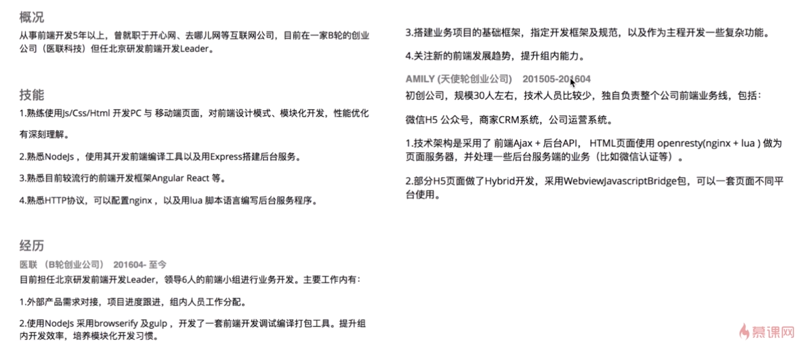
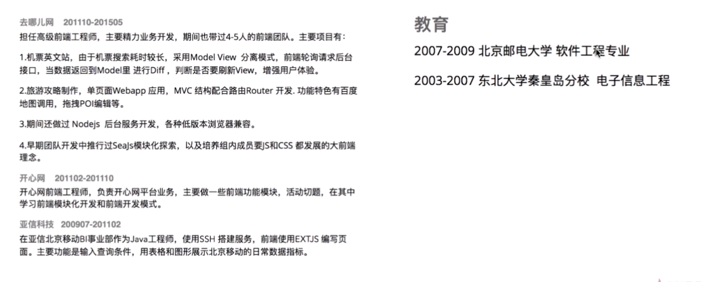

# 前端跳槽面试必备技巧

## 职位描述(JD)
不同的JD需要匹配不同的技能。写出不同的简历。通过JD着重去准备某部分东西

## 业务分析
jr.jd.com
京东金融技术分析（知识点）
- UI组件
  - 导航组件（手动写一下）
  - 基本布局(左中右三栏布局，左右两栏布局，不同思路实现布局)
  - 鼠标移过效果（CSS3动画重点准备，肯定要问）
  - 页面中的所有UI组件，不熟悉的要去看一下准备一下
- Chrome开发面板查看技术细节(Sources)
  - 用到了jQuery(比如事件委托，选择器最基本的，最常用的配套的模板引擎：handlebars/juicer/easyTemplate/underscoretemplate，最新的jq更新)
  - vue框架
  - es6语法
  - webpack打包工具
- Elements看源码（主要看header）
  - 
```
<meta http-equiv="X-UA-Compatible" content="IE=Edge,chrome=1">//设置IE用Edge渲染，有chrome用chrome渲染
<meta name="renderer" content="webkit">//双核浏览器优先用webkit内核渲染浏览器
<meta http-equiv="Content-Type" content="text/html; charset=utf-8">//网站编码
<meta name="description" content="京东金融官网，服务金融机构的数字科技公司。中国互联网金融协会理事单位! 参与中央网信办等四部委发起的联合安全测评并位居榜首。旗下品牌包括京东财富、京东众筹、京东保险、京东白条、企业金融、京东股票、东家财富、金融云、城市计算等。">//网站描述，SEO
<link rel="dns-prefetch" href="//static.360buyimg.com">//实现dns预解析，优化性能

```
- Application
  - local Storage用的比较多，Session Storage没怎么用，所以重点准备localstorage
  - Frames-Fronts
  字体文件，自定义字体，字体图标，知道是什么，怎么用
  - Frames-Images
  主要用了png和jpg，不用特别准备

www.elong.com
艺龙官网技术分析（知识点）
- 按上方顺序分析
- 注意右上角小程序(所以艺龙JD中说的微信项目就是小程序，需要准备微信小程序相关知识)
- 右上角手机版（就是webapp，h5需要了解）
- 左边的日期控件（去了解一下怎么写日期控件，了解其中的算法，万一问起来至少知道是怎么做的，虽然实际工作中就是调用已经写好的api）
- 鼠标移入拉宽，其它收缩的特效（准备好，扎实下基本功，面试时候可以拿出来说，甚至可以说出你更好的方案CSS animation做出来）
- viewport标签没有，`<html xmln='http://www.w3.org/1999/xhtml'>`说明项目一直维持久远历史状态，没有做新版重构。header中存在大量script，script不应该放在header部分（参考雅虎军规）。但它的script上有async，是异步加载的。异步加载script有几种
- Require.js(模块化准备)
技术栈总结：jquery+require.js

## 技术栈准备

### 技术栈

jQuery:
看源码（核心架构是什么，事件委托怎么做，插件机制是什么，兼容性暂时可以不看）：找一篇jquery源码分析文章看
Vue/React/Angular:
时间紧准备一个，问起来就说那个没用过，这个用的熟。对于其中一个的原理理解深，Vue源码深入理解，找一篇分析的文章看。提前准备好遇到过怎么问题，怎么解决的，思路是什么（二面三面经常问，考察思维，如何解决问题等）。
Node:
没时间不准备没事，直接说不了解，但要准备就准备好了，不要画蛇添足

### 前端工程（构建工具）
sass/less:
gulp/grunt:都不了解，就准备gulp
npm:
常见命令，通常怎么用的，npm scripts怎么用的（博客随便搜一个）
browserify
webpack:必准备

## 自我陈述

### 简历
- 基本信息 姓名-年龄-手机-邮箱-籍贯
- 学历，由最高往低写
- 工作经历，项目背景-技术栈-技术收益/业务业绩。如果确实没什么成绩，那你重新想一下当时什么没做好，自己代码写一遍，然后写再简历上。
- 开源项目，Github和说明（不要作假）。
- 最好不要写自我评价。
- 简历审美要好
  
### 自我陈述
- 自我介绍：面试官会根据你说的内容想好问题。
- 想告诉他的东西说半句留半句，让他来问你，你再说。
- 不懂的可以问。
- 问基础不要急躁。
- 遇到难度大的题目要尽量去思考，不要轻易放弃。
- 遇到困难的面试可以找面试官要资料，让自己有所收获。
  
### 参考简历

