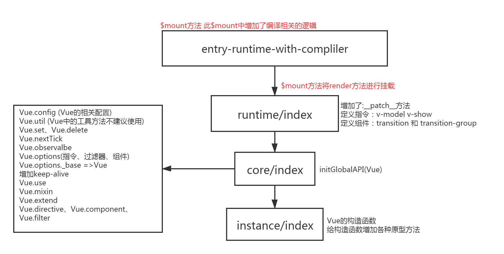
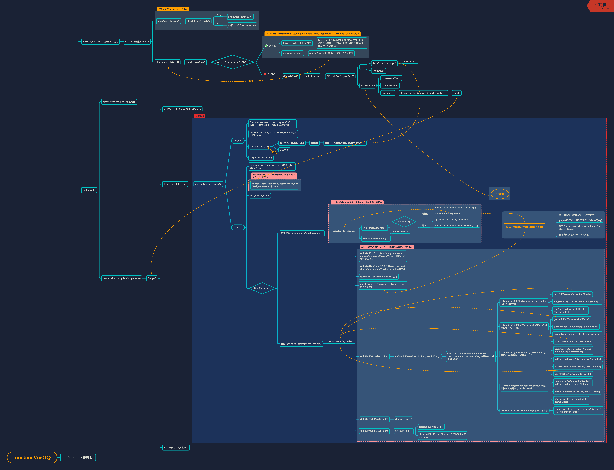

# vue 源码
[电子书](https://github.com/ustbhuangyi/vue-analysis)
## 准备工作
### Flow
Flow 是 facebook 出品的 JavaScript 静态类型检查工具。
#### 为什么用 Flow
JavaScript 是动态类型语言，它的灵活性有目共睹，但是过于灵活的副作用是很容易就写出非常隐蔽的隐患代码，在编译期甚至看上去都不会报错，但在运行阶段就可能出现各种奇怪的 bug。

类型检查是当前动态类型语言的发展趋势，所谓类型检查，就是在编译期尽早发现（由类型错误引起的）bug，又不影响代码运行（不需要运行时动态检查类型），使编写 JavaScript 具有和编写 Java 等强类型语言相近的体验。
#### Flow 的工作方式
通常类型检查分成 2 种方式：

类型推断：通过变量的使用上下文来推断出变量类型，然后根据这些推断来检查类型。

类型注释：事先注释好我们期待的类型，Flow 会基于这些注释来判断。

- 类型推断
```js
/*@flow*/

function split(str) {
  return str.split(' ')
}

split(11)
```
- 类型注释
```js
/*@flow*/

function add(x, y){
  return x + y
}

add('Hello', 11)
```
```js
/*@flow*/

function add(x: number, y: number): number {
  return x + y
}

add('Hello', 11)
```

#### Flow 在 Vue.js 源码中的应用
```
npm install -g flow-bin
flow init // 创建.flowconfig配置文件
flow
```
```
flow
├── compiler.js        # 编译相关
├── component.js       # 组件数据结构
├── global-api.js      # Global API 结构
├── modules.js         # 第三方库定义
├── options.js         # 选项相关
├── ssr.js             # 服务端渲染相关
├── vnode.js           # 虚拟 node 相关
```
可以看到，Vue.js 有很多自定义类型的定义，在阅读源码的时候，如果遇到某个类型并想了解它完整的数据结构的时候，可以回来翻阅这些数据结构的定义。


### Vue.js 源码构建
Vue.js 源码是基于 Rollup 构建的，它的构建相关配置都在 scripts 目录下。


## nextTick
重看nextTick 派发更新 依赖


# 珠峰vue源码

## 核心点MVVM和DOM-diff
- vue中如何实现数据劫持
- 数组得劫持
- vue中的观察者模式
- 计算属性和watch的区别（原理）
- vue中数据的批量更新
- nextTick原理
- 什么是虚拟dom及虚拟dom的作用
- vue中的diff实现

## vue对象劫持
1. 使用构造函数来写vue，因为这种方式可以分多个文件来给Vue类添加方法，结构清晰明了
2. _init(options)初始化-->initState(vm) MVVM数据重新初始化-->initData 重新初始化data-->observe(data) 观察数据-->new Observer()-->this.walk-->defineReactive-->Object.defineProperty()(注意此时要对value observe(value)进行递归观察，set中也要对更新的值递归观察)
3. 去掉取值时vm._data.msg的data(vm._data为之前的观察数据)：initData-->proxy(vm,'_data',key) （vm上的数据代理为vm_data上的数据）-->Object.defineProperty()-->return vm['_data'][key] vm['_data'][key]=newValue

## 数组劫持
1. 以上代码数组的增删，set无法观察到。需要对原生的方法进行劫持
2. Observer-->isArray-->Object.create()新建对象复制原数组方法-->给复制的方法赋值一个函数，函数中调用老的方法(函数劫持，切片编程)。data的__proto__指向新对象。
3. 数组中添加了对象：observerArray(inserted) 对数组观测 -->observe(inserted[i]) 对添加的每一个成员观测
4. 数组劫持观测数据两个缺点：[0,1,2]直接改变索引下不能被监测到，[1,2,3].length--,长度变化不会监测到
5. 数组劫持可以监测到：数组里的对象可以监测，push/splice/unshift可以监测

## 编译文本
1. _init(options)初始化-->vm.$mount()-->document.querySelector拿到组件-->new Watcher(vm,updateComponent())-->_update()-->document.createDocumentFragment()(操作文档碎片，减少真实dom的操作导致的渲染)-->node.appendChild(firstChild)将真实dom移动到文档碎片中（vue1.0的做法）
2. compiler-->文本节点：compilerText-->replace-->（reduce迭代data.school.name获得value）
2. compiler-->元素节点：compiler() 
3. 编译完后放回真实dom中 el.appendChild(node)

## 依赖收集

使用Dep类来收集依赖，收集一个个watcher，需要更新时再把watcher全部执行
1. vm.$mount()-->new Watcher(vm,updateComponent())
2. this.get()-->pushTarget(this) target指向当前watch
3. this.getter.call(this.vm)-->vm._update(vm._render())-->调用当前属性的get方法-->dep.addSub(watcher)
4. 修改数据后-->set()-->dep.notify()-->this.subs.forEach(watcher=>watcher.update())=>update-->this.get()-->重新渲染
5. popTarget() target置为空
6. ?????? 同一个data如果调用多次会有多个watcher，会更新时多次渲染：defineReactive-->get()-->dep.depend()(让dep中可以存watcher,watcher中可以存dep,实现多对多的关系)-->Dep.target.addDep(this)-->
？？？？
```js
let id=dep.id;
if(!this.depsId.has(id)){
  this.depsId.add(id);
  this.deps.push(dep);// 让watcher记住当前的dep
  dep.addSub(this)
}
```

## 异步批量更新
nextTick实现原理：

1. 短时间内多次给一个data赋值，会多次渲染更新，影响性能，需要批量更新。如果立即调用get，会导致页面刷新，需要异步来更新：new Watcher-->update-->queueWatcher(this)-->批量更新的都是同一个watcher，所以对重复的watcher进行过滤操作-->queue.push(watcher)-->实现异步更新 nextTick(flushQueue)-->flushQueue 更新 -->queue.forEach(watcher=>watcher.run())

2. nextTick->先使用异步微任务(promise没有再使用 mutationObserver)没有再使用异步宏任务(setImmediate没有再使用setTimeout)


## 数组的依赖收集更新？？
1. 对象数组是可以依赖收集的，但是push/unshift/splice不能收集依赖
2. Observer-->this.dep=new Dep()-->isArray


## watch??
1. initState-->initWatch(vm)-->createWatcher(vm,key,handler)-->return vm.$watch(key,handler)
2. this.$watch的实现
Vue.prototype.$watch(expr,$watch)-->new Watcher(vm,expr,handler,{user:true}) 叫用户watcher-->this.value=this.get() 取老值-->run之后拿到更新后的值 let value=this.get()-->如果新值和老值不一样，就调用回调函数


## computed
1. initState-->initComputed(vm,opts.computed)-->watcher=vm._watchersComputed=Object.create(null) 创建一个对象存储计算属性的watcher对象,并将计算属性的配置放到vm上
2. new Watcher(vm,userDef,()=>{},{lazy:true}) 创建计算属性watcher,lazy dirty都配置true-->this.value=this.lazy?undefined:this.get() 默认值是undefined
3. Object.defineProperty(vm,key,{get:createComputedGetter(vm,key)}) 当用户在取值模板上写了表达式之后，取值时就会走到这个表达式里-->如果有watcher,有计算属性，-->dirty是true-->watcher.evaluate() 求值-->this.get()-->pushTarget(this) 把计算属性watcher放入watcher栈，所以现在栈中有一个渲染watcher和一个计算属性watcher,Dep.target是栈中最后一个即计算属性watcher-->this.getter.call(this.vm)执行计算属性方法，-->栈中计算属性watcher pop出去，Dep.target为渲染watcher,Dep.target有值得时候，两个属性会都收集渲染watcher，所以数据变化后，会先执行计算属性watcher,再执行渲染watcher watcher.depend()-->this.deps[i].depend()-->watcher-->dirty=false 值求过了，下次渲染不用求了
4. 值有变化时-->watcher.js update()-->dirty=true 计算属性依赖的值变化了 稍后取值时重新计算
5. watcher.update-->if(this.lazy){this.dirty=false} 会在页面重新取值，但不重新渲染，需要再加一个渲染watcher
6. observe-->if(watcher)-->if(Dep.target){watcher.depend()} 如果有计算属性watcher,就在两个dep里分别存入渲染watcher
7. watcher.js-->depend(){let deps=this.deps.length}-->this.deps[i].depend()

## 虚拟dom和初次渲染，子节点比较
```js
import {h,render,patch} from './vdom';
// h=>createElement 用于来创建元素的方法 返回值是一个虚拟dom
// render 将虚拟dom渲染成真实节点，并放到某个容器中
// patch 比对两个虚拟节点 并且用新的节点去更新老的节点
let oldVnode=h('div',{id:'container'},
  h('span',{style:{color:'red',background:'yellow'}},'hello'),
  'zf'
);
let container=document.getElementById('app');
render(oldVnode,container);

let newVnode=h('div',{id:'aa'},
  h('span',{style:{color:'green'}},'world'),
  'px'
)

setTimeout(()=>{
  // 新节点和老节点对比，更新真实dom元素
  patch(oldVnode,newVnode);
},1000);
```
- vue2.0使用虚拟dom实现编译
- 操作文档碎片性能低，所以自己构建虚拟dom节点对象来编译。
  1. 虚拟dom内容比实际dom内容少得多。
  2. 虚拟dom可以实现dom之前和之后的比对，减少更新，不用直接替换
:::tip 返回的虚拟dom对象
```js
{
  tag:'div',
  props:{},
  children:[{
    tag:undefined,
    props:undefined,
    children:undefined,
    text:'hello'
  }]
}
<div>hello</div>
new Vue({
  render(h){
    return h('div',{},'hello')
  }
})
```
1. h(tag,props,...children)-->return vnode(tag,props,key,children)-->return vnode对象
2. 将vnode渲染成真实dom挂在到页面上。返回渲染完的dom
- render(vnode,container)-->vnode.el=createElm(vnode)-->updateProperties()-->style老的有，新的没有，el.style[key]=''。props老的里有，新的里没有，delete el[key]-->属性是style，el.style[stylename]=newProps.style[stylename]-->都不是 el[key]=newProps[key]-->document.createElement/document.createTextNode(text)
- appendChild
- return el
3. patch(oldVnode,newVnode) 比较新旧虚拟节点 并尽量少地渲染新节点更新页面 返回新dom元素
4. 标签不一样直接替换成新节点 oldVnode.el.parentNode.replaceChild(createEle(newVnode),oldVnode)
   1. 标签一样，当前标签是undefined，内容不一样，就文本内容替换 oldVnode.el.textContent=newVnode.test
   2. 标签一样，属性不一样 let el=newVnode.el=oldVnode.el 复用-->updateProperties(newVnode,oldVnode.props) 做属性的比对
   3. 比较children
      1. 老的有孩子 新的有孩子
         1. updateChildren(el,oldChildren,newChildren)
            while(oldStartIndex<=oldEndIndex&&newStartIndex<=newEndIndex)-->
            1. 添加元素、删除元素
               1. 从后面添加元素
                四个指针，前面的指针一起往后退，判断是否一样，一样就往后退一个，直到老的头指针到结尾了，就把新增的这一段添加到新节点中去，或者把旧的一段删除 isSameVNode(oldStartVnode,newStartVnode)-->return (oldVnode.tag===newVnode.tag)&&(oldVnode.key===newVnode.key)-->patch(oldStartVnode,newStartVnode) 用新的属性更新老的属性-->oldStartVnode=oldChildren[++oldStartIndex]
               -->newStartVnode=newChildren[++newStartIndex] 让指针后移并且Vnode赋为现在的值
               -->newStartIndex<=newEndIndex 添加的情况-->parent.appendChild(createElm(newChildren[i])) 把新的剩下的放进旧的
               --> 删除的情况
               2. 从前面添加元素
                  使用尾指针重复以上步骤，插入插在头部 insertBefore(插入的元素，参考位置节点) 
            2. 排列正序、排列倒序
               1. 倒序：拿老的头指针和新的尾指针比较，如果相同就把老的第一个元素移到老的尾指针后面
               2. 正序：拿老的尾指针和新的头指针比较，如果相同就把老的最后一个元素移到老的头指针前面
      2. 老的有孩子 新的没孩子
         1. el.innerHTML=''
      3. 老的没孩子 新的有孩子
         1. let child=newChildren[i]
         2. el.appendChild(createElm(child)) 将新的儿子放入老节点中
:::tip 为什么不能使用索引作为key
比如倒序的情况abcd变成dcba，最佳情况是abc移动三次即可完成更新。如果使用索引，abcd四个位置不变，但内容全部要更新，渲染四次（创建新节点并替换）。移动三次比渲染四次性能高太多。
:::


## 虚拟dom融合vue代码
vm.$mount()-->vm._update(vm._render())-->let render=vm.$options.render 获取用户写的render方法-->let vnode=render.call(vm,h) return vnode 执行用户的render方法 返回vnode
vm._update(vnode)-->初次渲染 vm.$el=render(vnode,el)-->更新操作 let $el=patch(preVnode,vnode)

## `Vue`源码剖析
### 一.目录源码剖析
- `compiler`(编译模块) 将模板`template`转化成`render`函数

- `core`  (核心模块 )

  - `components` 内置的组件
  - `global-api` 全局的`api`

  - `instance` `Vue`实例相关的核心逻辑 
  - `observer` `Vue`中`MVVM`响应式数据原理
  - `util`核心模块中的工具方法
  - `vdom` 虚拟`dom`模块

- `platform`(平台模块) 通过不同入口编译出不同的`vue.js`
  - `web` 浏览器中使用的`vue`
  - `weex `  `weex` 基于` vue `的移动端跨平台` ui`

- `server` 服务端渲染相关代码
- `sfc` 将`.vue` 文件编译成对象
- `shared` 所有模块中共享的方法

```
src
├── compiler        # 编译模块 
├── core            # 核心模块 
├── platforms       # 平台模块
├── server          # 服务端渲染
├── sfc             # .vue 文件编译成对象
├── shared          # 所有模块中的共享代码
```

#### compiler
compiler 目录包含 Vue.js 所有编译相关的代码。它包括把模板解析成 ast 语法树，ast 语法树优化，代码生成等功能。

编译的工作可以在构建时做（借助 webpack、vue-loader 等辅助插件）；也可以在运行时做，使用包含构建功能的 Vue.js。显然，编译是一项耗性能的工作，所以更推荐前者——离线编译。
#### core
core 目录包含了 Vue.js 的核心代码，包括内置组件、全局 API 封装，Vue 实例化、观察者、虚拟 DOM、工具函数等等。
#### platform
Vue.js 是一个跨平台的 MVVM 框架，它可以跑在 web 上，也可以配合 weex 跑在 native 客户端上。platform 是 Vue.js 的入口，2 个目录代表 2 个主要入口，分别打包成运行在 web 上和 weex 上的 Vue.js。
#### server
Vue.js 2.0 支持了服务端渲染，所有服务端渲染相关的逻辑都在这个目录下。注意：这部分代码是跑在服务端的 Node.js，不要和跑在浏览器端的 Vue.js 混为一谈。

服务端渲染主要的工作是把组件渲染为服务器端的 HTML 字符串，将它们直接发送到浏览器，最后将静态标记"混合"为客户端上完全交互的应用程序。
#### sfc
通常我们开发 Vue.js 都会借助 webpack 构建， 然后通过 .vue 单文件来编写组件。

这个目录下的代码逻辑会把 .vue 文件内容解析成一个 JavaScript 的对象。
#### shared
Vue.js 会定义一些工具方法，这里定义的工具方法都是会被浏览器端的 Vue.js 和服务端的 Vue.js 所共享的。


### 二.如何看`Vue`源代码

- 通过`package.json`来看项目入口
  - `main` 默认引入包会查找`main`对应的文件(require引入)
  - `module` 如果使用`webpack`默认会以`module`对应的文件为入口(import引入)

> 打包出的结果会放到`dist`目录下，我们需要查找打包的命令在哪里?

通过`scripts`的脚本来进行打包,找到`build`的相关字段

```bash
"build": "node scripts/build.js" 
"build:ssr": "npm run build -- web-runtime-cjs,web-server-renderer"
"build:weex": "npm run build -- weex"
```

核心打包执行的文件是`build.js`

**打包的模块类型**

模块的区别:`cjs`(`commonjs`规范) 、`es`(`es6Module`)、`umd` (`Universal Module Definition`  )  （包含`AMD`、`cmd`、` CommonJs `）


**分析打包流程**：

- 1.先查看`dist`目录是否存在,如果不存在就创建此目录

- 2.根据自己的配置生成`rollup`的配置

- 3.根据用户打包时传递的参数过滤配置

- 4.进行打包`roolup.rollup(config)` `入口在src-platforms-web-entry-runtime`,并且生成打包后的结果写入到目录中`write`

  

`Vue`的两种模式:`Runtime-Only` 不能在运行时编译模板只支持用户编写`render function`,`Runtime-with-Compiler`运行时可以编译模板文件体积大。


**找到`Vue`的入口**:

以`Runtime-with-Compiler`为入口 找到,`platform/web/entry-runtime-with-compiler`

分析入口查找:

- 1.先找到` entry-runtime-with-compliler `,重写`$mount`方法
- 2.找到` runtime/index ` 主要包含`$mount`核心方法 (`__patch__`方法
- 3.`core/index`在`Vue`的构造函数增加全局`api` 
- 4.` instance/index `找到`Vue`的构造函数,给`Vue`构造函数增加多个原型方法



### 三.`Vue`的初始化工作

通过`demo`来找到真实引入的`Vue.js`文件 `vue/dist/vue.esm.js`

**分析初始化过程**:

- 1.`new Vue`时会调用`_init`方法
- 2.增加了`_uid`给每个实例增加唯一标识
- 3.将用户的所有属性挂载到`vm.$options`上
- 4.初始化状态 `initState()`将用户传递的属性挂载到`vm._data` 上并且代理到`vue`的实例上 

- 5.如果有`el`属性就进行挂载,并且调用`$mount`方法

**分析挂载流程**:

- 1.如果用户使用`runtime-with-compiler`会调用他内部的`$mount`方法

- 2.先判断是否有`render`方法,如果没有`render`会查找`template`并且将`template`变成`render`方法,如果没有`template`默认会使用`el`指定的`dom`元素

- 3.调用`runtime/index`中的`$mount`方法,内部会统一处理调用`mountComponent`

- 4.会校验`render`方法的存在,并且会将当前的真实`dom`挂载到`vm.$el`

- 5.生成`updateComponent`方法,并且初始化渲染`watcher`,内部会立刻调用`updateComponent`方法

  ```javascript
  vm._update(vm._render(), hydrating)
  ```

- 6.`vm._render`作用是返回`vnode`  内部会调用解析好的`render`方法(`vm._renderProxy` 和 `vm.$createElement`)

- `vm.$createElement` => `vdom/create-element` => `_createElement` =>` vnode`

- 7.`vm._update` 将`vnode` 渲染成真实的`dom`元素

  - `vm.__patch__` 默认会调用 `vdom/patch方法`
  - `patch`方法会根据`vm.$el`创建虚拟节点和新的节点,映射虚拟节点和新节点的关系
  - 递归创建子元素，将子元素插入到新的节点中。最终将新的节点插入到`vm.$el`的后面
  - 删除掉`vm.$el`对应的节点

### 四.数据响应式原理

将`data`对应的数据转化成采用`Object.defineProperty`来定义

- 1.会执行`initState`方法 => `initData` => `observe`
- 2.`new Observer` 收到要观察的数据 => `this.walk` => `defineReactive` => 如果观察对象的值是一个对象的话，会递归观察=> 采用`Object.defineProperty` 来重新定义属性
- 3.默认会先初始化`Watcher`实例，将此实例放到`Dep.target`上，并且给每一个属性增加一个`dep`属性,此`dep`会将当前的`Dep.target`存起来。
- 4.每次更新值都会通知对应`dep`中存放的`watcher` 让他们调用update方法最终会将要执行的`watcher`放到`queue`中，最后调用`nextTick(flushSchedulerQueue)`方法清空队列,让视图更新 

### 五.计算属性的实现

默认会创建一个计算属性`watcher`，当取值时会调用用户定义的计算属性方法,会对依赖的属性取值，此时依赖的属性会将计算属性的`watcher`收集起来,最后计算属性`watcher`会将渲染`watcher`放到对应的每个属性的`dep`中, 属性变化时会依次执行计算属性`watcher`和渲染`watcher`

### 六.`Watch`的实现原理

内部调用`vm.$watch`,默认会创建一个`watcher`,会将表达式根据`.`分割,去`vm`上取值，取值的过程中会将此`watcher`收集到当前属性的依赖中，属性变化会通知此`watcher`执行

### 七.`Dom-Diff`原理
## 总结图

## 实现broadcast

## 组件
- 表单组件

- 异步组件

- 递归组件

- 弹框组件

## 插件原理

### vue-lazyload组件实现
- 使用
```js
// main.js
// vue-lazyload 图片懒加载 v-lazy
import Vue from 'vue';
import VuelazyLoad from './vue-lazyload';
import loading from './loading.jpg'
import App from './App.vue'
// use方法是一个全局的api 会调用 VuelazyLoad install
Vue.use(VuelazyLoad,{
    preLoad: 1.3, // 可见区域的1.3倍
    loading, // loading图
}); // use的默认调用就会执行VuelazyLoad的install方法

new Vue({
    el:'#app',
    render:h=>h(App)
})
```
```vue
<template>
    <div class="box">
        <li v-for="img in imgs" :key="img">
            
        </li>        
    </div>
</template>
<script>
import axios from 'axios'; // 基于promise async + await
export default {
    data(){
        return {imgs:[]}
    },
     created(){ // vue的生命周期是同步执行的
       axios.get('http://www.fullstackjavascript.cn:9999/api/img').then(({data})=>{

           this.imgs = data;
       })
     }
}
</script>
<style>
.box {
    height:300px;
    overflow: scroll;
    width: 200px;
}
img{
    width: 100px; height:100px;
}
</style>
```
实现
- 主要做的就是
  1. 监控父亲的滚动事件
  2. 当滚动时候 检测当前的图片是否出现在了可视区域内
```js
// vue-lazyload/index.js
/* eslint-disable */
import Lazy from './lazy'
export default {
    // install 方法中有两个参数 Vue的构造函数
    // 希望我们写vue插件的时候 不去依赖vue
    install(Vue,options){
        //_Vue = Vue; // 为了保证和当前用户使用的Vue构造函数是同一个
        // vue-lazyload 主要就是提供一个指令
        // 1) 可能注册一些全局组件 2） 给vue的原型的扩展属性  3) 可以赋予一些全局指令和过滤器
        const LazyClass = Lazy(Vue);
        LazyClass.prototype.test='xx';
        const lazy = new LazyClass(options);
        debugger;
        Vue.directive('lazy',{ // 只要绑定就回调用
            // 保证当前add方法执行的时候 this永远指向lazy实例
            bind:lazy.add.bind(lazy),
        })
    }
}
```
```js
// vue-lazyload/lazy.js
/* eslint-disable */
// 存放懒加载功能的文件
import {throttle,debounce} from 'lodash'
export default (Vue) =>{
    class ReactiveListener{
        constructor({el,src,elRenderer,options}){
            this.el = el;
            this.src = src;
            this.elRenderer =elRenderer;
            this.options = options;
            this.state = {loading:false}

        }
        checkInView(){ // 判断是否渲染
            let {top} = this.el.getBoundingClientRect(); // 高度就是图片的位置
            return top < window.innerHeight * this.options.preLoad
        }
        load(){ // 加载当前的listener
            // 开始渲染 渲染前 需要默认渲染loading状态
            this.elRenderer(this,'loading');
            loadImageAsync(this.src,()=>{
                this.state.loading = true; // 加载完毕了
                this.elRenderer(this,'loaded');
            },()=>{
                this.elRenderer(this,'error');
            }); // 异步加载图片
        }
    } 
    function loadImageAsync(src,resolve,reject){
        let image = new Image();
        image.src = src;
        image.onload = resolve;
        image.onerror = reject
    }
    return class LazyClass{
        constructor(options){
            this.options = options; // 将用户传入的数据保存到当前的实例上
            this.listenerQueue = [];
            this.bindHandler = false;

            // 在一段时间内 不停的触发方法
            //  防抖(最终触发一次) 节流(默认每隔一段时间执行一次)
            this.lazyLoadHandler = throttle(()=>{ 
                let catIn = false;
                this.listenerQueue.forEach(listener=>{
                    if(listener.state.loading) return ; // 如果已经渲染过的图片就不在进行渲染了
                    catIn = listener.checkInView(); // 判断是否应该渲染
                    catIn && listener.load(); // 加载对应的listener
                })
            },500)
        }
        add(el,bindings,vnode){
            
            // addEventListener('scroll')  监控当前图片是否在显示区域的范围
            // 这里获取不到真实的dom
            Vue.nextTick(()=>{
                function scrollParent(){
                    let parent = el.parentNode;
                    while(parent){
                        if(/scroll/.test(getComputedStyle(parent)['overflow'])){
                            return parent;
                        }
                        parent = parent.parentNode // 不停的向上找 找带有overflow的属性
                    }
                    return parent
                }
                let parent = scrollParent();
                // 我要判断当前这个图片是否要加载
                let src = bindings.value; // 对应的v-lazy的值
                let listener = new ReactiveListener({
                    el, // 真实的dom
                    src,
                    elRenderer:this.elRenderer.bind(this),
                    options:this.options, // {默认会看是渲染loading}
                });
                this.listenerQueue.push(listener);
                if(!this.bindHandler){
                    this.bindHandler = true;
                    console.log('绑定一次')
                    parent.addEventListener('scroll',this.lazyLoadHandler); // 滚动时判断
                }   
               
                // 默认需要先进行一次判断 
                this.lazyLoadHandler();
            });
        }
        elRenderer(listener,state){ // 渲染当前实例的什么状态
            let {el} = listener;
            let src = ''
            switch (state) {
                case 'loading':
                    src = listener.options.loading || ''
                    break;
                case 'error':
                    src = listener.options.error || ''
                default:
                    src = listener.src
                    break;
            }
            el.setAttribute('src',src);
        }
    }
}
```


### JS垃圾收集
#### 简介
- js使用自动内存管理，这被称为“垃圾回收机制”，优点是可以简化开发，节省代码。缺点是无法完整掌握内存的分配和回收过程
- 内存有限制
  - 因为V8垃圾收集工作原理导致，1.4g内存完成一次垃圾收集需要1s以上，暂停期间内，应用性能和响应能力都会下降
- JS对象通过V8引擎来分配内存
- `process.memoryUsage`返回一个对象，包含了Node进程的内存占用信息
  - rss:所有内存占用，包括指令区和堆栈(代码区域，栈[本地变量和指针，基本类型]，堆[对象，闭包]，堆还分为使用到的堆和未使用的)
  - heapTotal:“堆”占用的内存，包括用到的和没用到的
  - heapUsed:“堆”用到的内存
  - external:V8引擎内部的C++对象占用的内存

#### V8的垃圾回收机制
- 按存活时间分为新生代和老生代

### 函数柯里化

柯里化，英语：Currying(果然是满满的英译中的既视感)，是把接受多个参数的函数变换成接受一个单一参数（最初函数的第一个参数）的函数，并且返回接受余下的参数而且返回结果的新函数的技术。

- 例子
```js
// 普通的add函数
function add(x, y) {
    return x + y
}

// Currying后
function curryingAdd(x) {
    return function (y) {
        return x + y
    }
}

add(1, 2)           // 3
curryingAdd(1)(2)   // 3
```
实际上就是把add函数的x，y两个参数变成了先用一个函数接收x然后返回一个函数去处理y参数。现在思路应该就比较清晰了，就是只传递给函数一部分参数来调用它，让它返回一个函数去处理剩下的参数。

#### Currying好处

1. 参数复用
```js
// 正常正则验证字符串 reg.test(txt)

// 函数封装后
function check(reg, txt) {
    return reg.test(txt)
}

check(/\d+/g, 'test')       //false
check(/[a-z]+/g, 'test')    //true

// Currying后
function curryingCheck(reg) {
    return function(txt) {
        return reg.test(txt)
    }
}

var hasNumber = curryingCheck(/\d+/g)
var hasLetter = curryingCheck(/[a-z]+/g)

hasNumber('test1')      // true
hasNumber('testtest')   // false
hasLetter('21212')      // false
```
上面的示例是一个正则的校验，正常来说直接调用check函数就可以了，但是如果我有很多地方都要校验是否有数字，其实就是需要将第一个参数reg进行复用，这样别的地方就能够直接调用hasNumber，hasLetter等函数，让参数能够复用，调用起来也更方便。

2. 提前确认
```js
var on = function(element, event, handler) {
    if (document.addEventListener) {
        if (element && event && handler) {
            element.addEventListener(event, handler, false);
        }
    } else {
        if (element && event && handler) {
            element.attachEvent('on' + event, handler);
        }
    }
}

var on = (function() {
    if (document.addEventListener) {
        return function(element, event, handler) {
            if (element && event && handler) {
                element.addEventListener(event, handler, false);
            }
        };
    } else {
        return function(element, event, handler) {
            if (element && event && handler) {
                element.attachEvent('on' + event, handler);
            }
        };
    }
})();

//换一种写法可能比较好理解一点，上面就是把isSupport这个参数给先确定下来了
var on = function(isSupport, element, event, handler) {
    isSupport = isSupport || document.addEventListener;
    if (isSupport) {
        return element.addEventListener(event, handler, false);
    } else {
        return element.attachEvent('on' + event, handler);
    }
}
```
我们在做项目的过程中，封装一些dom操作可以说再常见不过，上面第一种写法也是比较常见，但是我们看看第二种写法，它相对一第一种写法就是自执行然后返回一个新的函数，这样其实就是提前确定了会走哪一个方法，避免每次都进行判断。

3. 延迟运行
```js
Function.prototype.bind = function (context) {
    var _this = this
    var args = Array.prototype.slice.call(arguments, 1)
 
    return function() {
        return _this.apply(context, args)
    }
}
```
像我们js中经常使用的bind，实现的机制就是Currying.

#### 通用的封装方法
```js
// 初步封装
var currying = function(fn) {
    // args 获取第一个方法内的全部参数
    var args = Array.prototype.slice.call(arguments, 1)
    return function() {
        // 将后面方法里的全部参数和args进行合并
        var newArgs = args.concat(Array.prototype.slice.call(arguments))
        // 把合并后的参数通过apply作为fn的参数并执行
        return fn.apply(this, newArgs)
    }
}
```
这边首先是初步封装,通过闭包把初步参数给保存下来，然后通过获取剩下的arguments进行拼接，最后执行需要currying的函数。

但是好像还有些什么缺陷，这样返回的话其实只能多扩展一个参数，currying(a)(b)(c)这样的话，貌似就不支持了（不支持多参数调用），一般这种情况都会想到使用递归再进行封装一层。

```js
// 支持多参数传递
function progressCurrying(fn, args) {

    var _this = this
    var len = fn.length;
    var args = args || [];

    return function() {
        var _args = Array.prototype.slice.call(arguments);
        Array.prototype.push.apply(args, _args);

        // 如果参数个数小于最初的fn.length，则递归调用，继续收集参数
        if (_args.length < len) {
            return progressCurrying.call(_this, fn, _args);
        }

        // 参数收集完毕，则执行fn
        return fn.apply(this, _args);
    }
}
```
这边其实是在初步的基础上，加上了递归的调用，只要参数个数小于最初的fn.length，就会继续执递归。

#### curry的性能

- 存取arguments对象通常要比存取命名参数要慢一点
- 一些老版本的浏览器在arguments.length的实现上是相当慢的
- 使用fn.apply( … ) 和 fn.call( … )通常比直接调用fn( … ) 稍微慢点
- 创建大量嵌套作用域和闭包函数会带来花销，无论是在内存还是速度上

其实在大部分应用中，主要的性能瓶颈是在操作DOM节点上，这js的性能损耗基本是可以忽略不计的，所以curry是可以直接放心的使用。

#### 【经典面试题】
```js
// 实现一个add方法，使计算结果能够满足如下预期：
add(1)(2)(3) = 6;
add(1, 2, 3)(4) = 10;
add(1)(2)(3)(4)(5) = 15;

function add() {
    // 第一次执行时，定义一个数组专门用来存储所有的参数
    var _args = Array.prototype.slice.call(arguments);

    // 在内部声明一个函数，利用闭包的特性保存_args并收集所有的参数值
    var _adder = function() {
        _args.push(...arguments);
        return _adder;
    };

    // 利用toString隐式转换的特性，当最后执行时隐式转换，并计算最终的值返回
    _adder.toString = function () {
        return _args.reduce(function (a, b) {
            return a + b;
        });
    }
    return _adder;
}

add(1)(2)(3)                // 6
add(1, 2, 3)(4)             // 10
add(1)(2)(3)(4)(5)          // 15
add(2, 6)(1)                // 9
```