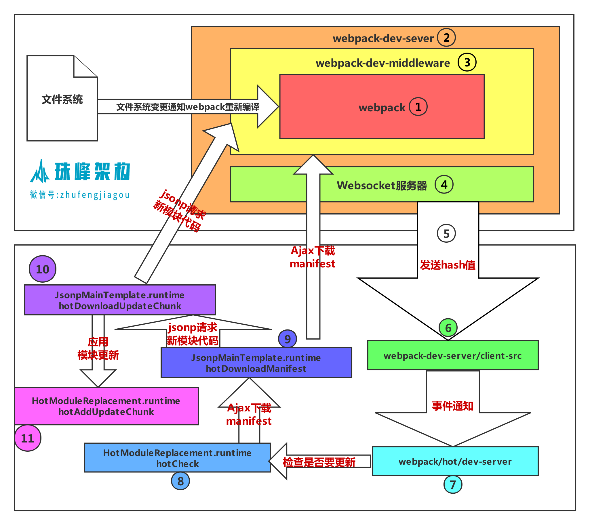

# 【8. webpack】
[webpack](https://www.webpackjs.com/guides/production/)
## 什么是WebPack
- 代码转换：TypeScript 编译成 JavaScript、SCSS 编译成 CSS 等。
- 文件优化：压缩 JavaScript、CSS、HTML 代码，压缩合并图片等。
- 代码分割：提取多个页面的公共代码、提取首屏不需要执行部分的代码让其异步加载。
- 模块合并：在采用模块化的项目里会有很多个模块和文件，需要构建功能把模块分类合并成一个文件。
- 自动刷新：监听本地源代码的变化，自动重新构建、刷新浏览器。
- 代码校验：在代码被提交到仓库前需要校验代码是否符合规范，以及单元测试是否通过。
- 自动发布：更新完代码后，自动构建出线上发布代码并传输给发布系统。
## 初始化项目
```md
mkdir webpack-test
cd webpack-test
npm init -y
```
## 快速上手
### 核心概念
- Entry：入口，Webpack 执行构建的第一步将从 Entry 开始，可抽象成输入。
- Module：模块，在 Webpack 里一切皆模块，一个模块对应着一个文件。Webpack 会从配置的 Entry 开始递归找出所有依赖的模块。
- Chunk：代码块，一个 Chunk 由多个模块组合而成，用于代码合并与分割。
- Loader：模块转换器，用于把模块原内容按照需求转换成新内容。
- Plugin：扩展插件，在 Webpack 构建流程中的特定时机注入扩展逻辑来改变构建结果或做你想要的事情。
- Output：输出结果，在 Webpack 经过一系列处理并得出最终想要的代码后输出结果。
- context: context即是项目打包的路径上下文，如果指定了context,那么entry和output都是相对于上下文路径的，contex必须是一个绝对路径
> Webpack 启动后会从Entry里配置的Module开始递归解析 Entry 依赖的所有 Module。 每找到一个 Module， 就会根据配置的Loader去找出对应的转换规则，对 Module 进行转换后，再解析出当前 Module 依赖的 Module。 这些模块会以 Entry 为单位进行分组，一个 Entry 和其所有依赖的 Module 被分到一个组也就是一个 Chunk。最后 Webpack 会把所有 Chunk 转换成文件输出。 在整个流程中 Webpack 会在恰当的时机执行 Plugin 里定义的逻辑。
### 配置webpack
```md
npm install webpack webpack-cli -D
```
#### 创建src目录
```md
mkdir src
```
#### 创建dist目录
```md
mkdir dist
```
#### 打包命令
- npx webpack
    - 会执行nodemodules/bin/webpack.cmd
    - 默认将src/index.js打包成dist/main.js
- npx webpack --mode development
    - 默认production，压缩代码，development，不压缩代码
:::tip
- 配置文件只能用commonjs规范（基于node）
- 修改配置文件名字，需要指定配置文件：`npx webpack --config new-name`
:::
:::tip
```json
// package.json
{
    "scripts":{
        "dev":"webpack-dev-server",
        "build":"webpack",
        "start":"yarn run dev"
    }
}
```
:::
:::tip 打包原理
从index.js按require顺序一层一层打包（commonjs规范）
:::
#### 创建基本配置文件
- entry：配置入口文件的地址
- output：配置出口文件的地址
- module：配置模块,主要用来配置不同文件的加载器
- plugins：配置插件
- devServer：配置开发服务器
```js
// webpack.config.js
module.exports={
    entry: './src/index.js',// entry:['react','react-dom'],
    output: {
        path: path.resolve(__dirname,'dist'),// 输出的目录只能是绝对路径
        filename:'bundle.js'
    },
    module: {},
    plugins: [],
    devServer: {}
}
```
#### 创建index.html文件
```html
<body>
    <div id="root"></div>
    <script src="bundle.js"></script>
</body>
```
#### mode
- development
- production
- none

common
```js
//parent chunk中解决了的chunk会被删除
optimization.removeAvailableModules:true
//删除空的chunks
optimization.removeEmptyChunks:true
//合并重复的chunk
optimization.mergeDuplicateChunks:true
```
development
```js
//调试
devtool:eval
//缓存模块, 避免在未更改时重建它们。
cache:true
//缓存已解决的依赖项, 避免重新解析它们。
module.unsafeCache:true
//在 bundle 中引入「所包含模块信息」的相关注释
output.pathinfo:true
//在可能的情况下确定每个模块的导出,被用于其他优化或代码生成。
optimization.providedExports:true
//找到chunk中共享的模块,取出来生成单独的chunk
optimization.splitChunks:true
//为 webpack 运行时代码创建单独的chunk
optimization.runtimeChunk:true
//编译错误时不写入到输出
optimization.noEmitOnErrors:true
//给模块有意义的名称代替ids
optimization.namedModules:true
//给模chunk有意义的名称代替ids
optimization.namedChunks:true
```
production
```js
//性能相关配置
performance:{hints:"error"....}
//某些chunk的子chunk已一种方式被确定和标记,这些子chunks在加载更大的块时不必加载
optimization.flagIncludedChunks:true
//给经常使用的ids更短的值
optimization.occurrenceOrder:true
//确定每个模块下被使用的导出
optimization.usedExports:true
//识别package.json or rules sideEffects 标志
optimization.sideEffects:true
//尝试查找模块图中可以安全连接到单个模块中的段。- -
optimization.concatenateModules:true
//使用uglify-js压缩代码
optimization.minimize:true
```
## 配置开发服务器
- npx webpack-dev-server
    - 启动开发服务（修改后可及时更新页面。打包的页面存在内存里，并不打包出来）
- 内置了express
```md
yarn add webpack-dev-server -D
```
```js
devServer:{
    contentBase:path.resolve(__dirname,'dist'),
    host:'localhost',
    compress:true,
    port:8080
}
// 开发服务的配置
devServer:{
    // 静态文件放置目录(产出的文件写到内存里，而不是写在硬盘上。为了速度快。)
    contentBase:'./dist',
    // 端口号
    port:3000,
    // 进度条
    progress:true,
    // 服务开启gzip压缩
    compress:'true',
    
},
```

## 支持加载css文件
- module/rules中使用不同的loader把不同的文件转成JS
### 参数
- test：匹配处理文件的扩展名的正则表达式
- use：loader名称，就是你要使用模块的名称
- include/exclude:手动指定必须处理的文件夹或屏蔽不需要处理的文件夹
- query：为loaders提供额外的设置选项
- enforce:'pre',确保在最之前校验
                
### loader三种写法
```js
// loader
{
    test: /\.css/,
    loader:['style-loader','css-loader']
}
// use
{
    test: /\.css/,
    use:['style-loader','css-loader']
}
// use+loader
{
    test: /\.css/,
    include: path.resolve(__dirname,'src'),
    exclude: /node_modules/,
    use: [{
        loader: 'style-loader'
    },'css-loader']
}
```

## 插件
模块代码转换的工作由 loader 来处理。除此之外的其他任何工作都可以交由 plugin 来完成
### 自动生成html
自动生成HTML文件，并在里面引入生成的资源，chunksSortMode可以控制引入顺序,写多个不同的入口文件即生成多个html
```md
yarn add html-webpack-plugin -D
```
```js
entry:{
    index:'./src/index.js',  // chunk名字 index
    common:'./src/common.js' //chunk名字 common
},
// 自动生成一个html文件来引用入口文件
new HtmlWebpackPlugin({
    filename:'index.html',// 产出后的文件名
    template:'./public/index.html',// 指定模板文件
    hash:true,// 为了避免缓存，可以在产出的资源后面添加hash值
    minify:{// 对html文件进行压缩
        removeAttributeQuotes:true,// 去掉属性的双引号
        removeTagWhitespace:true,
    },
    chunks:['common','index'],// 引入的入口文件
    chunksSortMode:'manual'//对引入代码块进行排序的模式 手工
})
```
## 支持图片
### 手动添加图片
```md
yarn add file-loader url-loader -D
```
- file-loader(图片拷贝),可用url-loader代替，url-loader会调用file-loader
    - file-loader 解决CSS等文件中的引入图片路径问题
    - url-loader 当图片小于limit的时候会把图片BASE64编码，大于limit参数的时候还是使用file-loader 进行拷贝
    - options
        - limit
        - publicPath:'https://www.baidu.com',打包时只在图片地址前加域名
### JS中引入图片
```js
import logo from '../images/logo.png';
let img=new Image();
img.src=logo;
document.body.appendChild(img);
```
```js
{
  test:/\.(jpg|png|bmp|gif|svg)/,
    use:[
    {
       loader:'url-loader',
       options:{limit:10*1024}// 小于10k就转base64
    }
  ]
}
```
### CSS中引入图片
```css
.logo{
    width:355px;
    height:133px;
    background-image: url(./images/logo.png);
    background-size: cover;
}
```
```html
<div class="logo"></div>
```
### 在HTML中使用图片
- 
    - 用html-withimg-loader解决
```js

{
    test:/\.html/,
    use:'html-withimg-loader'
}
```

- 注意：webpack打包后，会优先运行dist文件夹下的代码，而不是src本地的。


## 分离CSS
- CSS不再内嵌在js中，而单独提取出来Link加载`mini-css-extract-plugin`
    - filename 打包入口文件
    - chunkFilename 用来打包import('module')方法中引入的模块
### 安装
```md
npm install --save-dev mini-css-extract-plugin
```
### import和class CSS
```js
new MiniCssExtractPlugin({
    filename: '[name].css',
    chunkFilename:'[id].css'// 异步加载的时候用的
}),
{
    test: /\.css/,
    include: path.resolve(__dirname,'src'),
    exclude: /node_modules/,
    use: [{
        loader: MiniCssExtractPlugin.loader
    },'css-loader']
}
```
### 内联CSS
```md
cnpm i html-inline-css-webpack-plugin -D
```
```js
const HtmlInlineCssWebpackPlugin= require('html-inline-css-webpack-plugin').default;

plugins:[
  new HtmlInlineCssWebpackPlugin()
]
```

### 压缩JS和CSS
- `optimize-css-assets-webpack-plugin`压缩CSS
- 用`terser-webpack-plugin`替换掉`uglifyjs-webpack-plugin`解决uglifyjs不支持es6语法问题,压缩JS
```md
npm i uglifyjs-webpack-plugin terser-webpack-plugin optimize-css-assets-webpack-plugin -D
```
```js
const UglifyJsPlugin = require("uglifyjs-webpack-plugin");
const TerserPlugin = require('terser-webpack-plugin');
const OptimizeCSSAssetsPlugin = require("optimize-css-assets-webpack-plugin");
module.exports = {
    mode: 'production',
    optimization: {
        minimizer: [
           /*  new UglifyJsPlugin({
                cache: true,//启动缓存
                parallel: true,//启动并行压缩
                //如果为true的话，可以获得sourcemap
                sourceMap: true // set to true if you want JS source maps
            }), */
            new TerserPlugin({
                 parallel: true,//开启多进程并行压缩
                 cache: true// 开启缓存
            }),
            //压缩css资源的
            new OptimizeCSSAssetsPlugin({
                 assetNameRegExp:/\.css$/g,// 指定要压缩的模块的正则
                 //cssnano是PostCSS的CSS优化和分解插件。cssnano采用格式很好的CSS，并通过许多优化，以确保最终的生产环境尽可能小。
                 cssProcessor:require('cssnano')
            })
        ]
    },
```
### css和image存放单独目录
```js
{
   loader:MiniCssExtractPlugin.loader,
    options:{
        publicPath:'/'
    } 
}
```
```js
output: {
        path: path.resolve(__dirname,'dist'),
        filename: 'bundle.js',
+        publicPath:'/'// 根路径 在浏览器访问的时候要以什么路径访问 /xx.jpg
    },
{
  test:/\.(jpg|jpeg|png|bmp|gif|svg|ttf|woff|woff2|eot)/,
  use:[
        {
          loader:'url-loader',
          options:{
              limit: 4096,
               name:'[name]',
+              outputPath: 'images',// 把图片拷贝到images目录下
+              publicPath:'/images'// 重写此处的publicPath
          }
        }
     ]
}

plugins: [
        new MiniCssExtractPlugin({
-            filename: 'css/[name].css',
+            chunkFilename:'css/[id].css'
+            filename:'css/[name].[hash].[chunkhash].[contenthash].css',
        }),

```
### 文件指纹

:::tip hash、chunkhash、contenthash
- hash:修改任何项目文件都会导致所有文件的hash发生改变
- chunkhash:chunk里有文件变了就变
- contenthash:本模块变了才会变
:::

|占位符名称	|含义|
|:---|:---|
|ext|	资源后缀名|
|name|	文件名称|
|path|	文件的相对路径|
|folder|	文件所在的文件夹|
|contenthash|	文件的内容hash,默认是md5生成|
|hash|	文件内容的hash,默认是md5生成|
|emoji|	一个随机的指代文件内容的emoj|

## 编译less和sass
安装
```md
npm i less less-loader -D
npm i node-sass sass-loader -D
```
编写样式
```css
@color:red;
.less-container{
    color:@color;
}
```
```css
$color:green;
.sass-container{
    color:$color;
}
```
```js
{
    test: /\.less/,
    include: path.resolve(__dirname,'src'),
    exclude: /node_modules/,
    use: [{
        loader: MiniCssExtractPlugin.loader,
    },'css-loader','less-loader']
},
{
    test: /\.scss/,
    include: path.resolve(__dirname,'src'),
    exclude: /node_modules/,
    use: [{
        loader: MiniCssExtractPlugin.loader,
    },'css-loader','sass-loader']
},
```

## 处理CSS3属性前缀
- Trident内核：主要代表为IE浏览器, 前缀为-ms
- Gecko内核：主要代表为Firefox, 前缀为-moz
- Presto内核：主要代表为Opera, 前缀为-o
- Webkit内核：产要代表为Chrome和Safari, 前缀为-webkit
[caniuse](https://caniuse.com/)
```md
npm i postcss-loader autoprefixer --save-dev
```
```css
::placeholder {
    color: red;
}
```
postcss.config.js
```js
module.exports={
    plugins:[require('autoprefixer')]
}
```
webpack.config.js
```js
{
   test:/\.css$/,
   use:[MiniCssExtractPlugin.loader,'css-loader','postcss-loader'],
   include:path.join(__dirname,'./src'),
   exclude:/node_modules/
}
```

## 转义ES6/ES7/JSX
Babel其实是一个编译JavaScript的平台,可以把ES6/ES7,React的JSX转义为ES5
### 安装
```md
npm i babel-loader @babel/core @babel/preset-env  @babel/preset-react  --save-dev
npm i @babel/plugin-proposal-decorators @babel/plugin-proposal-class-properties --save-dev
```
### decorator
```js
//Option+Shift+A
function readonly(target,key,discriptor) {
    discriptor.writable=false;
}

class Person{
    @readonly PI=3.14;
}
let p1=new Person();
p1.PI=3.15;
console.log(p1)
```
jsconfig.json
```json
{
    "compilerOptions": {
        "experimentalDecorators": true
    }
}
```
### 配置
webpack.config.js
```js
            {
                test:/\.js/,
                // 代码规范校验,顺序不能变，校验配置文件根目录建.eslintrc.json，可在eslint官网demo生成
                use:['babel-loader','eslint-loader'],
                exclude:/node_modules/
            },
            // 代码规范校验
            {
                test:/\.js$/,
                use:'eslint-loader',
                // 确保在最之前校验
                enforce:'pre',
            },
```
```js
{
    test: /\.jsx?$/,
    use: {
        loader: 'babel-loader',
        options:{
         "presets": ["@babel/preset-env"],// 预设配置
         "plugins": [
            ["@babel/plugin-proposal-decorators", { "legacy": true }],// 装饰器(放类属性上面)
            ["@babel/plugin-proposal-class-properties", { "loose" : true }]// 类属性
         ]
        }
    },
    include: path.join(__dirname,'src'),
    exclude:/node_modules/
}
```
.babelrc
    - 相当于webpack.config.js中的babel-loader
```json
{
  "presets": ["@babel/preset-env"],
  "plugins": [
    ["@babel/plugin-proposal-decorators", { "legacy": true }],
    ["@babel/plugin-proposal-class-properties", { "loose" : true }]
  ]
}
```
### babel runtime
- babel 在每个文件都插入了辅助代码，使代码体积过大
- babel 对一些公共方法使用了非常小的辅助代码，比如 _extend
- 默认情况下会被添加到每一个需要它的文件中。你可以引入 @babel/runtime 作为一个独立模块，来避免重复引入
```md
npm install --save-dev @babel/plugin-transform-runtime
npm install --save @babel/runtime
```
.babelrc
```json
{
  "presets": ["@babel/preset-env"],
  "plugins": [
    ["@babel/plugin-proposal-decorators", { "legacy": true }],
    ["@babel/plugin-proposal-class-properties", { "loose" : true }]
    [
         "@babel/plugin-transform-runtime",
         {
            "corejs": false,
            "helpers": true,
            "regenerator": true,
            "useESModules": true
        }
    ]
  ]
}
```
> webpack打包的时候，会自动优化重复引入公共方法的问题

### ESLint校验代码格式规范
- 建议制定团队的eslint规范
- 基于eslint:recommend配置进行改进
- 发现代码错误的规则尽可能多的开启
- 帮助保持团队的代码风格统一而不要限制开发体验
```js

```
```md
npm install eslint eslint-loader babel-eslint --save-dev
```
.eslintrc.js
```js
module.exports = {
    // 是否是根配置
    root: true,
    //指定解析器选项
    parserOptions: {
        sourceType: 'module',
        ecmaVersion: 2015
    },
    //指定脚本的运行环境
    env: {
        browser: true,// window document
        node:true// require process
    },
    // 启用的规则及其各自的错误级别
    rules: {
        "indent": ["error", 4],//缩进风格
        "quotes": ["error", "double"],//引号类型 
        "semi": ["error", "always"],//关闭语句强制分号结尾
        "no-console": "error",//禁止使用console
        "arrow-parens": 0 //箭头函数用小括号括起来
    }
}
```
webpack.config.js
```js
module: {
    //配置加载规则
    rules: [
        {
            test: /\.js$/,
            loader: 'eslint-loader',
            enforce: "pre",
            include: [path.resolve(__dirname, 'src')], // 指定检查的目录
            options: { fix: true } // 这里的配置项参数将会被传递到 eslint 的 CLIEngine   
        },
```
### 继承airbnb
```md
cnpm i eslint-config-airbnb eslint-loader eslint eslint-plugin-import eslint-plugin-react eslint-plugin-react-hooks and eslint-plugin-jsx-a11y --save-dev
```
.eslintrc.js
```js
module.exports = {
    "parser":"babel-eslint",
    "extends":"airbnb",
    "rules":{
        "semi":"error",
        "no-console":"off",
        "linebreak-style":"off",
        "eol-last":"off"
        //"indent":["error",2]
    },
    "env":{
        "browser":true,
        "node":true
    }
}
```
### 引入字体
- OTF—— opentype 苹果机与PC机都能很好应用的兼容字体
- 配置loader
```js
{
 test:/\.(woff|ttf|eot|svg|otf)$/,
     use:{
        //url内部内置了file-loader
        loader:'url-loader',
        options:{//如果要加载的图片大小小于10K的话，就把这张图片转成base64编码内嵌到html网页中去
            limit:10*1024
        }
   }
 },
```
使用字体
```css
@font-face {
    src: url('./fonts/HabanoST.otf') format('truetype');
    font-family: 'HabanoST';
}
.welcome {
    font-size:100px;
    font-family: 'HabanoST';
}
```
## 如何调试打包后的代码
- sourcemap是为了解决开发代码与实际运行代码不一致时帮助我们debug到原始开发代码的技术
- webpack通过配置可以自动给我们source maps文件，map文件是一种对应编译文件和源文件的方法
```js
// 源码映射（方便调试错误。源代码和打包后的代码做映射，本地调试生产环境时使用。一般生产环境不使用）
// 单独创建一个源码映射文件,并且指定错误的行和列
devtool:'source-map',
// 在打包文件中加入源码，不分离，文件会很大
devtool:'eval-source-map',
// 不分离，不定位到列(很少用)
devtool:'cheap-module-source-map',
// 分离，不定位到列(较多)
devtool:'cheap-module-eval-source-map'
```
|类型|	含义|
|:---|:---|
|source-map|	原始代码 最好的sourcemap质量有完整的结果，但是会很慢|
|eval-source-map|	原始代码 同样道理，但是最高的质量和最低的性能|
|cheap-module-eval-source-map|	原始代码（只有行内） 同样道理，但是更高的质量和更低的性能|
|cheap-eval-source-map|	转换代码（行内） 每个模块被eval执行，并且sourcemap作为eval的一个dataurl|
|eval|	生成代码 每个模块都被eval执行，并且存在@sourceURL,带eval的构建模式能cache SourceMap|
|cheap-source-map|	转换代码（行内） 生成的sourcemap没有列映射，从loaders生成的sourcemap没有被使用|
|cheap-module-source-map|	原始代码（只有行内） 与上面一样除了每行特点的从loader中进行映射|


## 打包第三方类库
### 直接引入
```js
import _ from 'lodash';
alert(_.join(['a','b','c'],'@'));
```
### 插件引入
- webpack配置ProvidePlugin后，在使用时将不再需要import和require进行引入，直接使用即可
- _ 函数会自动添加到当前模块的上下文，无需显示声明
```js
+ new webpack.ProvidePlugin({
+     _:'lodash'
+ })
```
> 没有全局的$函数，所以导入依赖全局变量的插件依旧会失败
### expose-loader
不需要任何其他的插件配合，只要将下面的代码添加到所有的loader之前
```js
require("expose-loader?libraryName!./file.js");
```
```js
{ 
  test: require.resolve("jquery"), 
  loader: "expose-loader?jQuery"
}
```
```js
require("expose-loader?$!jquery");
```

### externals
如果我们想引用一个库，但是又不想让webpack打包，并且又不影响我们在程序中以CMD、AMD或者window/global全局等方式进行使用，那就可以通过配置externals
```js
 const jQuery = require("jquery");
 import jQuery from 'jquery';
```
```html
<script src="https://cdn.bootcss.com/jquery/3.4.1/jquery.js"></script>
```
```js
+ externals: {
+         jquery: 'jQuery'//如果要在浏览器中运行，那么不用添加什么前缀，默认设置就是global
+ },
module: {
```
### 外链CDN
html-webpack-externals-plugin 
```js
+ const htmlWebpackExternalsPlugin= require('html-webpack-externals-plugin');
new htmlWebpackExternalsPlugin({
            externals:[
                {
                    module:'react',
                    entry:'https://cdn.bootcss.com/react/15.6.1/react.js',
                    global:'React'
                },
                 {
                    module:'react-dom',
                    entry:'https://cdn.bootcss.com/react/15.6.1/react-dom.js',
                    global:'ReactDOM'
                }
            ]
}) 
```

## watch
当代码发生修改后可以自动重新编译
```js
module.exports = {
    //默认false,也就是不开启
    watch:true,
    //只有开启监听模式时，watchOptions才有意义
    watchOptions:{
        //默认为空，不监听的文件或者文件夹，支持正则匹配
        ignored:/node_modules/,
        //监听到变化发生后会等300ms再去执行，默认300ms
        aggregateTimeout:300,
        //判断文件是否发生变化是通过不停的询问文件系统指定议是有变化实现的，默认每秒问1000次
        poll:1000
    }
}
```
## 添加商标
```js
+ new webpack.BannerPlugin('by yy'),
```
## 拷贝静态文件
有时项目中没有引用的文件也需要打包到目标目录
```md
npm i copy-webpack-plugin --save-dev
```
```js
new CopyWebpackPlugin([{
  from: path.resolve(__dirname,'src/assets'),//静态资源目录源地址
  to:path.resolve(__dirname,'dist/assets') //目标地址，相对于output的path目录
}])
```
## 打包前先清空输出目录
[clean-webpack-plugin](https://www.npmjs.com/package/clean-webpack-plugin)
```md
npm i  clean-webpack-plugin -D
```
```js
const CleanWebpackPlugin = require('clean-webpack-plugin');
plugins:[
new CleanWebpackPlugin({cleanOnceBeforeBuildPatterns: ['**/*', '!static-files*'],})
]
```
## 服务器代理
### 不修改路径
请求到 /api/users 现在会被代理到请求 http://localhost:3000/api/users。
```js
devServer:{
    proxy: {
        "/api": 'http://localhost:3000'
    }
}
```
### 修改路径
```js
proxy: {
    "/api": {
       target: 'http://localhost:3000',
       pathRewrite:{"^/api":""}        
    }            
}
```
### before after
before 在 webpack-dev-server 静态资源中间件处理之前，可以用于拦截部分请求返回特定内容，或者实现简单的数据 mock。
```js
before(app){
  app.get('/api/users', function(req, res) { 
    res.json([{id:1,name:'zfpx1'}])
  })
}
```
### webpack-dev-middleware
在 Express 中提供 webpack-dev-server 静态服务能力的一个中间件
```md
npm install webpack-dev-middleware --save-dev
```
```js
const express = require('express');
const app = express();
const webpack = require('webpack');
const webpackDevMiddleware = require('webpack-dev-middleware');
const webpackOptions = require('./webpack.config');
webpackOptions.mode = 'development';
const compiler = webpack(webpackOptions);
app.use(webpackDevMiddleware(compiler, {}));
app.listen(3000);
```
- 使用webpack-dev-middleware的好处是可以在既有的 Express 代码基础上快速添加 webpack-dev-server 的功能，同时利用 Express 来根据需要添加更多的功能，如 mock 服务、代理 API 请求等
## resolve解析
解析查找路径require()
> console.log(module.paths)可以打印出查找文件顺序
### extensions
指定extension之后可以不用在require或是import的时候加文件扩展名,会依次尝试添加扩展名进行匹配
```js
resolve: {
  extensions: [".js",".jsx",".json",".css"]
},
```
### alias
配置别名可以加快webpack查找模块的速度

- 每当引入bootstrap模块的时候，它会直接引入bootstrap,而不需要从node_modules文件夹中按模块的查找规则查找
```js
const bootstrap = path.resolve(__dirname,'node_modules/_bootstrap@3.3.7@bootstrap/dist/css/bootstrap.css');
resolve: {
+    alias:{
+        "bootstrap":bootstrap
+    }
},
```

### modules
- 对于直接声明依赖名的模块（如 react ），webpack 会类似 Node.js 一样进行路径搜索，搜索node_modules目录
- 这个目录就是使用resolve.modules字段进行配置的 默认配置
```js
resolve: {
    modules: ['node_modules'],
}
```
如果可以确定项目内所有的第三方依赖模块都是在项目根目录下的 node_modules 中的话
```js
resolve: {
modules: [path.resolve(__dirname, 'node_modules')],
}
```
### mainFields
默认情况下package.json 文件则按照文件中 main 字段的文件名来查找文件
```js
resolve: {
  // 配置 target === "web" 或者 target === "webworker" 时 mainFields 默认值是：
  mainFields: ['browser', 'module', 'main'],
  // target 的值为其他时，mainFields 默认值为：
  mainFields: ["module", "main"],
}
```
### mainFiles
当目录下没有 package.json 文件时，我们说会默认使用目录下的 index.js 这个文件，其实这个也是可以配置的
```js
resolve: {
  mainFiles: ['index'], // 你可以添加其他默认使用的文件名
},
```
### resolveLoader
`resolve.resolveLoader`用于配置解析 loader 时的 resolve 配置,默认的配置
```js
module.exports = {
  resolveLoader: {
    modules: [ 'node_modules' ],
    extensions: [ '.js', '.json' ],
    mainFields: [ 'loader', 'main' ]
  }
};
```
## noParse
- `module.noParse` 字段，可以用于配置哪些模块文件的内容不需要进行解析
- 不需要解析依赖（即无依赖） 的第三方大型类库等，可以通过这个字段来配置，以提高整体的构建速度
```js
module.exports = {
    // ...
    module: {
        noParse: /jquery|lodash/, // 正则表达式
        // 或者使用函数
        noParse(content) {
            return /jquery|lodash/.test(content)
        },
    }
}...
```
> 使用 noParse 进行忽略的模块文件中不能使用 import、require、define 等导入机制
## DefinePlugin
`DefinePlugin`创建一些在编译时可以配置的全局常量
```js
new webpack.DefinePlugin({
    PRODUCTION: JSON.stringify(true),
    VERSION: "1",
    EXPRESSION: "1+2",
    COPYRIGHT: {
        AUTHOR: JSON.stringify("殷艺")
    }
})
```
```js
console.log(PRODUCTION);
console.log(VERSION);
console.log(EXPRESSION);
console.log(COPYRIGHT);
```
- 如果配置的值是字符串，那么整个字符串会被当成代码片段来执行，其结果作为最终变量的值
- 如果配置的值不是字符串，也不是一个对象字面量，那么该值会被转为一个字符串，如 true，最后的结果是 'true'
- 如果配置的是一个对象字面量，那么该对象的所有 key 会以同样的方式去定义
- JSON.stringify(true) 的结果是 'true'
## IgnorePlugin
`IgnorePlugin`用于忽略某些特定的模块，让 webpack 不把这些指定的模块打包进去
```js
import moment from  'moment';
console.log(moment);
```
```js
new webpack.IgnorePlugin(/^\.\/locale/,/moment$/)
```
- 第一个是匹配引入模块路径的正则表达式
- 第二个是匹配模块的对应上下文，即所在目录名
## 区分环境变量
- 日常的前端开发工作中，一般都会有两套构建环境
- 一套开发时使用，构建结果用于本地开发调试，不进行代码压缩，打印 debug 信息，包含 sourcemap 文件
- 一套构建后的结果是直接应用于线上的，即代码都是压缩后，运行时不打印 debug 信息，静态文件不包括 sourcemap
- webpack 4.x 版本引入了 mode 的概念
- 当你指定使用 production mode 时，默认会启用各种性能优化的功能，包括构建结果优化以及 webpack 运行性能优化
- 而如果是 development mode 的话，则会开启 debug 工具，运行时打印详细的错误信息，以及更加快速的增量编译构建
### 环境差异
- 生产环境
    - 可能需要分离 CSS 成单独的文件，以便多个页面共享同一个 CSS 文件
    - 需要压缩 HTML/CSS/JS 代码
    - 需要压缩图片
- 开发环境
    - 需要生成 sourcemap 文件
    - 需要打印 debug 信息
    - 需要 live reload 或者 hot reload 的功能...
### 获取mode参数
env/argv.mode获取--env的值
```js
npm install --save-dev optimize-css-assets-webpack-plugin
```
```js
  "scripts": {
+    "dev": "webpack-dev-server --env=development --open"
  },
```
```js
const TerserWebpackPlugin = require('terser-webpack-plugin');
const OptimizeCssAssetsPlugin = require('optimize-css-assets-webpack-plugin');
module.exports=(env,argv) => ({
    optimization: {
        
        minimizer: argv.mode == 'production'?[            
            new TerserWebpackPlugin({
               parallel:true,//开启多进程并行压缩
               cache:true//开启缓存
      }),
            new OptimizeCssAssetsWebpackPlugin({})
        ]:[]
    }
})
```
### 封装log方法
webpack 时传递的 mode 参数，是可以在我们的应用代码运行时，通过 process.env.NODE_ENV 这个变量获取
```js
export default function log(...args) {
    if (process.env.NODE_ENV == 'development') {
        console.log.apply(console,args);
    }
}
```
### 拆分配置
可以把 webpack 的配置按照不同的环境拆分成多个文件，运行时直接根据环境变量加载对应的配置即可
- webpack.base.js：基础部分，即多个文件中共享的配置
- webpack.development.js：开发环境使用的配置
- webpack.production.js：生产环境使用的配置
- webpack.test.js：测试环境使用的配置...
- [webpack-merge](https://github.com/survivejs/webpack-merge)
```js
const { smart } = require('webpack-merge')
const webpack = require('webpack')
const base = require('./webpack.base.js')
module.exports = smart(base, {
  module: {
    rules: [],
  }
})
```

## 对图片进行压缩和优化
`image-webpack-loader`可以帮助我们对图片进行压缩和优化
```md
npm install image-webpack-loader --save-dev
```
```js
{
          test: /\.(png|svg|gif|jpe?g|ico)$/,
          use: [
            'file-loader',
+           {
+             loader: 'image-webpack-loader',
+             options: {
+               mozjpeg: {
+                 progressive: true,
+                 quality: 65
+               },
+               optipng: {
+                 enabled: false,
+               },
+               pngquant: {
+                 quality: '65-90',
+                 speed: 4
+               },
+               gifsicle: {
+                 interlaced: false,
+               },
+               webp: {
+                 quality: 75
+               }
+             }
+           },
          ]
        }
```
## 多入口MPA
- 有时候我们的页面可以不止一个HTML页面，会有多个页面，所以就需要多入口
- 每一次页面跳转的时候，后台服务器都会返回一个新的html文档，这种类型的网站就是多页网站，也叫多页应用
:::tip glob
实现文件匹配功能。使用特殊字符来匹配想要的文件。
:::
```js
const path=require('path');
const HtmlWebpackPlugin=require('html-webpack-plugin');
const htmlWebpackPlugins=[];
const glob = require('glob');
const entry={};
const entryFiles = glob.sync('./src/**/index.js');// 返回所有src下index.js的路径
entryFiles.forEach((entryFile,index)=>{
    let entryName = path.dirname(entryFile).split('/').pop();
    entry[entryName]=entryFile;
    htmlWebpackPlugins.push(new HtmlWebpackPlugin({
        template:`./src/${entryName}/index.html`,
        filename:`${entryName}/index.html`,
        chunks:[entryName],
        inject:true,
        minify:{
            html5:true,
            collapseWhitespace:true,
            preserveLineBreaks:false,
            minifyCSS:true,
            minifyJS:true,
            removeComments:false
        }
    }));
}); 

module.exports={
    entry,
    plugins: [
        //other plugins
        ...htmlWebpackPlugins
    ]
}
```
## 日志优化
- 日志太多太少都不美观
- 可以修改`stats`
|预设|	替代|	描述|
|:---|:---|:---|
|errors-only|	none|	只在错误时输出|
|minial|	none|	发生错误和新的编译时输出|
|none|	false|	没有输出|
|normal|	true|	标准输出|
|verbose|	none|	全部输出|
### friendly-errors-webpack-plugin
```md
cnpm i friendly-errors-webpack-plugin
```
```js
+ stats:'verbose',
  plugins:[
+   new FriendlyErrorsWebpackPlugin()
  ]
```
> 编译完成后可以通过echo $?获取错误码，0为成功，非0为失败
## 错误上报
- compiler在每次构建结束之后会触发done的hook
- process.exit可以主动处理报错
```js
function(){
  this.hooks.done.tap('done',stats=>{
    if(stats.compilation.errors&&stats.compilation.errors.length){
            console.log('build errorerrorerrorerrorerror');
           process.exit(1);
    }
  });
},
```
## 日志输出
```json
 "scripts": {
    "build": "webpack",
+    "build:stats":"webpack --json > stats.json",
    "dev": "webpack-dev-server --open"
  },
```
```js
const webpack = require('webpack');
const config = require('./webpack.config.js');
webpack(config,(err,stats)=>{
  if(err){
    console.log(err);
  }
  if(stats.hasErrors()){
    return console.error(stats.toString("errors-only"));
  }
  console.log(stats);
});
```
## 费时分析
```js
const SpeedMeasureWebpackPlugin = require('speed-measure-webpack-plugin');
const smw = new SpeedMeasureWebpackPlugin();
module.exports =smw.wrap({
});
```
## webpack-bundle-analyzer
是一个webpack的插件，需要配合webpack和webpack-cli一起使用。这个插件的功能是生成代码分析报告，帮助提升代码质量和网站性能
```js
cnpm i webpack-bundle-analyzer -D
```
```js
const BundleAnalyzerPlugin = require('webpack-bundle-analyzer').BundleAnalyzerPlugin
module.exports={
  plugins: [
    new BundleAnalyzerPlugin()  // 使用默认配置
    // 默认配置的具体配置项
    // new BundleAnalyzerPlugin({
    //   analyzerMode: 'server',
    //   analyzerHost: '127.0.0.1',
    //   analyzerPort: '8888',
    //   reportFilename: 'report.html',
    //   defaultSizes: 'parsed',
    //   openAnalyzer: true,
    //   generateStatsFile: false,
    //   statsFilename: 'stats.json',
    //   statsOptions: null,
    //   excludeAssets: null,
    //   logLevel: info
    // })
  ]
}
```
```json
{
 "scripts": {
    "dev": "webpack --config webpack.dev.js --progress"
  }
}
```
webpack.config.js
```js
const BundleAnalyzerPlugin = require('webpack-bundle-analyzer').BundleAnalyzerPlugin
module.exports={
  plugins: [
    new BundleAnalyzerPlugin({
      analyzerMode: 'disabled', // 不启动展示打包报告的http服务器
      generateStatsFile: true, // 是否生成stats.json文件
    }),
  ]
}
```
```json
{
 "scripts": {
    "generateAnalyzFile": "webpack --profile --json > stats.json", // 生成分析文件
    "analyz": "webpack-bundle-analyzer --port 8888 ./dist/stats.json" // 启动展示打包报告的http服务器
  }
}
```
```md
npm run generateAnalyzFile
npm run analyz
```
## polyfill
Polyfill 是一块代码（通常是 Web 上的 JavaScript），用来为旧浏览器提供它没有原生支持的较新的功能。
### babel-polyfill
- babel-polyfill是React官方推荐，缺点是体积大
- babel-polyfill用正确的姿势安装之后，引用方式有三种：

1. require("babel-polyfill");
2. import "babel-polyfill";
3. module.exports = { 　　entry: ["babel-polyfill", "./app/js"] };
### polyfill-service
- 自动化的 JavaScript Polyfill 服务
- Polyfill.io 通过分析请求头信息中的 UserAgent 实现自动加载浏览器所需的 polyfills
```html
<script src="https://polyfill.io/v3/polyfill.min.js"></script>
```
## libraryTarget 和 library
当用 Webpack 去构建一个可以被其他模块导入使用的库时需要用到它们
- output.library 配置导出库的名称
- output.libraryExport 配置要导出的模块中哪些子模块需要被导出。 它只有在 output.libraryTarget 被设置成 commonjs 或者 commonjs2 时使用才有意义
- output.libraryTarget 配置以何种方式导出库,是字符串的枚举类型，支持以下配置
|libraryTarget|	使用者的引入方式|	使用者提供给被使用者的模块的方式|
|:---|:---|:---|
|var|	只能以script标签的形式引入我们的库|	只能以全局变量的形式提供这些被依赖的模块|
|commonjs|	只能按照commonjs的规范引入我们的库|	被依赖模块需要按照commonjs规范引入|
|amd|	只能按amd规范引入|	被依赖的模块需要按照amd规范引入|
|umd|	|可以用script、commonjs、amd引入|	按对应的方式引入|

## 打包库和组件
- webpack还可以用来打包JS库
- 实现数学运算功能加减乘除的库
- 打包成压缩版和非压缩版
- 支持AMD/CJS/ESM方式导入
### 编写库文件
webpack.config.js
```js
const path = require('path');
const webpack = require('webpack');
const HtmlWebpackPlugin = require('html-webpack-plugin');
const TerserPlugin = require('terser-webpack-plugin');
module.exports = {
  mode:'none',
  entry:{
      'zhufengmath':'./src/index.js',
      'zhufengmath.min':'./src/index.js'
  },
  optimization:{
      minimize:true,
      minimizer:[
          //可以支持es6,默认的使用TerserPlugin
          new TerserPlugin({
              include:/\.min\.js/
          })
      ]
  },
  output:{
      filename:'[name].js',
      library:'zhufengmath',//配置导出库的名称
      libraryExport:'default',
      libraryTarget:'umd'//配置以何种方式导出库,是字符串的枚举类型
  }
};
```
package.json
```json
"scripts": {
+    "build": "webpack",
```
index.js
```js
//zhufengnodejs zhufengjiagou
if(process.env.NODE_ENV == 'production'){
    module.exports = require('./dist/zhufengmath.min.js');
}else{
    module.exports = require('./dist/zhufengmath.js');
}
```
src/index.js
```js
export function add(a,b){
  return a+b;
}
export function minus(a,b){
  return a-b;
}
export function multiply(a,b){
  return a*b;
}
export function divide(a,b){
  return a/b;
}
export default {
  add,minus,multiply,divide
}
```

## px 自动转成rem
- 使用px2rem-loader
- 页面渲染时计算根元素的font-size值
[lib-flexible](https://github.com/amfe/lib-flexible)
```md
cnpm i px2rem-loader lib-flexible -D
```
index.html
```html
<head>
    <meta charset="UTF-8">
    <meta name="viewport" content="width=device-width, initial-scale=1.0">
    <meta http-equiv="X-UA-Compatible" content="ie=edge">
    <title>主页</title>
    <script>
      let docEle = document.documentElement;
      function setRemUnit () {
        //750/10=75   375/10=37.5
        docEle.style.fontSize = docEle.clientWidth / 10 + 'px';
      }
      setRemUnit();
      window.addEventListener('resize', setRemUnit);
    </script>
</head>
<body>
    <div id="root"></div>
</body>
```
reset.css
```css
*{
    padding: 0;
    margin: 0;
}
#root{
    width:375px;
    height:375px;
    border:1px solid red;
    box-sizing: border-box;
}
```
webpack.config.js
```js
{
        test:/\.css$/,//如果要require或import的文件是css的文件的话
        //从右向左处理CSS文件,loader是一个函数
        use:[{
                loader:MiniCssExtractPlugin.loader,
                options:{
                     publicPath: (resourcePath, context) => {
                        return '/';
                    }
                    //publicPath: '/'
                }
        },{
                    loader:'css-loader',
                    options:{
                        //Enables/Disables or setups number of loaders applied before CSS loader.
                        importLoaders:0
                    }
                },{
                    loader:'postcss-loader',
                    options:{
                        plugins:[
                            require('autoprefixer')
                        ]
                    }
                },{
+                    loader:'px2rem-loader',
+                    options:{
+                        remUnit:75,
+                        remPrecesion:8
+                    }
+                }]
+            },
```


## optimize
### purgecss-webpack-plugin
- purgecss
- 可以去除未使用的 css，一般与 glob、glob-all 配合使用
- 必须和mini-css-extract-plugin配合使用
- paths路径是绝对路径
```md
npm i -D purgecss-webpack-plugin glob
```
webpack.config.js
```js
+ const glob = require('glob');
+ const PurgecssPlugin = require('purgecss-webpack-plugin');

module.exports = {
  mode: 'development',
  plugins: [
+    new PurgecssPlugin({
+      paths: glob.sync(`${path.join(__dirname, 'src')}/**/*`, 
+      {nodir: true}), // 不匹配目录，只匹配文件
+    }),
  ],
}
```
### DLL
.dll为后缀的文件称为动态链接库，在一个动态链接库中可以包含给其他模块调用的函数和数据

- 把基础模块独立出来打包到单独的动态连接库里
- 当需要导入的模块在动态连接库里的时候，模块不能再次被打包，而是去动态连接库里获取
#### 定义DLL
- DllPlugin插件： 用于打包出一个个动态连接库
- DllReferencePlugin: 在配置文件中引入DllPlugin插件打包好的动态连接库
```js
const path=require('path');
const DllPlugin=require('webpack/lib/DllPlugin');
module.exports={
    entry: {
        react:['react','react-dom']
    },// 把 React 相关模块的放到一个单独的动态链接库
    output: {
        path: path.resolve(__dirname,'dist'),// 输出的文件都放到 dist 目录下
        filename: '[name].dll.js',//输出的动态链接库的文件名称，[name] 代表当前动态链接库的名称
        library: '_dll_[name]',//存放动态链接库的全局变量名称,例如对应 react 来说就是 _dll_react
    },
    plugins: [
        new DllPlugin({
            // 动态链接库的全局变量名称，需要和 output.library 中保持一致
            // 该字段的值也就是输出的 manifest.json 文件 中 name 字段的值
            // 例如 react.manifest.json 中就有 "name": "_dll_react"
            name: '_dll_[name]',
            // 描述动态链接库的 manifest.json 文件输出时的文件名称
            path: path.join(__dirname, 'dist', '[name].manifest.json')
        })
    ]
}
```
#### 使用动态链接库文件
```js
const DllReferencePlugin = require('webpack/lib/DllReferencePlugin')
plugins: [
  new DllReferencePlugin({
    manifest:require('./dist/react.manifest.json')
  })
]
```
```md
webpack --config webpack.config.js --mode development
```
#### html中使用
```html
<script src="react.dll.js"></script>
<script src="bundle.js"></script>
```

### 多进程线程处理
#### HappyPack
- 构建需要解析和处理文件,文件读写和计算密集型的操作太多后速度会很慢
- Node.js 之上的 Webpack 是单线程模型
- happypack 就能让Webpack把任务分解给多个子线程去并发的执行，子线程处理完后再把结果发送给主进程。
- 进程里包括线程
- 进程里包括一条主线程，node中可以开子进程，一般不会超过当前cpu核数(i5 4 i7 8，默认开4个)
- 较复杂的项目才使用，小项目打包时间会变慢
```md
npm i happypack@next -D
```
```js
const HappyPack = require('happypack');
rules: [
    {
        test: /\.js$/,
        // 把对 .js 文件的处理转交给 id 为 babel 的 HappyPack 实例
        use: ['happypack/loader?id=babel'],
        exclude: path.resolve(__dirname, 'node_modules'),
    },
    {
        test: /\.css$/,
        // 把对 .css 文件的处理转交给 id 为 css 的 HappyPack 实例
        use: ['happypack/loader?id=css']
    }
]
new Happypack({
    //ID是标识符的意思，ID用来代理当前的happypack是用来处理一类特定的文件的
    id: 'js',
    use: [{
        loader: 'babel-loader',
        //options=query都是向插件传递参数的
        options: {
            presets: [["@babel/preset-env", { modules: false }], "@babel/preset-react"],
            plugins: [
                ["@babel/plugin-proposal-decorators", { "legacy": true }],
                ["@babel/plugin-proposal-class-properties", { "loose": true }],
            ]
        }
    }]
}),
new Happypack({
    //ID是标识符的意思，ID用来代理当前的happypack是用来处理一类特定的文件的
    id: 'css',
    use: [MiniCssExtractPlugin.loader, 'css-loader', 'postcss-loader'],
    threads: 4,//你要开启多少个子进程去处理这一类型的文件
    verbose: true//是否要输出详细的日志 verbose
})
```
#### thread-loader
把这个 loader 放置在其他 loader 之前， 放置在这个 loader 之后的 loader 就会在一个单独的 worker 池(worker pool)中运行
- thread-loader
```js
{
        test: /\.(js)$/,
        use: [
           {
            loader:'thread-loader',
            options:{
              workers:3
            }
          }, 
          {
            loader:'babel-loader'
          }
        ],
      }
```
#### webpack-parallel-uglify-plugin
- webpack默认提供了UglifyJS插件来压缩JS代码，但是它使用的是单线程压缩代码，也就是说多个js文件需要被压缩，它需要一个个文件进行压缩。所以说在正式环境打包压缩代码速度非常慢(因为压缩JS代码需要先把代码解析成用Object抽象表示的AST语法树，再去应用各种规则分析和处理AST，导致这个过程耗时非常大)。
- 当webpack有多个JS文件需要输出和压缩时候，原来会使用UglifyJS去一个个压缩并且输出，但是ParallelUglifyPlugin插件则会开启多个子进程，把对多个文件压缩的工作分别给多个子进程去完成，但是每个子进程还是通过UglifyJS去压缩代码。无非就是变成了并行处理该压缩了，并行处理多个子任务，效率会更加的提高
- webpack-parallel-uglify-plugin
```md
cnpm i webpack-parallel-uglify-plugin -D
```
```js
let ParallelUglifyPlugin = require('webpack-parallel-uglify-plugin');
new ParallelUglifyPlugin({});
```
### CDN
- CDN 又叫内容分发网络，通过把资源部署到世界各地，用户在访问时按照就近原则从离用户最近的服务器获取资源，从而加速资源的获取速度。
- HTML文件不缓存，放在自己的服务器上，关闭自己服务器的缓存，静态资源的URL变成指向CDN服务器的地址
- 静态的JavaScript、CSS、图片等文件开启CDN和缓存，并且文件名带上HASH值
- 为了并行加载不阻塞，把不同的静态资源分配到不同的CDN服务器上
#### 使用缓存
- 由于 CDN 服务一般都会给资源开启很长时间的缓存，例如用户从 CDN 上获取到了 index.html 这个文件后， 即使之后的发布操作把 index.html 文件给重新覆盖了，但是用户在很长一段时间内还是运行的之前的版本，这会新的导致发布不能立即生效 解决办法
- 针对 HTML 文件：不开启缓存，把 HTML 放到自己的服务器上，而不是 CDN 服务上，同时关闭自己服务器上的缓存。自己的服务器只提供 HTML 文件和数据接口。
- 针对静态的 JavaScript、CSS、图片等文件：开启 CDN 和缓存，上传到 CDN 服务上去，同时给每个文件名带上由文件内容算出的 Hash 值
- 带上 Hash 值的原因是文件名会随着文件内容而变化，只要文件发生变化其对应的 URL 就会变化，它就会被重新下载，无论缓存时间有多长。
- 启用CDN之后 相对路径，都变成了绝对的指向 CDN 服务的 URL 地址
#### 域名限制
- 同一时刻针对同一个域名的资源并行请求是有限制
- 可以把这些静态资源分散到不同的 CDN 服务上去
- 多个域名后会增加域名解析时间
- 可以通过在 HTML HEAD 标签中 加入<link rel="dns-prefetch" href="http://img.zhufengpeixun.cn">去预解析域名，以降低域名解析带来的延迟
#### 接入CDN
要给网站接入 CDN，需要把网页的静态资源上传到 CDN 服务上去，在服务这些静态资源的时候需要通过 CDN 服务提供的 URL 地址去访问
```json
    output: {
        path: path.resolve(__dirname, 'dist'),
+        filename: '[name]_[hash:8].js',
+        publicPath: 'http://img.zhufengpeixun.cn'
    },
```
### Tree Shaking
- 一个模块可以有多个方法，只要其中某个方法使用到了，则整个文件都会被打到bundle里面去，tree shaking就是只把用到的方法打入bundle,没用到的方法会uglify阶段擦除掉
- 原理是利用es6模块的特点,只能作为模块顶层语句出现,import的模块名只能是字符串常量
#### 开启
- webpack默认支持，在.babelrc里设置module:false即可在production mode下默认开启
- The 'modules' option must be one of 'false' to indicate no module processing .babelrc
- 还要注意把devtool设置为null
```json
    "presets":[
+        ["@babel/preset-env",{"modules":true}],//转译 ES6 ES7
        "@babel/preset-react"//转译JSX语法
    ],
```
#### 没有导入和使用
functions.js
```js
function func1(){
  return 'func1';
}
function func2(){
     return 'func2';
}
export {
  func1,
  func2
}
import {func2} from './functions';
var result2 = func2();
console.log(result2);
```
#### 代码不会被执行，不可到达
```js
if(false){
 console.log('false')
}
```
#### 代码执行的结果不会被用到
```js
import {func2} from './functions';
func2();
```
#### 代码中只会影响死变量，只写不读
```js
var aabbcc='aabbcc';
aabbcc='eeffgg';
```
### 代码分割
#### 代码分割的意义
- 对于大的Web应用来讲，将所有的代码都放在一个文件中显然是不够有效的，特别是当你的某些代码块是在某些特殊的时候才会被用到。
- webpack有一个功能就是将你的代码库分割成chunks语块，当代码运行到需要它们的时候再进行加载。 适用的场景
- 抽离相同代码到一个共享块
- 脚本懒加载，使得初始下载的代码更小
#### Entry Points
Entry Points：入口文件设置的时候可以配置
这种方法的问题
如果入口 chunks 之间包含重复的模块(lodash)，那些重复模块都会被引入到各个 bundle 中
不够灵活，并且不能将核心应用程序逻辑进行动态拆分代码
```js
entry: {
        index: "./src/index.js",
        login: "./src/login.js"
}
```
#### 动态导入和懒加载
- 用户当前需要用什么功能就只加载这个功能对应的代码，也就是所谓的按需加载 在给单页应用做按需加载优化时，一般采用以下原则：
    - 对网站功能进行划分，每一类一个chunk
    - 对于首次打开页面需要的功能直接加载，尽快展示给用户,某些依赖大量代码的功能点可以按需加载
    - 被分割出去的代码需要一个按需加载的时机
- import() 
  - 动态加载js,草案中的方法，现在需要引用插件`@babel/plugin-syntax-dynamic-import`才能使用
```md
cnpm i @babel/plugin-syntax-dynamic-import --save-dev
```
```js
btn.addEventListener('click',function(){
    import('./use').then(data=>{
        // use.js中的代码挂载default上。
        console.log(data.default)
    })
})
```
```js
rules:[
    // 需要在webpack中配置动态加载js的插件
    {
        test:/\.js$/,
        use:[{
            loader:'babel-loader',
            options:{
                presets:[],
                plugins:[
                    "@babel/plugin-syntax-dynamic-import"
                ]
            }
        }]
    }
]
```
```html
<button id="clickBtn">点我</button>
```
- 原理
  - JSONP加载js
  - 第一步 window['webpackJsonp'].push=webpackJsonpCallback;把json的回调挂载window上
  - 第二步 调用__webpack_require__.e 告诉内部加载0.js，并且返回的是一个promise
  - 第三步 在modules的属性上把当前的0.js放在modules的对象内
  - 第四步 __webpack_require__.bind(null,'./src/use.js')引用这个use.js。__webpack_exports__[\"default\"]='hello' exports.default='hello';
  - 第五步 下一次then就可以拿到这个exports对象 通过.default拿到异步加载的结果

#### 提取公共代码
- 为什么需要提取公共代码
    大网站有多个页面，每个页面由于采用相同技术栈和样式代码，会包含很多公共代码，如果都包含进来会有问题
    - 相同的资源被重复的加载，浪费用户的流量和服务器的成本；
    - 每个页面需要加载的资源太大，导致网页首屏加载缓慢，影响用户体验。
    - 如果能把公共代码抽离成单独文件进行加载能进行优化，可以减少网络传输流量，降低服务器成本
- 如何提取
    - 基础类库，方便长期缓存
    - 页面之间的公用代码
    - 各个页面单独生成文件
    - common-chunk-and-vendor-chunk
    - webpack将会基于以下条件自动分割代码块:
        - 新的代码块被共享或者来自node_modules文件夹
        - 新的代码块大于30kb(在min+giz之前)
        - 按需加载代码块的请求数量应该<=5
        - 页面初始化时加载代码块的请求数量应该<=3
默认配置
```js
  optimization: {
    // 这里放着优化的内容
    minimizer: [
      // 表示放优化的插件
      new TerserWebpackPlugin({
               parallel:true,//开启多进程并行压缩
               cache:true//开启缓存
      }),
      new OptimizeCssAssetsWebpackPlugin({
        assetNameRegExp: /\.css$/g, // 指定要压缩的模块的正则
        // cssnano是PostCSS的CSS优化和分解插件。cssnano采用格式很好的CSS，并通过许多优化，以确保最终的生产环境尽可能小。
        cssProcessor: require('cssnano'),
      }),
    ],
    splitChunks: {
        chunks: "all",//默认作用于异步chunk，值为all/initial/async
        minSize: 30000,  //默认值是30kb,代码块的最小尺寸
        minChunks: 1,  //被多少模块共享,在分割之前模块的被引用次数
        maxAsyncRequests: 5,  //按需加载最大并行请求数量
        maxInitialRequests: 3,  //一个入口的最大并行请求数量
        name: true,  //打包后的名称，默认是chunk的名字通过分隔符（默认是～）分隔开，如vendor~
        automaticNameDelimiter:'~',//默认webpack将会使用入口名和代码块的名称生成命名,比如 'vendors~main.js'
        cacheGroups: { //设置缓存组用来抽取满足不同规则的chunk,下面以生成common为例
            vendors: {
              chunks: "initial",
              name: 'vendors',  //可以通过'name'配置项来控制切割之后代码块的命名,给多个分割之后的代码块分配相同的名称,所有的vendor 模块被放进一个共享的代码块中,不过这会导致多余的代码被下载所以并不推荐
              test: /node_modules/,//条件
              priority: -10 ///优先级，一个chunk很可能满足多个缓存组，会被抽取到优先级高的缓存组中,为了能够让自定义缓存组有更高的优先级(默认0),默认缓存组的priority属性为负值.
            },
             commons: {
              chunks: "initial",
              name: 'commons',
              minSize: 0,//最小提取字节数
              minChunks: 1, //最少被几个chunk引用
              priority: -20,
              reuseExistingChunk: true//    如果该chunk中引用了已经被抽取的chunk，直接引用该chunk，不会重复打包代码
            }
      }
    },
    //runtime包含:在模块交互时,连接模块所需的加载和解析逻辑。包括浏览器中的已加载模块的连接，以及懒加载模块的执行逻辑.
    //设置optimization.runtimeChunk=true ,将每一个入口添加一个只包含runtime的额外代码块.然而设置值为single,只会为所有生成的代码块创建一个共享的runtime文件.runtime:连接模块化应用程序的所有代码.
    runtimeChunk:{
        name:'manifest'
    }
  },
```
- 提取公共代码
pageA.js
```js
import utils1 from './utils1';
import utils2 from './utils2';
import $ from 'jquery';
console.log(utils1,utils2,$);
pageB.js

import utils1 from './utils1';
import utils2 from './utils2';
import $ from 'jquery';
console.log(utils1,utils2,$);;
pageC.js

import utils3 from './utils3';
import utils1 from './utils1';
import $ from 'jquery';
console.log(utils1,utils3,$);

    entry: {
        pageA: './src/pageA',
        pageB: './src/pageB',
        pageC: './src/pageC'
    },
    output: {
        path: path.resolve(__dirname,'dist'),
        filename: '[name].js'
    },
  plugins:[
       new HtmlWebpackPlugin({
            template: './src/index.html',
            filename: 'pageA.html',
            chunks: ['pageA'],
            minify: {
                removeAttributeQuotes: true
            }
        }),
        new HtmlWebpackPlugin({
            template: './src/index.html',
            filename: 'pageB.html',
            chunks: ['pageB'],
            minify: {
                removeAttributeQuotes: true
            }
        }),


        new HtmlWebpackPlugin({
            template: './src/index.html',
            filename: 'pageC.html',
            chunks: ['pageC'],
            minify: {
                removeAttributeQuotes: true
            }
        })
    ]
```


### 开启 Scope Hoisting
- Scope Hoisting 可以让 Webpack 打包出来的代码文件更小、运行的更快， 它又译作 "作用域提升"，是在 Webpack3 中新推出的功能。
- 初webpack转换后的模块会包裹上一层函数,import会转换成require
- 代码体积更小，因为函数申明语句会产生大量代码
- 代码在运行时因为创建的函数作用域更少了，内存开销也随之变小
- 大量作用域包裹代码会导致体积增大
- 运行时创建的函数作用域变多，内存开销增大
- scope hoisting的原理是将所有的模块按照引用顺序放在一个函数作用域里，然后适当地重命名一些变量以防止命名冲突
- 这个功能在mode为production下默认开启,开发环境要用 webpack.optimize.ModuleConcatenationPlugin插件
- 也要使用ES6 Module,CJS不支持
#### 开发环境插件配置
```js
module.exports = {
  resolve: {
    // 针对 Npm 中的第三方模块优先采用 jsnext:main 中指向的 ES6 模块化语法的文件
    mainFields: ['jsnext:main', 'browser', 'main']
  },
  plugins: [
    // 开启 Scope Hoisting
    new webpack.optimize.ModuleConcatenationPlugin(),
  ],
};
```
#### 代码
hello.js
```js
export default 'Hello';
```
index.js
```js
import str from './hello.js';
console.log(str);
```
输出的结果main.js
```js
"./src/index.js":
(function(module, __webpack_exports__, __webpack_require__) {
__webpack_require__.r(__webpack_exports__);
var hello = ('hello');
console.log(hello);
 })
 ```
函数由两个变成了一个，hello.js 中定义的内容被直接注入到了 main.js 中
### 用 HMR 提高开发效率
- HMR 全称是 Hot Module Replacement，即模块热替换
- Hot Reloading，当代码变更时通知浏览器刷新页面，以避免频繁手动刷新浏览器页面
- HMR 可以理解为增强版的 Hot Reloading，但不用整个页面刷新，而是局部替换掉部分模块代码并且使其生效
- 原理是当一个源码发生变化时，只重新编译发生变化的模块，再用新输出的模块替换掉浏览器中对应的老模块
- 模块热替换技术的优势有：
    - 实时预览反应更快，等待时间更短。
    - 不刷新浏览器能保留当前网页的运行状态，例如在使用 Redux 来管理数据的应用中搭配模块热替换能做到代码更新时Redux 中的数据还保持不变
#### 模块热替换原理
模块热替换的原理和自动刷新原理类似，都需要往要开发的网页中注入一个代理客户端用于连接 DevServer 和网页

-  配置
    - 配置hot
    - DevServer 默认不会开启模块热替换模式，要开启该模式，只需在启动时带上参数 --hot
```js
const webpack = require('webpack');
module.exports = {
entry:{
  main:'./src/index.js',
},
plugins: [
  // 该插件的作用就是实现模块热替换，实际上当启动时带上 `--hot` 参数，会注入该插件，生成 .hot-update.json 文件。
  new webpack.NamedModulesPlugin(), // 用于启动 HMR 时可以显示模块的相对路径
  new webpack.HotModuleReplacementPlugin(), // Hot Module Replacement 的插件
],
devServer:{
  // 告诉 DevServer 要开启模块热替换模式
  hot: true,      
}  
};
```
> 在启动 Webpack 时带上参数 --hot 其实就是自动为你完成以上配置。
#### 代码实现
```js
import React from 'react';
import { render } from 'react-dom';
import App from './App';
import './index.css';
render(<App/>, document.getElementById('root'));

// 只有当开启了模块热替换时 module.hot 才存在
if (module.hot) {
  // accept 函数的第一个参数指出当前文件接受哪些子模块的替换，这里表示只接受 ./AppComponent 这个子模块
  // 第2个参数用于在新的子模块加载完毕后需要执行的逻辑
  module.hot.accept(['./App'], () => {
    // 新的 AppComponent 加载成功后重新执行下组建渲染逻辑
    let App=require('./App').default;  
    render(<App/>, document.getElementById('root'));
  });
}
```
- module.hot 是当开启模块热替换后注入到全局的 API，用于控制模块热替换的逻辑
- 当子模块发生更新时，更新事件会一层层往上传递，也就是从App.js文件传递到index.js文件， 直到有某层的文件接受了当前变化的模块
- 如果事件一直往上抛到最外层都没有文件接受它，就会直接刷新网页
- .css文件都会触发模块热替换的原因是style-loader会注入用于接受 CSS 的代码
#### react-hot-loader
- react-hot-loader
- webpack-dev-server 已经是热加载，为何还要在 react 项目还要安装 react-hot-loader 呢？
- 其实这两者的更新是有区别的，webpack-dev-server 的热加载是开发人员修改了代码，代码经过打包，重新刷新了整个页面。而 react-hot-loader 不会刷新整个页面，它只替换了修改的代码，做到了页面的局部刷新。但它需要依赖 webpack 的 HotModuleReplacement 热加载插件
```md
npm install --save-dev react-hot-loader
```
Add react-hot-loader/babel to your .babelrc:
```json
// .babelrc
{
  "plugins": ["react-hot-loader/babel"]
}
// App.js
import { hot } from 'react-hot-loader/root';
const App = () => <div>Hello World!</div>;
export default hot(App);
```

【面试】
- dev-server的原理是什么？描述一下它的具体流程


## chunk的分割规则
1. node_moduels单独抽到vendors
2. import单独取到单独的chunk里


## webpack源码解析

### webpack执行流程
| 类型        | 事件名称                     | 类型              | 参数                                  | 说明                                                         |
| :---------- | :--------------------------- | :---------------- | :------------------------------------ | :----------------------------------------------------------- |
| compiler    | environment                  | SyncHook          | 空                                    | 设置node环境变量             |
| compiler    | afterEnvironment             | SyncHook          | 空                                    | 设置环境变量完成                                         |
| compiler    | entryOption                  | SyncBailHook      | context,entry                         | 解析入口文件                        |
| compiler    | afterPlugins                 | SyncHook          | compiler                              | 挂在插件结束                                         |
| compiler    | afterResolvers               | SyncHook          | compiler                              | 在路径解析器初始化后触发   核心作用是将路径转换成绝对路径                                       |
| compiler    | beforeRun                    | AsyncSeriesHook   | compiler                              | 开始正式编译之前                                             |
| compiler    | run                          | AsyncSeriesHook   | compiler                              | 开始编译之后，读取 records 之前；监听模式触发watch-run       |
| compiler    | normalModuleFactory          | SyncHook          | normalModuleFactory                   | NormalModuleFactory 创建普通模块工厂之后                                 |
| compiler    | contextModuleFactory         | SyncHook          | contextModulefactory                  | ContextModuleFactory 创建上下文模块工厂(类似external)之后                                |
| compiler    | beforeCompile                | AsyncSeriesHook   | params                                | 开始编译前，compilation 实例化需要的参数创建完毕之后                     |
| compiler    | compile                      | SyncHook          | params                                | 编译，一次 compilation 编译创建之前                                |
| compiler    | thisCompilation              | SyncHook          | compilation,params                    | 开始启动编译，触发 compilation 事件之前执行                                |
| compiler    | compilation                  | SyncHook          | compilation,params                    | 开始创建compilation对象                                    |
| compiler    | make                         | AsyncParallelHook | compilation                           | 最核心代码，从入口文件开始编译                      |
| compilation | addEntry                     | SyncHook          | entry,name                            | 添加入口                                                     |
| compilation | buildModule                  | SyncHook          | module                                | 编译入口模块                                     |
| compilation | normalModuleLoader           | SyncHook          | loaderContext,module                  | 拿到普通模块 loader，真正（一个接一个地）加载模块图（graph）中所有模块的函数 |
| compilation | succeedModule                | SyncHook          | module                                | 成功加载模块                                           |
| compilation | succeedEntry                 | SyncHook          | entry,name,module                     |  入口解析成功                                                            |
| compilation | finishModules                | AsyncSeriesHook   | modules                               | 完成模块编译                                         |
| compilation | seal                         | SyncHook          |                                       | 封包，一旦封包后，不能再向内添加新的模块了                     |
| compilation | optimizeDependenciesBasic    | SyncBailHook      | modules                               | 优化基本依赖项                                    |
| compilation | optimizeDependencies         | SyncBailHook      | modules                               | 优化依赖项                                          |
| compilation | optimizeDependenciesAdvanced | SyncBailHook      | modules                               | 优化高级依赖项                                       |
| compilation | afterOptimizeDependencies    | SyncHook          | modules                               | 优化结束                                                     |
| compilation | beforeChunks                 | SyncHook          |                                       | 生成chunk                                              |
| compilation | dependencyReference          | SyncWaterfallHook | dependencyReference,dependency,module | 依赖引用                                                     |
| compilation | log                          | SyncBailHook      | origin,logEntry                       | 打印日志                                                     |
| compilation | afterChunks                  | SyncHook          | chunks                                | 完成生成chunk                                               |
| compilation | optimize                     | SyncHook          |                                       | 优化阶段开始时触发                                           |
| compilation | optimizeModulesBasic         | SyncBailHook      | modules                               | 基础模块的优化                                               |
| compilation | optimizeModules              | SyncBailHook      | modules                               | 模块的优化                                                   |
| compilation | optimizeModulesAdvanced      | SyncBailHook      | modules                               | 高级模块的优化                                               |
| compilation | afterOptimizeModules         | SyncHook          | modules                               | 模块优化完成                                          |
| compilation | optimizeChunksBasic          | SyncBailHook      | chunks,chunkGroups                    | 基础chunk优化                                                |
| compilation | optimizeChunks               | SyncBailHook      | chunks,chunkGroups                    | 优化 chunks                                                  |
| compilation | optimizeChunksAdvanced       | SyncBailHook      | chunks,chunkGroups                    | 高级chunk优化                                                |
| compilation | afterOptimizeChunks          | SyncHook          | chunks,chunkGroups                    | chunk 优化完成之后触发                                       |
| compilation | optimizeTree                 | AsyncSeriesHook   | chunks,modules                        | 异步优化依赖树                                               |
| compilation | afterOptimizeTree            | SyncHook          | chunks,modules                        | 异步优化依赖树完成时                                         |
| compilation | optimizeChunkModulesBasic    | SyncBailHook      | chunks,modules                        | 基础优化单个chunk中的 modules 开始                           |
| compilation | optimizeChunkModules         | SyncBailHook      | chunks,modules                        | 优化单个chunk中的 modules 开始                               |
| compilation | optimizeChunkModulesAdvanced | SyncBailHook      | chunks,modules                        | 高级优化单个chunk中的 modules 开始                           |
| compilation | afterOptimizeChunkModules    | SyncHook          | chunks,modules                        | 优化单个chunk中的 modules结束后                              |
| compilation | shouldRecord                 | SyncBailHook      |                                       | 是否应该记录stats文件                                                 |
| compilation | reviveModules                | SyncHook          | modules,records                       | 从 records 中恢复模块信息                                    |
| compilation | optimizeModuleOrder          | SyncHook          | modules                               | 将模块从最重要的到最不重要的进行排序                         |
| compilation | advancedOptimizeModuleOrder  | SyncHook          | modules                               | 高级将模块从最重要的到最不重要的进行排序                     |
| compilation | beforeModuleIds              | SyncHook          | modules                               | 处理 modulesId 之前                                          |
| compilation | moduleIds                    | SyncHook          | modules                               | 处理 modulesId                                               |
| compilation | optimizeModuleIds            | SyncHook          | modules                               | 优化 modulesId                                               |
| compilation | afterOptimizeModuleIds       | SyncHook          | modules                               | 优化 modulesId之后                                           |
| compilation | reviveChunks                 | SyncHook          | chunks,records                        | 从 records 中恢复 chunk 信息                                 |
| compilation | optimizeChunkOrder           | SyncHook          | chunks                                | 将 chunk 从最重要的到最不重要的进行排序                      |
| compilation | beforeChunkIds               | SyncHook          | chunks                                | chunk id 优化之前触发                                        |
| compilation | optimizeChunkIds             | SyncHook          | chunks                                | chunk id 优化开始触发                                        |
| compilation | afterOptimizeChunkIds        | SyncHook          | chunks                                | chunk id 优化结束触发                                        |
| compilation | recordModules                | SyncHook          | modules,records                       | 将模块信息存储到 records                                     |
| compilation | recordChunks                 | SyncHook          | chunks,records                        | 将 chunk 信息存储到 records                                  |
| compilation | beforeHash                   | SyncHook          |                                       | 生成hash前                                   |
| compilation | chunkHash                    | SyncHook          | chunk,chunkHash                       | 生成chunkHash                                                |
| compilation | contentHash                  | SyncHook          | chunk                                 | 生成contentHash                                              |
| compilation | afterHash                    | SyncHook          |                                       | 生成hash后                                   |
| compilation | recordHash                   | SyncHook          | records                               | 记录hash到stats文件里                                                     |
| compilation | beforeModuleAssets           | SyncHook          |                                       | 在生成模块的资源之前                                         |
| compilation | shouldGenerateChunkAssets    | SyncBailHook      |                                       | 是否要生成chunk资源                                          |
| compilation | beforeChunkAssets            | SyncHook          |                                       | 在创建 chunk 资源（asset）之前                               |
| compilation | chunkAsset                   | SyncHook          | chunk,filename                        | 一个 chunk 中的一个资源被添加到编译中                        |
| compilation | additionalChunkAssets        | SyncHook          | chunks                                | 额外的资源                                        |
| compilation | record                       | SyncHook          | compilation,records                   | 将 compilation 相关信息存储到 records 中                     |
| compilation | additionalAssets             | AsyncSeriesHook   |                                       | 为编译（compilation）创建附加资源（asset）                   |
| compilation | optimizeChunkAssets          | AsyncSeriesHook   | compilation                           | 优化所有 chunk 资源（asset）                                 |
| compilation | afterOptimizeChunkAssets     | SyncHook          | chunks                                | chunk 资源（asset）已经被优化                                |
| compilation | optimizeAssets               | AsyncSeriesHook   | assets                                | 优化存储在 compilation.assets 中的所有资源（asset）          |
| compilation | afterOptimizeAssets          | SyncHook          | assets                                | 优化compilation.assets 中的所有资源（asset）之后             |
| compilation | needAdditionalSeal           | SyncBailHook      |                                       | 是否需要额外的seal                                           |
| compilation | afterSeal                    | AsyncSeriesHook   |                                       | 封装之后                                                     |
| compiler    | afterCompile                 | AsyncSeriesHook   | compilation                           | 完成编译和封存（seal）编译产出之后                           |
| compiler    | shouldEmit                   | SyncBailHook      | compilation                           | 询问是否要生成文件   |
| compiler    | emit                         | AsyncSeriesHook   | compilation                           | 生成文件                                   |
| compiler    | assetEmitted                 | AsyncSeriesHook   | file,content                          | 资源已经生成                                          |
| compiler    | afterEmit                    | AsyncSeriesHook   | compilation                           | 生成完成                                  |
| compilation | needAdditionalPass           | SyncBailHook      |                                       | 是否需要额外的                                               |
| compiler    | done                         | AsyncSeriesHook   | stats                                 | 整个编译完成                                          |


### stats对象
```json
{
  "errors": [],// 错误字符串 (error string) 的数组
  "warnings": [],//警告字符串 (warning string) 的数组
  "version": "4.39.3",// 用来编译的 webpack 的版本
  "hash": "3e945ec6b2c56d0b010e",//编译使用的 hash
  "time": 66, // 编译耗时 (ms)
  "builtAt": 1567225465347,//编译的时间
  "publicPath": "",//资源访问路径
  "outputPath": "C:\\vipdata\\vipproject\\webpack-source\\dist",//webpack输出目录
  "assetsByChunkName": {//用作映射的 chunk 的名称
    "lazy": "lazy.bundle.js",//chunk的名字叫lazy,lazy.bundle.js
    "main": "bundle.js"//chunk的名字叫main,打包出来了bundle.js
  },
  "assets": [//asset 对象 (asset objects) 的数组
    {
      "name": "bundle.js",//文件名
      "size": 9043,//大小
      "chunks": [//包含的代码块
        "main"
      ],
      "chunkNames": [//包含的代码块名称
        "main"
      ],
      "emitted": true//是否要生成
    },
    {
      "name": "lazy.bundle.js", // 输出的文件名
      "size": 336,// 文件的大小
      "chunks": [ // 这个 asset 包含的 chunk 的 id
        "lazy"
      ],
      "chunkNames": [// 这个 asset 包含的 chunk
        "lazy"
      ],
      "emitted": true  // 表示这个 asset 是否会让它输出到 output 目录
    }
  ],
  "filteredAssets": 0,// 过滤的资源
  "entrypoints": {// 入口点
    "main": {
      "chunks": [
        "main"
      ],
      "assets": [
        "bundle.js"
      ],
      "children": {},
      "childAssets": {}
    }
  },
  "namedChunkGroups": {
    "main": {
      "chunks": [
        "main"
      ],
      "assets": [
        "bundle.js"
      ],
      "children": {},
      "childAssets": {}
    },
    "lazy": {
      "chunks": [
        "lazy"
      ],
      "assets": [
        "lazy.bundle.js"
      ],
      "children": {},
      "childAssets": {}
    }
  },
  "chunks": [ //chunk 对象 (chunk objects) 的数组
    {
      "id": "lazy", // 这个 chunk 的id
      "rendered": true,// 表示这个 chunk 是否会参与进编译
      "initial": false, // 是否同步初始化
      "entry": false,// 表示这个 chunk 是否包含 webpack 的运行时
      "size": 24,//预估的模块大小
      "names": [// 包含在这个 chunk 内的 chunk 的名字的数组
        "lazy"
      ],
      "files": [
        "lazy.bundle.js"
      ],
      "hash": "d08a8b502d30324f81e1", // chunkHash
      "siblings": [],
      "parents": [// 父 chunk 的 ids
        "main"
      ],
      "children": [],
      "childrenByOrder": {},
      "modules": [
        {
          "id": "./src/lazy.js",
          "identifier": "C:\\vipdata\\vipproject\\webpack-source\\src\\lazy.js",
          "name": "./src/lazy.js",
          "index": 2,
          "index2": 2,
          "size": 24,
          "cacheable": true,
          "built": true,
          "optional": false,
          "prefetched": false,
          "chunks": [
            "lazy"
          ],
          "issuer": "C:\\vipdata\\vipproject\\webpack-source\\src\\index.js",
          "issuerId": "./src/index.js",
          "issuerName": "./src/index.js",
          "issuerPath": [
            {
              "id": "./src/index.js",
              "identifier": "C:\\vipdata\\vipproject\\webpack-source\\src\\index.js",
              "name": "./src/index.js",
              "profile": {
                "factory": 18,// 工厂创建模块的时间
                "building": 14// loader编译的时间
              }
            }
          ],
          "profile": {
            "factory": 4,
            "building": 2
          },
          "failed": false,
          "errors": 0,
          "warnings": 0,
          "assets": [],
          "reasons": [// 生成 assets 的原因
            {
              "moduleId": "./src/index.js",//模块的ID
              "moduleIdentifier": "C:\\vipdata\\vipproject\\webpack-source\\src\\index.js",//唯一标识
              "module": "./src/index.js",//模块
              "moduleName": "./src/index.js",//模块名称
              "type": "import()",//类型
              "userRequest": "./lazy",//用户请求方式
              "loc": "2:0-46"//在父模块中的位置
            }
          ],
          "providedExports": null,
          "optimizationBailout": [],
          "depth": 1,
          "source": "module.exports = 'lazy';"
        }
      ],
      "filteredModules": 0,
      "origins": [
        {
          "moduleId": "./src/index.js",// 模块的ID
          "module": "C:\\vipdata\\vipproject\\webpack-source\\src\\index.js",// 模块的位置
          "moduleIdentifier": "C:\\vipdata\\vipproject\\webpack-source\\src\\index.js",// 模块的地址
          "moduleName": "./src/index.js",//模块的相对地址
          "loc": "2:0-46",
          "request": "./lazy",
          "reasons": [] // 具体是哪行生成了这个chunk
        }
      ]
    },
    {
      "id": "main",
      "rendered": true,
      "initial": true,
      "entry": true,
      "size": 162,
      "names": [
        "main"
      ],
      "files": [
        "bundle.js"
      ],
      "hash": "263cadc0459e8470151b",
      "siblings": [],
      "parents": [],
      "children": [// 自己引用哪些chunk
        "lazy"
      ],
      "childrenByOrder": {}, // 引用的顺序
      "modules": [
        {
          "id": "./src/hello.js",
          "identifier": "C:\\vipdata\\vipproject\\webpack-source\\src\\hello.js",
          "name": "./src/hello.js",
          "index": 1,
          "index2": 0,
          "size": 25,
          "cacheable": true,
          "built": true,
          "optional": false,
          "prefetched": false,
          "chunks": [
            "main"
          ],
          "issuer": "C:\\vipdata\\vipproject\\webpack-source\\src\\index.js",
          "issuerId": "./src/index.js",
          "issuerName": "./src/index.js",
          "issuerPath": [
            {
              "id": "./src/index.js",
              "identifier": "C:\\vipdata\\vipproject\\webpack-source\\src\\index.js",
              "name": "./src/index.js",
              "profile": {
                "factory": 18,
                "building": 14
              }
            }
          ],
          "profile": {
            "factory": 4,
            "building": 2
          },
          "failed": false,
          "errors": 0,
          "warnings": 0,
          "assets": [],
          "reasons": [
            {
              "moduleId": "./src/index.js",
              "moduleIdentifier": "C:\\vipdata\\vipproject\\webpack-source\\src\\index.js",
              "module": "./src/index.js",
              "moduleName": "./src/index.js",
              "type": "cjs require",
              "userRequest": "./hello",
              "loc": "1:12-30"
            }
          ],
          "providedExports": null,
          "optimizationBailout": [],
          "depth": 1,
          "source": "module.exports = 'hello';"
        },
        {
          "id": "./src/index.js",
          "identifier": "C:\\vipdata\\vipproject\\webpack-source\\src\\index.js",
          "name": "./src/index.js",
          "index": 0,
          "index2": 1,
          "size": 137,
          "cacheable": true,
          "built": true,
          "optional": false,
          "prefetched": false,
          "chunks": [
            "main"
          ],
          "issuer": null,
          "issuerId": null,
          "issuerName": null,
          "issuerPath": null,
          "profile": {
            "factory": 18,
            "building": 14
          },
          "failed": false,
          "errors": 0,
          "warnings": 0,
          "assets": [],
          "reasons": [
            {
              "moduleId": null,
              "moduleIdentifier": null,
              "module": null,
              "moduleName": null,
              "type": "single entry",
              "userRequest": "./src/index.js",
              "loc": "main"
            }
          ],
          "providedExports": null,
          "optimizationBailout": [],
          "depth": 0,
          "source": "let hello = require('./hello');\r\nimport(/* webpackChunkName: \"lazy\" */'./lazy').then(result=>{\r\n    console.log(hello,resut.default)\r\n});"
        }
      ],
      "filteredModules": 0,
      "origins": [
        {
          "module": "",
          "moduleIdentifier": "",
          "moduleName": "",
          "loc": "main",
          "request": "./src/index.js",
          "reasons": []
        }
      ]
    }
  ],
  "modules": [// 模块对象 (module objects) 的数组
    {
      "id": "./src/hello.js",//模块ID
      "identifier": "C:\\vipdata\\vipproject\\webpack-source\\src\\hello.js",//webpack内部使用的唯一的标识
      "name": "./src/hello.js",// 实际文件的地址
      "index": 1,//索引
      "index2": 0,//索引
      "size": 25,// 预估模块的大小 (byte)
      "cacheable": true,// 表示这个模块是否会被缓存
      "built": true,// 表示这个模块会参与 Loaders , 解析, 并被编译
      "optional": false,// 每一个对这个模块的请求都会包裹在 `try... catch` 内
      "prefetched": false,// 表示这个模块是否会被 prefetched
      "chunks": [//此模块在哪个代码块内
        "main"
      ],
      "issuer": "C:\\vipdata\\vipproject\\webpack-source\\src\\index.js",//使用者唯一标识
      "issuerId": "./src/index.js",//使用者ID
      "issuerName": "./src/index.js",//使用者名称
      "issuerPath": [//使用者路径
        {
          "id": "./src/index.js",
          "identifier": "C:\\vipdata\\vipproject\\webpack-source\\src\\index.js",
          "name": "./src/index.js",
          "profile": { //这个模块特有的编译时间数据(ms)
            "factory": 18,// 解决依赖的时间
            "building": 14 // 载入和解析的时间
          }
        }
      ],
      "profile": {
        "factory": 4,// 解决依赖的时间
        "building": 2// 载入和解析的时间
      },
      "failed": false,//是否失败
      "errors": 0,// 处理模块时错误的数量
      "warnings": 0,// 处理模块时警告的数量
      "assets": [],//在哪个资源内
      "reasons": [
        {
          "moduleId": "./src/index.js",// 模块的 ID
          "moduleIdentifier": "C:\\vipdata\\vipproject\\webpack-source\\src\\index.js",// 模块的地址
          "module": "./src/index.js",// 所基于模块的相对地址 context
          "moduleName": "./src/index.js",
          "type": "cjs require",// 使用的请求的种类 (require或import)
          "userRequest": "./hello",// 用来 `import` 或者 `require` 的源字符串
          "loc": "1:12-30" // 导致这个被加入依赖图标的代码行数
        }
      ],
      "providedExports": null,//提供的导出对象
      "optimizationBailout": [],//失败时的优化
      "depth": 1,//模块深度
      "source": "module.exports = 'hello';"// 字符串化的输入
    },
    {
      "id": "./src/index.js",
      "identifier": "C:\\vipdata\\vipproject\\webpack-source\\src\\index.js",
      "name": "./src/index.js",
      "index": 0,
      "index2": 1,
      "size": 137,
      "cacheable": true,
      "built": true,
      "optional": false,
      "prefetched": false,
      "chunks": [
        "main"
      ],
      "issuer": null,
      "issuerId": null,
      "issuerName": null,
      "issuerPath": null,
      "profile": {
        "factory": 18,
        "building": 14
      },
      "failed": false,
      "errors": 0,
      "warnings": 0,
      "assets": [],
      "reasons": [
        {
          "moduleId": null,
          "moduleIdentifier": null,
          "module": null,
          "moduleName": null,
          "type": "single entry",
          "userRequest": "./src/index.js",
          "loc": "main"
        }
      ],
      "providedExports": null,
      "optimizationBailout": [],
      "depth": 0,
      "source": "let hello = require('./hello');\r\nimport(/* webpackChunkName: \"lazy\" */'./lazy').then(result=>{\r\n    console.log(hello,resut.default)\r\n});"
    },
    {
      "id": "./src/lazy.js",
      "identifier": "C:\\vipdata\\vipproject\\webpack-source\\src\\lazy.js",
      "name": "./src/lazy.js",
      "index": 2,
      "index2": 2,
      "size": 24,
      "cacheable": true,
      "built": true,
      "optional": false,
      "prefetched": false,
      "chunks": [
        "lazy"
      ],
      "issuer": "C:\\vipdata\\vipproject\\webpack-source\\src\\index.js",
      "issuerId": "./src/index.js",
      "issuerName": "./src/index.js",
      "issuerPath": [
        {
          "id": "./src/index.js",
          "identifier": "C:\\vipdata\\vipproject\\webpack-source\\src\\index.js",
          "name": "./src/index.js",
          "profile": {
            "factory": 18,
            "building": 14
          }
        }
      ],
      "profile": {
        "factory": 4,
        "building": 2
      },
      "failed": false,
      "errors": 0,
      "warnings": 0,
      "assets": [],
      "reasons": [
        {
          "moduleId": "./src/index.js",
          "moduleIdentifier": "C:\\vipdata\\vipproject\\webpack-source\\src\\index.js",
          "module": "./src/index.js",
          "moduleName": "./src/index.js",
          "type": "import()",
          "userRequest": "./lazy",
          "loc": "2:0-46"
        }
      ],
      "providedExports": null,
      "optimizationBailout": [],
      "depth": 1,
      "source": "module.exports = 'lazy';"
    }
  ],
  "filteredModules": 0,
  "logging": {
    "webpack.buildChunkGraph.visitModules": {
      "entries": [],
      "filteredEntries": 5,
      "debug": false
    }
  },
  "children": []
}
```


### loader-runner
- pitch参数
  - loader2:
  - request：全部(loader1!loader2!loader3!hello.js)
  - remindingRequest：剩余的(loader3!hello.js)
  - previousRequest：之前的(loader1)
  - currentRequest：从当前出发(loader2!loader3!hello.js)
  - data：与normal共用的属性
### loader
#### inline loader
- enforce=pre（pre loader）
- enforce=post（post loader）
- enforce没有值（normal loader）。
:::tip
pre loader 配置：图片压缩
normal loader 配置：coffee-script转换
inline loader 配置：bundle loader
post loader 配置： 代码覆盖率工具
:::
- 可以通过给inline Loader加前缀覆盖配置中的任何loaders，preloaders，postLoaders

前缀加 ! 禁用所有的配置中的normal loaders
```js
import Styles from '!style-loader!css-loader?modules!./styles.css';
```
前缀加 !! 禁用所有的配置loaders (preLoaders, loaders, postLoaders)
```js
import Styles from '!!style-loader!css-loader?modules!./styles.css';
```
前缀加 -! 禁用配置的 preLoaders 和 loaders ，不禁用 postLoaders
```js
import Styles from '-!style-loader!css-loader?modules!./styles.css';
```

### plugin
#### 异步
```js
class EmitPlugin {
    constructor(options) {
        this.options = options;
    }
    apply(compiler) {
        compiler.hooks.emit.tapAsync('EmitPlugin', (compilation, callback) => {
            setTimeout(()=>{
              callback();
            },3000)
        });
    }
}
module.exports = EmitPlugin;
```