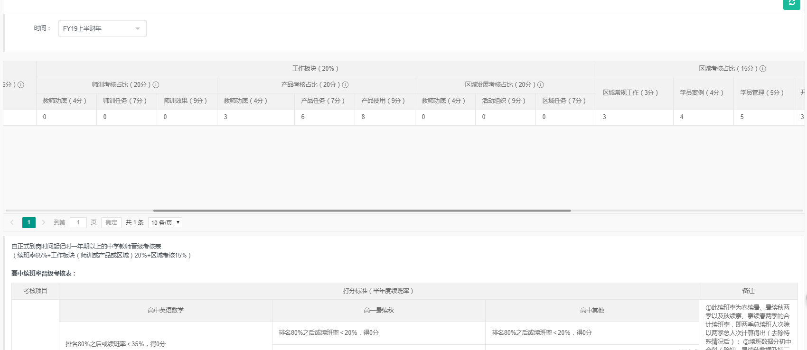

# 新东方信管部-系统工程师
[[toc]]
## 工作内容
## 系统
### 优能一对一系统
- (http://ynsuzhou.xdf.cn/)（admin/1234,023950/123456,zhongxiaoou@xdf.cn/123456）
### 优能一对一系统手机端
- (http://suzhou.xdf.cn/zhuanti/iphoneOne2One2019)（admin/1234,023950/123456,zhongxiaoou@xdf.cn/123456）
- 10.124.14.193:1853
:::warning 负责内容
- 登录功能，用cookie和sessionStorage优化，刷新vuex数据消失功能优化
:::
### 学生信息管理系统
- （http://stsuzhou.xdf.cn/Login/IndexAdmin）（用户名：admin 密码：0000）
:::warning 负责内容
- 修改了一些显示,分享页面数据功能修改
- 特色
  - Razor模板引擎
:::
### 新东方课酬（绩效）查询平台

- （http://10.124.9.160:8086/）（admin/0000,张锐/0000,计曹晨/0000,李方朝/0000）
:::warning 负责内容
- 数据的添加和维护，layui table多级表头
- 点击定位，返回顶部
- 点击隐藏其他无关紧要的，返回顶部后全部显示

:::
- 特色
  - layui table多级表头
```css
/*layui 多级表头样式问题*/
.layui-table thead th {
    background-color: #f2f2f2 !important;
}
.layui-table tbody tr:hover{
    background-color:#fff !important;
}
.layui-table td, .layui-table th{
    position:static !important;
}
```
### 讲义配送调度系统
- （http://suzhou.xdf.cn/zhuanti/jiaowu2019/index.html ）(admin/1234)
- 背景
    - 分发讲义防止讲义浪费，控制讲义流程，出问题责任人明确，讲义数据分析。
:::warning 负责内容
  - 讲义配送（导入excel）
  - 讲义警报（每隔5秒检查下讲义是否充足）
  - 讲义调度（申请调度和同意拒绝别人的调度）
:::
- 特色
  - 使用了xlsx插件来导入excel表格并传json数据到后端。
  - 封装了excel转json工具
- 问题
  - 调用store里的方法，含有异步方法的，调用的时候也要await。
  - created方法失效：因为里面已经加了created方法，在最后。。。
  - mock数据无法使用，报错code101，改了各种地方没有用，新建项目测试可用。后来下载几个svn版本对比分析，因为之前可以用。最后发现是mock解析传进来的参数时参数名字不对。在某一版的时候后端的登录参数名称改了，参数重写后可以用了。
  - 一次演示系统会议。教务部门说需要测试地址，同事说周三再给，然后他们说不行，再两周就要培训了。然后我说可以布自己服务器。下午就给他们
  - 请求头添加token
  - 加验证码
  - 移动端app
### 巡更系统
- （http://pxsuzhou.xdf.cn/）
:::warning 负责内容
  - 巡更点基础数据增删改查
  - 巡更记录的增删改查
  - 接口json数据导出为excel（各校区值班手机巡检合格率反馈表，不合格情况汇总表，获取每月各校区各值班人巡检不合格详情列表）
:::
- 特色
  - 封装了json转excel工具
  - 适用插件vue-qr生成二维码


## 专题页面
- 问题
  - 人人秀(rrxiu.net)免费H5页面制作工具
  - 自己做了一个信管开发部所有项目的整合网页。（南昌：http://xk722.cn/）
  - 所有静态文件都放在苏州自己的服务器上
  - node做的后端数据接口

### 微服务报名单页
- rem自适应
  ```html
  <!DOCTYPE html>
  <html>
    <head>
      <meta charset="UTF-8">
      <title>小学托福报名</title>
      <script>!function(e){function t(a){if(i[a])return i[a].exports;var n=i[a]={exports:{},id:a,loaded:!1};return e[a].call(n.exports,n,n.exports,t),n.loaded=!0,n.exports}var i={};return t.m=e,t.c=i,t.p="",t(0)}([function(e,t){"use strict";Object.defineProperty(t,"__esModule",{value:!0});var i=window;t["default"]=i.flex=function(normal,e,t){var a=e||100,n=t||1,r=i.document,o=navigator.userAgent,d=o.match(/Android[\S\s]+AppleWebkit\/(\d{3})/i),l=o.match(/U3\/((\d+|\.){5,})/i),c=l&&parseInt(l[1].split(".").join(""),10)>=80,p=navigator.appVersion.match(/(iphone|ipad|ipod)/gi),s=i.devicePixelRatio||1;p||d&&d[1]>534||c||(s=1);var u=normal?1:1/s,m=r.querySelector('meta[name="viewport"]');m||(m=r.createElement("meta"),m.setAttribute("name","viewport"),r.head.appendChild(m)),m.setAttribute("content","width=device-width,user-scalable=no,initial-scale="+u+",maximum-scale="+u+",minimum-scale="+u),r.documentElement.style.fontSize=normal?"50px": a/2*s*n+"px"},e.exports=t["default"]}]);  flex(false,100, 1);</script>
      <link href="https://cdn.bootcss.com/normalize/8.0.1/normalize.min.css" rel="stylesheet">
      <style>
        /*最大宽度设置*/
        /*body{
          max-width: 768px;
          margin: 0 auto;
        }*/
        /*header*/
        header{
          height:0.75rem;
          margin-top:0.35rem;
          padding: 0 0.25rem;
          overflow: hidden;
        }
        header img{
          display: block;
        }
        header .left{
          float: left;
          width:2.81rem;
        }
        header .right{
          float: right;
          width:2.26rem;
        }
        /*main*/
        main{
          background-color: rgb(230,248,255);
          padding-bottom: 0.5rem;
        }
        main .introduction,main .content{
          padding: 0 0.5rem;
        }
        main .title,main .introduction{
          text-align: center;
          margin:0 auto;
        }
        main .title{
          padding:0 1rem;
        }
        main .subtitle{
          text-align: left;
          width:50%;
        }
        main .subcontent img{
          display: block;
          margin: 0 auto;
        }
        main .btn{
          width:40%;
          margin: 0.5rem auto;
        }
        main .explain{
          font-family: "微软雅黑";
          font-size: 0.18rem;
          color: rgb(29,126,143);
          text-align: center;
        }
        main .explain .label{
          color: rgb(236,105,65);
        }
        /*footer*/
        footer{
          padding: 0.25rem 0.5rem 1.5rem 0.5rem;
          background-color: rgb(29,126,143);
          font-family: "微软雅黑";
          font-size: 0.18rem;
          line-height: 0.36rem;
          position: relative;
          color: #fff;
        }
        footer .title{
          font-size: 0.24rem;
        }
        footer img{
          width:1.5rem;
          position: absolute;
          right: 0.5rem;
          bottom: 1.5rem;
        }
      </style>
    </head>
    <body>
      <header>
        <div class="left">
          
        </div>
        <div class="right">
          
        </div>
      </header>
      <main>
        <article>
          <div class="banner">
            
          </div>
          <div class="title">
            
          </div>
          <div class="introduction">
            
          </div>
          <section class="content">
            <div class="subtitle">
              
            </div>
            <div class="subcontent">
              
              <div class="btn">
                <a href="http://souke.xdf.cn/Class/23-4460001.html">
                  
                </a>
              </div>
              <div class="explain">
                <span class="label">报名班号：</span><span>PIH00037（泡泡少儿活动课报名链接）</span>
              </div>
            </div>
          </section>
          <section class="content">
            <div class="subtitle">
              
            </div>
            <div class="subcontent">
              
              <div class="btn">
                <a href="http://souke.xdf.cn/Class/23-4459999.html">
                  
                </a>
              </div>
              <div class="explain">
                <span class="label">报名班号：</span><span>PIH00038（泡泡少儿活动课报名链接）</span>
              </div>
            </div>
          </section>
        </article>
      </main>
      <footer>
        <span class="title">关于小学托福：</span><br/>
        想通过权威方式验证孩子英语能力水平？<br/>
        缺少证书充实升学简历？<br/>
        剑桥少儿、KET、PET报名未成功？<br/>
        更多小学托福相关，请扫码了解▼
        
      </footer>
    </body>
  </html>
  ```

### 端午节发放福利问卷调查
- （http://suzhou.xdf.cn/zhuanti/Welfare/index.html）
- 背景
  - 人力部门一直使用问卷星做福利发放问卷调查，但是有些人没有交工会费，问卷星不能筛选没有交工会费的人，所以需要我们自己做一个能筛选是否在工会名单里的页面。
  - 因为集团的服务器我们是不能操作的，这个页面打算放在集团的专题上面。头问我能不能纯前端操作服务器上的excel文件，提交礼物需求，查了半个小时发现不可行，然后我询问是否可以使用LeanCloud之类的后端服务，又问能把后端放我们自己的服务器上吗，询问了跨域已解决，最终决定前端放在总部云办公的服务器上，后端放在苏州学校自己的服务器上。
:::warning 功能
  - 登录验证是否在工会名单
  - 问卷
:::
- 技术栈
  - jq
    - 因为是需要上传到集团系统的文件，不清楚vue是否会出未知问题，需求又比较紧急，最多两天时间完成，所以选了直接下载下来的模板用的jq
  - layui
    - 因为使用的jq，又有两处表单提交，所以用了layui
- 问题
  - post请求错误500，服务端测试没问题，但ajax请求一直500,使用的是layui的form表单提交
    - 折腾近一个小时，最后发现是ajax的data不需要用JSON.stringify()转。去掉后就ok了（难道ajax不是提交的json字符串吗？？打印出来明明是json对象，转成字符串反而提交不了了）
  - 前后端分离，前端发送请求，cookies后端接受不到
    - 不用vue等框架，无法前端路由
  - cookies里能不能存放明文用户名
    - 最终放了明文用户名，并且在页面做了用户未登录跳转，先验证是否登陆，再显示出DOM.
  - 安全问题
    - 因为我判断用户已提交是用的display:none将表单隐藏，如果有人直接在浏览器修改css，就能修改数据了（前提是知道密码，表单页面验证了是否有cookies，没有就跳转回登陆页。）
    - XSS攻击，没有防御，可能是需要后端做的》
  - 提交成功页面在qq浏览器和ios的浏览器中会返回到表单页面并且不会刷新的问题
    - 把location.href="xxx"改成了location.replace("xxx")，避免了返回到表单页面，只会返回到登录页面。
### 暑假班选课筛选页
- （http://suzhou.xdf.cn/zhuanti/xdfcls2019/index.html）
- 背景
  - 比较紧急，花费一天
:::warning 功能
  - xml数据做成表格并分组显示
  - 筛选功能
:::
- 技术栈
  - 使用jquery，自己写的筛选下拉框组件
  - 纯手写H5页面
- 问题
  - http-server启动服务以便能够用ajax获取数据？？？
  - 看专题wx支付页面，转成自己的作品。


## 本机IP
10.124.14.193