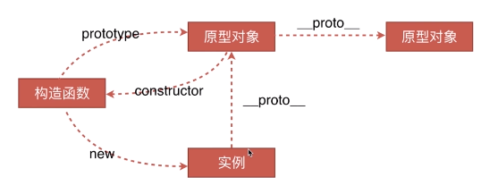

# 错题集
1. <mark-check id="1"></mark-check>原始类型有哪几种？null 是对象嘛？
2. <mark-check id="2"></mark-check>对象类型和原始类型的不同之处？函数参数是对象会发生什么问题？
3. <mark-check id="3"></mark-check>
```js
function test(person) {
  person.age = 26
  person = {
    name: 'yyy',
    age: 30
  }

  return person
}
const p1 = {
  name: 'yck',
  age: 25
}
const p2 = test(p1)
console.log(p1) // -> ?
console.log(p2) // -> ?
```
4. 
```js
let a = {
  valueOf() {
    return 0
  },
  toString() {
    return '1'
  },
  [Symbol.toPrimitive]() {
    return 2
  }
}
1 + a // => 3
```
5. ss
```js
4 + [1,2,3] // "41,2,3"
console.log(1 + undefined)//NaN undefined转number是NaN
console.log(1 + null)//1
console.log('a' > 'b')//false
console.log('abc' > 'abe')//false
console.log('10' > '2')//false
console.log('hello' > 'world')//false
console.log([] == [])//false 引用类型调用valueOf比较
console.log([] == ![])//true
console.log({} == {})//false
console.log(!![]) // true
console.log(!!{}) // true
console.log(1 > undefined) // true
console.log(0.1 + 0.2) // 结果是 0.30000000000000004，而不是 0.3
console.log(null == undefined) // true
console.log(null == 0) // false
console.log(null == '') // false
console.log(null == NaN) // false
console.log(undefined == 0) // false
console.log(undefined == '') // false
console.log(undefined == NaN) // false
console.log(NaN == 0) // false NaN不等于任何值
console.log(NaN == '') // false
console.log(NaN == NaN) // false
'1' * 'a'     // => NaN
[]+[]// ""
[]+{}// [object Object]
{}+[]// [object Object]
// 所有浏览器都认为{}是区块语句，计算+[]，得出0
{}+{}// [object Object][object Object]
// 谷歌浏览器是正常结果，火狐会把第一个{}当做区块语句，计算+{}，得出NaN
1+{a:1}// 1[object Object]
```

6. 如何正确判断 this？箭头函数的 this 是什么？
- 普通函数的this看执行，箭头函数的this看定义，自由变量看定义

1. ss
```js
var a = {
    name: 'A',
    fn: function () {
        console.log(this.name)
    }
}
a.fn()  // this === a
var fn1 = a.fn
fn1()  // this === window
```
8. ss
```js
let a = {}
let fn = function () { console.log(this) }
fn.bind().bind(a)() // => window
```
9. 循环中使用闭包解决 `var` 定义函数的问题
10. 什么是浅拷贝？如何实现浅拷贝？什么是深拷贝？如何实现深拷贝？
- 深拷贝：拷贝后的结果更改是不会影响拷贝前的，拷贝前后是没有关系的
浅拷贝：拷贝前和拷贝后是有关系的(Object.assign,展开运算符 ...)
- JSON.parse/stringify
- 递归拷贝
11. 如何理解原型？如何理解原型链？

12. 什么是提升？什么是暂时性死区？var、let 及 const 区别？
- 函数提升优先于变量提升，函数提升会把整个函数挪到作用域顶部，变量提升只会把声明挪到作用域顶部
- var 存在提升，我们能在声明之前使用。let、const 因为暂时性死区的原因，不能在声明前使用
- var 在全局作用域下声明变量会导致变量挂载在 window 上，其他两者不会
- let 和 const 作用基本一致，但是后者声明的变量不能再次赋值
13. 原型如何实现继承？Class 如何实现继承？Class 本质是什么？
JS 中并不存在类，class 的本质就是函数。
14. 为什么要使用模块化？都有哪几种方式可以实现模块化，各有什么特点？
- 立即执行函数
- AMD 和 CMD
- CommonJS
  - 虽然 exports 和 module.exports 用法相似，但是不能对 exports 直接赋值。因为 var exports = module.exports 这句代码表明了 exports 和 module.exports 享有相同地址，通过改变对象的属性值会对两者都起效，但是如果直接对 exports 赋值就会导致两者不再指向同一个内存地址，修改并不会对 module.exports 起效。
- ES Module
15. Proxy 可以实现什么功能？
```js
let p = new Proxy(target, handler)
let onWatch = (obj, setBind, getLogger) => {
  let handler = {
    get(target, property, receiver) {
      getLogger(target, property)
      return Reflect.get(target, property, receiver)
    },
    set(target, property, value, receiver) {
      setBind(value, property)
      return Reflect.set(target, property, value)
    }
  }
  return new Proxy(obj, handler)
}

let obj = { a: 1 }
let p = onWatch(
  obj,
  (v, property) => {
    console.log(`监听到属性${property}改变为${v}`)
  },
  (target, property) => {
    console.log(`'${property}' = ${target[property]}`)
  }
)
p.a = 2 // 监听到属性a改变
p.a // 'a' = 2

// 无需迭代
get(target, property, receiver) {
    getLogger(target, property)
    // 这句判断代码是新增的
    if (typeof target[property] === 'object' && target[property] !== null) {
        return new Proxy(target[property], handler);
    } else {
        return Reflect.get(target, property);
    }
}
```
- 使用 Proxy 替换原本的 API 原因在于 Proxy 无需一层层递归为每个属性添加代理，一次即可完成以上操作，性能上更好，并且原本的实现有一些数据更新不能监听到，但是 Proxy 可以完美监听到任何方式的数据改变，唯一缺陷可能就是浏览器的兼容性不好了。
16. map, filter, reduce 各自有什么作用
17. sss
```js
// 数组去重
let arr = [1,2,1,2,3,5,4,5,3,4,4,4,4];
let result = arr.sort().reduce((init, current) => {
    if(init.length === 0 || init[init.length-1] !== current) {
        init.push(current);
    }
    return init;
}, []);
console.log(result); //[1,2,3,4,5]
```
18. 什么是回调函数？回调函数有什么缺点？如何解决回调地狱问题？
19. <mark-question id="19"></mark-question>你理解的 Generator 是什么？
20. Promise 的特点是什么，分别有什么优缺点？什么是 Promise 链？Promise 构造函数执行和 then 函数执行有什么区别？
21. <mark-question id="19"></mark-question>async 及 await 的特点，它们的优点和缺点分别是什么？await 原理是什么？
22. setTimeout、setInterval、requestAnimationFrame 各有什么特点？
23. 手写 Promise
24. 进程与线程区别
25. 什么是执行栈？
- 执行栈认为是一个存储函数调用的栈结构，遵循先进后出的原则
26. 异步代码执行顺序？解释一下什么是 Event Loop ？

- 微任务包括 process.nextTick ，promise ，MutationObserver，其中 process.nextTick 为 Node 独有。

宏任务包括 script ， setTimeout ，setInterval ，setImmediate ，I/O ，UI rendering。

这里很多人会有个误区，认为微任务快于宏任务，其实是错误的。因为宏任务中包括了 script ，浏览器会先执行一个宏任务，接下来有异步代码的话才会先执行微任务。
27. <mark-question id="19"></mark-question>Node 中的 Event Loop 和浏览器中的有什么区别？process.nexttick 执行顺序？
28. call、apply 及 bind 函数内部实现是怎么样的？
29. new 的原理是什么？通过 new 的方式创建对象和通过字面量创建有什么区别？
```js
function Foo() {}
// function 就是个语法糖
// 内部等同于 new Function()
let a = { b: 1 }
// 这个字面量内部也是使用了 new Object()
```
30. instanceof 的原理是什么？
- instanceof 可以正确的判断对象的类型，因为内部机制是通过判断对象的原型链中是不是能找到类型的 prototype。
31. 为什么 0.1 + 0.2 != 0.3？如何解决这个问题？ 
32. V8 下的垃圾回收机制是怎么样的？
33. JS 分为哪两大类型？都有什么各自的特点？你该如何判断正确的类型？
34. 你理解的原型是什么？
35. bind、call 和 apply 各自有什么区别？
36. ES6 中有使用过什么？
37. 事件的触发过程是怎么样的？知道什么是事件代理嘛？
38. 什么是跨域？为什么浏览器要使用同源策略？你有几种方式可以解决跨域问题？了解预检请求嘛？
- JSONP
- 服务端设置CORS: Access-Control-Allow-Origin options预检
- document.domain
- postMessage
- nginx
39. 有几种方式可以实现存储功能，分别有什么优缺点？什么是 Service Worker？
40. 浏览器缓存机制(性能优化)
41. 浏览器渲染页面的过程？插入几万个 DOM，如何实现页面不卡顿？
42. 什么是 XSS 攻击？如何防范 XSS 攻击？什么是 CSP？
43. 什么是 CSRF 攻击？如何防范 CSRF 攻击？
44. 性能优化
45. Webpack性能优化
- 有哪些方式可以减少 Webpack 的打包时间
  - 优化 Loader搜索范围
  - HappyPack
  - DllPlugin
  - 代码压缩并行
  - 小的优化点
    - resolve.alias
- 有哪些方式可以让 Webpack 打出来的包更小
  - 按需加载
  - Scope Hoisting
  - Tree Shaking
46. 什么是 MVVM？比之 MVC 有什么区别？
47. 什么是 Virtual DOM？为什么 Virtual DOM 比原生 DOM 快？
48. 前端路由原理？两种实现方式有什么区别？
49. Vue 和 React 之间的区别
50. Vue生命周期钩子函数
51. Vue组件通信
- 父子通信
- 兄弟组件通信
- 跨多层次组件通信
- 任意组件
52. mixin 和 mixins 区别
53. computed 和 watch 区别
54. keep-alive 组件有什么作用
55. v-show 与 v-if 区别
56. Vue响应式原理
57. Object.defineProperty 的缺陷
58. NextTick 原理分析
59. 前端监控
60. UDP 与 TCP 的区别是什么？
61. 为什么 TCP 建立连接需要三次握手，明明两次就可以建立起连接
62. Post 和 Get 的区别？
63. 输入 URL 到页面渲染的整个流程
64. 请求方法、首部的作用以及状态码的含义
65. TLS :两种加密方式以及握手的流程
66. 设计模式
67. 数据结构和算法
68. CSS
69. [css](https://github.com/yangshun/front-end-interview-handbook/blob/master/Translations/Chinese/questions/css-questions.md)


