# markdown

## 语法

 1.标题
```md
# 一级标题
## 二级标题
### 三级标题
```
2.列表
```md
- 1
- 2
- 3
1. 列表1
2. 列表2
3. 列表3
```
3.引用
```md
> 这是一个引用
>> 二级引用
>>> 三级引用
```
4.分割线
```md
---
```
5.链接
```md
[链接1](www.baidu.com)
[链接2]:www.baidu.com
这是链接：[链接2][链接1]
```
6.图片
```md


[图片2]:https://www......jpg
这是图片：![图片1][图片2]
```
7.代码框
- 所有的html标签标签必须用代码框框起来，少的用单行，多的用多行，否则都会报错。
```md
单行：
	`<p>…</p>`
多行：
	```js/md/php等语言
	<p>…</p>
	```
```
8.字体强调
```md
*倾斜*
**加粗**
```

9.删除线
```md
~~删除~~
```
10.表格
```md
| 左对齐标题 | 右对齐标题 | 居中对齐标题 |
| :------| ------: | :------: |
| 短文本 | 中等文本 | 稍微长一点的文本 |
| 稍微长一点的文本 | 短文本 | 中等文本 |
```
11.转义
```md
/
```
12.目录
```md
[[toc]]
```

13.目录结构
```md
root
├─── public.js
│   ├── common.js
	├── layout.js
└─── util.js
```

## 预览和编辑器

`typora`
`vscode`
`vuepress`

## mermaid

### 图形
//该语句声明了一个新图形和图形布局的方向。
```js
graph TD
开始 --> 结束
方向是：
```
- TB - 从上到下
- BT - 从下到上
- RL - 从右到左
- LR - 从左到右
- TD - 与TB相同

image
### 节点和形状
1. 节点

默认节点就是默认的内容
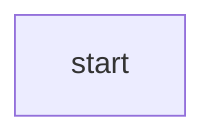
image
1. 带有文本的节点
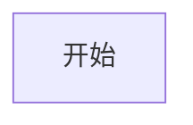
image

2. 具有圆边的节点

image
3. 圆形的节点
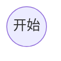
image
4. 非对称形状的节点

image
5. 菱形节点
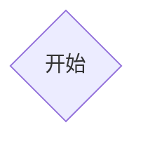
image
### 节点之间的连接
1. 带箭头的连接

image
2. 没有箭头的连接
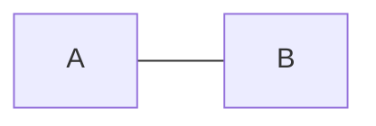
image

3. 连接上的文字

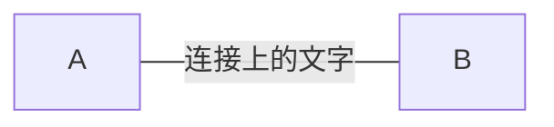

或者


image

4. 带箭头和文字的连接

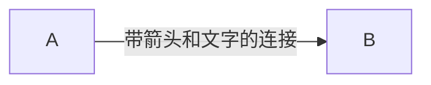
或者

image
1. 虚线连接
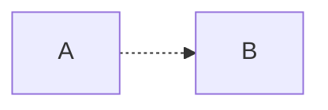
image
1. 带文字的虚线连接
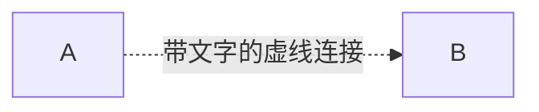
image
1. 粗连接
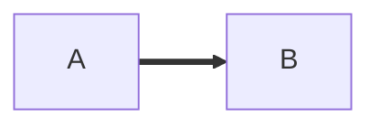
image
1. 带文本的粗连接
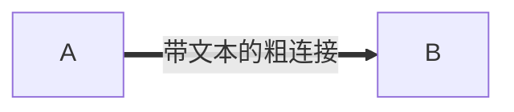
image
1. 破坏语法的特殊字符
可以将文本放在引号内以便渲染更麻烦的字符

image
（10） 实体代码转义字符
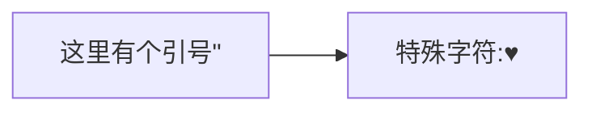
image
### 子图
语法：
```mermaid
subgraph title
    graph definition
end
graph TB
    c1-->a2
    subgraph one
    a1-->a2
    end
    subgraph two
    b1-->b2
    end
    subgraph three
    c1-->c2
    end
```
image
### 样式链接
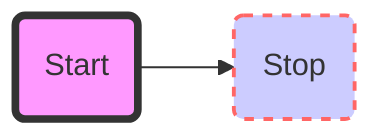
image
### 对fontawesome的基本支持
图标通过语法fa：#icon class name＃来获取
```mermaid
graph TD
    B["fa:fa-twitter 和平"]
    B-->C[fa:fa-ban 禁止]
    B-->D(fa:fa-spinner);
    B-->E(A fa:fa-camera-retro 也许?);
```