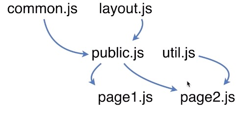

# 业务开发

## 业务开发流程

### 技术选型

#### 构建工具
1. 构建工具有哪些
- 任务分配和管理
`gulp`（流操作，输入输出）
`grunt`（不是流操作复杂项目比较慢）
- 不仅管理，而且编译
`webpack`
`rollup`（跟webpack类似）
- 其他
`fis`（百度内部）
`prepack`（facebook）

2. 为什么要构建工具
`资源压缩` `静态资源替换` `模块化处理` `编译处理`

3. 我们用哪个构建工具
`webpack`做编译 `npm scripts`做管理

#### MVVM框架选择
`Vue`
`React`
`Angular`-后端转前端
#### 模块化设计
1. js模块化设计
    - common.js 公司内所有项目的登录，注册等通用的东西
    - layout.js 公共布局
    - public.js(引入common.js和layout.js)
    - util.js
    
2. CSS模块化设计
#### 自适应方案设计

#### 代码维护及复用性设计的思考
- 需求变更
- 产品迭代
- Bug定位
- 新功能开发

### 业务开发

### 测试验证

### 发布上线

