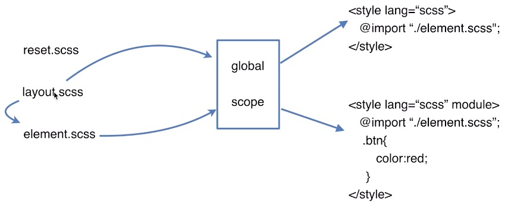

# 业务开发

## 业务开发流程

### 技术选型
- 组员的技术类型
- 框架的发展，bug更新速度
- 适用性
#### 构建工具
1. 构建工具有哪些
- 任务分配和管理
`gulp`（流操作，输入输出）
`grunt`（不是流操作复杂项目比较慢）
- 不仅管理，而且编译
`webpack`
`rollup`（跟webpack类似）
- 其他
`fis`（百度内部）
`prepack`（facebook）

2. 为什么要构建工具
`资源压缩` `静态资源替换` `模块化处理` `编译处理`

3. 我们用哪个构建工具
`webpack`做编译 `npm scripts`做管理

#### MVVM框架选择
`Vue`
`React`
`Angular`-后端转前端
#### 模块化设计
1. js模块化设计
    - common.js 公司内所有项目的登录，注册等通用的东西
    - layout.js 公共布局
    - public.js(引入common.js和layout.js)
    - util.js
    <!--  -->
2. CSS模块化设计
#### 自适应方案设计


#### 代码维护及复用性设计的思考
- 需求变更
- 产品迭代
- Bug定位
- 新功能开发


### 业务开发

### 测试验证

### 发布上线


## 项目设计与原理分析

### CSS模块化设计

1. 设计原则
- 可复用能继承要完整
- 周期性迭代

2. 设计方法
- 先整体后部分再颗粒化
    - 布局-页面（大的页面）-功能（基础组件）-业务
- 先抽象再具体
    - 京东金融可以把所有块作为面板抽象出来
    - 抽象成列表（横向/纵向）

3. 具体方案
<!--  -->
- reset.scss 重置默认样式
- layout.scss 布局样式
- element.scss 列表，按钮等功能性的东西

```css
/* layout.css */
/* 使用utf-8编码 */
@charset “UTF-8"

@mixin flex($direction:column,$inline:block){
    display: if($inline==block,flex,inline-flex);
    flex-direction:$direction;
    flex-wrap:wrap;
}
```

```css
/* element.scss */
@import "./layout.scss"

@mixin btn($size:14px,$color:#fff,$bgcolor:#F04752,$padding:5px,$radius:5px){
    padding:$padding;
    background-color:$bgcolor;
    border-radius:$radius;
    border:1px solid $bgcolor;
    font-size:#size;
    color:$color;
    text-align:center;
    line-height:1;
    display:inline-block;
}

@mixin list($direction:column){
    @include flex($direction);
}

@mixin panel($bgcolor:#fff,$padding:0,$margin:20px 0,$height:112px,$txtPadding:0 32px,$color:#333,$fontSize:32px){
    background:$bgcolor;
    padding:$padding;
    margin:$margin;
    >h4{
        height:$height;
        line-height:$height;
        padding:$txtPadding;
        text-overflow:ellipsis;
        white-space:nowrap;
        overflow:hidden;
        text-align:center;
        color:$color;
        font-size:$fontSize;
    }
}

```

### JS组件设计
1. 设计原则
- 高内聚低耦合
    - 功能组件直接不要互相依赖(最高效复用)
- 周期性迭代
2. 设计方法
- 先整体后部分再颗粒化
- 尽可能地抽象（让任何东西都可以用的地步）

3. 抽象组件（复用的,放入core文件夹），业务组件（不能复用的，放入每个页面的文件夹仅在界面结构布局组件中当做一块来使用），页面布局组件(放入每个页面的文件夹，index.vue，引用本页面所有的业务组件，从上而下排列，方便修改布局)
4. 是否做成抽象组件：结构简单，没有交互性，不频繁出现，就不需要特地做成组件

### JS自适应
- 移动端自适应，一份代码跑遍各个设备
1. 基本概念（https://github.com/jawil/blog/issues/21）
    - CSS像素(px)，设备像素(也叫物理像素，设备上的一个像素)，逻辑像素(px)，设备像素比（逻辑像素和设备像素的比值，比如苹果是2）
    - viewport
    - rem
2. 工作原理
    - 利用viewport和设备像素比调整基准像素（html的fontsize通过js动态地按物理像素/css像素的比值进行调整）
    - 利用px2rem自动转换css单位

### SPA设计
1. 设计意义
   - 前后端分离(前后端代码不耦合)
   - 减轻服务器压力（当一个应用操作比较复杂，有十几个页面的时候，每个用户操作几个页面只需要请求一次）
   - 增强用户体验（不存在多次下载页面的时间，只有接口的时间）
   - Prerender预渲染优化SEO(单页面对搜索引擎不友好，使用预渲染优化)
2. 工作原理
   - History API(更加优雅，但对浏览器有要求)
    <!--  -->
    - window.history.pushState()注册路由
    - 
   - Hash（不优雅，但兼容性最好）
     - 使用location.hash修改路由
     - 目标页面监听hashchange事件
    <!--  -->
    
3. 面试
   - spa做了哪些事情？
   - 它是怎么做到的？


## 上线指导
### 生产构建
合并(style合并成一个文件和js)、抽取（样式从js中抽取出来）、压缩（js，css都需要压缩）、调试（开启sourcemap）
### 发布部署
提交（git管理版本）、部署（后端从git仓库拉去代码，通过小流量，跨机房，全量部署）、开启gzip压缩（后端服务需要开启gzip压缩。前端需要检查js和css文件有没有开启gzip压缩。这个比webpack压缩压缩率高很多）、更新CDN

## 构建工具
### 创建目录
- mkdir xxx
### 初始化
- npm init
### 创建业务目录
```md
webpack-test
├─── app
│   ├── js
│       ├── main.js
│       ├── App.vue
│       ├── test.vue
│       ├── home
│           ├── index.vue
│       ├── router
│           ├── index.js
│   ├── css
│       ├── reset.scss
│   ├── views
│       ├── index.html
└── package.json
```

### 创建配置文件
- 创建配置文件webpack.config.js
```md
webpack-test
├─── app
├─── webpack.config.js
└── package.json
```
- 文件配置
    - 基础配置
        - entry
        - module
        - plugins
        - output
    - 进阶配置
        - resolve
        - devtool
        - devServer

## 项目面试
- 同学做过哪些项目啊...

- 为什么用这样的框架呢

- 在项目中的角色是什么？解决过哪些难题...

- 通过这个项目学到了什么...

### 二面考什么？
- 一面基础，二面项目，三面负责人聊文化，综合素质，四面hr，性格，薪资，加班等
- 项目经验
- 技术深度
- 架构能力
### 项目怎么准备
- 梳理历史项目（挨个设计优化空间），简历中认真写两到三个，三到四个项目。
- 挑选并打造一个非常满意的走心的项目（体现自己能力的项目）聊到大家不懂为止。用新的技术栈去更新项目，不一定非要是公司的项目
- 问答设计
    
### 项目该怎么介绍
- 项目背景
    - 两三句话就可以了，时间，业务场景。
- 项目收益
    - 
- 项目设计
    - 技术方案，特色亮点
    - 扩展性强不强
- 项目总结
    - 不足，值得探索没来得及验证的，可以优化的点


### 【面试】 
- Vue的双向绑定是如何实现的？
  - 设计模式，能否手写出设计模式
- 有没有使用CSS Module，基本原理是什么，Vue该如何做？
- 开启CSS Module知乎如何使用第三方样式库
- Vue安装包有几个版本，遇到问题如何解决的？
- 你的项目有什么特色，解决过什么问题，用了什么技术方案
    - 特色
        - 自适应方案
            - 一般是用media+rem的方案去做，但是media有优先级，多个media会有优先级覆盖，可能会导致失效。而且设备太多，一个个去写，测试机不可能太多，覆盖面窄
            - 动态去计算fontsize,然后背后原理就是px转rem。
            - 怎么实现？px2rem，一个loader，把所有px转成rem
        - 模块化设计
    - 解决过什么问题
        - 自适应方案，怎么把viewport的js跟webpack进行打包，解决了计算fontsize问题
            - 一般是用media+rem的方案去做，但是media有优先级，多个media会有优先级覆盖，可能会导致失效。而且设备太多，一个个去写，测试机不可能太多，覆盖面窄
            - 动态去计算fontsize,然后背后原理就是px转rem。
            - 怎么实现？px2rem
- 你对自己的项目是否满意，有改进空间吗
    - gzip压缩
    - 组件异步加载
- 为什么选择Webpack构建工具
- 项目是如何使用webpack的？dev-server的原理是什么？
- 有没有实现一个webpack的loader?
- 如何做任务管理的？（区分编译开发环境的还是编译生产环境，动态监听某个文件，watch，比如node script,gulp,grant等）
- 如果这个项目让你重新设计，你会怎么思考？
- 自适应方案应该怎么做，原理是什么
- rem和em的区别
- 前后端分离是怎么做的
- 前端路由是什么原理

### 项目总结
- 项目的所有原理必须弄清楚，至少知道大概是怎么做的，只知道怎么使用是不行的。
- 如何抽象设计组件
- 如何设计模块化
- 如何独立构建项目
- 如何上线

- 方案原理
    - 最完美的自适应方案如何做？
- 路由的工作原理？
- Vue的相关用法